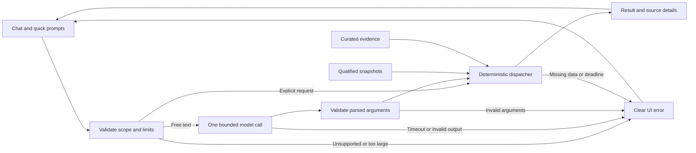

# Airport Investment Analyst — Bounded Demo Plan

**Plan revision 3. DESIGN ONLY.** This is a small home-assignment prototype, not an aviation platform. The written plan has been simplified around the owner's direction: keep sensible limits and show a clear UI error outside them. Application execution and real agent reviews remain [TODO](TODO.md); no independent approval or implemented capability is claimed.

This README is the master plan. [PLAN_GRAPH.json](docs/PLAN_GRAPH.json) mirrors the step goals, dependencies and file scopes. Earlier review records are historical and apply only to their recorded versions. No upstream Agentic OS or Claude configuration is changed by this plan.

## 1. Mission and successful demo

The [assignment](FDE%20Exam%202.pdf) asks for an AI-assisted US airport-modernization investment screen, public-API data, deterministic analysis, understandable reasoning, conversational follow-ups, a chat UI, source code and a short design document.

Build a **screening assistant**, not a profitability or latent-demand forecasting model. Traffic pressure identifies where to investigate; a small set of official evidence notes explains whether a terminal intervention plausibly addresses a constraint. An unsupported investment thesis remains unknown.

| Required demonstration | What must work |
|---|---|
| New England expansion screening | Numeric ranking over the declared cohort; reviewed evidence for the first three eligible candidates; distinguish supported terminal cases from an unverified traffic watchlist. |
| LAX versus Santa Ana | Same-period cancellation, diversion, departure-delay and taxi-out comparison, with denominators and a direct qualified summary. |
| Anchorage long-haul percentage | Exact departure-weighted share on qualified data, with year, distance threshold, numerator, denominator and scope. Insufficient distance coverage produces an error, not a fabricated percentage. |
| SFO unmet-demand question | Real passenger trends, matched passenger-growth versus seat-growth proxy, operational indicators and a sourced constraint note. Explain why these do not identify the quantity or cause of true unmet demand. |
| Nearby questions and follow-ups | Compare BOS/PVD passenger growth; rank New England by raw growth; change a supported metric/year/threshold without losing scope. |
| API and AI | An actual DataSF API refresh feeds the SFO result. Real natural-language interpretation is demonstrated, not just quick-prompt buttons. |
| Handoff | One usable browser screen, runnable local source and a short architecture/design note. |

**Errors are valid product behavior, but not a substitute for the required successful demonstrations.** Test both a supported result and a bounded failure. If no reviewed airport has a supported terminal thesis, say so after showing the real ranking and evidence review; never manufacture a positive recommendation.

## 2. Small architecture

One local FastAPI process (Python 3.11+) serves a static HTML/JavaScript UI. DuckDB reads local Parquet snapshots. An in-memory dictionary holds the latest successful result per session. One manually curated JSON file holds evidence notes. One constrained model call interprets free text; deterministic handlers calculate and explain the results.

Serve on `127.0.0.1`, one worker. No hosting, auth product, queue, database server, RAG, crawler, multiple runtime agents, voice, live-flight tracking or financial valuation. ORBIT is styling inspiration. A globe/map is optional only after the core works; camera position must never change analytical populations.

Private keys stay server-side and outside Git/logs. Do not search for or print credentials. Use already-authorized access; missing access means AI unavailable, not silent fabricated output. Presets can still run without the model.

## 3. Supported scope and simple limits

These are deliberate prototype limits, not aviation standards. Enforce them in request validation/settings, not just in the prompt. Expanding a limit is a conscious scope change, not an automatic fallback.

| Boundary | v1 behavior |
|---|---|
| Airports | T-100 analytics for the 26 listed origins below; operational data for LAX/SNA/SFO only. No claim of worldwide or all-US-airport coverage. |
| Time | Qualified CY2023/CY2024 T-100; CY2024 operations; growth is 2024 versus 2023. Reject unsupported years rather than fetch a new history. |
| Actions | One of `rank`, `compare`, `metric`, `explain` per request. `metric` has one airport; `compare` has exactly two. Rank only the New England cohort or a subset. At most 22 ranked rows. |
| Question length | At most 4,000 user-input characters. Reject larger input; do not silently truncate it. |
| Work in flight | One active analytical request in the local process. Return `busy` for another; no queue. Disable the send control while waiting. Data refresh/import is a separate setup action and is not run during an analysis. |
| Model | At most one call per free-text request, no SDK retries or model switching; 20-second model timeout, 512 output tokens, complete serialized prompt at most 8,000 tokens. Presets use zero calls. |
| Query deadline | 30 seconds for the query path. Cancel/interrupt the active model/database work on timeout; do not release the busy slot or accept a late result while abandoned work remains active. No generic worker pool is needed. |
| Cost | Proposed maximum $0.02 per model request and $2 per local process. Record the selected model and dated rate card before enabling calls. Check/reserve worst-case cost before dispatch; timed-out calls retain their reservation until usage is known. Restart resets this demo counter; it is not an account-wide billing control. |
| Sessions | At most 100, latest successful request/result only, expire after 60 idle minutes. Unknown/expired sessions ask for a fresh analysis. No persistent conversation history. |
| Long-haul threshold | Default 3,000 statute miles; accept an explicit finite value `0 < threshold <= 12000`. Distance/count/period gaps return `insufficient_data`. |
| Source refresh | DataSF only, separate explicit refresh: 60 seconds total, at most four pages of 5,000 rows, 10 MiB cumulative response bytes, no automatic retries. Count/schema/coverage validation still applies. Hitting a cap is an error, never permission to accept a partial dataset. |

Use one ordinary response shape for failure: `status=error`, a stable `code`, a short safe `message`, and a suggested user action or allowed scope. It is not necessary to build a recovery workflow per error.

| Situation | Example UI behavior |
|---|---|
| Unsupported airport/year/cargo request or compound question | “This demo supports these airports and periods. Choose one supported analysis.” |
| Ambiguous airport | Ask one focused clarification; do not execute a guessed scope. |
| Missing required source data or zero denominator | “Not enough data to calculate this metric for the selected period.” |
| Missing model key, timeout, quota or budget exhaustion | “AI interpretation is unavailable. Try a preset or retry later.” No automatic retry. |
| Another query active | “An analysis is already running. Wait for it to finish.” |
| Unexpected internal exception | “The analysis failed. Try again or choose another request.” Log a redacted diagnostic/reference, not a traceback or secret in the UI. |

A failed request does not replace the last successful result. If that result stays visible, label it **Previous result** with its own scope/time; never present it as the answer to the failed request. For mixed metric bundles, individually valid metrics may display with a clear **Partial result** label; missing inputs cannot support a ranking contribution or conclusion. The final required demonstrations still need their declared metrics.

## 4. Data inputs

Use the [existing source-qualification record](backend/docs/evidence/source-qualification-20260925.md) for exact requests, keys and historical observations. Temporary paths in that record are not guaranteed to exist. Reacquire or verify files; do not label earlier investigations as application ingestion.

| Source | Use |
|---|---|
| DataSF Socrata dataset `rkru-6vcg` | Actual public API, SFO enplaned passenger trends for 2023/24. |
| FAA CY2024 commercial-service list | Defines the New England airport cohort. |
| BTS T-100 All Carriers (`FMG`) | 2023/24 seats, passengers, performed departures and distance. |
| BTS Reporting Carrier On-Time (`FGJ`) | Twelve CY2024 months for LAX/SNA/SFO operational comparisons. Only January was inspected in the earlier qualification record. |
| Official FAA/airport documents | Four small evidence notes: top-three traffic candidates plus SFO. No automated document retrieval system. |

New England: `BDL, HVN, PWM, BGR, PQI, RKD, BHB, AUG, BOS, ACK, ORH, MVY, HYA, PVC, MHT, PSM, LEB, PVD, WST, BID, BTV, RUT`. Add `ANC, LAX, SNA, SFO` for the 26 T-100 origins. This is a bounded US-origin scope; qualified international segments involving those origins can be included. It is not worldwide airport analytics.

DataSF uses `https://data.sf.gov/resource/rkru-6vcg.csv`, the recorded 15 selected columns and CY2023/24 predicate. Fetch in a stable complete dimension-key order; reconcile scoped counts before/after retrieval, duplicates, required months and activity/geography coverage. An unstable or incomplete retrieval fails without replacing the last accepted snapshot. The earlier response was 3,721 rows, so the proposed 20,000-row cap has headroom; it is still a bound, not a completeness assertion.

For passenger trends select `activity_type_code='Enplaned'`, summing `passenger_count` by `activity_period` and `geo_summary`. Do not mix enplaned, deplaned and transit traffic. The real refresh must feed a displayed SFO calculation; subsequent questions reuse the accepted snapshot.

FAA/BTS official bulk downloads are a deliberate historical-data choice, not APIs disguised as APIs. Import supplied official archives sequentially; validate expected CSV members without extracting arbitrary archive paths. Read large files incrementally with explicit per-file limits set during qualification; reject an oversized or invalid input rather than implement resumable ingestion. No browser-driven bulk refresh, scheduler or fallback provider.

T-100: origin direction, `CLASS in {A,C,E,F}`, `SEATS > 0`, domestic/international US/foreign carrier source families. Preserve the source's full raw identity including `AIRCRAFT_CONFIG`; overlapping state extracts cover either endpoint and must be deduplicated. Exact duplicate rows collapse; conflicting measures fail the affected snapshot. Cargo-only/nonscheduled records are out of scope.

FGJ identity is `(FlightDate, Reporting_Airline, Flight_Number_Reporting_Airline, OriginAirportID, DestAirportID, CRSDepTime)`. Validate IDs and binary flags. Conflicting duplicate flights fail qualification. Conditional nulls in delay/taxi fields have explicit denominators.

Annual calculations require all twelve source months and verified selected-airport coverage. An unexplained no-row month is unknown, not zero. In particular, the earlier record found no eligible PVC row for December 2024. Exclude that airport-year unless the gap is resolved; do not create a special data-repair project for it.

Each accepted snapshot stores its source/request, period/population, retrieval UTC, row count, checksum and validation status. Stage, validate, then publish atomically. Failure keeps the prior accepted snapshot and its original label; first acquisition failure returns unavailable. No lineage service or automatic reconciliation framework.

## 5. Calculation contracts

All authoritative arithmetic is deterministic. Use the declared population consistently and return source/period/coverage beside numbers. Invalid or nonfinite inputs cannot become a plausible zero.

### Traffic and ranking

`passengers = sum(PASSENGERS)`, `seats = sum(SEATS)`, `departures = sum(DEPARTURES_PERFORMED)` over the qualified origin/year population. Generic departures never means scheduled departures. Null, negative, noninteger or nonfinite performed counts invalidate that metric; an established valid zero count is zero.

For the score calculate `volume=P24`, `growth=(P24-P23)/P23`, `occupancy=P24/S24`. Require complete coverage, valid nonnegative measures, positive baseline passengers and positive seats. Occupancy is a ratio of sums, not average row ratios or a passenger-mile load factor.

Across the full numerically eligible New England cohort of size `n`, use ascending average component rank `r` and percentile `(r-1)/(n-1)`:

`screen_score = 100 * (0.40 * growth_percentile + 0.30 * volume_percentile + 0.30 * occupancy_percentile)`

For `n<2`, return insufficient data rather than a score. Final ranks are `1 + count(strictly higher unrounded scores)`; airport ID orders ties for display. Filtering a result preserves its reference cohort and scores. “Grew fastest” sorts raw growth, not the composite. Weights are fixed in this prototype; sensitivity exploration is optional.

Written fixture, not real airport data: A/B/C growth 5/10/15%, volume 1000/3000/2000, occupancy 90/70/80% gives **30/50/70**. Equal components use average ranks. These are heuristic pressure scores, not investment-success probabilities, terminal capacity or profitability.

Review evidence for only the first three eligible traffic candidates (score then ID). Notes contain airport, publisher/title/URL/page, publication and checked dates, unresolved constraint, proposed intervention, `supported|contradicted|unknown`, counterevidence and next diligence. Use an evidence-as-of date separately from the traffic period. Completed or superseded constraints cannot support an unresolved-constraint claim.

Only a supported terminal constraint with a plausible throughput link permits a conditional terminal-expansion diligence recommendation. Other candidates remain a watchlist; unreviewed airports are `not_reviewed`, not unattractive. Label this an evidence-reviewed subset, not a complete investment assessment of 22 airports. Explain **signal -> constraint -> possible intervention -> counterevidence -> next diligence**. No fabricated extra flights, capex or returns.

### Operational comparison

Use qualified CY2024 FGJ domestic reporting-carrier departures at each origin. Disclose carrier lists and reporting coverage; do not call it all-airline/international airport coverage.

For valid scheduled-flight rows `N`, cancellation rate is cancelled/N and diversion rate is diverted/N. On noncancelled/nondiverted flights, independently average non-null `DepDelayMinutes` and `TaxiOut`; show their eligible/non-null counts. `DepDelayMinutes` sets early departures to zero; do not substitute signed delay. Zero denominators make the metric unavailable.

Compare each of the four displayed metrics at two decimal places, reporting higher/lower/tied; skip unavailable pairs explicitly. Summarize “A is higher on k of m comparable operational-strain indicators.” If different indicators favor different airports, say “mixed picture”; with none comparable, show insufficient data. This descriptive count is not a significance test, overall congestion index or proof that a terminal is the cause.

### Long-haul percentage

Use `DEPARTURES_PERFORMED` weights, not route-row or passenger counts. `T` is all performed departures in scope; `L` is those with known `DISTANCE >= threshold`.

For this bounded version, require a complete annual population, valid nonnegative integer counts and a finite nonnegative distance for every row carrying positive performed departures. Otherwise return `insufficient_data`. A reported zero distance is known short under this endpoint-distance definition. If `T=0`, the ratio is not computable. Otherwise return `100*L/T`, the counts and threshold.

We deliberately do not implement missing-distance bounds in v1. An error is preferable to displaying an uninformative 0–100% range. Other independently valid traffic metrics may remain available. The successful ANC demo must show a real numeric share on qualified data.

### SFO pressure, not measured unmet demand

Keep DataSF enplaned statistics separate from the T-100 population. Entirely within matching T-100 origin records calculate:

`growth_gap_pp = 100 * ((P24/P23 - 1) - (S24/S23 - 1))`

Require positive baselines and complete periods. Show occupancy for both years and the separately scoped operational indicators. Passenger growth +10% and seat growth +5% gives **+5 percentage points**. A positive gap means transported passengers grew faster than supplied seats; a negative gap means slower. Neither identifies rejected bookings, missing flights, terminal saturation or the absence of unmet demand.

Add the reviewed SFO constraint note and a competing explanation/limitation. If a precise latent-demand number is requested, report `not_identifiable` alongside useful supported indicators. Capex, revenues, fares, unconstrained demand and causal evidence are missing inputs, not invitations to guess. An evidence gap is allowed after a documented source check.

## 6. Conversation and evaluation

The strict request has `action`, airport IDs or `region=new_england`, supported metric/bundle, period, optional threshold and current-session result reference. Disallow arbitrary SQL/code/URLs and unsupported combinations. T-100 levels, occupancy and long-haul can use 2023/24; growth/ranking uses 2024 versus 2023; operations use 2024 only. The SFO bundle is SFO-only. Resolve Santa Ana to SNA and Anchorage to ANC; disclose any default interpretation of LA as LAX, and clarify genuinely ambiguous inputs.

“Show only cancellations” preserves the two compared airports and year. “Why is BOS ahead of PVD?” reads the original ranking without renormalizing. Supported period/threshold changes recompute; unsupported changes leave the last result untouched. One latest result per session is enough. Cross-session or expired references fail safely.

Freeze a small evaluation corpus before tuning: 30 unique cases, categories `demo` (6), `safety` (8), `other` (16). Each has `id`, `category`, `text`, optional prior `context`, and an independently authored `expected` request or safe outcome. Safety expectations may be explicit unsupported/error/clarification responses; an error on a required supported demonstration is not success.

One evaluator supports baseline and candidate modes, `--acceptance` and `--output`. Baseline mode measures the simple explicit-input parser; it need not meet the candidate bar. Candidate mode uses the same cases, validates the corpus first and records actual outcomes, errors, usage and latency. It can be tested with a stub before paid access exists.

Retain the predeclared candidate bar: at least 29/30 correct semantic outcomes, all six demonstrations and all eight safety cases correct. Compare with the baseline and explain regressions; no second model or automated tuning loop. Do not lower a threshold after seeing a failing run. Record model, prompt/corpus identities, rate card and sampled latency/cost. A failed run leaves AI disabled; presets remain usable, but the final AI demonstration remains TODO.

## 7. Build and review method

Work through the existing 42 small steps, one builder at a time. [Execution mode](docs/execution-mode.json) is a dependency graph for ordering, not a requirement for parallel agents or a new runtime orchestrator. Do not edit the same file concurrently. The README is authoritative; update its derived graph when goals, dependencies or scopes change.

Keep each change to its named file pair where practical. If it grows, split that change before coding; do not compress code to satisfy a paperwork limit. The owner has narrowed this to a sensible prototype review, not a hunt for perfect formatting or zero possible comments. Retain the real protections: correct calculations, source scope, credentials, bounded cost/work, truthful errors and successful end-to-end examples.

For code, write a focused failing behavioral test, implement the change, then run it and the applicable suite. Installation errors or no collected tests are not a valid failing baseline. `git diff --check` and JSON parsing are supplementary, never proof that an endpoint, evidence note or evaluation corpus works.

Python checks once their targets exist: `python -m ruff check backend/app backend/tests` (add backend/scripts when created), and `python -m mypy --config-file backend/pyproject.toml backend/app`. JS syntax: `node --check backend/app/static/app.js`, plus actual browser checks. Pure dependency/configuration bootstrap uses installation/config validation, not lint over absent source. Source tests must not read live credentials.

UI checks are bounded: keyboard/focus, narrow viewport, table readability and loading/empty/error/partial/previous-result behavior. Use the existing accessibility/state/visual audit skills when available, but do not add canvas or animation tooling for absent features. Retain actual screenshots/interaction evidence; do not pretend source inspection is a browser test.

Review/fix/re-review targets material contradictions and plausible bugs. Unsupported cases can be closed by an explicit bound plus an honest UI error. No automatic retries, fallback providers or repair platform solely to avoid an error. Run the final written-plan check after fixes; stop when no material issue is found within that check, not when every imaginable case is solved. Real agent-runner reviews and application checks remain separately marked TODO; author review is not independent approval. Publishing this plan is not application implementation or deployment authorization.

## 8. Implementation steps

All following steps are planned. The check descriptions are acceptance targets, not claims that commands have run. `COMMIT` below flags existing human-gated live/model work; it does not authorize spending by itself. Non-runtime note checks can be performed while planning. Runtime-dependent checks stay in TODO until their prerequisites exist.

### Step 0.1 — stack-decision

**Single outcome:** Record the local-demo architecture decision.

**Files:** `backend/docs/adr/001-local-demo.md`. **Depends on:** none. **Execution tier:** DRAFT.

**How / acceptance:** Decision covers chosen stack, alternatives, tenancy, dependency policy, dated source links and reversibility; no new runtime service.

**Check:** Read the decision against the mission: one local service, supported scope, alternatives and no unrequested infrastructure. Record any concrete disagreement; whitespace checking is supplementary.

### Step 1.0 — toolchain

**Single outcome:** Declare a reproducible Python toolchain.

**Files:** `backend/requirements.txt`, `backend/pyproject.toml`. **Depends on:** 0.1. **Execution tier:** RECOMMEND.

**How / acceptance:** Select and pin compatible dependencies in an isolated environment; record the Python version. Validate package installation and parse pyproject.toml. No source lint/typecheck until source targets exist.

**Check:** `python -m pip check` plus package inventory and `python -c "import pathlib,tomllib; tomllib.loads(pathlib.Path('backend/pyproject.toml').read_text()); print('config_files_checked=1')"`.

### Step 1.1 — health

**Single outcome:** Create the loopback FastAPI health endpoint.

**Files:** `backend/app/main.py`, `backend/tests/test_main.py`. **Depends on:** 1.0. **Execution tier:** RECOMMEND.

**How / acceptance:** test_main.py: exact health response; unsupported method rejected; import performs no network or credential lookup.

**Check:** `PYTHONPATH=backend python -m pytest backend/tests/test_main.py -q`.

### Step 1.2 — ignore-config

**Single outcome:** Define safe local configuration exclusions with placeholder credential names.

**Files:** `.gitignore`, `backend/.env.example`. **Depends on:** none. **Execution tier:** RECOMMEND.

**How / acceptance:** Require both the .env path and raw-data path to be ignored; keep .env.example tracked with placeholders only. No credential reads.

**Check:** `git check-ignore -q -- backend/.env && git check-ignore -q -- backend/data/raw/probe.csv`. Test in a scratch repo that ignoring only one path fails; inspect the staged file list.

### Step 1.3 — shell

**Single outcome:** Create one static request-selection surface.

**Files:** `backend/app/static/index.html`, `backend/app/static/app.js`. **Depends on:** 1.1. **Execution tier:** RECOMMEND.

**How / acceptance:** Each button selects its intended request; no result claimed yet.

**Check:** `ui-tester screenshot + functional trace`.

### Step 1.4 — mount-shell

**Single outcome:** Mount the static shell at `/`.

**Files:** `backend/app/main.py`. **Depends on:** 1.3. **Execution tier:** RECOMMEND.

**How / acceptance:** Browser loads page and JavaScript without 404s.

**Check:** `python -c "import urllib.request; r=urllib.request.urlopen('http://127.0.0.1:8000/'); assert r.status==200; assert b'<html' in r.read().lower(); print('pages_checked=1')"`.

### Step 1.5 — contracts

**Single outcome:** Validate the analytical request contract.

**Files:** `backend/app/contracts.py`, `backend/tests/test_contracts.py`. **Depends on:** 1.0. **Execution tier:** RECOMMEND.

**How / acceptance:** Validate action, metric, supported airports/year, long-haul threshold and bounded request size; define the common safe UI error response. Test supported requests, unsupported combinations, oversized input and invalid values.

**Check:** `PYTHONPATH=backend python -m pytest backend/tests/test_contracts.py -q`.

### Step 1.6 — settings

**Single outcome:** Validate typed application settings.

**Files:** `backend/app/settings.py`, `backend/tests/test_settings.py`. **Depends on:** 1.0, 1.2. **Execution tier:** RECOMMEND.

**How / acceptance:** Validate typed local settings for timeouts, source/query limits and model budgets. Reject unsafe or malformed settings; missing model access leaves presets usable.

**Check:** `PYTHONPATH=backend python -m pytest backend/tests/test_settings.py -q`.

### Step 2.1 — datasf-fetch

**Single outcome:** Acquire complete bounded DataSF CSV using the declared request/paging contract.

**Files:** `backend/app/sources/datasf.py`, `backend/tests/test_datasf.py`. **Depends on:** 1.2, 1.5, 1.6. **Execution tier:** RECOMMEND.

**How / acceptance:** Implement the DataSF request and full coverage checks within the fixed refresh bounds. Test complete input, mismatched counts, missing pages, invalid records and limit/timeout errors; no retry loop.

**Check:** `PYTHONPATH=backend python -m pytest backend/tests/test_datasf.py -q`.

### Step 2.2 — datasf-snapshot

**Single outcome:** Publish only accepted Parquet snapshots with metadata.

**Files:** `backend/app/sources/datasf.py`, `backend/tests/test_datasf.py`. **Depends on:** 2.1. **Execution tier:** RECOMMEND.

**How / acceptance:** `PYTHONPATH=backend python -m app.sources.datasf --refresh` live run; failed refresh preserves the previous snapshot.

**Check:** `PYTHONPATH=backend python -m pytest backend/tests/test_datasf.py -q`.

### Step 2.3 — sfo-trends

**Single outcome:** Return an SFO enplaned-trend result.

**Files:** `backend/app/calculations/sfo.py`, `backend/tests/test_sfo.py`. **Depends on:** 2.2. **Execution tier:** RECOMMEND.

**How / acceptance:** `test_sfo.py`: exclude other activities, reconcile a source aggregate, handle zero baseline.

**Check:** `PYTHONPATH=backend python -m pytest backend/tests/test_sfo.py -q`.

### Step 2.4 — sfo-api

**Single outcome:** Expose `POST /api/query` for an explicit SFO metric request.

**Files:** `backend/app/main.py`, `backend/tests/test_api.py`. **Depends on:** 1.4, 1.5, 2.3. **Execution tier:** RECOMMEND.

**How / acceptance:** Return the validated SFO result object directly; prose templates come later at 4.5. Test correct values, snapshot identity, invalid requests and missing-data errors.

**Check:** `PYTHONPATH=backend python -m pytest backend/tests/test_api.py -q`.

### Step 2.5 — sfo-browser

**Single outcome:** Render the real SFO passenger result.

**Files:** `backend/app/static/app.js`, `backend/app/static/index.html`. **Depends on:** 2.4. **Execution tier:** RECOMMEND.

**How / acceptance:** Render the accepted SFO snapshot values and source label. Show a safe error for failed requests; keep any previous result explicitly labeled as previous.

**Check:** Browser interaction trace plus screenshot: click SFO, compare displayed values with the API result, then exercise an unavailable-data response. Whitespace checking is not acceptance.

### Step 3.1 — faa-cohort

**Single outcome:** Reproduce the FAA cohort from the official download.

**Files:** `backend/app/sources/faa.py`, `backend/tests/test_faa.py`. **Depends on:** 1.0, 1.2, 1.6. **Execution tier:** RECOMMEND.

**How / acceptance:** `test_faa.py`: exact 22 IDs; record acquisition URL/date.

**Check:** `PYTHONPATH=backend python -m pytest backend/tests/test_faa.py -q`.

### Step 3.2 — t100-import

**Single outcome:** Import the required T-100 partitions with full-key deduplication.

**Files:** `backend/app/sources/t100.py`, `backend/tests/test_t100.py`. **Depends on:** 1.0, 1.2, 1.6. **Execution tier:** RECOMMEND.

**How / acceptance:** `test_t100.py`: overlapping records collapse; conflicting measures fail.

**Check:** `PYTHONPATH=backend python -m pytest backend/tests/test_t100.py -q`.

### Step 3.3 — t100-snapshot

**Single outcome:** Produce origin/service-filtered Parquet with airport-period coverage.

**Files:** `backend/app/sources/t100.py`, `backend/tests/test_t100.py`. **Depends on:** 3.2. **Execution tier:** RECOMMEND.

**How / acceptance:** `test_t100.py`: exclude cargo-only; preserve the recorded missing month.

**Check:** `PYTHONPATH=backend python -m pytest backend/tests/test_t100.py -q`.

### Step 3.4 — traffic-metrics

**Single outcome:** Return a typed T-100 airport-traffic result.

**Files:** `backend/app/calculations/traffic.py`, `backend/tests/test_traffic.py`. **Depends on:** 3.3. **Execution tier:** RECOMMEND.

**How / acceptance:** Calculate passengers, seats, performed departures, growth and sum-based occupancy. Test hand-calculated values, scheduled/performed confusion, missing data, zero denominators and invalid numbers.

**Check:** `PYTHONPATH=backend python -m pytest backend/tests/test_traffic.py -q`.

### Step 3.5 — long-haul

**Single outcome:** Calculate departure-weighted long-haul share for a supplied airport.

**Files:** `backend/app/calculations/long_haul.py`, `backend/tests/test_long_haul.py`. **Depends on:** 3.3. **Execution tier:** RECOMMEND.

**How / acceptance:** Compute an exact performed-departure long-haul share only with complete period/count/distance coverage. Missing distance for any performed departure returns insufficient_data, not a point estimate or interval.

**Check:** `PYTHONPATH=backend python -m pytest backend/tests/test_long_haul.py -q` (threshold boundary, weighted counts, unknown distance, zero/invalid total).

### Step 3.6 — screen-score

**Single outcome:** Calculate v1 ranking with frozen-cohort semantics.

**Files:** `backend/app/calculations/screen.py`, `backend/tests/test_screen.py`. **Depends on:** 3.1, 3.4. **Execution tier:** RECOMMEND.

**How / acceptance:** Test A/B/C=30/50/70, average-rank ties, n<2, raw-growth ordering and unchanged cohort normalization when filtering. Fixed weights only; sensitivity exploration is optional.

**Check:** `PYTHONPATH=backend python -m pytest backend/tests/test_screen.py -q`.

### Step 3.7 — ontime-import

**Single outcome:** Import validated CY2024 FGJ archives sequentially.

**Files:** `backend/app/sources/ontime.py`, `backend/tests/test_ontime.py`. **Depends on:** 1.0, 1.2, 1.6. **Execution tier:** RECOMMEND.

**How / acceptance:** `test_ontime.py`: ZIP/CSV validity, identity/flags, conflict detection; live acquisition records 12 months.

**Check:** `PYTHONPATH=backend python -m pytest backend/tests/test_ontime.py -q`.

### Step 3.8 — ontime-snapshot

**Single outcome:** Publish scoped LAX/SNA/SFO Parquet with coverage.

**Files:** `backend/app/sources/ontime.py`, `backend/tests/test_ontime.py`. **Depends on:** 3.7. **Execution tier:** RECOMMEND.

**How / acceptance:** `test_ontime.py`: all requested airport-months qualified before annual queries; conditional nulls retained.

**Check:** `PYTHONPATH=backend python -m pytest backend/tests/test_ontime.py -q`.

### Step 3.9 — operations

**Single outcome:** Return a typed operational-indicator result.

**Files:** `backend/app/calculations/operations.py`, `backend/tests/test_operations.py`. **Depends on:** 3.8. **Execution tier:** RECOMMEND.

**How / acceptance:** `test_operations.py`: hand-checked denominators, nulls, origin direction and early-delay semantics.

**Check:** `PYTHONPATH=backend python -m pytest backend/tests/test_operations.py -q`.

### Step 3.10 — congestion-summary

**Single outcome:** Produce the descriptive congestion comparison.

**Files:** `backend/app/calculations/comparison.py`, `backend/tests/test_comparison.py`. **Depends on:** 3.9. **Execution tier:** RECOMMEND.

**How / acceptance:** `test_comparison.py`: higher/lower/tied, mixed picture, missing metrics and m=0.

**Check:** `PYTHONPATH=backend python -m pytest backend/tests/test_comparison.py -q`.

### Step 3.11 — sfo-bundle

**Single outcome:** Assemble the SFO pressure bundle.

**Files:** `backend/app/calculations/sfo.py`, `backend/tests/test_sfo.py`. **Depends on:** 2.3, 3.4, 3.9. **Execution tier:** RECOMMEND.

**How / acceptance:** `test_sfo.py`: +10%/+5%=+5 pp; matching T-100 scope; negative gap and zero baseline do not invent unmet demand.

**Check:** `PYTHONPATH=backend python -m pytest backend/tests/test_sfo.py -q`.

### Step 4.1 — terminal-notes

**Single outcome:** Curate the declared top-three evidence subset.

**Files:** `backend/data/evidence.json`. **Depends on:** 3.6. **Execution tier:** DRAFT.

**How / acceptance:** Review official passages for the top three eligible traffic candidates. Record checked dates, status, counterevidence and next diligence; lack of support is an explicit unknown, not an invented recommendation.

**Check:** Inspect the actual cited passages and confirm the selected airport IDs have completed notes. JSON parsing alone is insufficient. Contract checks at 4.3 must pass before notes drive recommendations.

### Step 4.2 — sfo-note

**Single outcome:** Curate the SFO constraint note.

**Files:** `backend/data/evidence.json`. **Depends on:** 4.1. **Execution tier:** DRAFT.

**How / acceptance:** Review a dated official SFO source for a possible constraint and a limitation or competing explanation. A reviewed evidence gap is allowed; an unreviewed placeholder is not.

**Check:** Open the cited passage and verify that the SFO note supports its claim or explicitly states the gap. Contract checks at 4.3 must pass before it is displayed as evidence.

### Step 4.3 — evidence-contract

**Single outcome:** Validate one evidence-record contract.

**Files:** `backend/app/evidence.py`, `backend/tests/test_evidence.py`. **Depends on:** 4.2, 1.0. **Execution tier:** RECOMMEND.

**How / acceptance:** Validate the actual curated file as well as fixtures: expected reviewed airport IDs, required fields, source locators, dates and valid statuses. Reject an empty file or placeholders. Semantic source support remains a separate manual review.

**Check:** `PYTHONPATH=backend python -m pytest backend/tests/test_evidence.py -q`.

### Step 4.4 — terminal-fit

**Single outcome:** Attach evidence-based terminal dispositions to the ranking.

**Files:** `backend/app/calculations/screen.py`, `backend/tests/test_screen.py`. **Depends on:** 3.6, 4.3. **Execution tier:** RECOMMEND.

**How / acceptance:** `test_screen.py`: same numeric scores; supported/unknown/contradicted and none-supported outcomes.

**Check:** `PYTHONPATH=backend python -m pytest backend/tests/test_screen.py -q`.

### Step 4.5 — explanations

**Single outcome:** Render evidence-led explanations from deterministic results.

**Files:** `backend/app/responses.py`, `backend/tests/test_responses.py`. **Depends on:** 3.10, 3.11, 4.4, 2.4. **Execution tier:** RECOMMEND.

**How / acceptance:** `test_responses.py`: each number/source resolves; terminal and SFO answers include counterevidence; proxy never becomes unmet flights.

**Check:** `PYTHONPATH=backend python -m pytest backend/tests/test_responses.py -q`.

### Step 5.0 — freeze-eval

**Single outcome:** Freeze the intent evaluation corpus.

**Files:** `backend/tests/fixtures/intent_eval.json`, `backend/docs/evidence/intent-eval-contract.md`. **Depends on:** 1.5. **Execution tier:** DRAFT.

**How / acceptance:** Freeze 30 unique labeled cases before tuning: six demonstrations, eight safety/clarification cases and sixteen ordinary/paraphrased/follow-up cases. Include prior request context where needed. Expected outputs are independently authored.

**Check:** Inspect the labels against the declared query matrix. Step 5.0b must assert 30 unique IDs, category counts 6/8/16, required fields and valid expected outputs before evaluating either parser. JSON parsing alone is not corpus acceptance.

### Step 5.0a — baseline-parser

**Single outcome:** Implement the explicit-input baseline.

**Files:** `backend/app/intent.py`, `backend/tests/test_intent.py`. **Depends on:** 5.0, 1.6. **Execution tier:** RECOMMEND.

**How / acceptance:** Accept structured presets and a small explicit airport/metric/year syntax without a model. Unrecognized or ambiguous text returns a clear unsupported/clarification result; no fuzzy-matching subsystem.

**Check:** `PYTHONPATH=backend python -m pytest backend/tests/test_intent.py -q`.

### Step 5.0b — baseline-eval

**Single outcome:** Build the shared intent evaluator.

**Files:** `backend/scripts/eval_intents.py`, `backend/tests/test_eval_intents.py`. **Depends on:** 5.0a. **Execution tier:** RECOMMEND.

**How / acceptance:** Implement both --mode baseline and --mode candidate, plus --acceptance and --output. Validate the frozen corpus first. Test candidate mode with a stub, including failing scores, timeout results and output recording; run only the baseline live here. Baseline measurement is not required to meet the candidate bar.

**Check:** `PYTHONPATH=backend python -m pytest backend/tests/test_eval_intents.py -q && PYTHONPATH=backend python backend/scripts/eval_intents.py --mode baseline --cases backend/tests/fixtures/intent_eval.json`.

### Step 5.1 — session

**Single outcome:** Store bounded current-session context.

**Files:** `backend/app/session.py`, `backend/tests/test_session.py`. **Depends on:** 1.5. **Execution tier:** RECOMMEND.

**How / acceptance:** Test session isolation, expiry and bounded capacity. Failed/unsupported requests do not replace the last successful result. Busy requests are rejected rather than queued; include zero/expired/foreign result references.

**Check:** `PYTHONPATH=backend python -m pytest backend/tests/test_session.py -q`.

### Step 5.2 — dispatcher

**Single outcome:** Map allowed operation/metric combinations to existing functions.

**Files:** `backend/app/dispatch.py`, `backend/tests/test_dispatch.py`. **Depends on:** 1.5, 3.5, 4.5, 5.1. **Execution tier:** RECOMMEND.

**How / acceptance:** test_dispatch.py: BOS/PVD growth; performed-departure metric/compare; raw-growth order; explanation preserves cohort; unsupported combinations refuse.

**Check:** `PYTHONPATH=backend python -m pytest backend/tests/test_dispatch.py -q`.

### Step 5.3 — model-parser

**Single outcome:** Parse free text into the strict request schema.

**Files:** `backend/app/intent.py`, `backend/tests/test_intent.py`. **Depends on:** 1.2, 1.5, 1.6, 5.1, 5.0, 5.0b. **Execution tier:** COMMIT.

**How / acceptance:** Parse once into the strict schema. Unit-test safe errors, whole-prompt/output/cost/deadline limits and disabled retries. No provider call on structured presets. Live enabling waits for 5.4b.

**Check:** `PYTHONPATH=backend python -m pytest backend/tests/test_intent.py -q`.

### Step 5.4 — fallback

**Single outcome:** Return a safe UI error after model failure.

**Files:** `backend/app/intent.py`, `backend/tests/test_intent.py`. **Depends on:** 5.3. **Execution tier:** COMMIT.

**How / acceptance:** On timeout, quota, invalid output or budget exhaustion, return a short error with a supported next action. Do not retry, switch models or re-interpret automatically. Structured quick prompts remain available.

**Check:** `PYTHONPATH=backend python -m pytest backend/tests/test_intent.py -q` (one call, explicit error, no state replacement, presets still work).

### Step 5.4b — model-admission

**Single outcome:** Record the measured model admission decision.

**Files:** `backend/docs/evidence/intent-admission.json`. **Depends on:** 5.4, 5.0b. **Execution tier:** COMMIT.

**How / acceptance:** Run the already-built candidate evaluator on the frozen cases, within approved access and the stated budget. Record usage, costs, latency and failures. Failure leaves the model disabled and remains TODO, not an approved AI demonstration.

**Check:** `PYTHONPATH=backend python backend/scripts/eval_intents.py --mode candidate --cases backend/tests/fixtures/intent_eval.json --acceptance --output backend/docs/evidence/intent-admission.json`.

### Step 5.5 — query-api

**Single outcome:** Serve validated conversational analysis requests.

**Files:** `backend/app/main.py`, `backend/tests/test_api.py`. **Depends on:** 1.4, 2.4, 5.1, 5.2, 5.4. **Execution tier:** COMMIT.

**How / acceptance:** Test real deterministic handlers, typed safe errors, one-query busy guard, deadline/cancellation behavior, supported follow-ups and cross-session refusal. Structured presets still run when model evaluation fails. Only model-backed free text requires a passed 5.4b decision.

**Check:** `PYTHONPATH=backend python -m pytest backend/tests/test_api.py -q`.

### Step 5.6 — results-ui

**Single outcome:** Display the active conversational result.

**Files:** `backend/app/static/app.js`, `backend/app/static/index.html`. **Depends on:** 2.5, 5.5. **Execution tier:** RECOMMEND.

**How / acceptance:** Show the four examples, nearby supported questions and follow-ups. Render result, previous-result and error states distinctly. Disable sending while a query is active; show safe messages rather than stack traces.

**Check:** `ui-tester screenshot + functional trace`.

### Step 6.1 — ui-audits

**Single outcome:** Pass the applicable UI audit sequence.

**Files:** `backend/app/static/index.html`, `backend/app/static/app.js`. **Depends on:** 5.6. **Execution tier:** RECOMMEND.

**How / acceptance:** Exercise keyboard use, visible focus, narrow view, readable tables and safe loading/empty/error states. Error messages explain scope or next action; do not add a recovery framework.

**Check:** `ui-tester screenshot + functional trace`.

### Step 6.2 — architecture-note

**Single outcome:** Document the runnable submission.

**Files:** `backend/docs/ARCHITECTURE.md`, `README.md`. **Depends on:** 6.1. **Execution tier:** DRAFT.

**How / acceptance:** Fresh environment follows setup; architecture explains formulas, AI role, API/bulk tradeoff and evidence limitations.

**Check:** Follow the documented setup in a clean environment, then open the UI and run the health check. Read the architecture note against the implemented formulas, limits and AI behavior. Record missing prerequisites; git diff --check is supplementary.

### Step 6.3 — demo-acceptance

**Single outcome:** Execute the bounded end-to-end demo.

**Files:** `backend/docs/evidence/demo-acceptance.md`. **Depends on:** 6.2, 5.4b. **Execution tier:** COMMIT.

**How / acceptance:** With authorized source/model access, run the final demonstration protocol below within the same request/process limits. Record actual results and safe failure paths in demo-acceptance.md. Do not call unit-test success a live demo.

**Check:** Run the full available unit/lint/typecheck suite, then the real API/model/browser protocol below. Record commands, counts, source snapshots, model usage and screenshots. Runtime not available means TODO, not approval.

## 9. Final live demonstration protocol — TODO until implemented

After setup and authorized access, run `PYTHONPATH=backend python -m pytest backend/tests -q`, then the existing-source lint/typecheck commands. Run `PYTHONPATH=backend python -m app.sources.datasf --refresh` and record the accepted snapshot identity. These are proposed application commands, not currently available capabilities.

Start the local app with `python -m uvicorn app.main:app --app-dir backend --host 127.0.0.1 --port 8000`. In the actual browser:

1. Submit the four assignment questions as free text and inspect each result's values, scope and source details against the qualified calculations.
2. Ask the BOS/PVD growth comparison and raw-growth ranking, then one metric-only follow-up and one supported threshold/year change. Confirm scope and recomputation.
3. Try an unsupported airport/year, incomplete dataset and a concurrent request. Each should produce the defined safe error, with no bogus replacement of a previous result.
4. Disable model access or simulate a timeout/quota failure. Confirm a safe error and working structured presets; do not create a paid outage loop to test this.

Record the exact revision, environment, snapshot IDs, real model usage, observations and screenshots in `backend/docs/evidence/demo-acceptance.md`. A mocked failure test is useful but is labeled as such; at least the successful API/model/browser paths must actually run. Ordinary errors do not require new features, but a broken required supported flow must be fixed or disclosed as incomplete.

## 10. Remaining unknowns

Actual source reacquisition/coverage, a qualifying affordable model, and support for the reviewed terminal theses are execution work. Resolve them with the named source loaders, fixed evaluation and manual official-document checks. An unavailable source makes its analysis unavailable; a failed model leaves presets usable; no supported terminal case means no terminal recommendation. None requires automatic provider substitution or speculative infrastructure.

Formal domain-agent/independent reviews and native factory validation have not been run for this revision. Keep those in TODO rather than claim approval or repeatedly probe an unavailable runner. Historical receipts under backend/docs/evidence remain historical; they are not fresh validation of these bytes.

**First milestone:** real DataSF data -> validated snapshot -> SFO calculation -> result on screen. Then extend the same architecture to the remaining required questions.
