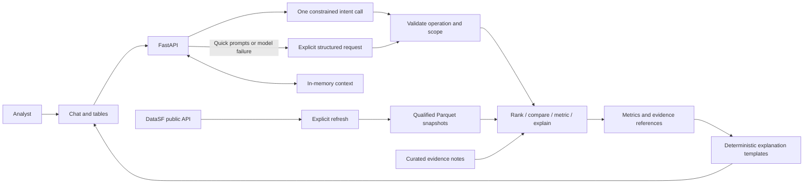
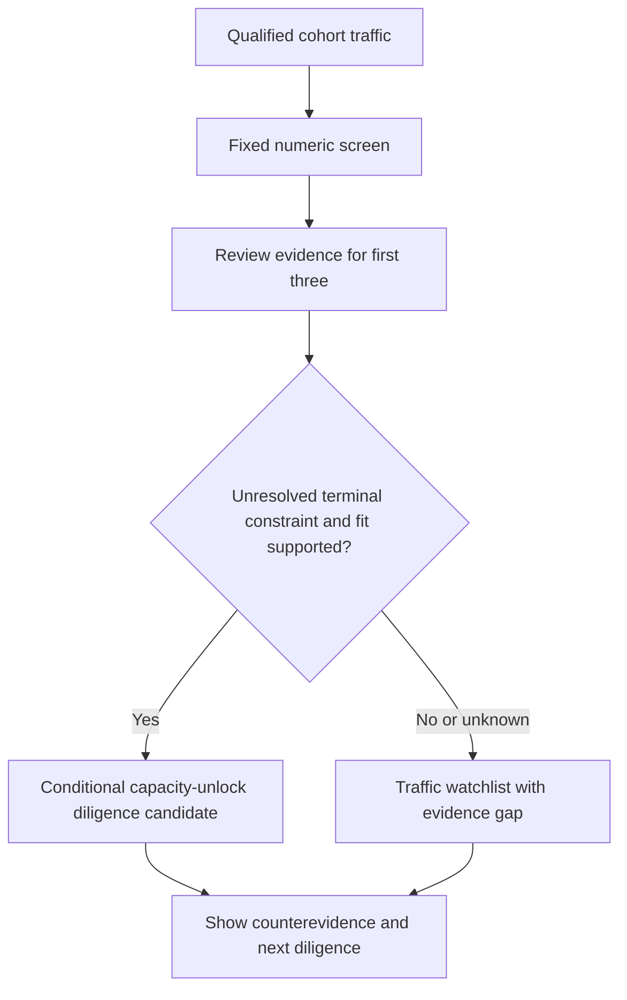

# Airport Investment Analyst — Lean Build Plan

**Delivery: design only.** Build one local home-assignment demo, not a production aviation platform. Source-research notes exist; application behavior and final acceptance remain to be demonstrated. This README is the current plan. Earlier specs/review records apply only to the versions they identify, not automatically to this revision.

## Mission and scope

The [assignment](FDE%20Exam%202.pdf) asks for an AI-powered assistant that identifies promising US airport modernization opportunities based on additional flight/passenger capacity. It requires public-API data, deterministic ranking or comparison, clear reasoning, conversational follow-ups, a chat UI, source code, and a short design document. Its four questions are examples, not four hardcoded intent names.

Our deliverable is a **capacity-unlock diligence screen**: measured traffic pressure plus a small amount of sourced intervention evidence. A busy airport alone is not an expansion opportunity. A candidate must have an evidenced unresolved constraint that the proposed renovation could address. We report why it merits investigation, what could invalidate it, and what the next diligence question is.

The available inputs do not support project-specific profitability or an identified quantity of unserved demand. We will provide useful calculations and conditional conclusions, not replace missing economics with a score. Increases in available airline seats are not measurements of terminal capacity.

### Definition of done

| Demonstration | Required successful result |
|---|---|
| New England terminal-expansion question | A real numeric ranking across the declared cohort; manually reviewed evidence notes for the first three numerically assessable airports; each note explains terminal fit, counterevidence and next diligence. Supported candidates are distinguished from unverified watchlist entries. Never manufacture a positive candidate to pass. |
| LAX/SNA congestion comparison | Real CY2024 cancellation, diversion, departure-delay and taxi-out indicators with denominators; a deterministic per-indicator comparison plus a qualified summary. |
| ANC long-haul percentage | A real departure-weighted CY2024 percentage or justified missing-distance bounds; numerator, denominator, threshold, service scope and coverage. |
| SFO unmet-demand question | Real passenger trends, a quantitative passenger-growth-versus-seat-growth proxy, CY2024 operational indicators, and a sourced constraint note. Explain what the proxy measures and why it cannot identify unmet flight demand or its causes. |
| Generalization | Answer “Compare BOS and PVD passenger growth” and “Which New England airports grew fastest?” through the same operations used for the examples. No question-specific endpoint or intent name. |
| Conversation | A metric-only follow-up preserves airports/year; an explanation preserves the original ranking cohort; a supported period/threshold change recomputes. Unsupported or ambiguous changes preserve the previous result and offer allowed choices. |
| API and AI | A real DataSF API refresh feeds the SFO result. Real model calls resolve the four example questions and the two generalization questions to validated requests. Offline fixtures do not substitute for these checks. |
| Deliverables | One browser chat/results screen, runnable source, and a short architecture note covering scoring, tradeoffs, where AI is used, sources and uncertainty. |

A dataset outage, empty ranking, or limitation-only response does not satisfy the numerical demonstrations. An evidence-backed conclusion that none of the reviewed airports has a supported terminal case is a legitimate outcome, provided real calculations and the completed evidence review are shown. This is prototype acceptance, not investment validation.

### Keep out of the first submission

No required globe, live aircraft, voice, saved analyses across restarts, authentication product, queue, worker fleet, database server, multiple runtime agents, document crawler, vector database, RAG, or ROI model. No automatic cloud deployment or publication. Use ORBIT only for restrained dark styling. A GEV/Cesium map is optional after the core passes; its camera must never change analytical populations.

## Architecture

One local FastAPI process serves static HTML/JavaScript and the API. Use DuckDB to query local Parquet snapshots, an in-memory session dictionary, and one small manually curated JSON evidence file. No separate frontend toolchain.

The model chooses an operation and parameters; the backend controls authorization, supported combinations, arithmetic and explanations. Templates explain score contributions, comparisons and evidence rather than merely displaying numbers. No second model or reviewer is needed on the runtime request path.

Serve on `127.0.0.1` with one worker. Keep the model credential server-side, excluded from Git and logs; no key reaches browser JavaScript. This local demo is not a hosted multi-user security design. Ignore credentials and replaceable data before acquisition. Keep permitted source snapshots reproducible without committing large raw archives.

## Data and scope contracts

The [existing qualification record](backend/docs/evidence/source-qualification-20260925.md) reports bounded source inspections, not a working application. Its temporary paths are not guaranteed to survive. Reacquire or validate supplied files; do not assume those paths exist. Preserve exact request/filter details from the record rather than treating old row counts as permanent truth.

| Source | Intended scope | Remaining implementation work |
|---|---|---|
| DataSF `rkru-6vcg` public API | SFO enplaned passengers, CY2023–24 | Fetch, validate, snapshot, consume. The record reports a qualified raw CSV; live app ingestion is unbuilt. |
| FAA CY2024 commercial-service list | New England cohort | Record the exact download URL; reproduce membership from the official list. |
| BTS T-100 All Carriers (`FMG`) | CY2023–24, 22 cohort origins plus ANC/LAX/SNA/SFO | Reacquire/import the qualified AK/CA/CT/MA/ME/NH/RI/VT partitions; deduplicate overlaps and retain origin scope. |
| BTS Reporting Carrier On-Time (`FGJ`) | CY2024 LAX/SNA/SFO departures | Qualify all 12 monthly archives; the existing record inspected only January 2024. No annual conclusion from one month. |
| Official airport/FAA documents | First three traffic-ranked cohort airports plus SFO | Manually curate short evidence notes; no scraping or extraction pipeline. |

**New England cohort:** `BDL, HVN, PWM, BGR, PQI, RKD, BHB, AUG, BOS, ACK, ORH, MVY, HYA, PVC, MHT, PSM, LEB, PVD, WST, BID, BTV, RUT` (22 airports from the recorded FAA CY2024 scope). These IDs are a check against acquisition, not a replacement for it. The source record reports no eligible PVC row for December 2024. Keep that month unknown unless the absence is separately resolved; do not impute zero.

### Public API: substantive use, not an ornamental integration

Use `https://data.sf.gov/resource/rkru-6vcg.csv` through its Socrata API. Reuse the recorded selected columns and CY2023–24 predicate. Paginate in stable order, reject duplicate/conflicting keys, reconcile with a scoped count query, and require expected month/activity/geography coverage. A page below the limit alone is not completeness proof. Bound acquisition; a timeout, unstable count or unresolved drift fails refresh without replacing the last accepted snapshot.

For the passenger result, filter `activity_type_code = 'Enplaned'`; sum `passenger_count` by `activity_period` and `geo_summary`. Do not sum enplaned, deplaned and transit rows together. A real refresh must occur in the demo and the returned snapshot must feed the SFO calculation. Subsequent questions reuse it.

**Acquisition tradeoff:** DataSF supplies the real API-driven airport workflow. BTS/FAA bulk downloads supply comparable historical populations. Those downloads are explicitly not REST APIs; choosing them avoids substituting a partial live-tracking feed for historical seats, passengers and departures. We do not claim an unverified general BTS API exists, or add a provider solely to increase the API count. Explain this division in the architecture note.

### Small validation contract

Each accepted snapshot stores source URL plus request parameters, retrieval UTC, period/population, row count, SHA-256 and validation outcome. These are local metadata, not a lineage service. Accept legitimate source corrections after checking affected aggregates; never blindly reject a changed hash or silently accept changed scope.

T-100 uses origin-direction records with `CLASS in {A,C,E,F}` and `SEATS > 0`, retaining domestic/international US/foreign carrier source families. The inspected partitions happened to contain only F among those classes. Preserve the full raw identity, including `AIRCRAFT_CONFIG`, from the source record. Exact cross-state duplicate rows collapse; conflicting measures block publication. Cargo-only/nonscheduled services remain out of scope and must not be silently included.

FGJ uses `(FlightDate, Reporting_Airline, Flight_Number_Reporting_Airline, OriginAirportID, DestAirportID, CRSDepTime)` as the recorded flight identity. Validate binary cancellation/diversion flags and airport ID/code agreement. Conflicting duplicate flights or invalid identity/flags block the affected airport-period. Conditional nulls in delay/taxi fields are allowed with explicit denominators.

Annual eligibility requires all 12 source months and explicit coverage for the selected airport. Unknown no-row months block annual metrics, not zero-fill them. Missing values remain distinct from zero. On refresh failure, an existing result remains visible with its original snapshot/time and a failed-refresh label; never label cached data freshly retrieved. On a clean start with no accepted snapshot, return `unavailable`.

### Supported query matrix

| Operation / metrics | Airports or region | Periods |
|---|---|---|
| `metric` / `compare`: T-100 passengers, seats, departures, seat occupancy, long-haul share | 26 listed origins | CY2023 or CY2024 after qualification |
| `metric` / `compare` / `rank`: passenger growth | Those origins; regional ranking within the 22-member New England cohort | CY2024 versus CY2023 only |
| `rank`: screen score, passenger volume, occupancy | New England or an explicit subset of its 22 members | CY2024 only |
| `metric` / `compare`: cancellation, diversion, mean departure delay, taxi-out; congestion bundle | LAX, SNA, SFO | CY2024 only |
| `metric`: DataSF enplaned trend, SFO capacity-pressure bundle | SFO | CY2023/24 levels; growth and bundle CY2024 versus CY2023 |
| `explain` | A result in the current session | Its original scope, snapshots and methodology |

All examples default explicitly to CY2024 and scheduled passenger-service scope. Resolve “Anchorage” to ANC and “Santa Ana” to SNA; disclose “LA interpreted as LAX” with a correction affordance. Ask clarification for genuinely ambiguous airport/metro references. Cargo requests are `unsupported_scope`, not passenger results in disguise. Unsupported airports/years/metrics return allowed choices without changing stored context. Historical CY2024 outputs are not labeled current forecasts.

## Deterministic methodology v1

### A. Traffic ranking plus a capacity-unlock rationale

From the same T-100 passenger-service population calculate `P24`, growth `g = (P24-P23)/P23`, and seat occupancy `o = P24/S24`. Use a sum-of-passengers / sum-of-seats ratio, not a mean of row ratios or a passenger-mile load factor. Nonnegative valid measures, complete periods, `P23 > 0` and `S24 > 0` are required for the score. Raw levels can remain available when a derived ratio is undefined.

Let `n` be numerically eligible airports in the full 22-member cohort. For each component use ascending average rank `r`; percentile is `(r-1)/(n-1)`. Calculate:

`screen_score = 100 * (0.40 * growth_percentile + 0.30 * volume_percentile + 0.30 * occupancy_percentile)`

No score if `n < 2`. Ties use average component rank; final rank is `1 + count(strictly higher unrounded scores)`. Airport ID orders display ties only. Filtering preserves this reference cohort and existing scores. A “grew fastest” request sorts raw growth, not the composite. No user-editable weights in v1.

Synthetic formula fixture (not airport data): A/B/C growth = 5/10/15%; volume = 1,000/3,000/2,000; occupancy = 90/70/80%. The expected scores are A=30, B=50, C=70. Also test equal components and a single eligible airport.

**Business interpretation:** growth is observed traffic momentum, volume is the scale of activity potentially affected, and occupancy describes airline seat utilization. These are heuristic reasons to investigate; they do not measure terminal utilization, prove demand exceeds supply, or calculate returns. Volume favors scale and may favor larger airports; disclose that tradeoff.

**Terminal shortlist:** after the numeric ranking, manually review only the first three numerically eligible airports, using score then ID to select three when tied. For each, record one compact note in `backend/data/evidence.json`: airport, official publisher/title/URL/page, document date, checked date, unresolved constraint, proposed intervention, terminal-fit status (`supported`, `contradicted`, `unknown`), counterevidence and next diligence question. Use an evidence-as-of date separate from the traffic period. A completed remedy or superseding plan invalidates a stale constraint claim. No admin UI, no automated extraction, no 22-airport review gate.

A `supported` entry requires cited evidence of an unresolved terminal constraint and a plausible connection between the proposed intervention and added throughput; unresolved material counterevidence makes the conclusion `unknown`. Only numerically eligible `supported` entries receive a **conditional terminal-expansion diligence recommendation**, ordered by their unchanged screen score. Others are watchlist entries, never negative investment verdicts. Label the shortlist “evidence-reviewed subset of the top three traffic candidates,” not the best opportunities across all 22. Remaining airports are `not_reviewed`; selecting one shows that gap.

Each recommendation states: **measured signal → evidenced constraint → proposed capacity unlock → counterevidence → next diligence**. It does not estimate extra flights, passengers or profit without the corresponding project inputs. A small sensitivity check reports top-three membership under equal weights without replacing v1 or changing the evidence-reviewed set; newly appearing candidates remain unreviewed.

### B. Congestion comparison with a direct, qualified conclusion

Use all reporting carriers at each selected origin in qualified CY2024 FGJ domestic scheduled-flight records, not only carriers common to both airports. Show carrier lists, counts and scope: neither airport is represented as all-airline/international coverage.

Let `N` be scheduled-flight rows with valid identity and flags. Cancellation rate = cancelled/N; diversion rate = diverted/N. For `Cancelled=0 AND Diverted=0`, calculate separate means of non-null `DepDelayMinutes` and `TaxiOut`. The delay label is “mean departure delay, early departures set to zero”; do not substitute signed `DepDelay`. Show each mean's denominator and coverage against eligible non-cancelled/non-diverted flights. Zero denominators make the affected metric unavailable.

The comparison rule uses the four displayed metrics (rates in percent, times in minutes, rounded to two decimal places). For each, report higher/lower/tied; exclude unavailable pairs from `m` and enumerate them. Summary: “LAX is higher on k of m comparable operational-strain indicators; SNA is higher on j; t are tied.” Equal displayed values are ties at display precision. If both airports are higher on different indicators, also say “mixed picture”; if `m=0`, no comparative conclusion.

This unweighted descriptive count is not a statistical significance claim, composite congestion score or proof of terminal causation. Do not normalize two airports into misleading 0/100 extremes. Cancellations, diversions, delays and taxi times can reflect different mechanisms. The answer explicitly identifies those interpretation limits.

### C. Long-haul share

For any supported origin, default long-haul to `DISTANCE >= 3000` statute miles. Allow an explicitly requested positive finite threshold no greater than 12,000 miles, always shown as an assumption; the ceiling is a prototype input bound, not an aviation standard. Count performed departures, not route rows, scheduled departures or passengers.

`T = sum(DEPARTURES_PERFORMED)` over the eligible annual population; `L` = performed departures on known distances meeting the threshold; `U` = performed departures with null/negative distance. A source-reported zero distance is known short under this endpoint-distance definition. Invalid/null/negative performed counts make the result unavailable because T is unknown.

If `T=0`, no share. Otherwise coverage = `(T-U)/T`. With `U=0`, share = `100*L/T`; with `U>0`, bounds = `[100*L/T, 100*(L+U)/T]`, no exact point estimate. Complete monthly coverage remains necessary. Render counts and service scope alongside the percentage. Cargo-only/private operations are outside this result.

### D. SFO quantitative proxy and the “why” answer

Show DataSF enplaned passenger levels/growth separately from T-100 measures; do not join their different passenger populations as if interchangeable. Calculate the following **capacity-pressure proxy** entirely within matching T-100 scheduled passenger-service origin records:

`passenger_growth = (P24/P23 - 1)`

`seat_growth = (S24/S23 - 1)`

`growth_gap_pp = 100 * (passenger_growth - seat_growth)`

Also show occupancy for both years and the separately scoped FGJ operational bundle. Positive baseline passengers/seats and complete periods are required; otherwise the proxy is `not_assessable`. Do not substitute DataSF passengers into a T-100 seat denominator.

Interpretation is literal: positive gap means transported passengers grew faster than supplied seats; negative means slower; zero means equal growth. Example fixture: passengers +10%, seats +5% gives +5 percentage points. This can describe tightening seat utilization, but **is not extra flights needed, terminal saturation, rejected bookings, or measured latent demand**. A negative gap does not establish the absence of unmet demand. Do not convert the gap into “missing passengers.”

Manually curate one SFO note in the same evidence file with dated official constraint evidence and a competing explanation or limitation. Template answer order: numeric scope/results; gap interpretation; documented constraint and its possible mechanism; counterevidence; what remains unidentified. A cited constraint is a hypothesis about relevance, not a proven cause of these aggregates. If the documents do not establish a constraint, say so; a completed source check with an explicit gap is acceptable, an unreviewed placeholder is not.

Requests for quantified unmet demand return `not_identifiable` **alongside** this successful proxy result, with missing unconstrained booking/search demand, fares, airline supply and causal constraint evidence. ROI requests additionally need capex, operating costs, incremental commercial revenue and financing. Unknown business quantities do not invalidate supported calculations or authorize invented estimates.

## Reusable agent contract

Use one strict `AnalysisRequest`: `action = rank | compare | metric | explain`, supported airport IDs or `region=new_england`, allowed metric(s), period, optional long-haul threshold, optional current-session result reference, and clarification fields. The four quick prompts are request presets, not a closed set of question-specific workflow names. Use fixed handlers and the query matrix above; no model-written SQL/code, arbitrary HTTP or shell tool.

At most **one model call per free-text message**, including retries (disable automatic SDK retries), 20-second model timeout, 512 output tokens and 4,000 input characters; 30-second query deadline. Quick-prompt structured requests use zero model calls. Pass only the message and compact previous context, not raw source archives, secrets or entire documents. Model timeout/invalid output returns deterministic explicit-input fallback or asks the user to choose a supported request. A failed model call never becomes a guessed numeric answer.

Validate the requested action, scope, metric, period and parameter combinations server-side. The model cannot create sources, metrics, weights or authoritative answer prose. A parameter such as a threshold is a validated user-selected input, not an observed measurement. Render calculations/citations from the result and curated evidence; safe output rendering never inserts unsanitized HTML from source text.

Minimal context stores the last successful request/result per server-issued session ID. `explain` can inspect two members of a stored ranking without renormalizing it. “Show only cancellations” selects a metric and reuses airports/year. “Use 2023 for ANC” recomputes only from qualified coverage. “Use 2023” after a CY2024 growth screen cannot fabricate 2022 baselines. Clarification, unsupported or unavailable results leave the previous successful context intact. Reject result references outside the session.

Keep at most 100 sessions, one latest result each, expiring after 60 idle minutes. Restart loses context by design. After eviction, ask for a fresh analysis instead of guessing. These are simple local memory limits, not a persistent history system.

## Atomic implementation steps

All steps below are **planned, not implemented**. Paths are repository-relative. Test commands run from the root with `PYTHONPATH=backend python -m pytest ...`; live CLI flags and API schemas are interfaces to implement before using their checks. A missing command, zero collected tests, or a failed request is not a pass. Each row has one bounded outcome and at most two edited paths. Split a row before execution if it grows beyond a small module/function plus its test. Repeat per-file source imports sequentially; do not turn them into an orchestration platform.

### Phase 1 — Runnable shell

**What:** one API and browser. **How:** FastAPI plus static files and validated contracts. **Why:** prove the serving path before acquiring broad data.

| ID | Depends | Files | Single outcome / how | Completion check |
|---|---|---|---|---|
| 1.1 | none | `backend/requirements.txt`, `backend/app/main.py` | Create the loopback FastAPI health endpoint. | Start the planned server command; `/health` body equals `{"status":"ok"}`. |
| 1.2 | none | `.gitignore`, `backend/.env.example` | Define safe local configuration exclusions with placeholder credential names. | `git check-ignore backend/.env backend/data/raw/probe.csv`; example has no values. |
| 1.3 | 1.1 | `backend/app/static/index.html`, `backend/app/static/app.js` | Create a chat shell with four visible request presets. | Each button selects its intended request; no result claimed yet. |
| 1.4 | 1.3 | `backend/app/main.py` | Mount the static shell at `/`. | Browser loads page and JavaScript without 404s. |
| 1.5 | 1.1 | `backend/app/contracts.py`, `backend/tests/test_contracts.py` | Define operation/result contracts including supported combinations. | `test_contracts.py`: reject invalid combinations; accept comparison and explanation examples. |

### Phase 2 — First slice: public API to SFO passenger result

**What:** a real source-to-screen result. **How:** bounded DataSF refresh and one calculation. **Why:** demonstrate API use before extra datasets or polish; this slice alone is not final AI/assignment acceptance.

| ID | Depends | Files | Single outcome / how | Completion check |
|---|---|---|---|---|
| 2.1 | 1.2,1.5 | `backend/app/sources/datasf.py`, `backend/tests/test_datasf.py` | Acquire complete bounded DataSF CSV using the declared request/paging contract. | `test_datasf.py`: full multi-page input succeeds; truncated/count-conflicting input fails. |
| 2.2 | 2.1 | `backend/app/sources/datasf.py`, `backend/tests/test_datasf.py` | Publish only accepted Parquet snapshots with metadata. | `python -m app.sources.datasf --refresh` live run; failed refresh preserves the previous snapshot. |
| 2.3 | 2.2 | `backend/app/calculations/sfo.py`, `backend/tests/test_sfo.py` | Calculate enplaned levels and growth from the accepted snapshot. | `test_sfo.py`: exclude other activities, reconcile a source aggregate, handle zero baseline. |
| 2.4 | 1.4,1.5,2.3 | `backend/app/main.py`, `backend/app/responses.py` | Expose `POST /api/query` for an explicit SFO metric request. | API returns calculated values, snapshot ID and scope, not an empty success. |
| 2.5 | 2.4 | `backend/app/static/app.js`, `backend/app/static/index.html` | Render the real SFO passenger result. | Browser quick prompt shows numbers matching the accepted snapshot. |

### Phase 3 — Reusable deterministic calculations

**What:** cover the remaining data/metrics. **How:** small loaders and pure functions. **Why:** all question variants share the same arithmetic.

| ID | Depends | Files | Single outcome / how | Completion check |
|---|---|---|---|---|
| 3.1 | 1.2 | `backend/app/sources/faa.py`, `backend/tests/test_faa.py` | Reproduce the FAA cohort from the official download. | `test_faa.py`: exact 22 IDs; record acquisition URL/date. |
| 3.2 | 1.2 | `backend/app/sources/t100.py`, `backend/tests/test_t100.py` | Import the required T-100 partitions with full-key deduplication. | `test_t100.py`: overlapping records collapse; conflicting measures fail. |
| 3.3 | 3.2 | `backend/app/sources/t100.py`, `backend/tests/test_t100.py` | Produce origin/service-filtered Parquet with airport-period coverage. | `test_t100.py`: exclude cargo-only; preserve the recorded missing month. |
| 3.4 | 3.3 | `backend/app/calculations/traffic.py`, `backend/tests/test_traffic.py` | Calculate airport volume, growth and occupancy. | `test_traffic.py`: independently aggregated values and undefined-ratio cases. |
| 3.5 | 3.3 | `backend/app/calculations/long_haul.py`, `backend/tests/test_long_haul.py` | Calculate departure-weighted long-haul share for a supplied airport. | `test_long_haul.py`: exact share, unknown-distance bounds, zero/invalid total. |
| 3.6 | 3.1,3.4 | `backend/app/calculations/screen.py`, `backend/tests/test_screen.py` | Calculate v1 ranking with frozen-cohort semantics. | `test_screen.py`: A/B/C=30/50/70, ties, n<2, raw-growth ordering, filtering invariance and equal-weight sensitivity. |
| 3.7 | 1.2 | `backend/app/sources/ontime.py`, `backend/tests/test_ontime.py` | Import validated CY2024 FGJ archives sequentially. | `test_ontime.py`: ZIP/CSV validity, identity/flags, conflict detection; live acquisition records 12 months. |
| 3.8 | 3.7 | `backend/app/sources/ontime.py`, `backend/tests/test_ontime.py` | Publish scoped LAX/SNA/SFO Parquet with coverage. | `test_ontime.py`: all requested airport-months qualified before annual queries; conditional nulls retained. |
| 3.9 | 3.8 | `backend/app/calculations/operations.py`, `backend/tests/test_operations.py` | Calculate operational rates and conditional means. | `test_operations.py`: hand-checked denominators, nulls, origin direction and early-delay semantics. |
| 3.10 | 3.9 | `backend/app/calculations/comparison.py`, `backend/tests/test_comparison.py` | Produce the descriptive congestion comparison. | `test_comparison.py`: higher/lower/tied, mixed picture, missing metrics and m=0. |
| 3.11 | 2.3,3.4,3.9 | `backend/app/calculations/sfo.py`, `backend/tests/test_sfo.py` | Assemble the SFO pressure bundle. | `test_sfo.py`: +10%/+5%=+5 pp; matching T-100 scope; negative gap and zero baseline do not invent unmet demand. |

### Phase 4 — Minimal investment reasoning

**What:** connect metrics to the renovation question. **How:** four manually authored evidence notes, no retrieval infrastructure. **Why:** fix the mission gap without reviewing 22 airport projects or building RAG.

| ID | Depends | Files | Single outcome / how | Completion check |
|---|---|---|---|---|
| 4.1 | 3.6 | `backend/data/evidence.json` | Curate one note per selected top-three airport using official documents. | Three completed notes or one per eligible airport if fewer; actual citations/checked dates, counterevidence and no placeholder status. |
| 4.2 | 4.1 | `backend/data/evidence.json` | Curate the SFO constraint note. | Open cited pages; note supports the proposed mechanism or explicitly records the gap after review. |
| 4.3 | 4.2 | `backend/app/evidence.py`, `backend/tests/test_evidence.py` | Validate evidence records and map them to result IDs. | `test_evidence.py`: missing citation, completed remedy and unreviewed airport never become supported terminal claims. |
| 4.4 | 3.6,4.3 | `backend/app/calculations/screen.py`, `backend/tests/test_screen.py` | Attach evidence-based terminal dispositions to the ranking. | `test_screen.py`: same numeric scores; supported/unknown/contradicted and none-supported outcomes. |
| 4.5 | 3.10,3.11,4.4 | `backend/app/responses.py`, `backend/tests/test_responses.py` | Render evidence-led explanations from deterministic results. | `test_responses.py`: each number/source resolves; terminal and SFO answers include counterevidence; proxy never becomes unmet flights. |

### Phase 5 — General conversational access

**What:** answer more than four phrasings. **How:** one bounded parser call and a small shared dispatcher. **Why:** an analyst can ask nearby questions without adding new workflows.

| ID | Depends | Files | Single outcome / how | Completion check |
|---|---|---|---|---|
| 5.1 | 1.5 | `backend/app/session.py`, `backend/tests/test_session.py` | Store bounded current-session context. | `test_session.py`: isolation, expiry, eviction and unchanged state after failed/unsupported requests. |
| 5.2 | 1.5,3.5,4.5 | `backend/app/dispatch.py`, `backend/tests/test_dispatch.py` | Map allowed operation/metric combinations to existing functions. | `test_dispatch.py`: BOS/PVD growth comparison, raw-growth ranking and stored-result explanation. |
| 5.3 | 1.2,1.5,5.1 | `backend/app/intent.py`, `backend/tests/test_intent.py` | Parse free text into the strict request schema. | `test_intent.py`: one call ceiling, disabled retries, timeout/length bounds; six real question probes. |
| 5.4 | 5.3 | `backend/app/intent.py`, `backend/tests/test_intent.py` | Provide explicit-input fallback when the model fails. | `test_intent.py`: quick prompts still work; ambiguity asks a question rather than guessing. |
| 5.5 | 5.1,5.2,5.4 | `backend/app/main.py`, `backend/tests/test_api.py` | Connect validated queries to sessions and the shared dispatcher. | `test_api.py`: real handler calls, supported follow-up recomputation, safe errors and session-bound result references. |
| 5.6 | 5.5 | `backend/app/static/app.js`, `backend/app/static/index.html` | Render conversational results and details on one screen. | Browser displays four examples plus generalization/follow-ups with matching values and citations. |

### Phase 6 — Verify and hand over

**What:** make the small demo usable and reproducible. **How:** targeted tests and an observed browser run. **Why:** clarity, reasoning and honest boundaries are the assessment priorities.

| ID | Depends | Files | Single outcome / how | Completion check |
|---|---|---|---|---|
| 6.1 | 5.6 | `backend/app/static/index.html`, `backend/app/static/app.js` | Make result states keyboard-accessible and narrow-screen usable. | Complete flows via keyboard; distinguish zero/missing/unavailable; visible focus, labels and no hidden sources. |
| 6.2 | 6.1 | `backend/docs/ARCHITECTURE.md`, `README.md` | Document the runnable submission. | Fresh environment follows setup; architecture explains formulas, AI role, API/bulk tradeoff and evidence limitations. |
| 6.3 | 6.2 | `backend/docs/evidence/demo-acceptance.md` | Record final numerical, model and browser acceptance. | All demonstrations above pass on real qualified snapshots; include missing-data/model-failure checks. |

Planned local startup: `python -m uvicorn app.main:app --app-dir backend --host 127.0.0.1 --port 8000` after installing `backend/requirements.txt`. Planned full suite: `PYTHONPATH=backend python -m pytest backend/tests -q`. These become runnable during implementation; documentation alone is not execution proof.

## Final review contract

Review the whole README against the original assignment and the small-demo scope, not only changed lines. Validate findings before editing: an unsupported request for more infrastructure, an invented unmet-demand estimate, or normalization of two congestion values into a fake index is not a justified fix. Zero findings is a valid outcome; never impose a finding quota or omit a genuine concern to produce approval.

Bind each independent review to the exact commit and README bytes. Keep findings and dispositions in the PR/review record. Fix a valid issue, rerun applicable checks, and request a fresh full-plan review on the new version. Earlier approvals do not survive content changes. Missing reviewer execution, a timeout or silence means **independent review not completed**, never approval. A clean review approves the plan only; all implementation/demo gates remain open until executed.

## First milestone and optional polish

First prove DataSF → accepted snapshot → SFO passenger calculation → browser result. Then complete reusable analytics, the small evidence file, and conversational access. Only after numerical and AI acceptance passes consider a simple map or selective GEV reuse. No UI reference, existing source-research note or previous review substitutes for the mission demonstrations.
