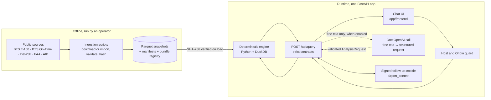
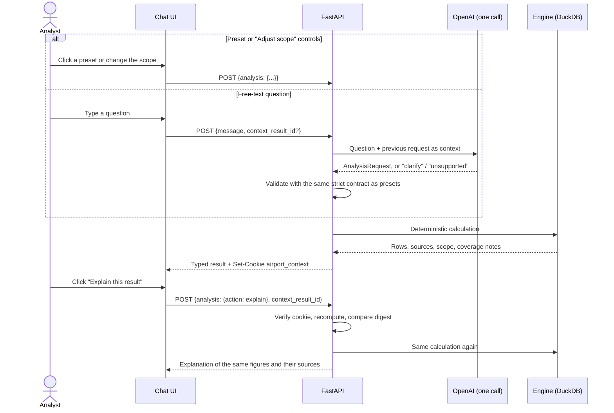
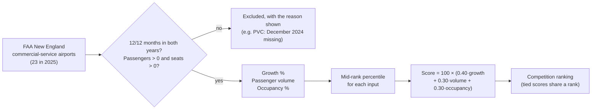

# Airport Investment Intelligence Agent

A prototype built for the Deloitte FDE home assignment ([brief](docs/FDE%20Exam%202.pdf)). An analyst uses a chat screen to ask investment-screening questions about US airports. The agent answers from public aviation data, ranks or compares airports with deterministic logic, explains how it reached each answer, and supports follow-up questions.

This README is the design and architecture document the brief asks for. It covers the scoring methodology, the key tradeoffs, where and how AI is used, and the assumptions, uncertainty and scope. To run, test or deploy the app, see **[app/README.md](app/README.md)**.

## Repository layout

```text
.
├── README.md          ← this document: design, methodology, tradeoffs, AI use
├── docs/              ← supporting documentation
│   ├── ARCHITECTURE.md    modules, request flow, numerical definitions, data refresh
│   ├── API_UI_MAP.md      the HTTP contract and how the UI uses it
│   ├── adr/               architecture decision records
│   ├── evidence/          verification records (hashes, recomputed figures, acceptance runs)
│   └── history/           earlier plans and reviews, kept for traceability
└── app/
    ├── README.md      ← run, test, configure and deploy
    ├── backend/       FastAPI service, calculations, data snapshots, ingestion scripts, tests
    └── frontend/      static chat UI (HTML, CSS, JS, WebGL globe), no build step
```

## The four questions and what the agent answers

By default the agent compares calendar year 2024 with 2025 (the accepted data bundle `annual-2025-r1`). If the analyst names 2023 or 2024, it uses the historical 2023 → 2024 snapshots instead.

| Question | How it is answered | Data source | Answer (CY2025) |
|---|---|---|---|
| Which New England airports are strong candidates for terminal expansion? | Screen score ranking, with terminal notes | BTS T-100, FAA airport list | 22 airports ranked. HVN is 1st (score 74.76); BGR and PWM tie for 2nd. PVC is excluded because its data is incomplete. |
| How do LAX and Santa Ana (SNA) compare on congestion? | 4 operational-strain indicators, side by side | BTS On-Time Performance | Mixed. SNA has more cancellations (1.047 % vs 0.690 %) and longer departure delays (15.17 vs 13.80 min). LAX has longer taxi-out times (17.73 vs 16.05 min). |
| What share of Anchorage (ANC) departures are long-haul? | Departures of 3,000 miles or more ÷ all departures | BTS T-100 | 999 / 36,040 = 2.77 % |
| What is SFO's unmet flight demand, and why? | Passenger growth minus seat growth, with supporting context | DataSF, BTS T-100, BTS On-Time | −1.22 pp: seats grew faster than passengers (+4.70 %). This is not evidence of unmet demand, and unmet demand cannot be measured from traffic data. |

Every figure above was recomputed independently from the raw files and matched the API ([integrated acceptance](docs/evidence/integrated-acceptance-20260929.md)).

## Architecture



- **Data is prepared offline.** Ingestion scripts fetch or import each official file, check it, and write it as a Parquet snapshot. They record a SHA-256 hash for every file. The server never calls a data provider while it answers a question. It loads the snapshots named in `data/bundles/accepted.json`, checks every hash, and refuses to answer if any file is missing or has been altered.
- **All numbers come from Python.** `dispatch.py` sends each validated request to one plain function in `calculations/`, which runs DuckDB SQL over the snapshots. There is no agent loop, no SQL written by a model, no database server and no queue.
- **Follow-ups are stateless.** Each result sets a signed `airport_context` cookie (HMAC-SHA256). The cookie holds the resolved request, a digest of the result and an expiry time. When the analyst asks for an explanation, the server checks the signature, recomputes the result, and checks the digest. Because nothing is stored on the server, this works on any serverless instance.

### A question, from start to finish



## Scoring methodology

A general rule for every workflow: missing months are never filled in. If any month of an airport-year is missing, that airport-year is treated as unavailable, never as zero.

### New England terminal-expansion screen



- **Inputs.** P is passengers and S is seats, for the baseline and comparison years.
  - Growth = `100 · (P_cmp − P_base) / P_base`.
  - Volume = `P_cmp`.
  - Occupancy = `100 · P_cmp / S_cmp`.
- **Percentile.** Each input is converted to a mid-rank percentile among the eligible airports: `(2·lower + tied − 1) / (2·(n − 1))`. Here `lower` is the number of airports with a lower value and `tied` is the number with the same value, including the airport itself. Percentiles make the three inputs comparable on one scale. They also stop BOS's size from dominating the score.
- **Why these weights.** Growth gets 40 % because expansion is about future demand. Volume and occupancy get 30 % each, because they measure how much the current terminal is used. The weights are a judgment call, not a calibrated model. Each result says the score is a heuristic measure of traffic pressure, not of terminal capacity or investment success.
- **Terminal notes.** Each ranked airport shows curated terminal-project evidence. Every claim is labelled "Status unknown", because the sources do not confirm project status.
- If fewer than two airports are eligible, the result is `insufficient_data` and no ranking is shown.

### LAX vs SNA congestion

The agent compares domestic departures by reporting carriers on four indicators:

- cancellation rate
- diversion rate
- mean departure delay (early departures count as 0)
- mean taxi-out time

Delay and taxi-out averages use completed flights only. For each indicator the agent reports which airport is higher, lower, or tied. It deliberately does **not** combine them into one congestion index, because any weighting would be arbitrary and would hide the fact that the picture is mixed.

### ANC long-haul share

Long-haul share = departures of at least 3,000 miles ÷ all performed departures, from T-100. The analyst can change the threshold to any value above 0 and up to 12,000 miles. If some departures have no recorded distance, the agent returns lower and upper bounds rather than a single number. For ANC there are no such departures.

### SFO unmet demand

Traffic data records flights that operated. It cannot show demand that was never served. The agent therefore does not produce a number for "unmet demand" and marks it `not_identifiable`. Instead it reports a **pressure indicator**: passenger growth % minus seat growth %, in percentage points. A positive value would mean passengers grew faster than seats, which points to tightening capacity. For 2025 the value is −1.22 pp: seats grew faster than passengers. The indicator is shown alongside the DataSF monthly enplanement trend, occupancy and on-time indicators. The answer to "why" states which of these the data supports and which it cannot address, such as fares, slot limits and latent demand.

## Where and how AI is used

AI is used in **exactly one place**: `app/backend/app/model_adapter.py` turns a free-text question into a structured request.

| | |
|---|---|
| **What the model does** | One OpenAI Responses API call with a strict JSON schema. It returns an `AnalysisRequest`, or `clarification_required`, or `unsupported_scope`. For a follow-up, the previous request is passed in as context. |
| **What the model never does** | It never produces numbers, SQL, citations or text shown to the analyst. Everything shown comes from the deterministic engine and fixed templates. |
| **Validation** | The model's output is checked by the same strict contract used for presets: a closed list of airports, metrics and years, and no extra fields. Anything outside that list is refused with a clear message. |
| **Limits** | Up to 4,000 characters in; up to 512 output tokens; a 20 s timeout; `store: false`; spend capped by a hard monthly budget on the OpenAI project. |
| **Admission gate** | Free text stays off until the chosen model passes a 30-case evaluation (at least 29 of 30 correct). The server then calls the model only if the model name and the SHA-256 of the adapter file match the admitted values, so an unreviewed change to the prompt or code turns the feature off. |
| **Failure** | Any provider error becomes a safe `ai_unavailable` or `query_timeout` response. Presets and the scope controls work without the model. |

The design keeps AI where it adds value, which is understanding loosely worded questions. It keeps AI out of places where it could make up a figure.

## Key tradeoffs

| Choice | Benefit | Cost |
|---|---|---|
| Parquet snapshots prepared ahead of time, queried with DuckDB, instead of live API calls | Reproducible, fast and free to run. Every figure can be traced to a file hash. | Refreshing the data means re-running ingestion and redeploying. |
| One constrained model call instead of an agent framework | The model cannot invent numbers. Behaviour can be tested with a fixed evaluation set. | Questions outside the supported list are refused rather than improvised. |
| A deterministic scoring formula instead of LLM judgement | Transparent, repeatable and explainable line by line. | The weights are a judgment call, and percentiles depend on which airports are in the cohort. |
| No composite congestion index | Honest about a mixed picture. | No single "winner" headline. |
| A signed cookie instead of a session store | Works on any serverless instance, with no database. | Context lasts at most 1 hour and is lost when the signing key changes. |
| Public data only | Every number traces back to an official source. | Capacity, fares and latent demand cannot be observed. |
| No login (owner's decision) | Simple to demo and review. | Cost is limited by per-call limits and the OpenAI project's budget, not by user accounts. |

## Assumptions, uncertainty and scope

- **Scope.** The four questions above, 2023–2025, and the airports and metrics in the contract. Profitability, ROI, capital cost and causal claims are out of scope. Results state this in their limitations, and the model path refuses such questions as unsupported.
- **Differences between data sources.** T-100 covers scheduled passenger service with seats reported. On-Time data covers domestic flights by reporting carriers only. Figures from different sources are never combined into one ratio.
- **Incomplete data.** Incomplete airport-years are excluded, and the reason is shown. Missing data is never replaced with an estimate.
- **Terminal evidence** is a small, curated review. Every claim is labelled "Status unknown".
- **Freshness.** The packaged data was checked against the official sources on 2026-09-27. The answers are about the past; they are not forecasts.
- **In the UI.** Every result shows the period compared, the data sources, notes on data coverage and the reason for any exclusion.
- **Not implemented.** Voice input, an optional extra in the brief.

## Verification status

| Claim | Status |
|---|---|
| Four workflows, follow-ups and error paths | Locally tested: 722 Python and 102 UI tests. Every figure was recomputed independently. 23,474 API cases ran with no server errors. ([evidence](docs/evidence/)) |
| Packaged data matches the official sources | Checked against the live sources on 2026-09-27 ([activation review](docs/evidence/recent-data-activation-review.md)) |
| Free-text model | Implemented and tested offline. Not yet tested against the live API, so free text returns `503 ai_unavailable` until the model is admitted. |
| Hosted deployment | Packaged for Vercel and checked offline. Not deployed yet ([package check](docs/evidence/vercel-package-check.md)). |

For more detail, see [docs/ARCHITECTURE.md](docs/ARCHITECTURE.md) (modules, numerical definitions, how data is refreshed) and [docs/API_UI_MAP.md](docs/API_UI_MAP.md) (the HTTP contract).
