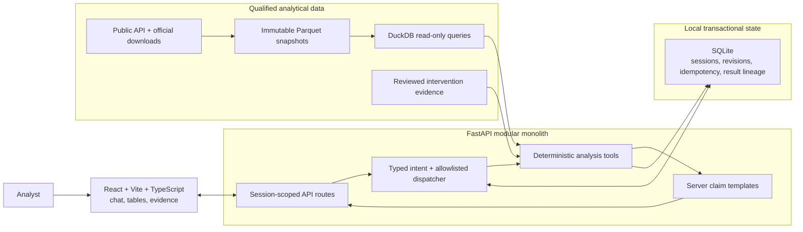
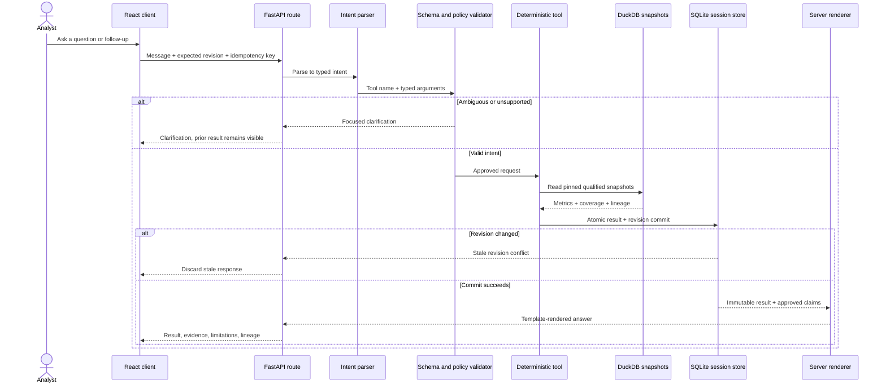
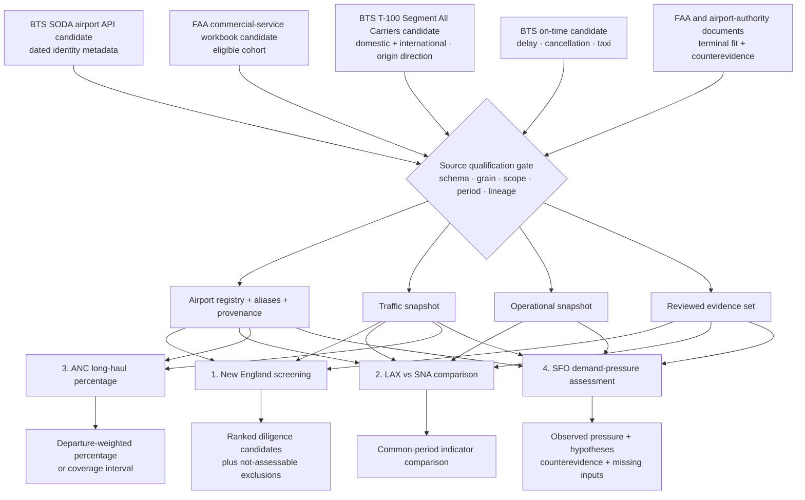

# Airport Investment Intelligence Agent — Master Build Plan

**Plan date:** 25 September 2026  
**Status:** plan only. No application, analytical source, test suite, or deployment has been built or runtime-qualified.  
**Planning assumption:** deliver the 24-hour exam milestone first; retain the full ORBIT-style product as the next phase. The exact remaining clock is unknown, so optional scope is cut before architecture or truthfulness safeguards.

## 1. Mission

Build an AI-assisted airport investment screening application that uses a meaningful public API integration, deterministic aviation analysis, and conversational follow-ups to help an analyst decide where deeper modernization diligence is warranted.

```text
observed traffic
  -> deterministic pressure priority
  -> terminal intervention fit and counterevidence
  -> profitability evidence gap
  -> diligence recommendation
```

The system prioritizes investigation. It does not prove profitability, ROI, or causal unmet demand. A future finance scenario needs capex/phasing, attributable usable-capacity uplift, ramp/utilization, investor revenue capture, incremental opex, asset life, and discount rate.

The exam milestone supports four generalized workflows:

1. rank a defined New England commercial-passenger airport cohort for terminal-expansion diligence;
2. compare congestion indicators for resolved airports, beginning with LAX and SNA;
3. calculate long-haul departure share for an airport, beginning with ANC;
4. assess demand pressure for an airport, beginning with SFO, without inventing an unmet-demand quantity.

Every substantive answer separates `observed`, `calculated`, `inferred`, `scenario`, and `unknown` claims. Missing data is never converted into zero.

## 2. Milestones

### Phase A — mandatory exam product

- a qualified public API supplies a substantive airport-search/detail field with dated lineage;
- qualified downloads/snapshots supply calculation-grade aviation data;
- deterministic backend tools implement all four workflows;
- the first complete capability compares airports, stores structured context, recomputes “use the previous year,” atomically persists the successor result, and renders numbers without model arithmetic;
- a minimal map-free Vite interface shows chat, tables, evidence, uncertainty, source mode, and result lineage;
- `backend/docs/ARCHITECTURE.md` explains scoring, tradeoffs, and AI boundaries.

### Phase B — retained full product

- ORBIT-inspired analyst workspace;
- optional Cesium/globe mechanics selected only after a coupling spike;
- saved analyses and richer evidence review;
- optional live context, voice, hosting, and finance scenarios after separate qualification.

Phase B cannot delay Phase A. A map is a view over an `AnalysisResult`, never an analytical input.

## 3. Architecture

Use a separate **FastAPI modular monolith** and **React 19 + Vite + TypeScript frontend**. React is chosen for explicit state composition and later Cesium integration; Vite keeps the exam bootstrap small; TypeScript makes API/result-state mismatches visible before browser review.



The backend is the product's analytical authority. The frontend sends intent and renders typed results; it does not calculate metrics. DuckDB reads versioned analytical snapshots, while SQLite tracks short-lived anonymous sessions and immutable result lineage. The model is bounded to typed intent and approved claim selection; deterministic tools and server templates own the answer.

The fixed request flow is:

```text
parse -> validate -> execute deterministic tool -> atomically persist -> explain
```



This is also the follow-up contract. “Use the previous year” reuses stored airport and service scope, changes the period explicitly, recomputes the tool, and creates a successor result. A model failure cannot remove the deterministic table or lineage.

The model may propose a typed intent, then choose an ordered list of approved claim IDs plus enumerated relations and qualifiers. It never supplies trusted substantive prose. Server templates render every numeric or causal sentence from validated values, relations, qualifiers, and citations. Arbitrary model text is treated as untrusted and cannot reach the substantive answer. A deterministic template returns the same validated result when model generation fails.

DuckDB reads pinned immutable Parquet snapshots. SQLite stores local single-process sessions, idempotency reservations, result metadata, and follow-up links. Phase A does not need MongoDB or Supabase: DuckDB handles analytical queries over the snapshots, while SQLite provides atomic transactional state for the single application process. Revisit managed PostgreSQL or Supabase only if the product moves to multi-instance hosting or shared multi-user access. No queue or server database is needed for the exam.

### Why this approach

- The deterministic engine can be proved independently of the model and UI.
- A clean API boundary supports a minimal exam interface and later ORBIT/globe UI.
- It avoids committing to an upstream spatial application before proving its coupling and rights.
- It adds more structure than a single Python UI, but only where required for correct follow-ups and trustworthy numbers.

## 4. Source gate and decision log

Source qualification is the first execution gate. A dependent ticket stops when its source gate fails.

| Need | Candidate | Planned role | Qualification required |
|---|---|---|---|
| Public API | BTS SODA Airports Citizen Connect `https://data.bts.gov/resource/kfcv-nyy3.json` | Airport search/detail identity metadata with visible dated provenance | Live calls returned 19,850 rows and exactly one match for each of ANC, BDL, BOS, LAX, SFO, and SNA. Its 2020-07-16 observation vintage limits it to dated identity/classification enrichment; selected field semantics and UI lineage must still pass. |
| Eligible airport cohort | FAA CY2024 commercial-service workbook | Authoritative membership after qualification | The live workbook passed XLSX integrity and content checks: 513 unique airport rows and a reproducible 22-airport New England cohort. Preserve the verified checksum, inclusion rule, and source metadata in the ingestion manifest. CY2025 preliminary data is not substituted. |
| Traffic and route mix | BTS T-100 Segment All Carriers domestic and international extract candidate | Origin-direction departures, seats, passengers, and distance | Official lookup calls now resolve service-class and domestic/international carrier-source codes, but three live bounded generated-download POSTs failed. The earlier successful extract is historical evidence; current extraction is blocked until reproducibility and the remaining grain, direction, units, deduplication, reconciliation, and period checks pass. |
| Operational indicators | BTS marketing-carrier on-time monthly ZIP candidates | Delay, cancellation, taxi indicators | The index exposes 12 partitions for each of CY2023 and CY2024 plus a December 2023 alias. A bounded January 2024 range request verified real ZIP/CSV bytes, the 110-column schema, and real rows; full-file checksums, row counts, reporting population, deduplication, and all-month coverage remain pending. |
| Intervention evidence | FAA and airport-authority documents | Terminal fit, competing constraints, counterevidence | Every claim resolves to publisher, date, page/section, constraint type, and review status. |

### How sources support the four assignment tasks

The diagram below is a planned mapping, not a validation result. Every arrow passes through the qualification gate before its dependent workflow can ship.



The candidate public API contributes dated airport identity metadata and visible provenance if it passes qualification; it is not the analytical source for congestion or ranking. The FAA cohort candidate determines New England eligibility, T-100 candidates support traffic/route calculations, on-time candidates support a distinct operational population, and reviewed documents gate terminal-intervention conclusions.

### Observed live public-API evidence — 2026-09-25

The SODA count query returned 19,850 rows. A bounded query for ANC, BDL, BOS, LAX, SFO, and SNA returned exactly one record for each identifier, including name, city, state, facility/use classification, status, and ICAO identity fields. Separate two-row pages returned distinct offsets, so the endpoint's pagination mechanism was exercised. Every required record carried `eff_date` 2020-07-16, and the official dataset description says its observations are as of 2020-07-16. A later portal-metadata update does not make those observations contemporary. The sampled `annual_ops` field contained dates such as `12/31/2019`, so it must not be interpreted as an operations count.

This proves a real, nonempty public API integration and 6/6 target-airport identity resolution. Its fitness is limited to visibly dated identity/classification enrichment; it does not qualify modern congestion or the 2024 cohort. FAA membership is authoritative. SODA is left-joined enrichment: a missing row yields `registry_metadata_missing` and never removes an FAA airport. A qualified API-origin field and its 2020-07-16 vintage must appear in search/details with lineage for the exam to pass; an offline fixture or download alone cannot satisfy that requirement.

T-100 and on-time inputs are planned downloads, not mislabeled APIs. Frozen snapshots may support reproducibility but are labeled with retrieval date and mode. Synthetic fixtures remain test-only.

### Observed live download evidence — 2026-09-25

- The official BTS T-100 Segment All Carriers selection UI at `https://transtats.bts.gov/DL_SelectFields.aspx?QO_fu146_anzr=&gnoyr_VQ=FMG` remains reachable and exposes the expected field selectors. Live official lookup downloads resolve `DATA_SOURCE` as `DF` domestic/foreign carrier, `DU` domestic/U.S. carrier, `IF` international/foreign carrier, and `IU` international/U.S. carrier. The service-class lookup identifies scheduled passenger/cargo classes `A`, `C`, `E`, and `F`, separately from scheduled all-cargo and unscheduled classes. An earlier bounded Alaska January 2024 POST returned a 36,924-byte ZIP with SHA-256 `6b69594064daafad1891483560d77aa63573b6087c4b3f6eb640734d49125da7`, a 211,939-byte CSV, and 3,922 data rows. On 2026-09-25, three fresh bounded POSTs with the same geography/year/month intent instead redirected to `/ErrPage.asp?aspxerrorpath=/DL_SelectFields.aspx` and then returned 404. The earlier success is historical evidence, not current runtime proof. Ticket 4 is blocked until generated extraction is reproducible and full CY2023/CY2024 coverage, segment grain, origin direction, units, IDs, deduplication, and reconciliation pass.
- The official PREZIP index exposes 12 canonical marketing-carrier on-time month partitions for CY2023 and 12 for CY2024; December 2023 also has an alternate parenthesized filename. A January 2024 HEAD returned HTTP 200, `application/x-zip-compressed`, 27,573,265 bytes, byte-range support, and a 2024-04-11 last-modified date. A bounded 65,536-byte request returned HTTP 206 with `Content-Range: bytes 0-65535/27573265` and a valid ZIP signature. Partial decompression exposed `On_Time_Reporting_Carrier_On_Time_Performance_(1987_present)_2024_1.csv`, a declared uncompressed size of 246,830,488 bytes, 110 columns, and 1,553 complete real rows in the decoded prefix. Required fields including airport IDs/codes, flight date, carrier, cancellation, delay, taxi, and distance were present. The prefix itself demonstrated field missingness: 1,553 eligible rows versus 1,507 nonblank departure delays, 1,505 taxi-out values, 1,502 taxi-in values, and 1,501 arrival delays. Ticket 5 must still download and checksum every required file, resolve the December alias, and verify full row counts, extraction, carrier grain, deduplication, months-with-rows, reporting coverage, and airport population.
- The FAA CY2024 commercial-service workbook returned HTTP 200 with the expected XLSX MIME type and 58,201 bytes. SHA-256 is `7253febd109b73deeece0bd68e2aeb6f419e88332c2d109fd3350020edd73640`; the ZIP container passed integrity checks. Its single sheet, `ChangeinRevenuePassengerEnplan `, contains columns for rank, FAA region, state, Locid, city, airport name, service level, hub, CY2024 enplanements, CY2023 enplanements, and percent change. Parsing produced 513 airport rows with 513 distinct Locids, no missing or nonpositive CY2024 enplanements, 394 primary (`P`) airports, and 119 nonprimary commercial-service (`CS`) airports. Applying the explicit CT, ME, MA, NH, RI, and VT rule yields 22 New England airports: 19 `P` and 3 `CS`. All six named target airports are present. The FAA page lists this under CY2024 Passenger Boarding Data, says it was added 2025-09-15, and defines the service-level and hub codes. This qualifies the workbook for the CY2024 commercial-service cohort; the immutable ingestion manifest must preserve the checksum, retrieval date, row counts, and cohort rule. CY2025 preliminary data remains outside the core comparison unless a later scope decision adopts it.

### Public API acceptance contract

The candidate API is accepted only when the qualification artifact proves all of the following. Until then its status remains `candidate_reachable`, not `qualified`.

- ANC, BDL, BOS, LAX, SFO, and SNA each resolve exactly once to canonical airport ID, name, city, state, and at least one meaningful classification field selected from the observed schema.
- Required-field null rates, duplicate canonical IDs, duplicate IATA codes, and conflicting names are counted and dispositioned; a missing enrichment row never removes an FAA-cohort airport.
- The artifact records observation vintage separately from portal-metadata update time, plus request URL/parameters, retrieval timestamp, response checksum, row count, and schema fingerprint.
- Pagination is exercised until completion and proves that the six named airports are not an accidental first-page sample.
- Timeout, non-2xx, malformed JSON, schema drift, missing required fields, duplicate IDs, and partial-page failure each produce a typed unavailable/quarantined state rather than silently serving stale or partial metadata.
- The qualified API-origin field and its vintage/lineage appear in airport search or detail output. If this candidate cannot meet that substantive role, Gate 1 selects another public API before Phase A can pass.

### Source failure matrix

| Failure | Runtime response | Release consequence |
|---|---|---|
| Public API timeout/unavailable | Preserve the FAA-backed airport record, mark API enrichment unavailable, show no invented replacement field. | Core exam acceptance remains blocked until a meaningful API integration is qualified and evidenced. |
| Public API malformed payload/schema drift/duplicate identity | Quarantine the response and expose source-health failure; never merge ambiguous metadata. | Block airport API qualification and all dependent provenance claims. |
| FAA cohort missing or crosswalk conflict | Do not infer cohort membership from SODA or visible map points. | Block New England screening; other airport-specific tools may proceed only with separately resolved IDs. |
| T-100 partition incomplete or service/direction scope unresolved | Return unavailable for affected traffic metric; do not fill absent rows with zero. | Block every workflow whose required metric/period is incomplete. |
| On-time partition incomplete or airport outside reporting population | Keep traffic and operational populations separate; mark operational indicator unavailable. | Block the full LAX/SNA comparison gate if required operational metrics are absent. |
| Intervention document missing, stale, conflicting, or unreviewed | Retain a quantitative pressure watchlist and expose the evidence gap. | Block terminal-project ranking and causal terminal conclusions; never convert absence into negative evidence. |

### Planned scope decisions

- Primary period: CY2024; growth comparison: CY2023 to CY2024, both subject to comparable full-period qualification.
- New England: CT, ME, MA, NH, RI, VT; eligible airports come from the qualified FAA cohort.
- Proposed passenger default: scheduled passenger service with seats greater than zero, subject to T-100 service-class confirmation.
- ANC default: scheduled passenger departures; exclude cargo/charter unless explicitly requested and qualified.
- Long haul default: at least 3,000 statute miles, displayed as a project definition.
- Partition completeness uses expected source partitions and reporting coverage. Twelve seasonal partitions may legitimately contain no rows; absence is neither automatically missing nor zero.
- On-time data outside its reporting population is unavailable, not zero.

## 5. Deterministic methodology

### Airport comparison

Return a common qualified period and service scope, passengers, seats, performed departures, seat occupancy, cancellation, qualified delay/taxi indicators, coverage, exclusions, evidence, and source snapshot IDs. These are operational-pressure indicators, not automatic terminal diagnoses.

The two source families keep separate populations and denominators. T-100 passengers and seats use the frozen service-class and origin-direction scope; seat occupancy is `passengers / seats` only where that denominator is positive. On-time cancellation rate is `cancelled flights / eligible reported flights`. Delay and taxi aggregates use non-cancelled observed flights with the relevant field present, and return both the observed-flight denominator and coverage against eligible reported flights. Raw T-100 and on-time rows are never multiplied together or treated as one population.

### Regional screening

Methodology v0 is frozen before ranking is enabled. A provisional hypothesis to evaluate is:

```text
pressure score = 0.40 * growth percentile
               + 0.30 * passenger-volume percentile
               + 0.30 * seat-occupancy percentile
```

The weights are not empirically validated investment predictors. Growth needs a denominator/base-effect rule and outlier treatment. Volume favors large hubs. Seat occupancy is airline seat utilization, never terminal/runway capacity or headroom. Preserve the dimensions separately.

Freeze the cohort, service scope, normalization, percentile ties, one-airport cohort behavior, missingness, and sensitivity cases. Missing required data makes an airport `not_assessable`; weights are never silently renormalized. A quantitative pressure watchlist is distinct from ranked terminal projects. Terminal ranking requires reviewed intervention evidence and counterevidence.

### Long-haul share

Use performed departures, not route-record counts. With total eligible departures `T`, known long-haul departures `L`, and unknown-distance departures `U`:

- all distances known: exact percentage `100 * L/T`;
- partial distances: honest percentage interval `100 * L/T` to `100 * (L+U)/T`;
- `T = 0`: unavailable.

Store the exact fraction or fraction interval in `[0, 1]`; the API/UI displays percentages by multiplying each stored bound by `100` exactly once.

### SFO demand pressure

Return substantive observed metrics, sourced constraints/hypotheses, counterevidence, and missing inputs needed for estimation. Throughput, delays, or occupancy alone do not yield a point estimate or bounds for unmet demand.

### Safe explanation

Each result exposes typed claim objects: `metric`, `comparison`, `coverage`, `evidence`, `limitation`, and `unknown`. The model may return only ordered approved claim IDs and enumerated relation/qualifier values. Server templates render all substantive numeric and causal sentences. Unknown IDs, altered values, unsupported relations, or free-form causal language fail validation and trigger the deterministic template.

## 6. API and state contracts

| Method and route | Purpose |
|---|---|
| `POST /api/v1/sessions` | Issue an anonymous opaque capability session in an HttpOnly, SameSite cookie with bounded expiry. |
| `GET /api/v1/sources/status` | Qualified snapshots, periods, modes, and limitations. |
| `GET /api/v1/airports/search` | Alias resolution plus mandatory API-origin metadata/provenance when available. |
| `POST /api/v1/analyses/compare` | Deterministic airport comparison. |
| `POST /api/v1/analyses/screen` | Gated methodology-v0 cohort screening. |
| `POST /api/v1/analyses/long-haul-share` | Departure-weighted share and coverage interval. |
| `POST /api/v1/analyses/demand-pressure` | Observations, constraints, counterevidence, missing inputs. |
| `POST /api/v1/chat/messages` | Typed intent, clarification, tool execution, or follow-up. |
| `GET /api/v1/results/{result_id}` | Immutable result and predecessor lineage. |
| `GET /api/v1/results/{result_id}/evidence` | Evidence referenced by the result. |

Core proposed records: `Airport`, `SourceSnapshot`, `EvidenceRecord`, `AnalysisRequest`, `MetricResult`, `AnalysisResult`, `Claim`, `ChatSession`, and `ChatTurn`.

FastAPI owns package startup, configuration loading, `main.py`, and a versioned root router that registers every promised route. A provider adapter owns the model call boundary so the orchestrator has no vendor-specific behavior. Every result/evidence/chat route resolves the anonymous server-issued capability cookie and scopes reads/writes to that session; opaque IDs alone never authorize cross-session access. Expired sessions fail closed and issue no silent replacement during a result request.

### Atomic follow-up semantics

- Idempotency key binds the payload hash.
- Same key plus same payload replays the committed response.
- Same key plus different payload returns conflict.
- A bounded `pending` reservation owns one total model/tool call cap, including retries.
- Compute targets an expected `session_revision`.
- Result and new session state commit in one transaction only if the revision still matches.
- A stale response is rejected and never exposed as committed.
- A process crash leaves no session pointer to a nonexistent result. An expired pending lease is reclaimed only when no committed result exists.
- `failed` keeps a safe retry path. Follow-ups create immutable successor results.

## 7. Truthfulness, failure, and security rules

- Ask when an airport alias changes meaning; never silently map “LA” to LAX.
- Treat retrieved documents as data, never instructions.
- Allowlist tool names and typed arguments; no model-authored SQL, formulas, or arithmetic.
- Keep analytical queries read-only and parameterized.
- Bound body size, airport counts, periods, tool/model calls, retries, and output length.
- Keep credentials out of project files and logs.
- Preserve the validated result when explanation generation fails.
- Show stale, partial, unavailable, API-metadata-missing, and fixture-backed states distinctly.
- Prevent cross-session result reuse.
- Never let map movement change cohort, period, denominator, or ranking.

### Client response ordering

The frontend maintains a monotonic request generation. It increments synchronously on input change, submit, and retry. Both success and error handlers compare their captured generation before applying state; abort is an optional optimization, never the correctness mechanism. The prior committed result stays visible with a pending indicator. Empty, first-load, stale-response-discarded, and no-prior-result states are explicit.

## 8. Numbered implementation tickets

These are future, proposed units. Paths and commands do not assert that files or test runners exist today. Each ticket names no more than two proposed files, one outcome, dependencies, owner, acceptance, and an exact **future** verification command owned by that implementer. No command below was run during planning. If work exceeds 150 net lines, split it before execution. Tickets 1–50 are the exam milestone; Tickets 51–52 are separately gated Phase B.

### Gate 1 — contract and qualified sources

1. **Write product contract** — Owner: backend engineer. Files: `backend/docs/PRODUCT_CONTRACT.md`, `backend/tests/test_product_contract.py`. Depends: none. Accept: four workflows define inputs, outputs, ambiguity, insufficient-data, and profitability boundaries. Future verify is deferred until Ticket 8 installs the declared test extra: `python -m pytest -q backend/tests/test_product_contract.py`.
2. **Qualify public airport API** — Owner: data engineer. Files: `backend/scripts/qualify_airport_api.py`, `backend/docs/sources/airport-api.md`. Depends: 1. Accept: exact API fields, semantics, provenance, nonzero rows, and failure behavior pass, or a replacement API is selected. Future verify: `python backend/scripts/qualify_airport_api.py --check`.
3. **Qualify FAA cohort workbook** — Owner: data engineer. Files: `backend/scripts/qualify_faa_cohort.py`, `backend/docs/sources/faa-cohort.md`. Depends: 1. Accept: authoritative CY2024 cohort and New England rule are reproducible. Future verify: `python backend/scripts/qualify_faa_cohort.py --check`.
4. **Qualify T-100 Segment All Carriers partitions** — Owner: data engineer. Files: `backend/scripts/qualify_t100.py`, `backend/docs/sources/t100.md`. Depends: 1. Accept: domestic+international union, segment grain, origin direction, service class, distance units, IDs, deduplication, and comparable CY2023/CY2024 partitions pass. Future verify: `python backend/scripts/qualify_t100.py --check`.
5. **Qualify on-time partitions** — Owner: data engineer. Files: `backend/scripts/qualify_ontime.py`, `backend/docs/sources/ontime.md`. Depends: 1. Accept: all 12 CY2023 plus all 12 CY2024 expected ZIPs have retrieval outcome, checksum, extraction/schema result, carrier grain, deduplication, months-with-rows, seasonal no-row disposition, reporting population, and field coverage recorded; any unresolved required partition fails the gate. Future verify: `python backend/scripts/qualify_ontime.py --check`.
5A. **Qualify intervention documents** — Owner: research lead. Files: `backend/scripts/qualify_intervention_docs.py`, `backend/docs/sources/intervention-evidence.md`. Depends: 1, 3. Accept: each candidate document has airport, publisher, effective/publication date, stable locator, page/section, constraint type, currency/conflict status, and review decision. Future verify: `python backend/scripts/qualify_intervention_docs.py --check`.
6. **Assemble source decision matrix** — Owner: data engineer. Files: `backend/scripts/build_source_matrix.py`, `backend/docs/SOURCE_MATRIX.md`. Depends: 2–5A. Accept: one serialized writer combines per-source decisions without concurrent shared-file edits. Future verify: `python backend/scripts/build_source_matrix.py --check`.
7. **Freeze methodology v0** — Owner: analytics lead. Files: `backend/config/methodology-v0.yaml`, `backend/tests/test_methodology_config.py`. Depends: 3–6. Accept: formulas, cohort, scope, weights, normalization, base effects, outliers, ties, one-member cohort, missingness, intervention gate, and sensitivity are explicit. Future verify is deferred until Ticket 8 installs the declared test extra: `python -m pytest -q backend/tests/test_methodology_config.py`.

### Gate 2 — runnable backend and reproducible data

8. **Create backend package/dependencies** — Owner: backend engineer. Files: `backend/pyproject.toml`, `backend/app/__init__.py`. Depends: 7. Accept: one installable backend package declares FastAPI, Pydantic, DuckDB, and test tooling. Future verify: `python -m pip install -e 'backend[test]'`.
9. **Own configuration and startup** — Owner: backend engineer. Files: `backend/app/config.py`, `backend/app/main.py`. Depends: 8. Accept: typed configuration creates the FastAPI app without reading secrets into logs. Future verify is owned by Ticket 9A.
9A. **Verify backend startup** — Owner: backend engineer. Files: `backend/tests/test_startup.py`. Depends: 9. Accept: app startup succeeds with safe defaults and redacted configuration output. Future verify: `python -m pytest -q backend/tests/test_startup.py`.
10. **Own versioned root router** — Owner: backend engineer. Files: `backend/app/api/router.py`, `backend/tests/test_router_factory.py`. Depends: 9A. Accept: one router factory supports incremental registration; each later route ticket registers its own router. Future verify: `python -m pytest -q backend/tests/test_router_factory.py`.
11. **Define airport/source schemas** — Owner: backend engineer. Files: `backend/app/domain/airports.py`, `backend/app/domain/sources.py`. Depends: 2–6, 8. Accept: typed records preserve time-valid IDs, aliases, grain, period, units, and lineage. Future verify is deferred to Ticket 11A.
11A. **Verify airport/source schemas** — Owner: backend engineer. Files: `backend/tests/test_source_contracts.py`. Depends: 11. Accept: qualified examples pass and invalid units/IDs fail. Future verify: `python -m pytest -q backend/tests/test_source_contracts.py`.
12. **Build airport registry snapshot** — Owner: data engineer. Files: `backend/app/ingest/airports.py`, `backend/data/manifests/airports.json`. Depends: 2, 3, 11A. Accept: FAA cohort left-joins API metadata; missing enrichment never drops an airport. Future verify is deferred to Ticket 12A.
12A. **Verify airport registry ingestion** — Owner: data engineer. Files: `backend/tests/test_airport_ingest.py`. Depends: 12. Accept: repeated ingestion is stable and crosswalk/missing-metadata cases pass. Future verify: `python -m pytest -q backend/tests/test_airport_ingest.py`.
13. **Build T-100 snapshot** — Owner: data engineer. Files: `backend/app/ingest/t100.py`, `backend/data/manifests/t100.json`. Depends: 4, 11A. Accept: qualified rows become immutable Parquet with lineage, deduplication, and coverage. Future verify is deferred to Ticket 13A.
13A. **Verify T-100 ingestion** — Owner: data engineer. Files: `backend/tests/test_t100_ingest.py`. Depends: 13. Accept: repeat ingestion and hand-calculation cases pass. Future verify: `python -m pytest -q backend/tests/test_t100_ingest.py`.
14. **Build on-time snapshot** — Owner: data engineer. Files: `backend/app/ingest/ontime.py`, `backend/data/manifests/ontime.json`. Depends: 5, 11A. Accept: immutable CY2023/CY2024 Parquet preserves its reporting population without joining raw T-100 rows or multiplying counts. Future verify is deferred to Ticket 14A.
14A. **Verify on-time ingestion** — Owner: data engineer. Files: `backend/tests/test_ontime_ingest.py`. Depends: 14. Accept: duplicate, seasonal-partition, and aggregate reconciliation cases pass. Future verify: `python -m pytest -q backend/tests/test_ontime_ingest.py`.
15. **Add read-only analytics store** — Owner: backend engineer. Files: `backend/app/storage/analytics.py`, `backend/tests/test_analytics_storage.py`. Depends: 12–14. Accept: DuckDB opens pinned per-source manifests read-only with distinct population/coverage metadata. Future verify: `python -m pytest -q backend/tests/test_analytics_storage.py`.

### Gate 3 — first comparison vertical slice

16. **Define analysis contracts** — Owner: backend engineer. Files: `backend/app/domain/analysis.py`, `backend/tests/test_analysis_contracts.py`. Depends: 7, 11. Accept: immutable requests/results carry methodology, snapshots, coverage, evidence, exclusions, unknowns, predecessor, and owner session. Future verify: `python -m pytest -q backend/tests/test_analysis_contracts.py`.
17. **Implement traffic metrics** — Owner: backend engineer. Files: `backend/app/analysis/traffic_metrics.py`, `backend/tests/test_traffic_metrics.py`. Depends: 7, 15, 16. Accept: passengers, seats, departures, occupancy, and growth handle denominators/base effects truthfully. Future verify: `python -m pytest -q backend/tests/test_traffic_metrics.py`.
18. **Implement operational metrics** — Owner: backend engineer. Files: `backend/app/analysis/operational_metrics.py`, `backend/tests/test_operational_metrics.py`. Depends: 14–16. Accept: cancellation uses cancelled/eligible reported flights; delay and taxi use non-cancelled observed flights with field-specific denominators and eligible-flight coverage; no metric raw-joins T-100 rows. Future verify: `python -m pytest -q backend/tests/test_operational_metrics.py`.
19. **Create reviewed evidence dataset** — Owner: research lead. Files: `backend/data/evidence/evidence.json`, `backend/tests/test_evidence_records.py`. Depends: 1, 5A. Accept: only qualified documents produce records, with publisher, date, locator, proposition, constraint type, counterevidence, and status. Future verify: `python -m pytest -q backend/tests/test_evidence_records.py`.
20. **Implement evidence helper** — Owner: backend engineer. Files: `backend/app/analysis/evidence.py`, `backend/tests/test_evidence.py`. Depends: 16, 19. Accept: production helper returns reviewed evidence/counterevidence by airport, topic, and period; compare, screen, and demand tools are named required callers. Future verify: `python -m pytest -q backend/tests/test_evidence.py`.
21. **Implement comparison tool** — Owner: backend engineer. Files: `backend/app/analysis/compare.py`, `backend/tests/test_compare.py`. Depends: 15–18, 20. Accept: arbitrary eligible airports return common-period traffic and separately aggregated operational indicators; the production comparison caller invokes Ticket 20 for reviewed evidence/counterevidence and lineage. Future verify: `python -m pytest -q backend/tests/test_compare.py`.
22. **Implement comparison request handler** — Owner: backend engineer. Files: `backend/app/services/comparison.py`, `backend/tests/test_comparison_service.py`. Depends: 21. Accept: a pure handler validates scope and returns the tool result without claiming an exposed route. Future verify: `python -m pytest -q backend/tests/test_comparison_service.py`.
23. **Add model provider adapter** — Owner: backend engineer. Files: `backend/app/agent/provider.py`, `backend/tests/test_provider.py`. Depends: 9. Accept: vendor calls, timeouts, retries, and structured output are isolated behind one interface. Future verify: `python -m pytest -q backend/tests/test_provider.py`.
24. **Define intent/claim schemas** — Owner: backend engineer. Files: `backend/app/agent/contracts.py`, `backend/tests/test_agent_contracts.py`. Depends: 16, 21. Accept: intent plus ordered approved claim IDs, enumerated relations/qualifiers, and clarification states validate; free-form substantive prose does not. Future verify: `python -m pytest -q backend/tests/test_agent_contracts.py`.
25. **Define session transaction schema** — Owner: backend engineer. Files: `backend/app/storage/session_schema.py`, `backend/tests/test_session_schema.py`. Depends: 16, 24. Accept: opaque capabilities, expiry, revisions, payload hashes, leases, states, and owner-scoped result links enforce invariants. Future verify: `python -m pytest -q backend/tests/test_session_schema.py`.
26. **Implement atomic session store** — Owner: backend engineer. Files: `backend/app/storage/sessions.py`, `backend/tests/test_sessions.py`. Depends: 25. Accept: CAS atomically persists result/state; replay, conflict, stale response, crash recovery, and pending expiry are deterministic. Future verify: `python -m pytest -q backend/tests/test_sessions.py`.
27. **Implement safe renderer** — Owner: backend engineer. Files: `backend/app/agent/render.py`, `backend/tests/test_render.py`. Depends: 20, 24. Accept: server templates render every substantive numeric/causal sentence from approved claims; fallback is complete. Future verify: `python -m pytest -q backend/tests/test_render.py`.
28. **Implement comparison orchestrator** — Owner: backend engineer. Files: `backend/app/agent/orchestrator.py`, `backend/tests/test_orchestrator.py`. Depends: 21, 23–27. Accept: typed comparison/follow-up cannot bypass validation, total call cap, CAS persistence, or safe rendering. Future verify: `python -m pytest -q backend/tests/test_orchestrator.py`.
29. **Expose anonymous session endpoint** — Owner: backend engineer. Files: `backend/app/api/sessions.py`, `backend/tests/test_session_api.py`. Depends: 10, 26. Accept: server issues an opaque expiring capability in an HttpOnly SameSite cookie. Future verify: `python -m pytest -q backend/tests/test_session_api.py`.
29A. **Expose comparison endpoint** — Owner: backend engineer. Files: `backend/app/api/analyses.py`, `backend/tests/test_compare_api.py`. Depends: 10, 22, 29. Accept: the registered route requires a valid capability session, validates scope, and returns the comparison handler result. Future verify: `python -m pytest -q backend/tests/test_compare_api.py`.
30. **Expose chat endpoint** — Owner: backend engineer. Files: `backend/app/api/chat.py`, `backend/tests/test_chat_api.py`. Depends: 10, 28, 29, 29A. Accept: registered session-scoped chat executes or clarifies and rejects missing/expired capability or stale revision. Future verify: `python -m pytest -q backend/tests/test_chat_api.py`.
31. **Expose result/evidence endpoints** — Owner: backend engineer. Files: `backend/app/api/results.py`, `backend/tests/test_result_access.py`. Depends: 10, 20, 26, 29. Accept: every result and evidence read is capability-session scoped; opaque result IDs alone grant no access. Future verify: `python -m pytest -q backend/tests/test_result_access.py`.
32. **Expose source-status/search endpoints** — Owner: backend engineer. Files: `backend/app/api/catalog.py`, `backend/tests/test_catalog_api.py`. Depends: 10, 12, 29. Accept: routes expose qualified source state and API-origin airport metadata/provenance within the current session. Future verify: `python -m pytest -q backend/tests/test_catalog_api.py`.
33. **Prove complete backend comparison slice** — Owner: backend engineer. Files: `backend/tests/test_comparison_journey.py`, `backend/docs/evidence/comparison-slice.md`. Depends: 21–32. Accept: LAX/SNA compare, evidence, stored context, prior-year recompute, atomic successor, scoped access, and deterministic rendering pass together. Future verify: `python -m pytest -q backend/tests/test_comparison_journey.py`.

### Gate 4 — minimal comparison UI

34. **Create frontend package/index** — Owner: frontend engineer. Files: `frontend/package.json`, `frontend/index.html`. Depends: 33. Accept: React 19, Vite, TypeScript, Vitest, and Playwright dependencies/scripts plus the app mount are explicit. Future verify: `node -e "const p=require('./frontend/package.json'); if(!p.scripts||!p.dependencies||!p.devDependencies) process.exit(1)"`.
34A. **Own TypeScript configuration** — Owner: frontend engineer. Files: `frontend/tsconfig.json`. Depends: 34. Accept: browser, JSX, strictness, and source inclusion are explicit. Future verify: `npx --prefix frontend tsc --showConfig`.
35. **Create frontend entry/styles** — Owner: frontend engineer. Files: `frontend/src/main.tsx`, `frontend/src/base.css`. Depends: 34A. Accept: application entry and accessible base styles exist; full build remains deferred until App composition. Future verify: `npx --prefix frontend tsc --noEmit --pretty false` after Ticket 40.
36. **Implement typed API client** — Owner: frontend engineer. Files: `frontend/src/api/client.ts`, `frontend/src/api/types.ts`. Depends: 29–34A. Accept: cookie credentials, typed results, conflicts, and structured errors are handled. Future verification is owned by Ticket 36A.
36A. **Verify typed API client** — Owner: frontend engineer. Files: `frontend/src/api/client.test.ts`. Depends: 36. Accept: cookie credentials, structured success/error, conflict, and capability-expiry cases pass. Future verify: `npm --prefix frontend test -- client`.
37. **Implement monotonic request state** — Owner: frontend engineer. Files: `frontend/src/state/analysis.ts`, `frontend/src/state/analysis.test.ts`. Depends: 36A. Accept: input/submit/retry synchronously increment generation; both success/error discard stale generations; prior result stays visible while pending. Future verify: `npm --prefix frontend test -- analysis`.
38. **Build chat/result component** — Owner: frontend engineer. Files: `frontend/src/components/ChatResult.tsx`, `frontend/src/components/ChatResult.test.tsx`. Depends: 37. Accept: empty, pending-with-prior-result, clarification, success, conflict, and stale-discard states are explicit. Future verify: `npm --prefix frontend test -- ChatResult`.
39. **Build evidence/source component** — Owner: frontend engineer. Files: `frontend/src/components/EvidencePanel.tsx`, `frontend/src/components/EvidencePanel.test.tsx`. Depends: 36. Accept: evidence, counterevidence, coverage, API provenance, metadata-missing, unavailable, and fixture states are distinct. Future verify: `npm --prefix frontend test -- EvidencePanel`.
40. **Compose analyst screen** — Owner: frontend engineer. Files: `frontend/src/App.tsx`, `frontend/src/app.css`. Depends: 38, 39. Accept: one map-free screen preserves question, result, lineage, assumptions, evidence, and source state. Future verify: `npm --prefix frontend run typecheck`.
40A. **Run complete frontend build gate** — Owner: frontend engineer. Files: `frontend/vite.config.ts`. Depends: 40. Accept: the composed app type-checks and production-bundles from the declared manifest. Future verify: `npm --prefix frontend run build`.
41. **Create screenshot runner** — Owner: UI tester. Files: `frontend/qa/capture.ts`, `frontend/playwright.config.ts`. Depends: 40A. Accept: deterministic desktop/narrow captures can be generated for named application states. Future verify: `npx --prefix frontend playwright test --list`.
42. **Record UI review evidence** — Owner: UI tester. Files: `frontend/docs/UI_AUDIT.md`, `frontend/qa/screenshot-manifest.json`. Depends: 41. Accept: captured evidence covers empty, loading, prior-result-pending, clarification, partial, unavailable, metadata-missing, fixture, conflict, explanation failure, stale discard, and success; accessibility is reviewed first, state coverage second, final web design last; motion/canvas review is conditional. Visual verification: reviewer inspects every screenshot named in `frontend/qa/screenshot-manifest.json` and records the verdict in `frontend/docs/UI_AUDIT.md`.
43. **Prove complete comparison browser slice** — Owner: UI tester. Files: `frontend/qa/comparison.spec.ts`, `frontend/docs/comparison-evidence.md`. Depends: 33–42. Accept: session creation, search provenance, LAX/SNA chat comparison, evidence, prior-year follow-up, pending continuity, stale success/error discard, and model fallback work end-to-end. Future verify: `npm --prefix frontend run qa:comparison`.

### Gate 5 — remaining three workflows, only after the slice

44. **Implement screening tool** — Owner: backend engineer. Files: `backend/app/analysis/screen.py`, `backend/tests/test_screen.py`. Depends: 7, 17, 20, 43. Accept: eligibility, dimensions, ties, missingness, sensitivity, and pressure watchlist are explicit; the production screening caller invokes Ticket 20 before any terminal evidence gate can pass. Future verify: `python -m pytest -q backend/tests/test_screen.py`.
45. **Expose screening endpoint** — Owner: backend engineer. Files: `backend/app/api/analyses.py`, `backend/tests/test_screen_api.py`. Depends: 44. Accept: session-scoped route exposes deterministic components/evidence. Future verify: `python -m pytest -q backend/tests/test_screen_api.py`.
46. **Implement long-haul tool** — Owner: backend engineer. Files: `backend/app/analysis/long_haul.py`, `backend/tests/test_long_haul.py`. Depends: 13, 16, 17, 43. Accept: the tool stores an exact fraction or fraction interval from performed departures with visible threshold/scope, then renders each percentage bound as `100 × fraction` exactly once. Future verify: `python -m pytest -q backend/tests/test_long_haul.py`.
47. **Expose long-haul endpoint** — Owner: backend engineer. Files: `backend/app/api/analyses.py`, `backend/tests/test_long_haul_api.py`. Depends: 46. Accept: session-scoped route returns numerator, denominator, percentage/interval, and coverage. Future verify: `python -m pytest -q backend/tests/test_long_haul_api.py`.
48. **Implement demand-pressure tool** — Owner: backend engineer. Files: `backend/app/analysis/demand_pressure.py`, `backend/tests/test_demand_pressure.py`. Depends: 17, 18, 20, 43. Accept: SFO/arbitrary airports return observations and missing estimation inputs without invented quantity; the production demand-pressure caller invokes Ticket 20 for sourced constraints and counterevidence. Future verify: `python -m pytest -q backend/tests/test_demand_pressure.py`.
49. **Expose demand-pressure endpoint** — Owner: backend engineer. Files: `backend/app/api/analyses.py`, `backend/tests/test_demand_pressure_api.py`. Depends: 48. Accept: session-scoped route preserves substantive evidence and unknowns. Future verify: `python -m pytest -q backend/tests/test_demand_pressure_api.py`.
49A. **Extend intent contracts for remaining tools** — Owner: backend engineer. Files: `backend/app/agent/contracts.py`, `backend/tests/test_agent_contracts.py`. Depends: 45, 47, 49. Accept: screen, long-haul, and demand-pressure intents/clarifications validate without free-form substantive claims. Future verify: `python -m pytest -q backend/tests/test_agent_contracts.py`.
49B. **Extend orchestrator allowlist** — Owner: backend engineer. Files: `backend/app/agent/orchestrator.py`, `backend/tests/test_orchestrator.py`. Depends: 49A. Accept: chat dispatches all four tools through the same validation, call cap, session transaction, and access rules. Future verify: `python -m pytest -q backend/tests/test_orchestrator.py`.
49C. **Extend safe templates for remaining tools** — Owner: backend engineer. Files: `backend/app/agent/render.py`, `backend/tests/test_render.py`. Depends: 49A. Accept: approved claim/relation/qualifier templates render substantive screen, long-haul, and demand-pressure answers. Future verify: `python -m pytest -q backend/tests/test_render.py`.
49D. **Extend client result coverage** — Owner: frontend engineer. Files: `frontend/src/api/types.ts`, `frontend/src/components/ChatResult.tsx`. Depends: 49B, 49C. Accept: existing chat/result UI renders all four typed result families and preserves unknown/evidence states. Future verify is owned by Ticket 49E.
49E. **Prove all-four conversational browser flow** — Owner: UI tester. Files: `frontend/qa/all-workflows.spec.ts`, `frontend/docs/all-workflows-evidence.md`. Depends: 49D. Accept: generalized compare, screen, long-haul, and demand-pressure prompts all execute through chat and render approved claims/evidence. Future verify: `npx --prefix frontend playwright test frontend/qa/all-workflows.spec.ts`.
49F. **Verify final route inventory** — Owner: backend engineer. Files: `backend/tests/test_route_inventory.py`. Depends: 29A, 30–32, 45, 47, 49. Accept: the registered app exposes every promised route with its required session behavior. Future verify: `python -m pytest -q backend/tests/test_route_inventory.py`.
50. **Write reviewer architecture deliverable** — Owner: lead architect. Files: `backend/docs/ARCHITECTURE.md`, `backend/tests/test_requirement_traceability.py`. Depends: 1–49F. Accept: reviewer traces scoring, AI, tradeoffs, source modes, privacy boundary, limitations, startup, final route inventory, and all-four conversational proof. Future verify: `python -m pytest -q backend/tests/test_requirement_traceability.py`.

### Phase B — only after the completed exam gate

51. **Build ORBIT workspace shell** — Owner: frontend engineer. Files: `frontend/src/workspace/Workspace.tsx`, `frontend/src/workspace/workspace.css`. Depends: 50. Accept: rails, central map-free focus, and bottom strip consume existing result IDs without waiting for a globe decision. Visual verification is owned by Ticket 51A.
51A. **Review ORBIT workspace screenshots** — Owner: UI tester. Files: `frontend/docs/WORKSPACE_REVIEW.md`, `frontend/qa/workspace-screenshots.json`. Depends: 51. Accept: the manifest names desktop/narrow screenshots for empty, populated, pending, partial, and failure states; a reviewer records a visual verdict in the review document.
52. **Evaluate optional globe integration** — Owner: frontend engineer. Files: `frontend/src/globe/GlobeSpike.tsx`, `frontend/docs/GLOBE_DECISION.md`. Depends: 50. Accept: measured evidence chooses narrow GEV reuse, smaller Cesium integration, or no globe; failure cannot affect the completed exam product. Visual verification: the decision document must name the captured lifecycle/failure screenshots and record the review verdict; no script is presumed.

## 9. Core completion criteria

Phase A is complete only when reviewer evidence shows:

1. a real qualified public API field appears substantively in airport search/details with source date and lineage;
2. qualified analytical partitions cover every emitted metric and methodology-v0 input;
3. LAX/SNA comparison and “use the previous year” pass as one atomic backend capability;
4. all four workflows work on generalized eligible inputs, not only named examples;
5. screening exposes dimensions, eligibility, intervention evidence, counterevidence, and sensitivity;
6. ANC shows passenger scope, threshold, numerator, denominator, and distance coverage;
7. SFO shows observations, constraints, counterevidence, and missing demand inputs without invented quantity;
8. same-payload replay, payload conflict, stale revision, bounded retry, and process-crash recovery pass;
9. explanation mutation controls reject altered numbers, unknown claims, and unsupported causality;
10. the map-free UI exposes all relevant success/degraded states and a fresh reader can follow `backend/docs/ARCHITECTURE.md`.

These are planned evidence requirements. No tests or reviewer approval are claimed to exist today.

## 10. Demonstration path

1. Open source status and airport search; show API-origin metadata and dated provenance.
2. Compare LAX/SNA; inspect the table, coverage, evidence, and one result ID.
3. Ask “use the previous year”; show an immutable successor preserving airport/service scope.
4. Screen New England; inspect score components, exclusions, terminal-fit gate, and counterevidence.
5. Ask for ANC long-haul share; show threshold, scope, numerator, denominator, and coverage.
6. Ask about SFO unmet demand; show substantive observations and why no quantity is supported.
7. Disable explanation generation; the deterministic result and fallback remain usable.

## 11. Explicit exclusions from Phase A

- profitability/ROI/NPV forecast;
- production auth, billing, deployment, or live multi-user concurrency;
- autonomous crawling, vector database, or multi-agent product runtime;
- model-authored SQL, formulas, or numbers;
- live global flight storage, voice, weather, or required globe interaction;
- polished cinematic UI.

## 12. Planning artifact

The compact decision spec, PDF traceability, specialist discussion, risk surface, reality sweep, and acceptance matrix are in [`backend/docs/specs/2026-09-25-airport-investment-plan.md`](backend/docs/specs/2026-09-25-airport-investment-plan.md). This README is the canonical build sequence. The future short reviewer-facing design document is `backend/docs/ARCHITECTURE.md`.
