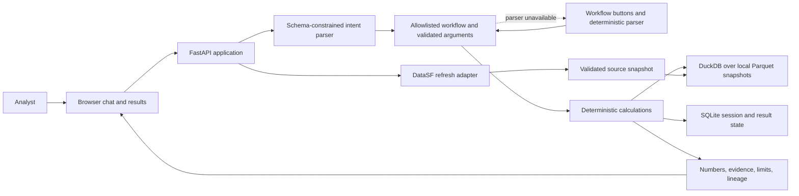
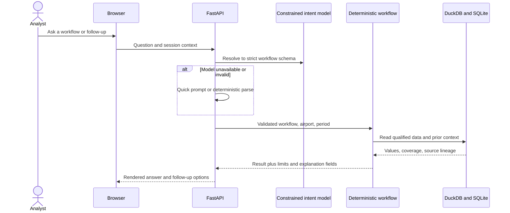

# Airport Investment Intelligence — Build Plan

**Status: plan only.** No application, runtime integration, calculation, or deployment has been built or proven. This plan deliberately targets one small local demo that is clear, useful, and honest about its evidence.

## Goal

Build a local analyst assistant that screens airports for modernization diligence. It answers four assignment workflows with repeatable calculations, visible evidence, assumptions, and gaps:

1. Rank the defined New England commercial-service cohort for terminal-expansion diligence.
2. Compare LAX and SNA using common-period operational indicators.
3. Calculate ANC's long-haul scheduled passenger-service flight share.
4. Assess SFO demand pressure using passenger trends and qualified operational indicators.

The result is a diligence screen, not a profitability or latent-demand model. Available public data cannot establish project-specific investor returns or causal unserved demand. Those requests return `not_identifiable` with the missing inputs; traffic, delay, or forecasts must not be relabeled as profit or unmet demand.

## Small, runnable architecture

One Python application serves both the API and a plain browser interface. The backend owns source refresh, validation, calculation, evidence, and response text. The UI presents the four workflows, results, source dates, coverage, and a simple follow-up control that reuses the previous airport/period. Keep the first demo local and single-process.

DuckDB and Parquet keep the multi-source analytical reads simple and repeatable. SQLite stores only a small local session, its selected context, and prior result needed for follow-ups. No queues, multi-worker coordination, leases, replay protocol, external database, map, or separate frontend toolchain are in the first demo. The AI-powered agent uses one language-model call to map a user's question or follow-up into a strict schema: one of four allowlisted workflows, airport IDs, period, and clarification fields. The backend validates that output, calculates every metric, and renders explanations from fixed templates. The model cannot return facts, metrics, or answer prose. When the model is unavailable or its output fails validation, show workflow quick prompts and use a deterministic parser for explicit airport/workflow/period requests; otherwise ask the user to choose.

## Source status and exact runtime contracts

Source qualification means the bounded source contents were inspected. It does not mean an application adapter, snapshot, calculation, or browser flow exists.

| Source | Evidence already retained | Planned use and current limit |
|---|---|---|
| DataSF SFO Air Traffic Passenger Statistics, `rkru-6vcg` | Observed baseline: qualified 3,721-row CSV for periods 202301–202412; all 15 selected fields populated, zero duplicates under the declared dimension key, valid counts, repeatable response hash, and exact FY2024 audited enplanement reconciliation. See [source record](backend/docs/evidence/source-qualification-20260925.md). | **Primary public API integration.** Request the raw CSV from `https://data.sf.gov/resource/rkru-6vcg.csv` using the exact selected columns, period predicate, ordering, and `$limit=5000` in the evidence record. Require CSV content type, all required columns, valid period/count values, unique declared keys, and complete expected month/activity/geography coverage. Retrieve every page (using the API pagination offset) until an empty page, then reconcile the fetched row count with a scoped count query. If a response reaches `$limit=5000` and complete pagination/count reconciliation cannot be established, fail closed; unique keys and month coverage alone do not prove completeness. Record current row count and hash against the observed baseline. A changed count/hash triggers a drift report; accept legitimate backfills only after checking the changed rows, month coverage, and affected aggregates (including FY2024 audited-total reconciliation). Do not reject solely because live row count differs from 3,721. Save accepted responses as dated snapshots with retrieval UTC and SHA-256. In the consumer, filter `activity_type_code = 'Enplaned'`, group by `activity_period` and `geo_summary`, and sum `passenger_count`; compare same-month years and annual domestic/international totals. The 48-row pre-aggregated JSON query is a separate probe, not the app contract. DataSF is SFO-only and cannot support other airports or operational congestion. Live app ingestion remains unbuilt. |
| FAA CY2024 final commercial-service workbook | Workbook content qualified: 513 unique airport records and the defined 22-airport New England cohort. | Use as cohort membership. Acquisition replay still needs exact workbook URL and retrieval UTC recorded with the snapshot; checksums/counts alone do not recreate the request. |
| BTS T-100 Segment All Carriers, table `FMG` | 16 partitions, 8 states × CY2023/24, all 26 required origins. Full key includes `AIRCRAFT_CONFIG`; no within-partition duplicate keys or union metric conflicts. | Use origin-direction scheduled passenger-capacity records with predicate `CLASS in {A,C,E,F} AND SEATS > 0`, across `DU`, `DF`, `IU`, and `IF`. The measured partitions contain only `F` among A/C/E/F; F-only is an observed sample outcome, not the general predicate. `PVC` December 2024 is a documented no-row month and remains missing, not zero. Before replayable acquisition, retain sanitized BTS form controls/body, response status/headers/redirect details, and retrieval UTC. Hashes and counts alone are insufficient. |
| BTS Reporting Carrier On-Time Performance, table `FGJ` | Inventory of 24 CY2023/24 monthly files and December 2023 alias resolved. January 2024 fully inspected for schema, dates, duplicates, and conditional nulls. | Use for common-period delay/cancellation/taxi indicators only after the required months are collected and qualified. The other 23 archives remain uncollected, so full-year LAX/SNA and SFO operational comparisons are currently blocked. Never present January alone as annual coverage. |
| FAA and airport-authority intervention documents | Candidate source types identified; airport-specific evidence ledger is not yet populated. | Needed to decide whether terminal expansion addresses a documented binding constraint and to record competing constraints/counterevidence. No airport may be marked terminal-fit eligible from traffic ranking alone. |

### Intervention-evidence coverage gate

Before the New England ranking can recommend terminal-expansion diligence, the evidence ledger must contain a reviewed row for **each of the 22 cohort airports**: `BDL, HVN, PWM, BGR, PQI, RKD, BHB, AUG, BOS, ACK, ORH, MVY, HYA, PVC, MHT, PSM, LEB, PVD, WST, BID, BTV, RUT`. Each row records status (`eligible`, `excluded`, or `not_assessable`), official publisher, URL, document title/date, page or section, stated constraint, terminal fit, material counterevidence, and reviewer/date. Record an evidence-as-of date and check the airport authority’s current capital-plan/project-status pages for completed projects or superseding plans; retain checked URLs and dates. `eligible` requires a cited unresolved terminal constraint as of review. A completed remedy or superseding plan must change the conclusion; unknown current status remains `not_assessable`. Historical CY2024 traffic and current diligence evidence are displayed separately, not presented as a reconstructed 2024 recommendation. The gate passes only when all 22 rows have an explicit reviewed status and every `eligible` or `excluded` conclusion has cited support; missing or conflicting evidence stays `not_assessable`. Add separate rows for LAX, SNA, and SFO only when the UI makes terminal-fit claims about them. Current state: **0/22 reviewed rows; gate open**. This is a required coverage target, not a claim that evidence has already been collected.

## Calculations and answer rules

### New England screen

Use the FAA CY2024 cohort and deduplicated origin-direction T-100 passenger-capacity records defined above. Sum `PASSENGERS` and `SEATS` by airport/year. Calculate 2024 volume `P2024`, growth `(P2024-P2023)/P2023`, and **2024 seat occupancy** `sum(PASSENGERS)/sum(SEATS)`. BTS load factor instead divides passenger-miles by available seat-miles; do not label our occupancy metric load factor. [BTS definitions](https://www.transtats.bts.gov/Fields.asp?gnoyr_VQ=FMG).

Require all 12 months in both years, valid nonnegative measures, positive 2023 passengers, and positive 2024 seats. Missing inputs or undefined ratios make that airport `not_assessable`; do not impute or reweight. PVC remains unassessable until its missing month is resolved. Let `n` be airports passing numeric gates, independently of terminal evidence. For each component, ascending average rank `r` gives percentile `(r-1)/(n-1)`. Score `0.40*growth_percentile + 0.30*volume_percentile + 0.30*occupancy_percentile`. Component ties share average rank; final rank is `1 + number of strictly higher scores`; airport ID orders display ties only. If `n<2`, show raw metrics but no comparative score/rank (`not_assessable`). Weights are disclosed screening choices, not return estimates.

Display all 22 airports with separate numeric and terminal-evidence statuses. Only numerically assessable airports with `eligible` terminal evidence receive terminal-expansion diligence recommendations. If none qualify, show the traffic screen and state that no terminal recommendation is supported.

### LAX/SNA operational comparison

Use FGJ **domestic scheduled flights represented by reporting carriers**, filtering by `OriginAirportID` for LAX or SNA, not destination, over identical qualified months. Resolve and validate IDs against source airport codes at ingestion. Include every `Reporting_Airline` present at each origin, not just carriers common to both. Display carrier lists, counts and period; this is not coverage of all airlines/international operations. Carrier/route mix can affect comparisons. Apply the same population rule to SFO operational indicators.

Deduplicate the flight identity in the source record. Let `N` be scheduled-flight rows with valid binary `Cancelled` and `Diverted` flags. Invalid identity/flags block that airport-period rather than silently dropping flights. Cancellation rate is `count(Cancelled=1)/N`; diversion rate is `count(Diverted=1)/N`. On `Cancelled=0 AND Diverted=0`, compute separate means of non-null **`DepDelayMinutes`** and `TaxiOut`. Label delay “mean departure delay, early departures set to zero”; do not use signed `DepDelay`. Show each non-null denominator and fraction of eligible non-cancelled/non-diverted rows. Zero denominators yield unavailable metrics, never zero. Keep indicators separate and do not claim terminal causation. [BTS on-time definitions](https://www.transtats.bts.gov/Fields.asp?gnoyr_VQ=FGJ).

### ANC long-haul flights

Filter eligible T-100 records to ANC origin. Count flights with **`sum(DEPARTURES_PERFORMED)`**, not scheduled departures, passenger counts or row counts. Let `T` be all eligible performed departures, `L` those with known `DISTANCE >= 3000` statute miles, and `U` those with missing/invalid distance. Known distance is nonnegative; source-reported zero-distance ANC-to-ANC segments are known short segments under this endpoint-distance definition. Null/negative distance is unknown. Invalid/null/negative performed counts make the result unavailable because `T` cannot be established.

If `T=0`, return `not_assessable` with “no eligible performed departures.” Otherwise show known-distance coverage `(T-U)/T`. With `U=0`, share is `L/T`; with `U>0`, show all-flight bounds `[L/T,(L+U)/T]` without an exact point estimate. Render percentages and retain counts. Missing monthly coverage blocks annual results. This measures scheduled passenger-service flights with positive seat capacity, not all ANC cargo/private flights. [BTS T-100 definitions](https://www.transtats.bts.gov/Fields.asp?gnoyr_VQ=FMG).

### SFO and answer boundaries

Calculate monthly enplaned trends and 2024-versus-2023 changes from DataSF. A percentage change with zero baseline is undefined. Add separately labeled operational indicators only for qualified periods. Show observations, changes, constraint hypotheses, counterevidence and missing inputs. Throughput/delay cannot quantify unserved passengers or prove unmet-demand causes.

All answers identify period, retrieval/snapshot lineage, coverage, assumptions and observed/calculated/inferred/unknown statements. Missing values are never zero. Profit quantities return `not_identifiable` with missing project capex, operating costs, incremental revenue and financing assumptions. Unmet-demand quantities return `not_identifiable` with missing unconstrained demand/booking or search data, fares, capacity and causal constraint evidence. Offer supported diligence indicators alongside these limits. Prototype acceptance does not establish those business quantities.

### Supported periods and follow-ups

This table defines bounded targets after source gates and implementation pass.

| Workflow | Supported target | Previous-year behavior |
|---|---|---|
| New England | CY2024 only: FAA CY2024 cohort plus T-100 CY2023/24 | CY2023 is `unsupported_period`: needs CY2023 cohort and CY2022/23 traffic. Never reuse the 2024 cohort. |
| ANC | CY2023 or CY2024, with 12 qualified months each | 2024 → 2023 supported; 2023 → 2022 unsupported. |
| LAX/SNA and SFO operations | CY2023 or CY2024 once all requested months qualify | 2024 → 2023 requires qualified coverage; otherwise `unavailable`. No silent subset. Explicit month requests within 2023/24 may use identical qualified months, labeled monthly/partial. |
| SFO passengers | Monthly/annual levels in CY2023/24; year-on-year changes only with both matching periods | CY2023 levels supported after ingestion; 2023-versus-2022 changes unsupported. |

Validate periods before calculating, including model-generated follow-ups. `unsupported_period` names missing sources and allowed choices; `unavailable` names incomplete qualification within supported scope. Preserve previous result/context on either response. Ambiguous follow-ups ask clarification. Evidence-only follow-ups reuse the airport without changing period.

## Atomic build sequence

Each row is a small future deliverable, not a completion claim. File names are prospective, relative to `backend/` unless stated. Owners: **BE** backend implementation specialist; **DE** data engineer; **UI** frontend specialist. Atomicity self-check: PASS — one owner, at most two code files, one completion outcome and at most 150 changed code lines per execution; split further if needed. Generated data artifacts are outputs, not additional code targets. Repeated partition/ledger rows are one small run per item. There is no fixed schedule.

| Step | Depends | Owner / target | Action and done check | Planned verification |
|---|---|---|---|---|
| 1 | — | BE: `requirements.txt`, `app/main.py` | Create minimal FastAPI app; startup command runs and health responds. | `curl -f localhost:8000/health` |
| 2 | 1 | UI: `app/static/index.html`, `app/static/app.js` | Serve chat and four visible quick prompts; each submits the selected workflow. | Open `/`; click four prompts. |
| 3 | 1 | BE: `app/contracts.py`, `app/main.py` | Define workflow/input/result/status schemas; invalid workflow/airport/period yields a clear error. | `curl -i -H "Content-Type: application/json" -d '{"workflow":"invalid"}' localhost:8000/api/query` |
| 4 | 3 | DE: `app/sources/manifest.py` | Define source manifest with request, UTC, hash, period, validation and artifact path; saved response traces to its request. | `PYTHONPATH=backend python -m app.sources.manifest --check data/manifests/datasf.json` |
| 5 | 4 | DE: `app/sources/datasf.py` | Fetch real CSV with declared query/paging/scoped-count reconciliation; complete response or explicit failure. | `PYTHONPATH=backend python -m app.sources.datasf --fetch` |
| 6 | 5 | DE: `app/sources/datasf.py`, `data/manifests/datasf.json` | Validate and snapshot CSV/Parquet; audit totals reconcile; failed refresh preserves last accepted snapshot and reports unavailable. | `PYTHONPATH=backend python -m app.sources.datasf --qualify` |
| 7 | 6 | BE: `app/calculations/sfo.py`, `tests/test_sfo.py` | Implement enplaned trends; independent source totals agree and zero-baseline change is undefined. | `python -m pytest backend/tests/test_sfo.py` |
| 8 | 2,3,7 | BE: `app/main.py`, `app/responses.py` | Render SFO result; browser request consumes live-ingested snapshot with visible lineage/limits. | Open SFO prompt; compare shown snapshot ID with manifest. |
| 9 | 4 | DE: `app/sources/faa.py`, `data/manifests/faa.json` | Replay FAA acquisition with exact URL/UTC; reproduce 513 records and 22-member cohort or explain drift. | `PYTHONPATH=backend python -m app.sources.faa --qualify` |
| 10 | 4 | DE: `app/sources/t100.py`, `data/manifests/t100-request.json` | Replay one partition with fresh form fields; sanitized controls/response metadata accompany valid ZIP/CSV. | `PYTHONPATH=backend python -m app.sources.t100 --state AK --year 2024 --qualify` |
| 11 | 10 | DE: `app/sources/t100.py`; outputs `data/manifests/t100-{state}-{year}.json`, `docs/evidence/source-qualification-20260925.md` | Repeat acquisition per required state/year; all 16 archives have metadata and unexplained hash drift blocks acceptance. | Same step-10 command per `{state}` in AK/CA/CT/MA/ME/NH/RI/VT and `{year}` in 2023/2024. |
| 12 | 9,11 | DE: `app/sources/t100.py`, `tests/test_t100.py` | Deduplicate/convert to Parquet; no metric conflicts, 26 origins accounted for, PVC missing month retained. | `python -m pytest backend/tests/test_t100.py` |
| 13 | 12 | BE: `app/calculations/anc.py`, `tests/test_anc.py` | Implement performed-flight share; independent aggregation, distance bounds and zero-total checks agree. | `python -m pytest backend/tests/test_anc.py` |
| 14 | 12 | BE: `app/calculations/screen.py`, `tests/test_screen.py` | Implement numeric score; independent sample, ties, missing inputs and `n<2` match rules. | `python -m pytest backend/tests/test_screen.py` |
| 15 | 9 | DE: `data/terminal-evidence.csv`, `docs/evidence/source-qualification-20260925.md` | Review one row per cohort airport including current project/supersession check; all 22 reviewed, unsupported conclusions remain unassessable. | Review one named CSV row against its cited official URLs; tally 22 reviewed rows. |
| 16 | 14,15 | BE: `app/calculations/screen.py`, `app/responses.py` | Join evidence to score; all 22 visible, only qualifying rows recommended, none-qualified case explicit. | `python -m pytest backend/tests/test_screen.py`; inspect eligible/none-eligible output. |
| 17 | 4 | DE: `app/sources/ontime.py`; outputs `data/manifests/ontime-{year}-{month}.json`, `data/ontime/{year}-{month}.parquet` | Acquire/qualify each of 23 remaining archives: ZIP integrity, schema, dates, scoped identity/flags and airport coverage; deduplicate and write accepted scoped Parquet with manifest lineage; all 24 accounted for including January. | `PYTHONPATH=backend python -m app.sources.ontime --year 2024 --month 1 --qualify`; repeat for each inventoried month. |
| 18 | 17 | BE: `app/calculations/operations.py`, `tests/test_operations.py` | Load Parquet and calculate indicators; independent counts/means, origin/carrier scope and null/period coverage agree. | `python -m pytest backend/tests/test_operations.py` |
| 19 | 3 | BE: `app/session.py`, `tests/test_session.py` | Store minimal SQLite context/results and enforce periods; test transitions through an injected calculation stub, preserving previous state on unsupported/unavailable. Real recomputation is checked at step 22. | `python -m pytest backend/tests/test_session.py` |
| 20 | 3,19 | BE: `app/intent.py`, `tests/test_intent.py` | Add constrained model call/validation; real model resolves question/follow-up; no model arithmetic enters result. | `PYTHONPATH=backend python -m app.intent --probe "Compare LAX and SNA in 2024"` |
| 21 | 20 | BE: `app/intent.py`, `tests/test_intent.py` | Add explicit-input parser and quick-prompt fallback; invalid/unavailable model remains usable, ambiguity asks clarification. | `python -m pytest backend/tests/test_intent.py` |
| 22 | 8,13,16,18,19,21 | BE: `app/main.py`, `app/responses.py` | Wire validated intent and session to all four calculation functions; real requests produce correct results and supported follow-ups recompute through the selected calculator. | `curl -f -H "Content-Type: application/json" -d '{"question":"Compare LAX and SNA in 2024"}' localhost:8000/api/query`; repeat four prompts and supported follow-up with returned session ID. |
| 23 | 22 | UI: `app/static/index.html`, `app/static/app.js` | Connect four workflows; show evidence/coverage, distinguish zero from missing, preserve results on unsupported follow-up, label controls and support keyboard/responsive layout. | Open `/`; exercise all result/failure states using keyboard and narrow viewport. |
| 24 | 1,8 | BE: `docs/ARCHITECTURE.md`, root `README.md` | Document startup, scoring, tradeoffs and AI; reader can run core and locate rules; update as workflows land. | Run documented startup command from a clean environment. |
| 25 | 23,24 | UI: `docs/evidence/demo-acceptance.md` | Run all four real browser flows, real model→intent→calculation, supported follow-up, unsupported period and fallback; inspect accessibility, then state coverage, then visual clarity. Record each outcome. | Open `/`; execute and record every demo check listed in this row. |

All table commands, module CLI flags, `/api/query` request examples and test files are prospective interfaces to implement, not currently working tools. Step 4 checks a manifest sample; step 6 replaces that sample with accepted source evidence. CLI qualification writes measured outcomes and returns a failure status when a gate fails. Browser checks are explicit manual verification actions; no browser-testing framework is required. Planned server commands: `uvicorn app.main:app --app-dir backend --reload`, `curl -f http://127.0.0.1:8000/health`, and the per-row `pytest` commands. These app/test artifacts do not yet exist. Source qualification steps record their exact replay commands and measured outputs in the source evidence when implemented. Browser checks use `http://127.0.0.1:8000`. Deliver source code and `backend/docs/ARCHITECTURE.md` with the runnable core.

If a required source gate or browser result remains missing, mark the dependent workflow blocked and overall prototype acceptance **not passed**. A blocked answer is useful failure behavior, not proof of the calculation. Plan approval approves this bounded work and its checks; it does not close evidence tasks or establish runtime readiness.

## Assignment coverage and known gaps

| Requirement | Planned response | Current status |
|---|---|---|
| Public API integration | Live DataSF raw CSV adapter consumed by the SFO trend workflow. | Source qualified; app adapter and consumer not built. |
| Rank/compare with defined KPI | Deterministic formulas and visible denominators. | Planned; no calculations built. |
| Explain reasoning | Backend-generated explanation with metrics, source lineage, assumptions, and evidence gaps. | Planned. |
| AI-powered agent | A constrained model resolves natural-language questions/follow-ups to an allowlisted workflow schema; deterministic controls/parser remain usable on model failure. | Planned; no model integration built. |
| Conversational follow-ups | Model maps follow-up language to validated context changes; app stores airport/workflow/period and recomputes. | Planned; local state design only. |
| Deterministic logic | All metric arithmetic in backend code over versioned snapshots. | Planned. |
| Chat interface | Small browser chat plus results/evidence panel. | Planned; no UI built. |
| Assumptions and uncertainty | Explicit status, source coverage, limitations, and missing inputs. | Planned. |
| Source code and architecture note | Runnable local application plus concise `backend/docs/ARCHITECTURE.md`. | Neither exists yet. |
| Profitability and unmet demand | Explain what evidence would be needed and return `not_identifiable` for quantitative claims. | Deliberate limitation of available sources. |

The next implementation should begin with the runnable shell and DataSF adapter-to-consumer vertical slice. Do not enable any workflow by substituting synthetic or incomplete data without labeling it. The full assignment capability is not yet established by this plan.
