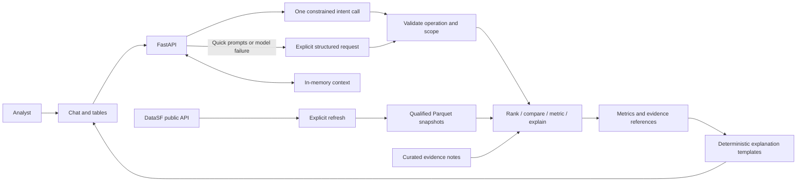
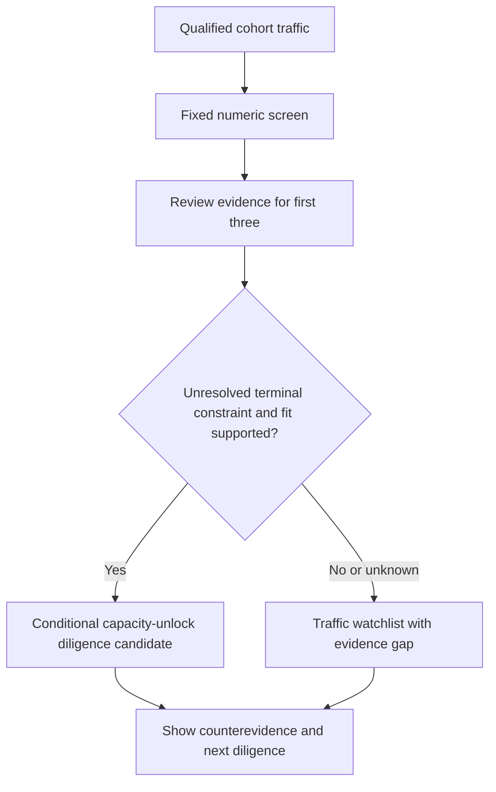

# Airport Investment Analyst — Lean Build Plan

**DELIVERY TYPE: DESIGN ONLY. Plan revision: 2. Approval: PENDING.** Build one local home-assignment demo, not a production aviation platform. Source-research notes exist; application behavior and final acceptance remain to be demonstrated. This README is the master plan; `docs/PLAN_GRAPH.json` is its derived task topology. Storing either on `main` is not review approval or authorization to build. Earlier specs/review records apply only to the versions they identify, not automatically to this revision.

## Mission and scope

The [assignment](FDE%20Exam%202.pdf) asks for an AI-powered assistant that identifies promising US airport modernization opportunities based on additional flight/passenger capacity. It requires public-API data, deterministic ranking or comparison, clear reasoning, conversational follow-ups, a chat UI, source code, and a short design document. Its four questions are examples, not four hardcoded intent names.

Our deliverable is a **capacity-unlock diligence screen**: measured traffic pressure plus a small amount of sourced intervention evidence. A busy airport alone is not an expansion opportunity. A candidate must have an evidenced unresolved constraint that the proposed renovation could address. We report why it merits investigation, what could invalidate it, and what the next diligence question is.

The available inputs do not support project-specific profitability or an identified quantity of unserved demand. We will provide useful calculations and conditional conclusions, not replace missing economics with a score. Increases in available airline seats are not measurements of terminal capacity.

### Definition of done

| Demonstration | Required successful result |
|---|---|
| New England terminal-expansion question | A real numeric ranking across the declared cohort; manually reviewed evidence notes for the first three numerically assessable airports; each note explains terminal fit, counterevidence and next diligence. Supported candidates are distinguished from unverified watchlist entries. Never manufacture a positive candidate to pass. |
| LAX/SNA congestion comparison | Real CY2024 cancellation, diversion, departure-delay and taxi-out indicators with denominators; a deterministic per-indicator comparison plus a qualified summary. |
| ANC long-haul percentage | A real departure-weighted CY2024 percentage or justified missing-distance bounds; numerator, denominator, threshold, service scope and coverage. |
| SFO unmet-demand question | Real passenger trends, a quantitative passenger-growth-versus-seat-growth proxy, CY2024 operational indicators, and a sourced constraint note. Explain what the proxy measures and why it cannot identify unmet flight demand or its causes. |
| Generalization | Answer “Compare BOS and PVD passenger growth” and “Which New England airports grew fastest?” through the same operations used for the examples. No question-specific endpoint or intent name. |
| Conversation | A metric-only follow-up preserves airports/year; an explanation preserves the original ranking cohort; a supported period/threshold change recomputes. Unsupported or ambiguous changes preserve the previous result and offer allowed choices. |
| API and AI | A real DataSF API refresh feeds the SFO result. Real model calls resolve the four example questions and the two generalization questions to validated requests. Offline fixtures do not substitute for these checks. |
| Deliverables | One browser chat/results screen, runnable source, and a short architecture note covering scoring, tradeoffs, where AI is used, sources and uncertainty. |

A dataset outage, empty ranking, or limitation-only response does not satisfy the numerical demonstrations. An evidence-backed conclusion that none of the reviewed airports has a supported terminal case is a legitimate outcome, provided real calculations and the completed evidence review are shown. This is prototype acceptance, not investment validation.

### Keep out of the first submission

No required globe, live aircraft, voice, saved analyses across restarts, authentication product, queue, worker fleet, database server, multiple runtime agents, document crawler, vector database, RAG, or ROI model. No automatic cloud deployment or publication. Use ORBIT only for restrained dark styling. A GEV/Cesium map is optional after the core passes; its camera must never change analytical populations.

## Architecture

One local FastAPI process serves static HTML/JavaScript and the API. Use DuckDB to query local Parquet snapshots, an in-memory session dictionary, and one small manually curated JSON evidence file. No separate frontend toolchain.



The model chooses an operation and parameters; the backend controls authorization, supported combinations, arithmetic and explanations. Templates explain score contributions, comparisons and evidence rather than merely displaying numbers. No second model or reviewer is needed on the runtime request path.

Serve on `127.0.0.1` with one worker. Keep the model credential server-side, excluded from Git and logs; no key reaches browser JavaScript. This local demo is not a hosted multi-user security design. Ignore credentials and replaceable data before acquisition. Keep permitted source snapshots reproducible without committing large raw archives.

## Data and scope contracts

The [existing qualification record](backend/docs/evidence/source-qualification-20260925.md) reports bounded source inspections, not a working application. Its temporary paths are not guaranteed to survive. Reacquire or validate supplied files; do not assume those paths exist. Preserve exact request/filter details from the record rather than treating old row counts as permanent truth.

| Source | Intended scope | Remaining implementation work |
|---|---|---|
| DataSF `rkru-6vcg` public API | SFO enplaned passengers, CY2023–24 | Fetch, validate, snapshot, consume. The record reports a qualified raw CSV; live app ingestion is unbuilt. |
| FAA CY2024 commercial-service list | New England cohort | Record the exact download URL; reproduce membership from the official list. |
| BTS T-100 All Carriers (`FMG`) | CY2023–24, 22 cohort origins plus ANC/LAX/SNA/SFO | Reacquire/import the qualified AK/CA/CT/MA/ME/NH/RI/VT partitions; deduplicate overlaps and retain origin scope. |
| BTS Reporting Carrier On-Time (`FGJ`) | CY2024 LAX/SNA/SFO departures | Qualify all 12 monthly archives; the existing record inspected only January 2024. No annual conclusion from one month. |
| Official airport/FAA documents | First three traffic-ranked cohort airports plus SFO | Manually curate short evidence notes; no scraping or extraction pipeline. |

**New England cohort:** `BDL, HVN, PWM, BGR, PQI, RKD, BHB, AUG, BOS, ACK, ORH, MVY, HYA, PVC, MHT, PSM, LEB, PVD, WST, BID, BTV, RUT` (22 airports from the recorded FAA CY2024 scope). These IDs are a check against acquisition, not a replacement for it. The source record reports no eligible PVC row for December 2024. Keep that month unknown unless the absence is separately resolved; do not impute zero.

### Public API: substantive use, not an ornamental integration

Use `https://data.sf.gov/resource/rkru-6vcg.csv` through its Socrata API. Reuse the recorded selected columns and CY2023–24 predicate. Paginate in stable order, reject duplicate/conflicting keys, reconcile with a scoped count query, and require expected month/activity/geography coverage. A page below the limit alone is not completeness proof. Bound acquisition; a timeout, unstable count or unresolved drift fails refresh without replacing the last accepted snapshot.

For the passenger result, filter `activity_type_code = 'Enplaned'`; sum `passenger_count` by `activity_period` and `geo_summary`. Do not sum enplaned, deplaned and transit rows together. A real refresh must occur in the demo and the returned snapshot must feed the SFO calculation. Subsequent questions reuse it.

**Acquisition tradeoff:** DataSF supplies the real API-driven airport workflow. BTS/FAA bulk downloads supply comparable historical populations. Those downloads are explicitly not REST APIs; choosing them avoids substituting a partial live-tracking feed for historical seats, passengers and departures. We do not claim an unverified general BTS API exists, or add a provider solely to increase the API count. Explain this division in the architecture note.

### Small validation contract

Each accepted snapshot stores source URL plus request parameters, retrieval UTC, period/population, row count, SHA-256 and validation outcome. These are local metadata, not a lineage service. Accept legitimate source corrections after checking affected aggregates; never blindly reject a changed hash or silently accept changed scope.

T-100 uses origin-direction records with `CLASS in {A,C,E,F}` and `SEATS > 0`, retaining domestic/international US/foreign carrier source families. The inspected partitions happened to contain only F among those classes. Preserve the full raw identity, including `AIRCRAFT_CONFIG`, from the source record. Exact cross-state duplicate rows collapse; conflicting measures block publication. Cargo-only/nonscheduled services remain out of scope and must not be silently included.

FGJ uses `(FlightDate, Reporting_Airline, Flight_Number_Reporting_Airline, OriginAirportID, DestAirportID, CRSDepTime)` as the recorded flight identity. Validate binary cancellation/diversion flags and airport ID/code agreement. Conflicting duplicate flights or invalid identity/flags block the affected airport-period. Conditional nulls in delay/taxi fields are allowed with explicit denominators.

Annual eligibility requires all 12 source months and explicit coverage for the selected airport. Unknown no-row months block annual metrics, not zero-fill them. Missing values remain distinct from zero. On refresh failure, an existing result remains visible with its original snapshot/time and a failed-refresh label; never label cached data freshly retrieved. On a clean start with no accepted snapshot, return `unavailable`.

### Supported query matrix

| Operation / metrics | Airports or region | Periods |
|---|---|---|
| `metric` / `compare`: T-100 passengers, seats, performed departures, seat occupancy, long-haul share | 26 listed origins | CY2023 or CY2024 after qualification |
| `metric` / `compare` / `rank`: passenger growth | Those origins; regional ranking within the 22-member New England cohort | CY2024 versus CY2023 only |
| `rank`: screen score, passenger volume, occupancy | New England or an explicit subset of its 22 members | CY2024 only |
| `metric` / `compare`: cancellation, diversion, mean departure delay, taxi-out; congestion bundle | LAX, SNA, SFO | CY2024 only |
| `metric`: DataSF enplaned trend, SFO capacity-pressure bundle | SFO | CY2023/24 levels; growth and bundle CY2024 versus CY2023 |
| `explain` | A result in the current session | Its original scope, snapshots and methodology |

All examples default explicitly to CY2024 and scheduled passenger-service scope. Resolve “Anchorage” to ANC and “Santa Ana” to SNA; disclose “LA interpreted as LAX” with a correction affordance. Ask clarification for genuinely ambiguous airport/metro references. Cargo requests are `unsupported_scope`, not passenger results in disguise. Unsupported airports/years/metrics return allowed choices without changing stored context. Historical CY2024 outputs are not labeled current forecasts.

## Deterministic methodology v1

### A. Traffic ranking plus a capacity-unlock rationale

From the same T-100 passenger-service population calculate `P24`, growth `g = (P24-P23)/P23`, and seat occupancy `o = P24/S24`. Use a sum-of-passengers / sum-of-seats ratio, not a mean of row ratios or a passenger-mile load factor. Nonnegative valid measures, complete periods, `P23 > 0` and `S24 > 0` are required for the score. Raw levels can remain available when a derived ratio is undefined.

**Generic departures metric:** `departures = sum(DEPARTURES_PERFORMED)` for the selected origin, year and eligible scheduled passenger-service population. This is not `DEPARTURES_SCHEDULED`. Null, negative, noninteger or nonfinite performed counts invalidate that metric; an established valid zero total is zero, not unavailable. Complete airport-month coverage is still required. Return the source field, flight count, year and population in `metric` and `compare` responses. Step 3.4 and dispatcher tests cover this independently of long-haul share.

Let `n` be numerically eligible airports in the full 22-member cohort. For each component use ascending average rank `r`; percentile is `(r-1)/(n-1)`. Calculate:

`screen_score = 100 * (0.40 * growth_percentile + 0.30 * volume_percentile + 0.30 * occupancy_percentile)`

No score if `n < 2`. Ties use average component rank; final rank is `1 + count(strictly higher unrounded scores)`. Airport ID orders display ties only. Filtering preserves this reference cohort and existing scores. A “grew fastest” request sorts raw growth, not the composite. No user-editable weights in v1.

Synthetic formula fixture (not airport data): A/B/C growth = 5/10/15%; volume = 1,000/3,000/2,000; occupancy = 90/70/80%. The expected scores are A=30, B=50, C=70. Also test equal components and a single eligible airport.

**Business interpretation:** growth is observed traffic momentum, volume is the scale of activity potentially affected, and occupancy describes airline seat utilization. These are heuristic reasons to investigate; they do not measure terminal utilization, prove demand exceeds supply, or calculate returns. Volume favors scale and may favor larger airports; disclose that tradeoff.

**Terminal shortlist:** after the numeric ranking, manually review only the first three numerically eligible airports, using score then ID to select three when tied. For each, record one compact note in `backend/data/evidence.json`: airport, official publisher/title/URL/page, document date, checked date, unresolved constraint, proposed intervention, terminal-fit status (`supported`, `contradicted`, `unknown`), counterevidence and next diligence question. Use an evidence-as-of date separate from the traffic period. A completed remedy or superseding plan invalidates a stale constraint claim. No admin UI, no automated extraction, no 22-airport review gate.

A `supported` entry requires cited evidence of an unresolved terminal constraint and a plausible connection between the proposed intervention and added throughput; unresolved material counterevidence makes the conclusion `unknown`. Only numerically eligible `supported` entries receive a **conditional terminal-expansion diligence recommendation**, ordered by their unchanged screen score. Others are watchlist entries, never negative investment verdicts. Label the shortlist “evidence-reviewed subset of the top three traffic candidates,” not the best opportunities across all 22. Remaining airports are `not_reviewed`; selecting one shows that gap.

Each recommendation states: **measured signal → evidenced constraint → proposed capacity unlock → counterevidence → next diligence**. It does not estimate extra flights, passengers or profit without the corresponding project inputs. A small sensitivity check reports top-three membership under equal weights without replacing v1 or changing the evidence-reviewed set; newly appearing candidates remain unreviewed.



### B. Congestion comparison with a direct, qualified conclusion

Use all reporting carriers at each selected origin in qualified CY2024 FGJ domestic scheduled-flight records, not only carriers common to both airports. Show carrier lists, counts and scope: neither airport is represented as all-airline/international coverage.

Let `N` be scheduled-flight rows with valid identity and flags. Cancellation rate = cancelled/N; diversion rate = diverted/N. For `Cancelled=0 AND Diverted=0`, calculate separate means of non-null `DepDelayMinutes` and `TaxiOut`. The delay label is “mean departure delay, early departures set to zero”; do not substitute signed `DepDelay`. Show each mean's denominator and coverage against eligible non-cancelled/non-diverted flights. Zero denominators make the affected metric unavailable.

The comparison rule uses the four displayed metrics (rates in percent, times in minutes, rounded to two decimal places). For each, report higher/lower/tied; exclude unavailable pairs from `m` and enumerate them. Summary: “LAX is higher on k of m comparable operational-strain indicators; SNA is higher on j; t are tied.” Equal displayed values are ties at display precision. If both airports are higher on different indicators, also say “mixed picture”; if `m=0`, no comparative conclusion.

This unweighted descriptive count is not a statistical significance claim, composite congestion score or proof of terminal causation. Do not normalize two airports into misleading 0/100 extremes. Cancellations, diversions, delays and taxi times can reflect different mechanisms. The answer explicitly identifies those interpretation limits.

### C. Long-haul share

For any supported origin, default long-haul to `DISTANCE >= 3000` statute miles. Allow an explicitly requested positive finite threshold no greater than 12,000 miles, always shown as an assumption; the ceiling is a prototype input bound, not an aviation standard. Count performed departures, not route rows, scheduled departures or passengers.

`T = sum(DEPARTURES_PERFORMED)` over the eligible annual population; `L` = performed departures on known distances meeting the threshold; `U` = performed departures with null/negative distance. A source-reported zero distance is known short under this endpoint-distance definition. Invalid/null/negative performed counts make the result unavailable because T is unknown.

If `T=0`, no share. Otherwise coverage = `(T-U)/T`. With `U=0`, share = `100*L/T`; with `U>0`, bounds = `[100*L/T, 100*(L+U)/T]`, no exact point estimate. Complete monthly coverage remains necessary. Render counts and service scope alongside the percentage. Cargo-only/private operations are outside this result.

### D. SFO quantitative proxy and the “why” answer

Show DataSF enplaned passenger levels/growth separately from T-100 measures; do not join their different passenger populations as if interchangeable. Calculate the following **capacity-pressure proxy** entirely within matching T-100 scheduled passenger-service origin records:

`passenger_growth = (P24/P23 - 1)`

`seat_growth = (S24/S23 - 1)`

`growth_gap_pp = 100 * (passenger_growth - seat_growth)`

Also show occupancy for both years and the separately scoped FGJ operational bundle. Positive baseline passengers/seats and complete periods are required; otherwise the proxy is `not_assessable`. Do not substitute DataSF passengers into a T-100 seat denominator.

Interpretation is literal: positive gap means transported passengers grew faster than supplied seats; negative means slower; zero means equal growth. Example fixture: passengers +10%, seats +5% gives +5 percentage points. This can describe tightening seat utilization, but **is not extra flights needed, terminal saturation, rejected bookings, or measured latent demand**. A negative gap does not establish the absence of unmet demand. Do not convert the gap into “missing passengers.”

Manually curate one SFO note in the same evidence file with dated official constraint evidence and a competing explanation or limitation. Template answer order: numeric scope/results; gap interpretation; documented constraint and its possible mechanism; counterevidence; what remains unidentified. A cited constraint is a hypothesis about relevance, not a proven cause of these aggregates. If the documents do not establish a constraint, say so; a completed source check with an explicit gap is acceptable, an unreviewed placeholder is not.

Requests for quantified unmet demand return `not_identifiable` **alongside** this successful proxy result, with missing unconstrained booking/search demand, fares, airline supply and causal constraint evidence. ROI requests additionally need capex, operating costs, incremental commercial revenue and financing. Unknown business quantities do not invalidate supported calculations or authorize invented estimates.

## Reusable agent contract

Use one strict `AnalysisRequest`: `action = rank | compare | metric | explain`, supported airport IDs or `region=new_england`, allowed metric(s), period, optional long-haul threshold, optional current-session result reference, and clarification fields. The four quick prompts are request presets, not a closed set of question-specific workflow names. Use fixed handlers and the query matrix above; no model-written SQL/code, arbitrary HTTP or shell tool.

At most **one model call per free-text message**, including retries (disable automatic SDK retries), 20-second model timeout, 512 output tokens and 4,000 user-input characters; 30-second query deadline. Bound the complete serialized prompt to 8,000 tokens including instructions and context, rejecting oversized input rather than silently truncating it. Enforce a proposed $0.02 maximum per model request and $2 per local demo process; these are budget choices, not provider-price claims. The selected model identifier and dated rate card must be recorded before enabling calls. If the maximum bill cannot be bounded from that rate card, disable model calls and preserve quick prompts. Quick-prompt structured requests use zero model calls. Pass only the message and compact previous context, not raw source archives, secrets or entire documents. Model timeout/invalid output returns deterministic explicit-input fallback or asks the user to choose a supported request. A failed model call never becomes a guessed numeric answer.

Validate the requested action, scope, metric, period and parameter combinations server-side. The model cannot create sources, metrics, weights or authoritative answer prose. A parameter such as a threshold is a validated user-selected input, not an observed measurement. Render calculations/citations from the result and curated evidence; safe output rendering never inserts unsanitized HTML from source text.

Minimal context stores the last successful request/result per server-issued session ID. `explain` can inspect two members of a stored ranking without renormalizing it. “Show only cancellations” selects a metric and reuses airports/year. “Use 2023 for ANC” recomputes only from qualified coverage. “Use 2023” after a CY2024 growth screen cannot fabricate 2022 baselines. Clarification, unsupported or unavailable results leave the previous successful context intact. Reject result references outside the session.

Keep at most 100 sessions, one latest result each, expiring after 60 idle minutes. Serialize requests for a single session; reject a concurrent second request as busy rather than allowing a late result to replace newer state. Restart loses context by design. After eviction, ask for a fresh analysis instead of guessing. These are simple local memory limits, not a persistent history system.

## Execution standard and approval boundary

This is a **plan-maintenance task**, not application implementation. The user explicitly authorized retaining the plan directly on `main`. That is a narrow storage authorization, not a claim that the factory's normal plan-only PR policy passed, not permission to edit `agent-os-core`/`claude-code-config`, and not permission to start the application build before its plan gates clear.

**Pinned owners:** `claude-code-config@97e5e8e4dc5f2de5a3120b7dfde47b7c52d29458` and `agent-os-core@9db00d22fd88962e902e19c778430dc24bc7151b`. Read the applicable owner sections before dispatch: `agents/ceo.md` Steps 2–5; `knowledge/universal-outcome-execution.md`; `plan-execution-mode.md`; `pre-implementation-gate.md`; `execution-package.md`; `coding-principles.md`; `self-review-is-not-validation.md`; `agentic-pattern-selection.md`; `design-qa-routing.md`. These are upstream references, not claims that tools ran. Build-time agents remain outside the airport app.

`[KB-QUERY: SKIP — routed]`: the standards audit named these owner documents; no semantic KB runner was invoked in this ChatGPT session. A native build session inherits the pointers and loads additional owners only when a new subproblem triggers them. Do not modify global governance in this product task. Mathly-specific Wix/PostgreSQL/production assumptions do not select this project's stack.

**Conflict recorded:** the pinned `hitl-tiers.md` says COMMIT at radius >=4, while the CEO text uses >=13 in another section. Apply the stricter >=4 threshold here; do not silently resolve this by changing either global file. Scores are v2 planning assessments, rechecked against the actual diff. Any live secret access, external publication or deployment requires its own explicit authority regardless of numeric score.

**Finish line for this task:** `plan_accepted`. The eventual application finish line is a separately authorized `live_capability` in the declared local-demo environment. The acceptance table above is the product contract; successful component tests do not accept its integrated parent outcome.

```yaml
root_contract_definition:
  id: airport-investment-plan
  revision: 2
  owner_outcome: An executable lean plan covers the assignment under the applicable review standard.
  deliverable_class: plan
  finish_line: plan_accepted
  target_binding: Exact candidate commit plus README and graph hashes in the review receipt.
  authority_boundary: Plan documents on main only; application build, global config, deploy and public publication excluded.
  acceptance_conditions: [mission_coverage, step_contracts, graph_valid, verification_defined, independent_review_closed]
```

This is the human-readable definition. The controller writes the native `root_contract` with `target=<actual 40-hex candidate SHA>` after the candidate is committed; no self-referential hash is embedded in README. The receipt binds README, graph and execution-mode bytes. A receipt-only commit cannot approve changed plan bytes. At dispatch, resolve the product root, read the exact step heading, paste that declaration into the CCB, bind its paths, and verify the staged diff is a subset. Checkpoints are controller state, not app data and not a bookkeeping exemption for unrelated commits.

### Execution mode and packages

[Execution-mode record](docs/execution-mode.json): `dependency_graph`. Three threshold clauses hold; graph topology is in [PLAN_GRAPH.json](docs/PLAN_GRAPH.json). `source_sha` records the amendment's input revision, not the approval of the output. Nodes contain only the native eight TaskNode fields. Agent/HITL/verification metadata lives below, not in invented graph fields.

**Dispatch default: one builder at a time.** Graph mode does not imply concurrent execution. Independent imports may be scheduled later, but overlapping write scopes always serialize; concurrent git-index writers are prohibited. Data acquisitions run sequentially into one ignored scratch/snapshot area, never overwrite another run's accepted artifact, and do not stage data outside declared file scopes. Dependency outputs must be accepted before consumers. Changes to topology require a versioned amendment and relevant re-review, not an agent improvising another node.

The master has 42 small nodes across six implementation packages plus the stack decision, rather than a single >25-step invocation. This count is explicitly disclosed under the CEO guideline. Execute one phase package at a time; the final parent acceptance still spans all packages. Extra nodes define verification/configuration already needed by the same small application, not more runtime features.

### Architecture decision D1 — local demo

Decision record to persist at step 0.1 before code: FastAPI with static HTML/JS; DuckDB/Parquet for local analytical data; one in-memory current result per session; manual JSON evidence. Alternatives considered: dataframe-only scripts (no conversational API), separate SPA/build system (unneeded toolchain), server database/queue (unneeded lifecycle). Tradeoff: restart loses conversation; one process is supported; historic snapshots require explicit refresh. `TENANCY_MODE: single_operator_local_demo`; session isolation is still required. No cloud tenancy or production scaling is inferred.

Dependency versions are selected from official documentation during toolchain setup, pinned and checked in an isolated environment. This plan does not invent present-day package versions. The model provider/model identifier remains disabled until its separate evaluation passes; selection is not silently made by adding a client wrapper. Use a small typed settings object and an application factory; initialize clients in lifespan/startup, never at module import. A missing model key disables AI, not deterministic workflows. No new dependency, framework or service without recording its purpose and alternative in D1.

### AI admission — freeze before candidate tuning

Primitive ladder: arithmetic is computable -> code; official constraint facts -> curated lookup; unstructured airport/metric/follow-up interpretation -> evaluate one constrained model; unavailable economics -> unknown/human diligence. No confidence-based escalation. Rung 0: structured presets select deterministically; free text requires interpretation; decomposition is fixed; one tuned call is the candidate; ambiguous input can request clarification. No planner, critic, tool-use loop or second agent is admitted. Because the parsed action selects a handler, conservatively evaluate the model-selection path under the router admission bar rather than exempting it by naming it a parser.

Freeze 30 realistic labeled requests before tuning: the six mission/generalization examples, ordinary metric/follow-up variations, and eight unsafe/unsupported/clarification cases. Expected intent and preserved-state behavior are human/fixture-authored, not candidate-generated. Measure an actually executed explicit-input baseline on that same corpus, then the candidate. Predeclared bar: at least 29/30 exact semantic intents, all six demonstration cases correct, all eight safety/clarification cases correct, no ordinary case the baseline handles regresses, and candidate improves at least one previously missed free-text case. Record every failure and sample count, including a genuinely empty failure list. Rejected candidates do not authorize model-backed dispatch; no fitting the threshold after seeing scores.

Record exact model/prompt/corpus hashes, SDK version/retry settings, per-case outcomes, input/output usage, dated rate card, total cost and p50/p95/max latency including timeouts. Candidate p95 <=20 seconds; all query paths <=30 seconds. Enforce the request/process budgets defined above. Do not report a cost delta without actual provider usage. Prompts are not logged verbatim; logs carry request ID, action, status, snapshot IDs, usage and elapsed time with secrets redacted. A process-level cap is deliberately not a production billing system.

### Verify commands and fail-before-pass discipline

Commands here are prospective feature interfaces, not already-run application tests. Before changing a feature: establish its environment, write the small failing behavior test, run it, record the failure, implement the minimal change, rerun the same test, then the applicable full suite. `pytest` usage/no-collection errors or missing executables are **check-could-not-run**, never a successful red baseline. No deleting assertions, skipping failing tests or lowering thresholds to obtain approval. A legitimate rubric change is separately proposed and re-reviewed.

Per-step **PY** expands to both: `python -m ruff check backend/app backend/tests backend/scripts` and `python -m mypy --config-file backend/pyproject.toml backend/app`. Confirm nonempty existing targets first; omit only not-yet-created directories, record the exact resolved command and checked count, and never pass an empty target. **JS** expands to `node --check backend/app/static/app.js` (syntax) plus the named UI audits; typecheck is `n/a — plain JavaScript`, not a TypeScript claim. JSON/docs use schema/reference checks; lint/typecheck is `n/a — no code`. These named expansions are part of each step's declaration and must be pasted into its CCB.

Full outer gate once the app exists: `PYTHONPATH=backend python -m pytest backend/tests -q` in default order, PY checks, then the real model/API/browser acceptance. Record command, exit code, counts, candidate SHA and environment. A partial suite is never labeled the full suite. Deliberately wrong controls must reject: scheduled instead of performed departures; route-row instead of flight weighting; missing-month zero-fill; changed ranking cohort; and cross-session/late-result replacement. Keep these in small existing tests, not a mutation platform. Verify the original correct candidate still passes.

Visual steps use actual `ui-tester` screenshots plus functional traces of the named behavior, not source-code guesses. Audit order: `/a11y-audit` -> `/state-coverage-audit` -> `/impeccable audit`; consult `dense-product-ui-systems.md` before data-table rendering. `/web-design-guidelines` is the pre-release pass. Motion/canvas/performance tools apply only if their triggers appear. A missing tool is recorded as missing, not “audit passed.” Screenshot generation is reviewer evidence retained by the controller; it does not authorize extra staged files in an implementation step.

### What-If: API (2.1, 2.2, 3.1–3.3, 3.7–3.8)

- Failure branch: timeout, HTML-instead-of-data, partial archive or mid-publish error leaves the previous accepted snapshot intact; first acquisition remains unavailable.
- Validation gap: source redirects, duplicate keys, scope drift, invalid count/range and schema changes must be checked before publication.
- Fallback: bounded retry, then explicit manual official-download import using the identical validator; no synthetic annual substitute. Stage to a distinct temporary path, validate, then publish atomically.
- Scope boundary: allowlisted official source URLs only; no arbitrary user URL fetching, new provider, scraper or changes to global tools.

### What-If: CONFIG (1.0, 1.2, 1.6)

- Failure branch: invalid bounds or unresolved dependency rejects startup/setup with a safe message; missing optional model credentials keeps deterministic mode.
- Validation gap: typed settings reject malformed values; examples contain names/placeholders only.
- Fallback: isolated environment and source-controlled prior pins; no modification of global Python or existing secrets.
- Scope boundary: no credential-file reading, secrets discovery, IAM, deployment or global configuration writes. Use the sanctioned secret-reference mechanism; unavailable access is a real blocker.

### What-If: SESSION (5.1)

- Failure branch: expired/unknown session requests a new analysis; concurrent requests return busy; partial results never replace the last success.
- Validation gap: session/result identity comes from validated server context, not model-supplied ownership.
- Fallback: explicit new session; no guessing missing history.
- Scope boundary: single-process local state only; no auth product, persistent database or cross-user sharing.

### What-If: MODEL (5.3–5.5 and 5.4b)

- Failure branch: timeout, quota, invalid schema or budget ceiling returns explicit-input fallback; never another automatic model call.
- Validation gap: bound whole prompt, validate action/args, redact logs, enforce one call including SDK retries; price the configured model before enabling it.
- Fallback: disable model feature and preserve deterministic presets. Failed admission is not a successful AI submission.
- Scope boundary: no model arithmetic, arbitrary code/HTTP tools, extra agent, confidence routing, external publishing or unapproved paid evaluation.

## Reality Sweep Report

Sweep target: `deloitte-home-assignment@7995983c8b4d81c830c244255a3f322c6099f6f8`, 2026-09-26. GitHub returned a nontruncated recursive tree. Product code/tests do not exist at this input revision; the plan never labels its prospective commands as currently executable. Recheck before implementation because another session may build meanwhile.

| Claim | Type | Status | Evidence / consequence |
|---|---|---|---|
| README, assignment PDF, source-qualification note | existing | EXISTS | Exact remote tree and blob identities inspected. |
| Earlier plan-review note | existing | EXISTS, historical | Its old hashes cannot approve this revision. |
| `backend/app`, `backend/tests`, app requirements | prospective | NET-NEW | Tree has documentation/evidence only; no app behavior is claimed. |
| Existing `.gitignore` | existing edit | EXISTS | Extend rather than invent a second ignore file. |
| Temporary source archives from old notes | prior external paths | UNRESOLVED | Reacquire/validate; no retained-byte claim. |
| Generic departures metric | advertised contract | GAP FIXED IN THIS DRAFT | Explicit performed-field definition and test/dispatch coverage; runtime still unbuilt. |

This is remote source inspection, not the native on-machine reality sweep or confirmation of the operator's checkout. Before dispatch run `git status --short`, verify `git rev-parse HEAD`, compare with the remote tracking head, and inspect actual target paths. An untracked local app or stale checkout requires delta replanning, not overwriting it. Given the full plan's metered/exposure surface, retain the report regardless of the per-step minimum scores.

## Unknowns and resolution work

The rows below remain execution prerequisites. Commands are exact planned resolution probes once the owning implementation step exists; before that they are **not runnable yet**, not fake failing baselines. Source-only research can precede these probes, with its exact retrieval recorded. This restriction is deliberately disclosed rather than claiming the Execution Package's fully executable unknown-resolution requirement has already passed.

| Unknown | Resolution command / owner | Blocks |
|---|---|---|
| Actual source availability, schema and complete coverage after reacquisition | `PYTHONPATH=backend python -m app.sources.datasf --refresh`; FAA/T-100/FGJ qualification through their step tests and recorded official downloads | Dependent calculations and final real-data acceptance |
| Whether current documents support the top-three terminal thesis and SFO mechanism | `python -m json.tool backend/data/evidence.json` plus actual cited-document review at 4.1–4.3; JSON parse alone never resolves the semantic question | Investment claims, not raw numeric screening |
| Which affordable model passes the fixed intent evaluation | `PYTHONPATH=backend python backend/scripts/eval_intents.py --mode candidate --cases backend/tests/fixtures/intent_eval.json --acceptance --output backend/docs/evidence/intent-admission.json` | Model enabling and final AI acceptance |
| Native reviewer/skill runtime availability | `command -v claude; command -v codex; command -v gemini` and sanctioned status probes in the operator environment | Mandatory approval stages; command presence alone is not authenticated execution |
| Native PlanGraph/plan-binding approval | `python3 scripts/plan_graph_inspect.py "$PRODUCT/docs/PLAN_GRAPH.json" --max-parallel 1` from the pinned OS checkout; execution-mode validator separately | Native graph-verification claim |

## Atomic implementation declarations

Each heading is a separate PIL declaration block with its own tracked-file allowlist. Read inherited definitions of PY/JS and What-If profiles as part of that block at dispatch. IDs/slugs are stable across reviews. Every implementation step requires the whole plan's approval plus its accepted dependencies. No step is completed by this plan commit. LOC is a ceiling, not a prediction or an instruction to cram; split before exceeding 150. Planned filenames cannot be cited as existing runtime code. Human tier/agent fields describe future dispatch, not reviewers executed in this chat.

### Step 0.1 — stack-decision

**Agent:** `general-purpose` · **HITL:** `DRAFT` · **Blast-radius v2:** 1 (documentation/local-only scope; conservative minimum 1).

**Single outcome:** Record the local-demo architecture decision.

**Files:** `backend/docs/adr/001-local-demo.md`. **Net code LOC:** 0 (documentation/configuration text is not counted as application code). **Depends on:** none.

**How / acceptance:** Decision covers chosen stack, alternatives, tenancy, dependency policy, dated source links and reversibility; no new runtime service.

**Verification command:** `git diff --check`.

**Lint/typecheck:** n/a — no Python or JavaScript source in this step. **Edge cases:** none — static documentation/data artifact; validate schema, references and nonempty review content instead.

**Reject-on-merge:** The recorded decision introduces a second service, production deployment or mandatory globe. **What-If:** none.

### Step 1.0 — toolchain

**Agent:** `general-purpose` · **HITL:** `RECOMMEND` · **Blast-radius v2:** 1 (documentation/local-only scope; conservative minimum 1).

**Single outcome:** Declare a reproducible Python toolchain.

**Files:** `backend/requirements.txt`, `backend/pyproject.toml`. **Net code LOC:** 0 (documentation/configuration text is not counted as application code). **Depends on:** 0.1.

**How / acceptance:** Pin reviewed compatible runtime/dev dependencies; pip check and package inventory; pytest, Ruff and mypy are installed in the isolated development environment.

**Verification command:** `python -m pip check && python -c "import importlib.metadata as m; p=('fastapi','uvicorn','duckdb','httpx','pytest','ruff','mypy'); print([(n,m.version(n)) for n in p]); print('packages_checked=7')"`.

**Lint/typecheck:** PY. **Edge cases:** none — static documentation/data artifact; validate schema, references and nonempty review content instead.

**Reject-on-merge:** The environment resolves unpinned dependencies or omits Ruff/mypy/pytest. **What-If:** CONFIG.

### Step 1.1 — health

**Agent:** `general-purpose` · **HITL:** `RECOMMEND` · **Blast-radius v2:** 1 (documentation/local-only scope; conservative minimum 1).

**Single outcome:** Create the loopback FastAPI health endpoint.

**Files:** `backend/app/main.py`, `backend/tests/test_main.py`. **Net LOC:** <= 150. **Depends on:** 1.0.

**How / acceptance:** test_main.py: exact health response; unsupported method rejected; import performs no network or credential lookup.

**Verification command:** `PYTHONPATH=backend python -m pytest backend/tests/test_main.py -q`.

**Lint/typecheck:** PY. **Edge cases:** empty/zero input; exact allowed boundary; malformed or unavailable input.

**Reject-on-merge:** Importing the health module calls a provider or reads a live credential. **What-If:** none.

### Step 1.2 — ignore-config

**Agent:** `general-purpose` · **HITL:** `RECOMMEND` · **Blast-radius v2:** 1 (documentation/local-only scope; conservative minimum 1).

**Single outcome:** Define safe local configuration exclusions with placeholder credential names.

**Files:** `.gitignore`, `backend/.env.example`. **Net code LOC:** 0 (documentation/configuration text is not counted as application code). **Depends on:** none.

**How / acceptance:** `git check-ignore backend/.env backend/data/raw/probe.csv`; example has no values.

**Verification command:** `git check-ignore backend/.env backend/data/raw/probe.csv && git diff --check`.

**Lint/typecheck:** n/a — no Python or JavaScript source in this step. **Edge cases:** none — static documentation/data artifact; validate schema, references and nonempty review content instead.

**Reject-on-merge:** A real credential or replaceable raw snapshot becomes staged. **What-If:** CONFIG.

### Step 1.3 — shell

**Agent:** `frontend-ux-engineer` · **HITL:** `RECOMMEND` · **Blast-radius v2:** 1 (documentation/local-only scope; conservative minimum 1).

**Single outcome:** Create one static request-selection surface.

**Files:** `backend/app/static/index.html`, `backend/app/static/app.js`. **Net LOC:** <= 150. **Depends on:** 1.1.

**How / acceptance:** Each button selects its intended request; no result claimed yet.

**Verification command:** `ui-tester screenshot + functional trace`.

**Lint/typecheck:** JS. **Edge cases:** empty/zero input; exact allowed boundary; malformed or unavailable input.

**Reject-on-merge:** A quick prompt selects the wrong operation or fabricates a completed result. **What-If:** none.

### Step 1.4 — mount-shell

**Agent:** `general-purpose` · **HITL:** `RECOMMEND` · **Blast-radius v2:** 1 (documentation/local-only scope; conservative minimum 1).

**Single outcome:** Mount the static shell at `/`.

**Files:** `backend/app/main.py`. **Net LOC:** <= 150. **Depends on:** 1.3.

**How / acceptance:** Browser loads page and JavaScript without 404s.

**Verification command:** `python -c "import urllib.request; r=urllib.request.urlopen('http://127.0.0.1:8000/'); assert r.status==200; assert b'<html' in r.read().lower(); print('pages_checked=1')"`.

**Lint/typecheck:** PY. **Edge cases:** empty/zero input; exact allowed boundary; malformed or unavailable input.

**Reject-on-merge:** The browser shell or its script returns 404 from the documented URL. **What-If:** none.

### Step 1.5 — contracts

**Agent:** `general-purpose` · **HITL:** `RECOMMEND` · **Blast-radius v2:** 2 (+3 session/data-boundary surface -1 reversible code = 2).

**Single outcome:** Validate the analytical request contract.

**Files:** `backend/app/contracts.py`, `backend/tests/test_contracts.py`. **Net LOC:** <= 150. **Depends on:** 1.0.

**How / acceptance:** `test_contracts.py`: reject invalid combinations; accept comparison and explanation examples.

**Verification command:** `PYTHONPATH=backend python -m pytest backend/tests/test_contracts.py -q`.

**Lint/typecheck:** PY. **Edge cases:** empty/zero input; exact allowed boundary; malformed or unavailable input.

**Reject-on-merge:** Unsupported airport/metric/year combinations validate successfully. **What-If:** none.

### Step 1.6 — settings

**Agent:** `general-purpose` · **HITL:** `RECOMMEND` · **Blast-radius v2:** 2 (+3 session/data-boundary surface -1 reversible code = 2).

**Single outcome:** Validate typed application settings.

**Files:** `backend/app/settings.py`, `backend/tests/test_settings.py`. **Net LOC:** <= 150. **Depends on:** 1.0, 1.2.

**How / acceptance:** test_settings.py: invalid bounds reject; absent optional model credential disables AI only; redacted repr; no network/config initialization at module import.

**Verification command:** `PYTHONPATH=backend python -m pytest backend/tests/test_settings.py -q`.

**Lint/typecheck:** PY. **Edge cases:** empty/zero input; exact allowed boundary; malformed or unavailable input.

**Reject-on-merge:** Missing optional model configuration disables deterministic calculations. **What-If:** CONFIG.

### Step 2.1 — datasf-fetch

**Agent:** `data-engineer` · **HITL:** `RECOMMEND` · **Blast-radius v2:** 1 (documentation/local-only scope; conservative minimum 1).

**Single outcome:** Acquire complete bounded DataSF CSV using the declared request/paging contract.

**Files:** `backend/app/sources/datasf.py`, `backend/tests/test_datasf.py`. **Net LOC:** <= 150. **Depends on:** 1.2, 1.5, 1.6.

**How / acceptance:** `test_datasf.py`: full multi-page input succeeds; truncated/count-conflicting input fails.

**Verification command:** `PYTHONPATH=backend python -m pytest backend/tests/test_datasf.py -q`.

**Lint/typecheck:** PY. **Edge cases:** empty/zero input; exact allowed boundary; malformed or unavailable input.

**Reject-on-merge:** A truncated or duplicate-conflicting API population is accepted as complete. **What-If:** API.

### Step 2.2 — datasf-snapshot

**Agent:** `data-engineer` · **HITL:** `RECOMMEND` · **Blast-radius v2:** 1 (documentation/local-only scope; conservative minimum 1).

**Single outcome:** Publish only accepted Parquet snapshots with metadata.

**Files:** `backend/app/sources/datasf.py`, `backend/tests/test_datasf.py`. **Net LOC:** <= 150. **Depends on:** 2.1.

**How / acceptance:** `python -m app.sources.datasf --refresh` live run; failed refresh preserves the previous snapshot.

**Verification command:** `PYTHONPATH=backend python -m pytest backend/tests/test_datasf.py -q`.

**Lint/typecheck:** PY. **Edge cases:** empty/zero input; exact allowed boundary; malformed or unavailable input.

**Reject-on-merge:** A failed refresh replaces the last accepted snapshot. **What-If:** API.

### Step 2.3 — sfo-trends

**Agent:** `general-purpose` · **HITL:** `RECOMMEND` · **Blast-radius v2:** 1 (documentation/local-only scope; conservative minimum 1).

**Single outcome:** Return an SFO enplaned-trend result.

**Files:** `backend/app/calculations/sfo.py`, `backend/tests/test_sfo.py`. **Net LOC:** <= 150. **Depends on:** 2.2.

**How / acceptance:** `test_sfo.py`: exclude other activities, reconcile a source aggregate, handle zero baseline.

**Verification command:** `PYTHONPATH=backend python -m pytest backend/tests/test_sfo.py -q`.

**Lint/typecheck:** PY. **Edge cases:** empty/zero input; exact allowed boundary; malformed or unavailable input.

**Reject-on-merge:** Deplaned/transit records enter the enplaned passenger total. **What-If:** none.

### Step 2.4 — sfo-api

**Agent:** `general-purpose` · **HITL:** `RECOMMEND` · **Blast-radius v2:** 1 (documentation/local-only scope; conservative minimum 1).

**Single outcome:** Expose `POST /api/query` for an explicit SFO metric request.

**Files:** `backend/app/main.py`, `backend/app/responses.py`. **Net LOC:** <= 150. **Depends on:** 1.4, 1.5, 2.3.

**How / acceptance:** API returns calculated values, snapshot ID and scope, not an empty success.

**Verification command:** `git diff --check`.

**Lint/typecheck:** PY. **Edge cases:** empty/zero input; exact allowed boundary; malformed or unavailable input.

**Reject-on-merge:** A nominally successful API result contains no measured SFO values or lineage. **What-If:** none.

### Step 2.5 — sfo-browser

**Agent:** `general-purpose` · **HITL:** `RECOMMEND` · **Blast-radius v2:** 1 (documentation/local-only scope; conservative minimum 1).

**Single outcome:** Render the real SFO passenger result.

**Files:** `backend/app/static/app.js`, `backend/app/static/index.html`. **Net LOC:** <= 150. **Depends on:** 2.4.

**How / acceptance:** Browser quick prompt shows numbers matching the accepted snapshot.

**Verification command:** `git diff --check`.

**Lint/typecheck:** JS. **Edge cases:** empty/zero input; exact allowed boundary; malformed or unavailable input.

**Reject-on-merge:** The browser source label identifies a different snapshot from its displayed values. **What-If:** none.

### Step 3.1 — faa-cohort

**Agent:** `data-engineer` · **HITL:** `RECOMMEND` · **Blast-radius v2:** 1 (documentation/local-only scope; conservative minimum 1).

**Single outcome:** Reproduce the FAA cohort from the official download.

**Files:** `backend/app/sources/faa.py`, `backend/tests/test_faa.py`. **Net LOC:** <= 150. **Depends on:** 1.0, 1.2, 1.6.

**How / acceptance:** `test_faa.py`: exact 22 IDs; record acquisition URL/date.

**Verification command:** `PYTHONPATH=backend python -m pytest backend/tests/test_faa.py -q`.

**Lint/typecheck:** PY. **Edge cases:** empty/zero input; exact allowed boundary; malformed or unavailable input.

**Reject-on-merge:** The imported cohort differs silently from the declared FAA population. **What-If:** API.

### Step 3.2 — t100-import

**Agent:** `data-engineer` · **HITL:** `RECOMMEND` · **Blast-radius v2:** 1 (documentation/local-only scope; conservative minimum 1).

**Single outcome:** Import the required T-100 partitions with full-key deduplication.

**Files:** `backend/app/sources/t100.py`, `backend/tests/test_t100.py`. **Net LOC:** <= 150. **Depends on:** 1.0, 1.2, 1.6.

**How / acceptance:** `test_t100.py`: overlapping records collapse; conflicting measures fail.

**Verification command:** `PYTHONPATH=backend python -m pytest backend/tests/test_t100.py -q`.

**Lint/typecheck:** PY. **Edge cases:** empty/zero input; exact allowed boundary; malformed or unavailable input.

**Reject-on-merge:** Cross-state overlaps multiply traffic counts or conflicts are discarded. **What-If:** API.

### Step 3.3 — t100-snapshot

**Agent:** `data-engineer` · **HITL:** `RECOMMEND` · **Blast-radius v2:** 1 (documentation/local-only scope; conservative minimum 1).

**Single outcome:** Produce origin/service-filtered Parquet with airport-period coverage.

**Files:** `backend/app/sources/t100.py`, `backend/tests/test_t100.py`. **Net LOC:** <= 150. **Depends on:** 3.2.

**How / acceptance:** `test_t100.py`: exclude cargo-only; preserve the recorded missing month.

**Verification command:** `PYTHONPATH=backend python -m pytest backend/tests/test_t100.py -q`.

**Lint/typecheck:** PY. **Edge cases:** empty/zero input; exact allowed boundary; malformed or unavailable input.

**Reject-on-merge:** Cargo-only data enters the passenger population or missing months become zero. **What-If:** API.

### Step 3.4 — traffic-metrics

**Agent:** `general-purpose` · **HITL:** `RECOMMEND` · **Blast-radius v2:** 1 (documentation/local-only scope; conservative minimum 1).

**Single outcome:** Return a typed T-100 airport-traffic result.

**Files:** `backend/app/calculations/traffic.py`, `backend/tests/test_traffic.py`. **Net LOC:** <= 150. **Depends on:** 3.3.

**How / acceptance:** test_traffic.py: passengers/seats/growth/occupancy; generic performed-departure count with scheduled != performed; zero, invalid counts and missing months.

**Verification command:** `PYTHONPATH=backend python -m pytest backend/tests/test_traffic.py -q`.

**Lint/typecheck:** PY. **Edge cases:** empty/zero input; exact allowed boundary; malformed or unavailable input.

**Reject-on-merge:** Generic departures uses scheduled departures or counts route rows. **What-If:** none.

### Step 3.5 — long-haul

**Agent:** `general-purpose` · **HITL:** `RECOMMEND` · **Blast-radius v2:** 1 (documentation/local-only scope; conservative minimum 1).

**Single outcome:** Calculate departure-weighted long-haul share for a supplied airport.

**Files:** `backend/app/calculations/long_haul.py`, `backend/tests/test_long_haul.py`. **Net LOC:** <= 150. **Depends on:** 3.3.

**How / acceptance:** `test_long_haul.py`: exact share, unknown-distance bounds, zero/invalid total.

**Verification command:** `PYTHONPATH=backend python -m pytest backend/tests/test_long_haul.py -q`.

**Lint/typecheck:** PY. **Edge cases:** empty/zero input; exact allowed boundary; malformed or unavailable input.

**Reject-on-merge:** Unknown distance becomes a false exact percentage. **What-If:** none.

### Step 3.6 — screen-score

**Agent:** `general-purpose` · **HITL:** `RECOMMEND` · **Blast-radius v2:** 1 (documentation/local-only scope; conservative minimum 1).

**Single outcome:** Calculate v1 ranking with frozen-cohort semantics.

**Files:** `backend/app/calculations/screen.py`, `backend/tests/test_screen.py`. **Net LOC:** <= 150. **Depends on:** 3.1, 3.4.

**How / acceptance:** `test_screen.py`: A/B/C=30/50/70, ties, n<2, raw-growth ordering, filtering invariance and equal-weight sensitivity.

**Verification command:** `PYTHONPATH=backend python -m pytest backend/tests/test_screen.py -q`.

**Lint/typecheck:** PY. **Edge cases:** empty/zero input; exact allowed boundary; malformed or unavailable input.

**Reject-on-merge:** Filtering changes the reference cohort or silently reweights missing components. **What-If:** none.

### Step 3.7 — ontime-import

**Agent:** `data-engineer` · **HITL:** `RECOMMEND` · **Blast-radius v2:** 1 (documentation/local-only scope; conservative minimum 1).

**Single outcome:** Import validated CY2024 FGJ archives sequentially.

**Files:** `backend/app/sources/ontime.py`, `backend/tests/test_ontime.py`. **Net LOC:** <= 150. **Depends on:** 1.0, 1.2, 1.6.

**How / acceptance:** `test_ontime.py`: ZIP/CSV validity, identity/flags, conflict detection; live acquisition records 12 months.

**Verification command:** `PYTHONPATH=backend python -m pytest backend/tests/test_ontime.py -q`.

**Lint/typecheck:** PY. **Edge cases:** empty/zero input; exact allowed boundary; malformed or unavailable input.

**Reject-on-merge:** HTML or a partial ZIP is accepted because its HTTP status was 200. **What-If:** API.

### Step 3.8 — ontime-snapshot

**Agent:** `data-engineer` · **HITL:** `RECOMMEND` · **Blast-radius v2:** 1 (documentation/local-only scope; conservative minimum 1).

**Single outcome:** Publish scoped LAX/SNA/SFO Parquet with coverage.

**Files:** `backend/app/sources/ontime.py`, `backend/tests/test_ontime.py`. **Net LOC:** <= 150. **Depends on:** 3.7.

**How / acceptance:** `test_ontime.py`: all requested airport-months qualified before annual queries; conditional nulls retained.

**Verification command:** `PYTHONPATH=backend python -m pytest backend/tests/test_ontime.py -q`.

**Lint/typecheck:** PY. **Edge cases:** empty/zero input; exact allowed boundary; malformed or unavailable input.

**Reject-on-merge:** An annual result is enabled with fewer than 12 qualified airport-months. **What-If:** API.

### Step 3.9 — operations

**Agent:** `general-purpose` · **HITL:** `RECOMMEND` · **Blast-radius v2:** 1 (documentation/local-only scope; conservative minimum 1).

**Single outcome:** Return a typed operational-indicator result.

**Files:** `backend/app/calculations/operations.py`, `backend/tests/test_operations.py`. **Net LOC:** <= 150. **Depends on:** 3.8.

**How / acceptance:** `test_operations.py`: hand-checked denominators, nulls, origin direction and early-delay semantics.

**Verification command:** `PYTHONPATH=backend python -m pytest backend/tests/test_operations.py -q`.

**Lint/typecheck:** PY. **Edge cases:** empty/zero input; exact allowed boundary; malformed or unavailable input.

**Reject-on-merge:** Cancelled/diverted flights or blank delay values contaminate conditional means. **What-If:** none.

### Step 3.10 — congestion-summary

**Agent:** `general-purpose` · **HITL:** `RECOMMEND` · **Blast-radius v2:** 1 (documentation/local-only scope; conservative minimum 1).

**Single outcome:** Produce the descriptive congestion comparison.

**Files:** `backend/app/calculations/comparison.py`, `backend/tests/test_comparison.py`. **Net LOC:** <= 150. **Depends on:** 3.9.

**How / acceptance:** `test_comparison.py`: higher/lower/tied, mixed picture, missing metrics and m=0.

**Verification command:** `PYTHONPATH=backend python -m pytest backend/tests/test_comparison.py -q`.

**Lint/typecheck:** PY. **Edge cases:** empty/zero input; exact allowed boundary; malformed or unavailable input.

**Reject-on-merge:** Unavailable pairs count as ties or the descriptive count becomes a causal congestion score. **What-If:** none.

### Step 3.11 — sfo-bundle

**Agent:** `general-purpose` · **HITL:** `RECOMMEND` · **Blast-radius v2:** 1 (documentation/local-only scope; conservative minimum 1).

**Single outcome:** Assemble the SFO pressure bundle.

**Files:** `backend/app/calculations/sfo.py`, `backend/tests/test_sfo.py`. **Net LOC:** <= 150. **Depends on:** 2.3, 3.4, 3.9.

**How / acceptance:** `test_sfo.py`: +10%/+5%=+5 pp; matching T-100 scope; negative gap and zero baseline do not invent unmet demand.

**Verification command:** `PYTHONPATH=backend python -m pytest backend/tests/test_sfo.py -q`.

**Lint/typecheck:** PY. **Edge cases:** empty/zero input; exact allowed boundary; malformed or unavailable input.

**Reject-on-merge:** The growth gap mixes DataSF passengers with T-100 seats or is labeled unmet flights. **What-If:** none.

### Step 4.1 — terminal-notes

**Agent:** `general-purpose` · **HITL:** `DRAFT` · **Blast-radius v2:** 1 (documentation/local-only scope; conservative minimum 1).

**Single outcome:** Curate the declared top-three evidence subset.

**Files:** `backend/data/evidence.json`. **Net code LOC:** 0 (documentation/configuration text is not counted as application code). **Depends on:** 3.6.

**How / acceptance:** Three completed notes or one per eligible airport if fewer; actual citations/checked dates, counterevidence and no placeholder status.

**Verification command:** `python -m json.tool backend/data/evidence.json >/dev/null`.

**Lint/typecheck:** n/a — no Python or JavaScript source in this step. **Edge cases:** none — static documentation/data artifact; validate schema, references and nonempty review content instead.

**Reject-on-merge:** An airport is recommended from traffic alone or from a completed/superseded constraint. **What-If:** none.

### Step 4.2 — sfo-note

**Agent:** `general-purpose` · **HITL:** `DRAFT` · **Blast-radius v2:** 1 (documentation/local-only scope; conservative minimum 1).

**Single outcome:** Curate the SFO constraint note.

**Files:** `backend/data/evidence.json`. **Net code LOC:** 0 (documentation/configuration text is not counted as application code). **Depends on:** 4.1.

**How / acceptance:** Open cited pages; note supports the proposed mechanism or explicitly records the gap after review.

**Verification command:** `python -m json.tool backend/data/evidence.json >/dev/null`.

**Lint/typecheck:** n/a — no Python or JavaScript source in this step. **Edge cases:** none — static documentation/data artifact; validate schema, references and nonempty review content instead.

**Reject-on-merge:** An unreviewed placeholder is presented as an established SFO constraint. **What-If:** none.

### Step 4.3 — evidence-contract

**Agent:** `general-purpose` · **HITL:** `RECOMMEND` · **Blast-radius v2:** 1 (documentation/local-only scope; conservative minimum 1).

**Single outcome:** Validate one evidence-record contract.

**Files:** `backend/app/evidence.py`, `backend/tests/test_evidence.py`. **Net LOC:** <= 150. **Depends on:** 4.2.

**How / acceptance:** `test_evidence.py`: missing citation, completed remedy and unreviewed airport never become supported terminal claims.

**Verification command:** `PYTHONPATH=backend python -m pytest backend/tests/test_evidence.py -q`.

**Lint/typecheck:** PY. **Edge cases:** empty/zero input; exact allowed boundary; malformed or unavailable input.

**Reject-on-merge:** A record with missing citation or unresolved material counterevidence validates as supported. **What-If:** none.

### Step 4.4 — terminal-fit

**Agent:** `general-purpose` · **HITL:** `RECOMMEND` · **Blast-radius v2:** 1 (documentation/local-only scope; conservative minimum 1).

**Single outcome:** Attach evidence-based terminal dispositions to the ranking.

**Files:** `backend/app/calculations/screen.py`, `backend/tests/test_screen.py`. **Net LOC:** <= 150. **Depends on:** 3.6, 4.3.

**How / acceptance:** `test_screen.py`: same numeric scores; supported/unknown/contradicted and none-supported outcomes.

**Verification command:** `PYTHONPATH=backend python -m pytest backend/tests/test_screen.py -q`.

**Lint/typecheck:** PY. **Edge cases:** empty/zero input; exact allowed boundary; malformed or unavailable input.

**Reject-on-merge:** Unreviewed airports acquire a supported terminal status or numeric scores change on evidence join. **What-If:** none.

### Step 4.5 — explanations

**Agent:** `general-purpose` · **HITL:** `RECOMMEND` · **Blast-radius v2:** 1 (documentation/local-only scope; conservative minimum 1).

**Single outcome:** Render evidence-led explanations from deterministic results.

**Files:** `backend/app/responses.py`, `backend/tests/test_responses.py`. **Net LOC:** <= 150. **Depends on:** 3.10, 3.11, 4.4, 2.4.

**How / acceptance:** `test_responses.py`: each number/source resolves; terminal and SFO answers include counterevidence; proxy never becomes unmet flights.

**Verification command:** `PYTHONPATH=backend python -m pytest backend/tests/test_responses.py -q`.

**Lint/typecheck:** PY. **Edge cases:** empty/zero input; exact allowed boundary; malformed or unavailable input.

**Reject-on-merge:** An explanation changes a metric value or cites evidence absent from its result. **What-If:** none.

### Step 5.0 — freeze-eval

**Agent:** `general-purpose` · **HITL:** `DRAFT` · **Blast-radius v2:** 1 (documentation/local-only scope; conservative minimum 1).

**Single outcome:** Freeze the intent evaluation corpus.

**Files:** `backend/tests/fixtures/intent_eval.json`, `backend/docs/evidence/intent-eval-contract.md`. **Net code LOC:** 0 (documentation/configuration text is not counted as application code). **Depends on:** 1.5.

**How / acceptance:** 30 labeled cases before candidate execution; eight unsafe/unsupported or clarification cases; six examples plus follow-ups and unseen paraphrases; thresholds in AI admission below.

**Verification command:** `python -m json.tool backend/tests/fixtures/intent_eval.json >/dev/null`.

**Lint/typecheck:** n/a — no Python or JavaScript source in this step. **Edge cases:** none — static documentation/data artifact; validate schema, references and nonempty review content instead.

**Reject-on-merge:** Candidate-produced answers or post-run threshold edits define the expected evaluation labels. **What-If:** none.

### Step 5.0a — baseline-parser

**Agent:** `general-purpose` · **HITL:** `RECOMMEND` · **Blast-radius v2:** 1 (documentation/local-only scope; conservative minimum 1).

**Single outcome:** Implement the explicit-input baseline.

**Files:** `backend/app/intent.py`, `backend/tests/test_intent.py`. **Net LOC:** <= 150. **Depends on:** 5.0, 1.6.

**How / acceptance:** test_intent.py: structured presets and explicit supported airport/metric/year requests; ambiguity returns clarification; no model call.

**Verification command:** `PYTHONPATH=backend python -m pytest backend/tests/test_intent.py -q`.

**Lint/typecheck:** PY. **Edge cases:** empty/zero input; exact allowed boundary; malformed or unavailable input.

**Reject-on-merge:** An ambiguous explicit request executes a guessed analysis instead of clarification. **What-If:** none.

### Step 5.0b — baseline-eval

**Agent:** `general-purpose` · **HITL:** `RECOMMEND` · **Blast-radius v2:** 1 (documentation/local-only scope; conservative minimum 1).

**Single outcome:** Measure the baseline on the frozen corpus.

**Files:** `backend/scripts/eval_intents.py`, `backend/tests/test_eval_intents.py`. **Net LOC:** <= 150. **Depends on:** 5.0a.

**How / acceptance:** Run baseline mode across all 30 cases; record per-case expected/actual intent, failures and latency; deliberately wrong parser fails acceptance.

**Verification command:** `PYTHONPATH=backend python -m pytest backend/tests/test_eval_intents.py -q && PYTHONPATH=backend python backend/scripts/eval_intents.py --mode baseline --cases backend/tests/fixtures/intent_eval.json`.

**Lint/typecheck:** PY. **Edge cases:** empty/zero input; exact allowed boundary; malformed or unavailable input.

**Reject-on-merge:** Zero cases or parser exceptions are counted as correct results. **What-If:** none.

### Step 5.1 — session

**Agent:** `general-purpose` · **HITL:** `RECOMMEND` · **Blast-radius v2:** 2 (+3 session/data-boundary surface -1 reversible code = 2).

**Single outcome:** Store bounded current-session context.

**Files:** `backend/app/session.py`, `backend/tests/test_session.py`. **Net LOC:** <= 150. **Depends on:** 1.5.

**How / acceptance:** `test_session.py`: isolation, expiry, eviction and unchanged state after failed/unsupported requests.

**Verification command:** `PYTHONPATH=backend python -m pytest backend/tests/test_session.py -q`.

**Lint/typecheck:** PY. **Edge cases:** empty/zero input; exact allowed boundary; malformed or unavailable input.

**Reject-on-merge:** A late or foreign-session result replaces the active session result. **What-If:** SESSION.

### Step 5.2 — dispatcher

**Agent:** `general-purpose` · **HITL:** `RECOMMEND` · **Blast-radius v2:** 2 (+3 session/data-boundary surface -1 reversible code = 2).

**Single outcome:** Map allowed operation/metric combinations to existing functions.

**Files:** `backend/app/dispatch.py`, `backend/tests/test_dispatch.py`. **Net LOC:** <= 150. **Depends on:** 1.5, 3.5, 4.5, 5.1.

**How / acceptance:** test_dispatch.py: BOS/PVD growth; performed-departure metric/compare; raw-growth order; explanation preserves cohort; unsupported combinations refuse.

**Verification command:** `PYTHONPATH=backend python -m pytest backend/tests/test_dispatch.py -q`.

**Lint/typecheck:** PY. **Edge cases:** empty/zero input; exact allowed boundary; malformed or unavailable input.

**Reject-on-merge:** An advertised metric has no matching deterministic handler. **What-If:** none.

### Step 5.3 — model-parser

**Agent:** `general-purpose` · **HITL:** `COMMIT` · **Blast-radius v2:** 5 (+3 metered-model path +3 data-exposure boundary -1 reversible code = 5).

**Single outcome:** Parse free text into the strict request schema.

**Files:** `backend/app/intent.py`, `backend/tests/test_intent.py`. **Net LOC:** <= 150. **Depends on:** 1.2, 1.5, 1.6, 5.1, 5.0, 5.0b.

**How / acceptance:** test_intent.py: strict schema; total prompt/output/cost/deadline limits; disabled retries; no unvalidated handler call. Live enabling waits for 5.4b.

**Verification command:** `PYTHONPATH=backend python -m pytest backend/tests/test_intent.py -q`.

**Lint/typecheck:** PY. **Edge cases:** empty/zero input; exact allowed boundary; malformed or unavailable input.

**Reject-on-merge:** An unvalidated model result reaches a handler or exceeds the declared budget. **What-If:** MODEL.

### Step 5.4 — fallback

**Agent:** `general-purpose` · **HITL:** `COMMIT` · **Blast-radius v2:** 5 (+3 metered-model path +3 data-exposure boundary -1 reversible code = 5).

**Single outcome:** Preserve the explicit-input fallback after model failure.

**Files:** `backend/app/intent.py`, `backend/tests/test_intent.py`. **Net LOC:** <= 150. **Depends on:** 5.3.

**How / acceptance:** `test_intent.py`: quick prompts still work; ambiguity asks a question rather than guessing.

**Verification command:** `PYTHONPATH=backend python -m pytest backend/tests/test_intent.py -q`.

**Lint/typecheck:** PY. **Edge cases:** empty/zero input; exact allowed boundary; malformed or unavailable input.

**Reject-on-merge:** Provider failure triggers an automatic second paid call or an invented answer. **What-If:** MODEL.

### Step 5.4b — model-admission

**Agent:** `general-purpose` · **HITL:** `COMMIT` · **Blast-radius v2:** 3 (+3 actual metered evaluation, not a reversible code-only act).

**Single outcome:** Record the measured model admission decision.

**Files:** `backend/docs/evidence/intent-admission.json`. **Net code LOC:** 0 (documentation/configuration text is not counted as application code). **Depends on:** 5.4, 5.0b.

**How / acceptance:** Live candidate and baseline use the same frozen cases; real price/token/latency evidence; rejected candidate leaves model disabled.

**Verification command:** `PYTHONPATH=backend python backend/scripts/eval_intents.py --mode candidate --cases backend/tests/fixtures/intent_eval.json --acceptance --output backend/docs/evidence/intent-admission.json`.

**Lint/typecheck:** n/a — no Python or JavaScript source in this step. **Edge cases:** none — static documentation/data artifact; validate schema, references and nonempty review content instead.

**Reject-on-merge:** An unmeasured or rejected candidate is enabled or described as admitted. **What-If:** MODEL.

### Step 5.5 — query-api

**Agent:** `general-purpose` · **HITL:** `COMMIT` · **Blast-radius v2:** 5 (+3 metered-model path +3 data-exposure boundary -1 reversible code = 5).

**Single outcome:** Serve validated conversational analysis requests.

**Files:** `backend/app/main.py`, `backend/tests/test_api.py`. **Net LOC:** <= 150. **Depends on:** 1.4, 2.4, 5.1, 5.2, 5.4, 5.4b.

**How / acceptance:** `test_api.py`: real handler calls, supported follow-up recomputation, safe errors and session-bound result references.

**Verification command:** `PYTHONPATH=backend python -m pytest backend/tests/test_api.py -q`.

**Lint/typecheck:** PY. **Edge cases:** empty/zero input; exact allowed boundary; malformed or unavailable input.

**Reject-on-merge:** An unsupported request mutates the last successful context. **What-If:** MODEL.

### Step 5.6 — results-ui

**Agent:** `frontend-ux-engineer` · **HITL:** `RECOMMEND` · **Blast-radius v2:** 1 (documentation/local-only scope; conservative minimum 1).

**Single outcome:** Display the active conversational result.

**Files:** `backend/app/static/app.js`, `backend/app/static/index.html`. **Net LOC:** <= 150. **Depends on:** 2.5, 5.5.

**How / acceptance:** Browser displays four examples plus generalization/follow-ups with matching values and citations.

**Verification command:** `ui-tester screenshot + functional trace`.

**Lint/typecheck:** JS. **Edge cases:** empty/zero input; exact allowed boundary; malformed or unavailable input.

**Reject-on-merge:** The visible answer disagrees with its result ID, period or citation set. **What-If:** none.

### Step 6.1 — ui-audits

**Agent:** `frontend-ux-engineer` · **HITL:** `RECOMMEND` · **Blast-radius v2:** 1 (documentation/local-only scope; conservative minimum 1).

**Single outcome:** Pass the applicable UI audit sequence.

**Files:** `backend/app/static/index.html`, `backend/app/static/app.js`. **Net LOC:** <= 150. **Depends on:** 5.6.

**How / acceptance:** Complete flows via keyboard; distinguish zero/missing/unavailable; visible focus, labels and no hidden sources.

**Verification command:** `ui-tester screenshot + functional trace`.

**Lint/typecheck:** JS. **Edge cases:** empty/zero input; exact allowed boundary; malformed or unavailable input.

**Reject-on-merge:** A required action is inaccessible by keyboard or a stale/error result is disguised as success. **What-If:** none.

### Step 6.2 — architecture-note

**Agent:** `general-purpose` · **HITL:** `DRAFT` · **Blast-radius v2:** 1 (documentation/local-only scope; conservative minimum 1).

**Single outcome:** Document the runnable submission.

**Files:** `backend/docs/ARCHITECTURE.md`, `README.md`. **Net code LOC:** 0 (documentation/configuration text is not counted as application code). **Depends on:** 6.1.

**How / acceptance:** Fresh environment follows setup; architecture explains formulas, AI role, API/bulk tradeoff and evidence limitations.

**Verification command:** `git diff --check`.

**Lint/typecheck:** n/a — no Python or JavaScript source in this step. **Edge cases:** none — static documentation/data artifact; validate schema, references and nonempty review content instead.

**Reject-on-merge:** Fresh setup requires undocumented credentials, files or services. **What-If:** none.

### Step 6.3 — demo-acceptance

**Agent:** `general-purpose` · **HITL:** `DRAFT` · **Blast-radius v2:** 1 (documentation/local-only scope; conservative minimum 1).

**Single outcome:** Record integrated prototype acceptance evidence.

**Files:** `backend/docs/evidence/demo-acceptance.md`. **Net code LOC:** 0 (documentation/configuration text is not counted as application code). **Depends on:** 6.2.

**How / acceptance:** All demonstrations above pass on real qualified snapshots; include missing-data/model-failure checks.

**Verification command:** `PYTHONPATH=backend python -m pytest backend/tests -q`.

**Lint/typecheck:** n/a — no Python or JavaScript source in this step. **Edge cases:** none — static documentation/data artifact; validate schema, references and nonempty review content instead.

**Reject-on-merge:** A mock-only or incomplete flow is recorded as real integrated acceptance. **What-If:** none.

## Review-fix loop and final approval

The named roles, skill calls and gate order below are requirements, not a claim that this session has dispatched them. **Current status: published planning candidate; formal approval pending.** Publication is not an approval or implementation claim. Never turn tool unavailability, an author's self-check, old approval, or a generic “no major issues” summary into 100% approval.

Before implementation: complete the direction discussion with the applicable `/brainstorm`, `/doubt`, `/grill-me` and conditional `/shape`/constitution triggers under their actual owner definitions. Record any tool name resolution rather than inventing aliases. Review the whole package, not only recently changed paragraphs.

1. **Stage 1:** actual `lead-architect`, `data-engineer`, `devsecops-agent`, `frontend-ux-engineer` and `cfo` readers assess the same bound candidate. The CFO concerns the single model's evaluation/cost, not airport ROI. Reviewers are read-only; the author applies accepted fixes. No global or Mathly-specific infrastructure is imported as a hidden requirement.
2. **Stage 2:** after Stage 1 is clean, an independent Codex reader receives the whole candidate plus minimal source context. Verify its exact artifact identity and proof-of-read; a failed canary is NO_REVIEW. Follow the pinned Codex -> Gemini -> explicitly qualified in-system degradation rule, never call a failed leg approval. A Codex PR summary or isolated comment is not evidence that the full requested review occurred.
3. **Stage 3:** actual final reviewer using the resolved `best` alias, with the documented model fallback but no skipped gate. New findings route according to the CEO's nonstructural/structural/Stage-1-invariant rule. Any changed binding requires the affected validation again.

Termination is **clean review or a disclosed halt**, not an infinite approval hunt. Use the canonical stable finding key, at most six Stage-2/3 re-entries total (initial passes free), same finding at most three occurrences, and at most two heavy-model rounds for the same finding. The count survives resume. Stop earlier on repeated nonprogress. These bounds are controller discipline here; no installed harness enforcement is claimed. A real rejection is addressed on its merits, not classified as provider unavailability. Do not delete comments to produce an empty review history; close findings by evidence and keep their history.

A qualifying approval begins `## VERDICT: APPROVED`, has an empty `### Issues Found`, no unresolved concerns hidden elsewhere, and criterion evidence tied to the exact candidate. The final controller receipt records author/validator/reviewer identities, actual outputs, pending gates and the bound commit/README/graph hashes. Write the native TSO checkpoint only with truthful status; an unsigned/pending checkpoint cannot authorize application work. Preserve source and receiver permissions; no raw secrets or unrelated private content is exported.

This episode may update the plan directly on `main` by explicit owner request. It may not change upstream standards to make itself pass. If a required runner is missing, preserve the repaired plan plus its precise unblock condition, do not repeatedly spend review calls that return only a canned summary, and do not claim the plan is approved.

## First milestone

First prove DataSF -> accepted snapshot -> SFO passenger calculation -> browser result. Then complete reusable calculations, four manual evidence notes, and bounded conversational access. A small map remains optional after acceptance. Product implementation has not started in this plan-only task.
