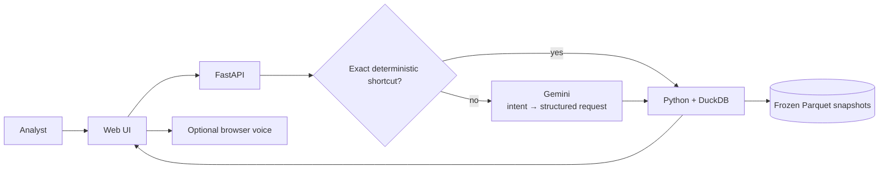

# Airport Investment Intelligence Agent

Built for the Deloitte FDE home assignment ([brief](docs/FDE%20Exam%202.pdf)). The app answers airport-investment screening questions from public aviation data, with deterministic calculations, follow-ups, explanations, and optional voice input/output.

## Demo

**Production:** https://deloitte-airport-analyst.vercel.app  
**Access:** shared password provided separately.

## What it answers

| Assignment question | Approach | Data |
|---|---|---|
| Which New England airports are strong terminal-expansion candidates? | Transparent traffic-pressure ranking: passenger growth 40%, passenger volume 30%, seat occupancy 30% | BTS T-100, FAA |
| How do LAX and SNA compare on congestion? | Cancellation, diversion, departure delay, and taxi-out shown side by side; no composite winner | BTS On-Time |
| What share of ANC departures are long-haul? | Eligible performed passenger-service departures ≥3,000 miles ÷ all eligible departures | BTS T-100 |
| Is there unmet demand at SFO, and why? | Passenger growth vs seat-supply growth, occupancy, monthly trend, and delay-cause context | BTS T-100, BTS On-Time, DataSF |

SFO latent demand is **not directly observable** from traffic data, so the app does not invent a value for it.

Default results use **CY2024 → CY2025** from the accepted `annual-2025-r1` bundle. Historical 2023 → 2024 analysis is supported where the contract allows it.

## How it works

**Gemini interprets language; it never calculates the answer.** Numbers, rankings, comparisons, explanations, sources, and limitations come from deterministic backend code over frozen, hash-verified snapshots.

A few unambiguous follow-ups such as “everything” or “full picture” are resolved directly by the server, avoiding an unnecessary model call.

## Design choices

| Choice | Why |
|---|---|
| Frozen Parquet + DuckDB | Reproducible results; no live provider dependency at query time |
| Deterministic analytics | No model-generated numbers, SQL, or citations |
| Structured Gemini intent | Natural-language flexibility with a small AI surface |
| Stateless signed context | Follow-ups work on serverless instances without a session database |
| No composite congestion score | Avoids arbitrary weighting and misleading “winner” claims |
| Browser-native voice | Dictation/read-aloud without a second AI pipeline |

Missing airport-years are excluded rather than filled with zero, and different source populations are kept explicit instead of being combined into unsupported ratios.

## Product behavior

- Shared-password access is checked server-side with signed `HttpOnly` cookies.
- The chat starts compact, grows with the conversation, and supports smooth expand/collapse and reduced-motion preferences.
- Provider overload/rate limits return a retryable message; presets and scope controls remain available.
- Unsupported business claims such as ROI, profitability, capital cost, forecasts, or precise latent demand are clearly bounded rather than guessed.

## Validation

Final RC3 Production release:

- **Backend:** 971 passed, 2 skipped (optional local-data fixtures)
- **Frontend:** 178/178 passed
- **Model admission:** 108/108, 0 errors
- **Production conversation checks:** 40/40 bare two-airport questions; 24/24 deterministic overview follow-ups
- **Assignment questions + follow-ups:** 8/8 returned 200
- **Production log scan:** 0 password/API-key hits; all logged provider responses were 200

Full evidence: [Validation](docs/VALIDATION.md).

## More detail

- [Requirements traceability](docs/REQUIREMENTS_TRACEABILITY.md)
- [Architecture](docs/ARCHITECTURE.md)
- [Run / test / deploy](app/README.md)
