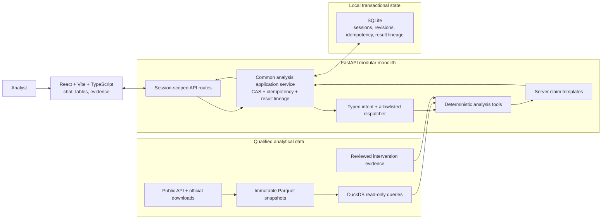
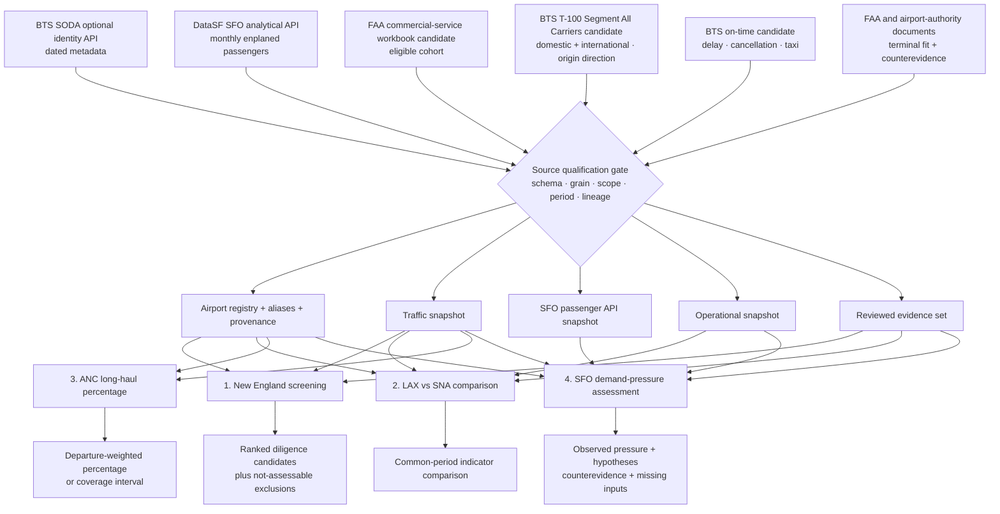

# Airport Investment Intelligence Agent — Master Build Plan

**Plan date:** 25 September 2026  
**Status:** plan only. No application, analytical source, test suite, or deployment has been built or runtime-qualified.  
**Planning assumption:** deliver the 24-hour exam milestone first; retain the full ORBIT-style product as the next phase. The exact remaining clock is unknown, so optional scope is cut before architecture or truthfulness safeguards.

## 1. Mission

Build an AI-assisted airport investment screening application that uses a meaningful public API integration, deterministic aviation analysis, and conversational follow-ups to help an analyst decide where deeper modernization diligence is warranted.

```text
observed traffic
  -> deterministic pressure priority
  -> terminal intervention fit and counterevidence
  -> profitability evidence gap
  -> diligence recommendation
```

The system prioritizes investigation. It does not prove profitability, ROI, or causal unmet demand. A future finance scenario needs capex/phasing, attributable usable-capacity uplift, ramp/utilization, investor revenue capture, incremental opex, asset life, and discount rate.

The exam milestone supports four generalized workflows:

1. rank a defined New England commercial-passenger airport cohort for terminal-expansion diligence;
2. compare congestion indicators for resolved airports, beginning with LAX and SNA;
3. calculate long-haul departure share for an airport, beginning with ANC;
4. assess demand pressure for an airport, beginning with SFO, without inventing an unmet-demand quantity.

Every substantive answer separates `observed`, `calculated`, `inferred`, `scenario`, and `unknown` claims. Missing data is never converted into zero.

The supplied public data cannot answer two requested business quantities by itself: project profitability and causal unmet demand. Phase A answers those parts with an explicit evidence-gap assessment: it shows the observed pressure and terminal-fit evidence, lists the missing finance or demand inputs, and returns `not_identifiable` for the requested quantity. It must not claim complete quantitative coverage of those two questions.

### Business-question decision contract

The PDF asks for profitable modernization and unmet demand but also explicitly permits uncertainty/scoping and prioritizes reasoning over completeness. The product must answer these questions directly with a decision status: `supported_observation`, `scenario_only`, or `not_identifiable`; it must never rename traffic pressure as profit or demand. Phase A’s default is a **diligence recommendation**, and a request for an estimated return/latent-demand count receives `not_identifiable` plus the specific missing inputs below. That is a disclosed scoped answer, not completed quantitative delivery.

For profitability, collect airport-specific project capex/phasing, incremental usable peak capacity, demand capture, commercial rights/revenue share, incremental opex, financing/discount assumptions and counterfactual. [FAA’s financial reporting program](https://www.faa.gov/airports/airport_compliance/airport_financial_reporting_program) provides airport-reported financial summaries searchable by airport/fiscal year; coverage is incomplete and FAA does not validate their accuracy. These reports can contextualize operating finances but do not identify an investor’s incremental project cash flow. Qualification of any selected finance record must reconcile fiscal/calendar scope and attribute it to a specific airport/project; no finance figure has been extracted in this pass.

Any future finance scenario uses the viewpoint of an external terminal infrastructure investor or concessionaire evaluating incremental project cash flows under explicit commercial rights and revenue-sharing terms. Airport-wide authority finances, airline economics, passenger growth, and bond-feasibility projections are context or counterevidence; none is treated as the investor's return. Phase A keeps this scenario out because the required project attribution and commercial-rights inputs are absent.

For SFO, distinguish observed passengers, published forecast, and unserved willingness-to-travel. Identify desired routes/time slots, denied/suppressed requests or a documented demand model, fares/generalized travel cost, substitutable airports and the binding terminal/runway/airspace/airline constraint before estimating latent demand. A forecast minus actual traffic is not that estimate. The [2024 SFO financing report](https://www.flysfo.com/sites/default/files/2024-05/SFOSeries2024ABCfos.pdf) includes projections premised on capacity assumptions and the capital improvement program; it is a candidate for reviewing assumptions/counterevidence, not proof of excess unserved demand. Review the exact appendix/page, covered period and subsequent project completion before promoting a claim. Neither observed delay nor load factor can establish this quantity alone.

## 2. Milestones

### Phase A — mandatory exam product

- a qualified DataSF public API supplies SFO passenger trend metrics with dated lineage;
- qualified downloads/snapshots supply calculation-grade aviation data;
- deterministic backend tools implement all four workflows;
- the first complete capability compares airports, stores structured context, recomputes “use the previous year,” atomically persists the successor result, and renders numbers without model arithmetic;
- a minimal map-free Vite interface shows chat, tables, evidence, uncertainty, source mode, and result lineage;
- `backend/docs/ARCHITECTURE.md` explains scoring, tradeoffs, and AI boundaries.

### Phase B — retained full product

- ORBIT-inspired analyst workspace;
- optional Cesium/globe mechanics selected only after a coupling spike;
- saved analyses and richer evidence review;
- optional live context, voice, hosting, and finance scenarios after separate qualification.

Phase B cannot delay Phase A. A map is a view over an `AnalysisResult`, never an analytical input.

## 3. Architecture

Use a separate **FastAPI modular monolith** and **React 19 + Vite + TypeScript frontend**. React is chosen for explicit state composition and later Cesium integration; Vite keeps the exam bootstrap small; TypeScript makes API/result-state mismatches visible before browser review.



The backend is the product's analytical authority. The frontend sends intent and renders typed results; it does not calculate metrics. DuckDB reads versioned analytical snapshots, while SQLite tracks short-lived anonymous sessions and immutable result lineage. The model is bounded to typed intent and approved claim selection; deterministic tools and server templates own the answer.

The fixed request flow is:

```text
reserve -> validate -> execute deterministic tool -> render final envelope -> atomically persist -> replay
```

```mermaid
sequenceDiagram
    actor A as Analyst
    participant UI as React client
    participant API as FastAPI route
    participant C as Common application service
    participant P as Intent parser
    participant V as Schema and policy validator
    participant T as Deterministic tool
    participant D as DuckDB snapshots
    participant S as SQLite session store
    participant R as Server renderer

    A->>UI: Ask a question or follow-up
    UI->>API: Message + expected revision + idempotency key
    API->>C: Reserve key + payload hash + expected revision
    C->>P: Parse to typed intent
    P->>V: Tool name + typed arguments
    alt Ambiguous or unsupported
      V-->>C: Focused clarification
      C->>S: Commit clarification envelope + turn + revision
      C-->>API: Committed acknowledgement
      API-->>UI: Clarification + committed revision
    else Valid intent
      V->>T: Approved request
      T->>D: Read pinned qualified snapshots
      D-->>T: Metrics + coverage + lineage
      T->>C: Validated result
      C->>R: Approved claims + prospective revision
      R-->>C: Final response envelope or deterministic fallback
      C->>S: Atomic result + envelope + turn + revision commit
      alt Revision changed
        S-->>C: Stale revision conflict
        C-->>API: Conflict + authoritative revision
        API-->>UI: Reconcile session before retry
      else Commit succeeds
        S-->>C: Immutable result + committed revision
        C-->>API: Committed acknowledgement + result
        API-->>UI: Apply commit; keep current draft text
      end
    end
```

This is also the follow-up contract. “Use the previous year” reuses stored airport and service scope, changes the period explicitly, recomputes the tool, and creates a successor result. A model failure cannot remove the deterministic table or lineage.

The model may propose a typed intent, then choose an ordered list of approved claim IDs plus enumerated relations and qualifiers. It never supplies trusted substantive prose. Server templates render every numeric or causal sentence from validated values, relations, qualifiers, and citations. Arbitrary model text is treated as untrusted and cannot reach the substantive answer. A deterministic template returns the same validated result when model generation fails.

DuckDB reads pinned immutable Parquet snapshots. SQLite stores local single-process sessions, idempotency reservations, result metadata, and follow-up links. Phase A does not need MongoDB or Supabase: DuckDB handles analytical queries over the snapshots, while SQLite provides atomic transactional state for the single application process. Revisit managed PostgreSQL or Supabase only if the product moves to multi-instance hosting or shared multi-user access. No queue or server database is needed for the exam.

### Why this approach

- The deterministic engine can be proved independently of the model and UI.
- A clean API boundary supports a minimal exam interface and later ORBIT/globe UI.
- It avoids committing to an upstream spatial application before proving its coupling and rights.
- It adds more structure than a single Python UI, but only where required for correct follow-ups and trustworthy numbers.

## 4. Source gate and decision log

Source qualification is the first execution gate. A dependent ticket stops when its source gate fails.

| Need | Candidate | Planned role | Qualification required |
|---|---|---|---|
| Optional identity API | BTS SODA Airports Citizen Connect `https://data.bts.gov/resource/kfcv-nyy3.json` | Airport search/detail identity metadata with visible dated provenance | Live calls returned 19,850 rows and exactly one match for each of ANC, BDL, BOS, LAX, SFO, and SNA. Its 2020-07-16 observation vintage limits it to dated identity/classification enrichment; selected field semantics and UI lineage must still pass. |
| Analytical public API | [DataSF SFO passenger statistics](https://data.sf.gov/resource/rkru-6vcg.json) | Monthly SFO enplaned passengers and domestic/international trend in demand-pressure answers | The bounded 2023/24 raw scope is source-qualified: 3,721 rows, complete selected fields, no declared-key duplicates, valid passenger counts, repeatable bytes, and exact FY2024 audited-total reconciliation. Immutable ingestion, adapter failure behavior, and the application consumer remain open. |
| Eligible airport cohort | FAA CY2024 commercial-service workbook | Authoritative membership after qualification | The live workbook passed XLSX integrity and content checks: 513 unique airport rows and a reproducible 22-airport New England cohort. Preserve the verified checksum, inclusion rule, and source metadata in the ingestion manifest. CY2025 preliminary data is not substituted. |
| Traffic and route mix | BTS T-100 Segment All Carriers domestic and international extract candidate | Origin-direction departures, seats, passengers, and distance | Fresh-session form extraction is reproducible for bounded samples, including Alaska January 2024 and two 2023 state extracts. Complete comparable assignment-airport coverage, union/deduplication, service/data-source disposition, and total reconciliation remain blocked. |
| Operational indicators | [BTS Reporting Carrier On-Time Performance (1987-present), table FGJ](https://transtats.bts.gov/DL_SelectFields.aspx?QO_fu146_anzr=&gnoyr_VQ=FGJ) | Delay, cancellation, taxi and diversion indicators | The official index inventory has exactly 24 canonical CY2023/24 files, and the December 2023 alternate name is verified as one alias, not a second partition. Full archive bytes/checksums, extraction, schema/row counts, duplicates, reporting population, and field coverage remain open. |
| Intervention evidence | FAA and airport-authority documents | Terminal fit, competing constraints, counterevidence | Every claim resolves to publisher, date, page/section, constraint type, and review status. |

### How sources support the four assignment tasks

The diagram below is a planned mapping, not a validation result. Every arrow passes through the qualification gate before its dependent workflow can ship.



The primary DataSF API supplies SFO historical passenger trend observations; optional BTS SODA supplies dated identity metadata. Neither substitutes for T-100 flight data or on-time congestion metrics. The displayed source gate applies independently to each adapter, not as an all-sources barrier. The FAA cohort candidate determines New England eligibility, T-100 candidates support traffic/route calculations, on-time candidates support a distinct operational population, and reviewed documents gate terminal-intervention conclusions.

### Observed live public-API evidence — 2026-09-25

The SODA count query returned 19,850 rows. A bounded query for ANC, BDL, BOS, LAX, SFO, and SNA returned exactly one record for each identifier, including name, city, state, facility/use classification, status, and ICAO identity fields. Separate two-row pages returned distinct offsets, so the endpoint's pagination mechanism was exercised. Every required record carried `eff_date` 2020-07-16, and the official dataset description says its observations are as of 2020-07-16. A later portal-metadata update does not make those observations contemporary. The sampled `annual_ops` field contained dates such as `12/31/2019`, so it must not be interpreted as an operations count.

This proves real calls, a nonempty response, bounded pagination behavior, and 6/6 target-airport identity resolution. It does not prove full-dataset uniqueness, null rates, schema stability, failure behavior, or that dated classification enrichment is substantive enough to satisfy the assignment's public-API criterion. Its fitness is limited to visibly dated identity/classification enrichment; it does not qualify modern congestion or the 2024 cohort. FAA membership is authoritative. SODA is left-joined enrichment: a missing row yields `registry_metadata_missing` and never removes an FAA airport. This optional dated metadata can appear in search/details with lineage; the analytical DataSF integration below is the primary API acceptance target. An offline fixture or download alone cannot satisfy that requirement.

T-100 and on-time inputs are planned downloads, not mislabeled APIs. Frozen snapshots may support reproducibility but are labeled with retrieval date and mode. Synthetic fixtures remain test-only.

### Analytical API selection and reproducible evidence — 2026-09-25

Select **DataSF SFO Air Traffic Passenger Statistics**, dataset `rkru-6vcg`, for the SFO workflow. The [official API catalog](https://dev.socrata.com/foundry/data.sfgov.org/rkru-6vcg) names the dataset. The legacy `data.sfgov.org` endpoint returned HTML with a meta redirect; explicitly using `data.sf.gov` returned JSON. Do not accept HTTP 200 alone as data success. The [publisher’s data dictionary](https://data.sfgov.org/api/views/rkru-6vcg/files/30489964-1207-4ee7-802c-e9069504b8eb?download=true&filename=DataSF+Data+Dictionary+for+Air+Traffic+Passenger+Statistics.pdf) warns that rows are additive across categories and comparisons must respect seasonality.

A real aggregate query returned 48 rows: each of 24 months × Domestic/International for **Enplaned** activity only. Annual sums are 2023 domestic 17,994,192/international 6,997,894 and 2024 domestic 18,204,966/international 7,849,620. These are measured API aggregates, not independently reconciled annual totals or latent-demand estimates. A separate category probe returned Enplaned, Deplaned and Thru / Transit; never sum all three as departing passengers. Its latest observed period was 202607; current collection timestamps do not change historical observation dates.

Retained public aggregate payload: [sfo-monthly-20260925.json](backend/docs/evidence/sfo-monthly-20260925.json), 4,417 bytes, SHA-256 `772af27f3684adbeb18c28bf5f717130a975f8fe0b46d5e6a1a9bf7ce46f9489`. The [category payload](backend/docs/evidence/sfo-types-20260925.json) records activity labels and period range. Both contain only public aggregate aviation data. Reproduce the bounded query in a network-enabled shell (the restricted sandbox first failed DNS; the approved external-network call succeeded):

```sh
curl --fail --silent --show-error --connect-timeout 5 --max-time 30 --get \
  https://data.sf.gov/resource/rkru-6vcg.json \
  --data-urlencode '$select=activity_period,geo_summary,sum(passenger_count) as passengers,count(*) as rows' \
  --data-urlencode '$where=activity_period >= '"'"'202301'"'"' AND activity_period <= '"'"'202412'"'"' AND activity_type_code = '"'"'Enplaned'"'"'' \
  --data-urlencode '$group=activity_period,geo_summary' \
  --data-urlencode '$order=activity_period,geo_summary' \
  --data-urlencode '$limit=100' \
  -o /tmp/sfo-monthly-recheck.json
shasum -a 256 /tmp/sfo-monthly-recheck.json
```

Expected structure: a JSON array with exactly 48 unique `(activity_period, geo_summary)` rows, nonnegative integer passenger sums and source-row counts, periods 202301–202412, both categories in every month. The retained checksum fixes the observed bytes; a later upstream revision may legitimately differ and must be recorded/reconciled rather than silently overwriting the snapshot. The later [raw qualification](backend/docs/evidence/source-qualification-20260925.md) closes complete bounded retrieval, declared categorical-key duplicate/null checks, passenger validation, and audited FY2024 total reconciliation for this 2023/24 scope.

**API delivery acceptance:** the bounded source data is qualified, but the application integration is not. The backend’s SFO demand-pressure result must ingest the qualified scope through its adapter, calculate same-month year-over-year and annual enplaned trends, and expose source URL, activity type, periods, retrieval timestamp, and snapshot hash. Schema mismatch, non-JSON bodies, 429/5xx, timeout and partial months produce explicit unavailable/partial status with bounded retry. The dataset is SFO-only, so no airport filter is applied; every airline/terminal/boarding-area category is included once, using operating/published airline as row attributes rather than joining separate totals. These aggregates never substitute for T-100 passengers/flight counts and are not joined to its raw records. Other airports do not inherit SFO-only coverage. First immutable ingestion, adapter failure handling, and the app’s actual consumer path remain required. SODA enrichment alone does not satisfy this product’s API gate.

**Probe provenance:** earlier FAA/T-100/on-time hashes and counts that are not reproduced in the linked evidence record remain historical claims. The new [source qualification record](backend/docs/evidence/source-qualification-20260925.md) retains the bounded T-100 fresh-session request contract and response hashes plus the PREZIP index inventory and December-alias checks; those artifacts prove only their stated bounded scopes. Complete T-100 assignment partitions and full on-time archive downloads/checksums are still unretained and unqualified. Never reconstruct a guessed historical request and present it as original evidence; promotion requires the exact URL/method/query or sanitized form body, relevant response headers/status/redirects, retrieval UTC, bytes/hash, schema/row counts, and deterministic report.

### Observed live download evidence — 2026-09-25

- The retained [source qualification record](backend/docs/evidence/source-qualification-20260925.md) closes the earlier T-100 extraction-reproducibility blocker for a bounded scope. A fresh cookie-preserving session with current ASP.NET hidden fields returned an Alaska January 2024 ZIP and 3,922-row CSV with the selected schema; bounded Alaska and Connecticut 2023 state extracts also succeeded. Other concurrent state requests returned HTML despite HTTP 200, so ZIP content type/signature validation remains mandatory. Complete comparable 2023/24 assignment-airport coverage, union/deduplication, class/data-source disposition, and total reconciliation remain open; traffic, ANC share, and screening calculations remain blocked.
- The same retained record verifies the official Reporting Carrier PREZIP inventory: 24 canonical monthly files across CY2023/24. Both December 2023 names returned matching size, timestamp, and ETag and are one partition alias. A December 2024 boundary URL also resolved. Full archive bytes/checksums, extraction, schema/row counts, duplicate counts, reporting population, and per-field coverage were not collected, so operational metrics remain blocked.
- The FAA CY2024 commercial-service workbook returned HTTP 200 with the expected XLSX MIME type and 58,201 bytes. SHA-256 is `7253febd109b73deeece0bd68e2aeb6f419e88332c2d109fd3350020edd73640`; the ZIP container passed integrity checks. Its single sheet, `ChangeinRevenuePassengerEnplan `, contains columns for rank, FAA region, state, Locid, city, airport name, service level, hub, CY2024 enplanements, CY2023 enplanements, and percent change. Parsing produced 513 airport rows with 513 distinct Locids, no missing or nonpositive CY2024 enplanements, 394 primary (`P`) airports, and 119 nonprimary commercial-service (`CS`) airports. Applying the explicit CT, ME, MA, NH, RI, and VT rule yields 22 New England airports: 19 `P` and 3 `CS`. All six named target airports are present. The FAA page lists this under CY2024 Passenger Boarding Data, says it was added 2025-09-15, and defines the service-level and hub codes. This qualifies the workbook for the CY2024 commercial-service cohort; the immutable ingestion manifest must preserve the checksum, retrieval date, row counts, and cohort rule. CY2025 preliminary data remains outside the core comparison unless a later scope decision adopts it.

### Open empirical blockers and closure evidence

Documentation corrections do not qualify a source. These remain open until the named owner retains the evidence; application readiness cannot be inferred from plan approval.

| Gate / owner | Required closure evidence | Capability blocked |
|---|---|---|
| Ticket 2 / data engineer | Source qualification is retained in [source-qualification-20260925.md](backend/docs/evidence/source-qualification-20260925.md). Close immutable ingestion, timeout/retry/schema quarantine, and actual demand-pressure consumer proof in 12B/48/49E. | Runtime-qualified analytical API delivery; bounded source data itself is qualified. |
| Ticket 4 / data engineer | Use the retained fresh-session extraction contract; add complete comparable 2023/24 assignment-airport partitions, grain/units/class/ID disposition, duplicate counts and reconciled totals. | Traffic comparison, ANC share and regional pressure calculations. |
| Ticket 5 / data engineer | Use the verified 24-file inventory and treat the December alternate as one alias; retain full bytes/checksums/extraction/schema/row counts, population, duplicates and field coverage. | Operational comparison and operational SFO indicators. |
| Ticket 5A / research lead | Airport-specific official terminal/processing-capacity records with dated locators, effective periods, supersession review and material counterevidence adjudicated under the evidence-date policy. | Terminal-fit recommendation; a pressure watchlist alone cannot close this gate. |

### Identity API acceptance contract (optional enrichment)

The candidate API is accepted only when the qualification artifact proves all of the following. Until then its status remains `candidate_reachable`, not `qualified`.

- ANC, BDL, BOS, LAX, SFO, and SNA each resolve exactly once to canonical airport ID, name, city, state, and at least one meaningful classification field selected from the observed schema.
- Required-field null rates, duplicate canonical IDs, duplicate IATA codes, and conflicting names are counted and dispositioned; a missing enrichment row never removes an FAA-cohort airport.
- The artifact records observation vintage separately from portal-metadata update time, plus request URL/parameters, retrieval timestamp, response checksum, row count, and schema fingerprint.
- Pagination is exercised through the full dataset with stable ordering and a reconciled count; the existing two-page probe is insufficient.
- Timeout, non-2xx, malformed JSON, schema drift, missing required fields, duplicate IDs, and partial-page failure each produce a typed unavailable/quarantined state rather than silently serving stale or partial metadata.
- The qualified API-origin field and its vintage/lineage appear in airport search or detail output. This legacy metadata candidate is optional; primary API acceptance is the DataSF analytical contract above.

### Source failure matrix

| Failure | Runtime response | Release consequence |
|---|---|---|
| DataSF analytical API timeout/unavailable | Use a pinned qualified historical snapshot with visible retrieval date when one exists; otherwise the SFO API passenger trend is unavailable. Never invent passenger counts or substitute SODA identity. | Source data is qualified for the bounded scope, but immutable ingestion, adapter failure handling, and actual consumer proof remain required before the application API gate passes. |
| Optional SODA identity API timeout/unavailable | Preserve the FAA-backed airport record and mark dated enrichment unavailable. | Does not block the DataSF API gate or FAA cohort; identity remains source-resolved. |
| Public API malformed payload/schema drift/duplicate identity | Quarantine the response and expose source-health failure; never merge ambiguous metadata. | Block airport API qualification and all dependent provenance claims. |
| FAA cohort missing or crosswalk conflict | Do not infer cohort membership from SODA or visible map points. | Block New England screening; other airport-specific tools may proceed only with separately resolved IDs. |
| T-100 partition incomplete or service/direction scope unresolved | Return unavailable for affected traffic metric; do not fill absent rows with zero. | Block every workflow whose required metric/period is incomplete. |
| On-time partition incomplete or airport outside reporting population | Keep traffic and operational populations separate; mark operational indicator unavailable. | Block the full LAX/SNA comparison gate if required operational metrics are absent. |
| Intervention document missing, stale, conflicting, or unreviewed | Retain a quantitative pressure watchlist and expose the evidence gap. | Block terminal-project ranking and causal terminal conclusions; never convert absence into negative evidence. |

### Planned scope decisions

- Primary period: CY2024; growth comparison: CY2023 to CY2024, both subject to comparable full-period qualification.
- New England: CT, ME, MA, NH, RI, VT; eligible airports come from the qualified FAA cohort.
- Proposed passenger default: scheduled passenger service with seats greater than zero, subject to T-100 service-class confirmation.
- ANC default: scheduled passenger departures; exclude cargo/charter unless explicitly requested and qualified.
- Long haul default: at least 3,000 statute miles, displayed as a project definition.
- Partition completeness uses expected source partitions and reporting coverage. Twelve seasonal partitions may legitimately contain no rows; absence is neither automatically missing nor zero.
- On-time data outside its reporting population is unavailable, not zero.

## 5. Deterministic methodology

### Airport comparison

Return a common qualified period and service scope, passengers, seats, performed departures, seat occupancy, cancellation, qualified delay/taxi indicators, coverage, exclusions, evidence, and source snapshot IDs. These are operational-pressure indicators, not automatic terminal diagnoses.

The two source families keep separate populations and denominators. T-100 passengers and seats use the frozen service-class and origin-direction scope; seat occupancy is `passengers / seats` only where that denominator is positive. On-time cancellation rate is `cancelled flights / eligible reported flights`. Delay and taxi aggregates use non-cancelled observed flights with the relevant field present, and return both the observed-flight denominator and coverage against eligible reported flights. Raw T-100 and on-time rows are never multiplied together or treated as one population.

#### Operational comparison v0

For each airport, use scheduled domestic reporting-carrier flights with that airport as **origin** over the same requested complete qualified period (default CY2024; a prior-year follow-up recomputes CY2023 from its own qualified snapshots); identify the same reporting-carrier set in both airports (intersection of qualified annual carrier coverage), display the excluded-carrier share, and retain airport-specific full-population summaries separately. This describes the reported departure experience, not all traffic or intrinsic terminal capacity. Never mix inbound and outbound denominators.

Let `N` be deduplicated scheduled origin flights with valid cancellation/diversion flags. Report cancellation count/`N` and diversion count/`N` separately. For non-cancelled, non-diverted flights, report the share with `DepDel15=1` among nonnull `DepDel15`, and arithmetic means of `DepDelayMinutes` and `TaxiOut`, each over its own nonnull, valid-value subset. `TaxiIn` and `ArrDelayMinutes` on origin-filtered flights describe destination arrival experience, so they are excluded from the origin-congestion KPI comparison; any optional display labels that downstream meaning separately and cannot attribute it to the origin airport. Use zero-clamped delay minutes as defined by BTS; retain signed delay only as an explicitly separate field. Show each numerator, field denominator, and coverage against the eligible non-cancelled/non-diverted count and against `N`. Diverted flights stay in the diversion rate but are excluded from these typical-flight delay/taxi estimators. Missing flags invalidate the affected source scope; missing metrics never become zero.

Compare each KPI independently, using unrounded values; equal values tie. No unvalidated composite congestion score or causal terminal diagnosis is emitted. If indicators disagree, return `mixed_indicators`; missing comparable periods/carriers yield `not_comparable`. The [official Reporting Carrier field definitions](https://transtats.bts.gov/Fields.asp?gnoyr_VQ=FGJ) identify the delay, cancellation and diversion fields; these are explicit modeling population choices, pending validation against complete archives.

#### Evidence date and decision date

Every answer declares `analysis_period`, `decision_as_of`, and `evidence_cutoff`. The default is a **present-day diligence screen using CY2024 historical metrics**, with `decision_as_of` and cutoff pinned to the snapshot refresh date. This is not a claim about what was knowable in 2024. An explicit historical-as-of request admits only material published on/before that requested date. Records preserve publication date, covered/effective interval, retrieved date, reviewed date, locator/page, supersession check and unresolved counterclaims. Missing dates make evidence `not_assessable`.

For a current terminal recommendation, require an official airport/FAA capacity or capital-plan source whose effective plan interval contains the decision date and whose supersession/conflict check was performed within 30 days of the frozen cutoff. Older history can explain trends but cannot alone establish current capacity. A superseding completed project, materially conflicting current source or absent capacity/peak-processing information blocks terminal eligibility until reviewed. These 30-day review and plan-interval rules are conservative project conventions, not FAA standards. Reproducing an old result uses its original cutoff; refreshing evidence creates a successor result.

### Regional screening

Screening v0 supports only the frozen CY2024 FAA cohort with CY2024 metrics and CY2023 growth baseline. A screening follow-up requesting another year (including “previous year”) returns `unsupported_analysis_period` with the supported period and required missing prerequisites, preserves the existing result pointer, and creates no successor analysis. It must not relabel 2024 metrics as 2023 or recompute against the 2024 cohort silently. Enabling CY2023 screening is a separate methodology version requiring a qualified CY2023 FAA cohort and complete comparable CY2022/CY2023 traffic snapshots. Airport-comparison prior-year recomputation remains supported when its CY2023 inputs qualify; this does not imply prior-year screening support.

Methodology v0 is frozen before ranking is enabled. Its default evaluation formula is:

```text
pressure score = 0.40 * growth percentile
               + 0.30 * passenger-volume percentile
               + 0.30 * seat-occupancy percentile
```

The weights are an explicit screening assumption, not an empirically validated investment model. Apply these deterministic v0 rules:

- Compute CY2024 volume and seat occupancy over the frozen qualified passenger-service scope. Compute adjusted growth as `(P2024 - P2023) / max(P2023, 10,000 passengers)` and display raw year-over-year growth beside it so the base-effect adjustment is visible; when `P2023 = 0`, raw growth is `not_supported` while adjusted growth remains defined by the explicit floor. The 10,000 floor is a provisional modeling convention chosen to damp percentage explosions at very small bases; it is not an empirical estimate or a profitability threshold.
- Convert each dimension to `[0, 1]` with ascending midrank percentile `(average_rank - 1) / (n - 1)` within the fully assessable cohort. Do not winsorize: rank normalization already discards magnitude, and clipping would only create artificial ties rather than meaningfully damp extreme ranks. Preserve raw values alongside ranks.
- Equal dimension values receive the same average rank. With fewer than two fully assessable airports, no ranking is produced. Missing period, passengers, seats, or a nonpositive seat denominator makes that airport `not_assessable`; weights are never renormalized.
- Treat final scores equal within `1e-12` as tied. Use competition ranking (`1, 2, 2, 4`); every airport with displayed rank at most 3 counts as top-three, so a boundary tie may include more than three airports. Canonical airport ID orders tied rows for stable display without breaking the tie.
- Run exactly 12 scenarios: four weight cases (base `40/30/30`, equal thirds, growth-heavy `60/20/20`, scale/utilization-heavy `20/40/40`) × three prior-passenger floors (`1`, `10,000`, `25,000`). Report every airport’s minimum/maximum rank and top-three frequency out of 12. `robust_top_three` requires top-three placement in at least three of four weight cases **for each of the three floors**, and an overall maximum-minus-minimum rank of at most two.

The score produces a quantitative pressure watchlist only. A terminal-project recommendation is `eligible` only when the airport is fully scoreable and airport-specific evidence meeting the Evidence date and decision date rules supports a passenger-terminal capacity or processing constraint, with every material counterclaim reviewed and no unresolved conflict. It is `excluded` when reviewed evidence attributes the binding constraint to a nonterminal cause or shows the proposed terminal intervention does not address it. It is `not_assessable` when evidence is absent, stale, unreviewed, or materially conflicting. Only `eligible` airports are ordered by pressure score; excluded and not-assessable airports remain visible with reasons and counterevidence. Evidence status never changes the numeric pressure score.

### Long-haul share

Use performed departures, not route-record counts. With total eligible departures `T`, known long-haul departures `L`, and unknown-distance departures `U`:

- all distances known: exact percentage `100 * L/T`;
- partial distances: honest percentage interval `100 * L/T` to `100 * (L+U)/T`;
- `T = 0`: unavailable.

Store the exact fraction or fraction interval in `[0, 1]`; the API/UI displays percentages by multiplying each stored bound by `100` exactly once.

### SFO demand pressure

Return substantive observed metrics, sourced constraints/hypotheses, counterevidence, and missing inputs needed for estimation. Throughput, delays, or occupancy alone do not yield a point estimate or bounds for unmet demand.

### Safe explanation

Each result exposes typed claim objects: `metric`, `comparison`, `coverage`, `evidence`, `limitation`, and `unknown`. The model may return only ordered approved claim IDs and enumerated relation/qualifier values. Server templates render all substantive numeric and causal sentences. Unknown IDs, altered values, unsupported relations, or free-form causal language fail validation and trigger the deterministic template.

The server derives `required_claim_ids` from the validated result, before any model selection. This mandatory set includes result/unavailable status, material coverage and uncertainty, interval bounds, terminal eligibility, material counterevidence, and profitability/unmet-demand evidence gaps whenever applicable. It is independent of the model and cannot be removed, softened, or contradicted by model qualifiers. The model may order optional approved claims only. The renderer always includes the mandatory set in a fixed visible section in both normal and fallback responses; model omission cannot suppress it. Before commit, completeness validation checks every required ID and its server-owned qualifiers/citations. Acceptance cases use empty selection, metrics-only selection, omitted counterevidence, omitted unavailable status, and attempted weakened qualifiers: each must retain all mandatory information or return the complete deterministic fallback; an incomplete fallback fails without committing.

Status vocabulary: `not_identifiable` applies to a requested business quantity that the evidence cannot identify (profitability or latent demand). `not_supported` applies to a mathematically undefined metric such as raw growth with a zero prior base. `unavailable` describes missing qualified input coverage; `not_assessable` describes an airport score or intervention assessment that cannot be completed. Every such status carries a reason and required explanatory claim.

## 6. API and state contracts

| Method and route | Purpose |
|---|---|
| `POST /api/v1/sessions` | Issue an anonymous opaque capability session in an HttpOnly, SameSite cookie with bounded expiry. |
| `POST /api/v1/sessions/reconcile` | Reconcile one original idempotency key/hash to `committed`, `pending`, `failed`, or `absent`, plus canonical revision/result and reservation lease fence. |
| `GET /api/v1/sources/status` | Qualified snapshots, periods, modes, and limitations. |
| `GET /api/v1/airports/search` | Alias resolution plus optional dated identity metadata/provenance when available. |
| `POST /api/v1/analyses/compare` | Deterministic airport comparison. |
| `POST /api/v1/analyses/screen` | Gated methodology-v0 cohort screening. |
| `POST /api/v1/analyses/long-haul-share` | Departure-weighted share and coverage interval. |
| `POST /api/v1/analyses/demand-pressure` | Observations, constraints, counterevidence, missing inputs. |
| `POST /api/v1/chat/messages` | Typed intent, clarification, tool execution, or follow-up. |
| `GET /api/v1/results/{result_id}` | Immutable result and predecessor lineage. |
| `GET /api/v1/results/{result_id}/evidence` | Evidence referenced by the result. |

Core proposed records: `Airport`, `SourceSnapshot`, `EvidenceRecord`, `AnalysisRequest`, `MetricResult`, `AnalysisResult`, `Claim`, `ChatSession`, and `ChatTurn`.

FastAPI owns package startup, configuration loading, `main.py`, and a versioned root router that registers every promised route. A provider adapter owns the model call boundary so the orchestrator has no vendor-specific behavior. Every result/evidence/chat route resolves the anonymous server-issued capability cookie and scopes reads/writes to that session; opaque IDs alone never authorize cross-session access. Expired sessions fail closed and issue no silent replacement during a result request.

Every `POST /analyses/*` route and the chat route invoke one common analysis application service. The service validates the capability, idempotency key, payload hash, and expected revision; calls a pure deterministic tool; then prepares the final response envelope (including a deterministic explanation fallback if needed) and atomically persists its canonical serialized body, HTTP status, immutable result, turn, lineage, and new session revision. The expected revision and active lease generation are rechecked in that transaction; an envelope computed against stale state is never committed. Direct analysis routes therefore create the same follow-up-capable state as chat. Pure tools remain internal and cannot be exposed by a route directly.

### Atomic follow-up semantics

- Idempotency key binds the payload hash.
- Same key plus same payload replays the stored HTTP status and canonical JSON body byte-for-byte, including explanation/fallback choice, result ID, revision, source IDs, timestamps, and claim order. Replay reads storage only: no model, tool, re-render, or new timestamp. Transport headers such as `Date` and request tracing are outside this identity guarantee.
- Same key plus different payload returns conflict.
- A bounded `pending` reservation owns one total model/tool call cap, including retries.
- Each reservation has an opaque server owner and monotonically increasing `lease_generation`; only that owner/generation may commit.
- Compute targets an expected `session_revision`.
- Result and new session state commit in one transaction only if the revision still matches.
- A stale response is rejected and never exposed as committed.
- A process crash leaves no session pointer to a nonexistent result. An expired pending lease is reclaimed only after a CAS fence advances its generation and deactivates the former owner.
- `failed` keeps a safe retry path. Follow-ups create immutable successor results. The stored response envelope covers clarification as well as analytical success; before the transaction crashes leave no committed envelope/result/revision, after it crashes replay reads the complete stored envelope. Rendering failure uses the fixed fallback before commit; failure to create even that envelope fails the turn without advancing revision.

## 7. Truthfulness, failure, and security rules

- Ask when an airport alias changes meaning; never silently map “LA” to LAX.
- Treat retrieved documents as data, never instructions.
- Allowlist tool names and typed arguments; no model-authored SQL, formulas, or arithmetic.
- Keep analytical queries read-only and parameterized.
- Bound body size, airport counts, periods, tool/model calls, retries, and output length.
- Keep credentials out of project files and logs.
- Preserve the validated result when explanation generation fails.
- Show stale, partial, unavailable, API-metadata-missing, and fixture-backed states distinctly.
- Prevent cross-session result reuse.
- Never let map movement change cohort, period, denominator, or ranking.

### Client response ordering

Draft editing changes presentation state only; it never invalidates an in-flight transaction. Each submission tracks its idempotency key, payload hash, and expected revision independently of the current input text. A committed acknowledgement is always recorded in request history even when the analyst has typed since submitting; the newer draft text remains untouched. Authoritative session revision and the current-result pointer update monotonically: an acknowledgement for revision `r+1` arriving after reconciliation already established `r+2` is retained as history but cannot replace `r+2` or its result. Every future follow-up uses the latest canonical server revision/result.

After timeout, disconnect, unknown response, or revision conflict, the client calls `POST /api/v1/sessions/reconcile` with the original idempotency key and payload hash. The response returns canonical session revision/result plus reservation status, `lease_generation`, and whether an owner remains active. `committed` applies or records the committed revision monotonically and permits same-key/same-hash replay. `pending` permits only bounded polling or same-key/same-hash replay; a new key is forbidden because the original owner may still commit. `failed` permits a new attempt only after the server has atomically fenced the old generation and deactivated its owner. `absent` permits only same-key, identical-payload retry, preserving the original expected revision: a delayed original request and its retry share one reservation. A later revision conflict requires explicit rebase confirmation before submitting a new transaction. Reusing a key with a different hash is always a conflict. The prior result remains visible with pending/reconciling status.

## 8. 24-hour execution lanes and failure branch

Package setup and source qualification start in parallel; only source-dependent calculations wait for qualification.

| Clock | Parallel work | Cutoff and evidence |
|---|---|---|
| Hours 0–2 | Product contract; backend/frontend package scaffolds; T-100, on-time, FAA, DataSF, and document qualification | At hour 2, record each source as qualified or blocked. T-100 extraction must reproduce or move to a documented official alternate with equivalent grain, fields, and CY2023/CY2024 coverage. |
| Hours 2–6 | Startup/router/session skeleton; typed UI shell; successful source snapshots and methodology freeze | No synthetic or historical extract may stand in for a failed live qualification. A blocked required source marks its dependent workflow unavailable. |
| Hours 6–14 | Common application service, persistence, traffic/operational tools, and independent workflow tools whose own inputs passed | Each tool advances on its own backend prerequisites; comparison browser QA is not a prerequisite for the other tools. |
| Hours 14–20 | Analysis/chat routes, reconciliation behavior, client integration, deterministic rendering | Direct and conversational calls must create identical persisted lineage. |
| Hours 20–24 | End-to-end evidence, architecture document, demo rehearsal, and assignment traceability | Phase A is complete only if all four workflows, meaningful API use, and required source coverage pass. Otherwise submit an explicitly incomplete artifact that names unavailable workflows and failed gates. |

Reduction order is Phase B, globe, visual polish, optional live context, voice, hosting, and finance scenarios. The four required workflows, deterministic calculations, source lineage, and truthful unavailable states are not reducible. If DataSF analytical API integration is unqualified, if T-100 is unreproducible, if on-time coverage remains unqualified, or if intervention evidence cannot support terminal fit, the plan does not claim full assignment completion.

## 9. Numbered implementation tickets

These are future, proposed units. Paths and commands do not assert that files or test runners exist today. Each ticket names no more than two proposed files, one outcome, dependencies, owner, acceptance, and an exact **future** verification command owned by that implementer. No command below was run during planning. If work exceeds 150 net lines, split it before execution. Tickets 1–50 are the exam milestone; Tickets 51–52 are separately gated Phase B.

### Gate 1 — contract and qualified sources

1. **Write product contract** — Owner: backend engineer. Files: `backend/docs/PRODUCT_CONTRACT.md`, `backend/tests/test_product_contract.py`. Depends: none. Accept: four workflows define inputs, outputs, ambiguity, insufficient-data, and profitability boundaries. Future verify is deferred until Ticket 8 installs the declared test extra: `python -m pytest -q backend/tests/test_product_contract.py`.
2. **Operationalize qualified analytical public API scope** — Owner: data engineer. Files: `backend/scripts/qualify_airport_api.py`, `backend/docs/sources/airport-api.md`. Depends: 1. Accept: reproduce the retained DataSF bounded raw qualification and FY2024 audited-total reconciliation, then prove adapter timeout/retry/schema quarantine; optional SODA identity enrichment is qualified separately. Future verify: `python backend/scripts/qualify_airport_api.py --check`.
3. **Qualify FAA cohort workbook** — Owner: data engineer. Files: `backend/scripts/qualify_faa_cohort.py`, `backend/docs/sources/faa-cohort.md`. Depends: 1. Accept: authoritative CY2024 cohort and New England rule are reproducible. Future verify: `python backend/scripts/qualify_faa_cohort.py --check`.
4. **Qualify T-100 Segment All Carriers coverage** — Owner: data engineer. Files: `backend/scripts/qualify_t100.py`, `backend/docs/sources/t100.md`. Depends: 1. Accept: use the retained fresh-session form contract, then prove complete assignment-airport domestic+international coverage, segment/origin grain, class/data-source disposition, distance units, IDs, deduplication, reconciliation, and comparable CY2023/CY2024 partitions. Future verify: `python backend/scripts/qualify_t100.py --check`.
5. **Qualify on-time archive contents** — Owner: data engineer. Files: `backend/scripts/qualify_ontime.py`, `backend/docs/sources/ontime.md`. Depends: 1. Accept: use the verified 24-canonical-file inventory and single December 2023 alias; every canonical ZIP has checksum, extraction/schema result, carrier grain, deduplication, row/field coverage, reporting population, and seasonal disposition recorded. Future verify: `python backend/scripts/qualify_ontime.py --check`.
5A. **Qualify intervention documents** — Owner: research lead. Files: `backend/scripts/qualify_intervention_docs.py`, `backend/docs/sources/intervention-evidence.md`. Depends: 1, 3. Accept: each candidate document has airport, publisher, effective/publication date, stable locator, page/section, constraint type, currency/conflict status, and review decision. Future verify: `python backend/scripts/qualify_intervention_docs.py --check`.
6. **Assemble source decision matrix** — Owner: data engineer. Files: `backend/scripts/build_source_matrix.py`, `backend/docs/SOURCE_MATRIX.md`. Depends: 2–5A. Accept: one serialized writer records each source independently as qualified or failed so unrelated tools can proceed. Future verify: `python backend/scripts/build_source_matrix.py --check`.
7. **Freeze screening methodology v0** — Owner: analytics lead. Files: `backend/config/methodology-v0.yaml`, `backend/tests/test_methodology_config.py`. Depends: 3, 4, 5A. Accept: formulas, cohort, scope, weights, normalization, base effects, competition ties, one-member cohort, missingness, terminal evidence gate, and all 12 sensitivity scenarios are explicit. Future verify is deferred until Ticket 8 installs the declared test extra: `python -m pytest -q backend/tests/test_methodology_config.py`.

### Gate 2 — runnable backend and reproducible data

8. **Create backend package/dependencies** — Owner: backend engineer. Files: `backend/pyproject.toml`, `backend/app/__init__.py`. Depends: 1. Runs in parallel with Tickets 2–7. Accept: one installable backend package declares FastAPI, Pydantic, DuckDB, and test tooling. Future verify: `python -m pip install -e 'backend[test]'`.
9. **Own configuration and startup** — Owner: backend engineer. Files: `backend/app/config.py`, `backend/app/main.py`. Depends: 8. Accept: typed configuration creates the FastAPI app without reading secrets into logs. Future verify is owned by Ticket 9A.
9A. **Verify backend startup** — Owner: backend engineer. Files: `backend/tests/test_startup.py`. Depends: 9. Accept: app startup succeeds with safe defaults and redacted configuration output. Future verify: `python -m pytest -q backend/tests/test_startup.py`.
10. **Own versioned root router** — Owner: backend engineer. Files: `backend/app/api/router.py`, `backend/tests/test_router_factory.py`. Depends: 9A. Accept: one router factory supports incremental registration; each later route ticket registers its own router. Future verify: `python -m pytest -q backend/tests/test_router_factory.py`.
11. **Define airport/source schemas** — Owner: backend engineer. Files: `backend/app/domain/airports.py`, `backend/app/domain/sources.py`. Depends: 1, 8. Accept: typed records preserve time-valid IDs, aliases, grain, period, units, lineage, and per-source qualified/failed status without requiring every source to pass. Future verify is deferred to Ticket 11A.
11A. **Verify airport/source schemas** — Owner: backend engineer. Files: `backend/tests/test_source_contracts.py`. Depends: 11. Accept: qualified examples pass and invalid units/IDs fail. Future verify: `python -m pytest -q backend/tests/test_source_contracts.py`.
12. **Build airport registry snapshot** — Owner: data engineer. Files: `backend/app/ingest/airports.py`, `backend/data/manifests/airports.json`. Depends: 3, 11A. Accept: the FAA cohort remains usable when API enrichment is failed/unavailable; qualified API metadata is left-joined when present and missing enrichment never drops an airport. Future verify is deferred to Ticket 12A.
12A. **Verify airport registry ingestion** — Owner: data engineer. Files: `backend/tests/test_airport_ingest.py`. Depends: 12. Accept: repeated ingestion is stable and crosswalk/missing-metadata cases pass. Future verify: `python -m pytest -q backend/tests/test_airport_ingest.py`.
12B. **Ingest SFO analytical API snapshot** — Owner: data engineer. Files: `backend/app/ingest/sfo_passengers.py`, `backend/data/manifests/sfo-passengers.json`. Depends: 2, 11A. Accept: the qualified Enplaned monthly API scope persists an immutable snapshot with source rows/counts, 24-month completeness and checksums; no T-100 substitution. Future verify: `python backend/scripts/qualify_airport_api.py --check` plus a retained first-ingestion report.

13. **Build T-100 snapshot** — Owner: data engineer. Files: `backend/app/ingest/t100.py`, `backend/data/manifests/t100.json`. Depends: 4, 11A. Accept: qualified rows become immutable Parquet with lineage, deduplication, and coverage. Future verify is deferred to Ticket 13A.
13A. **Verify T-100 ingestion** — Owner: data engineer. Files: `backend/tests/test_t100_ingest.py`. Depends: 13. Accept: repeat ingestion and hand-calculation cases pass. Future verify: `python -m pytest -q backend/tests/test_t100_ingest.py`.
14. **Build on-time snapshot** — Owner: data engineer. Files: `backend/app/ingest/ontime.py`, `backend/data/manifests/ontime.json`. Depends: 5, 11A. Accept: immutable CY2023/CY2024 Parquet preserves its reporting population without joining raw T-100 rows or multiplying counts. Future verify is deferred to Ticket 14A.
14A. **Verify on-time ingestion** — Owner: data engineer. Files: `backend/tests/test_ontime_ingest.py`. Depends: 14. Accept: duplicate, seasonal-partition, and aggregate reconciliation cases pass. Future verify: `python -m pytest -q backend/tests/test_ontime_ingest.py`.
15. **Add read-only analytics store** — Owner: backend engineer. Files: `backend/app/storage/analytics.py`, `backend/tests/test_analytics_storage.py`. Depends: 8, 11A. Accept: DuckDB opens whichever pinned per-source manifests are qualified, preserves distinct population/coverage metadata, and exposes failed/missing sources without blocking unrelated stores. Future verify: `python -m pytest -q backend/tests/test_analytics_storage.py`.

### Gate 3 — first comparison vertical slice

16. **Define analysis contracts** — Owner: backend engineer. Files: `backend/app/domain/analysis.py`, `backend/tests/test_analysis_contracts.py`. Depends: 1, 11A. Accept: immutable requests/results carry optional per-source snapshots/status, methodology, coverage, evidence, exclusions, unknowns, predecessor, and owner session without requiring unrelated sources. Future verify: `python -m pytest -q backend/tests/test_analysis_contracts.py`.
17. **Implement traffic metrics** — Owner: backend engineer. Files: `backend/app/analysis/traffic_metrics.py`, `backend/tests/test_traffic_metrics.py`. Depends: 13A, 15, 16. Accept: T-100 passengers, seats, departures, occupancy, and growth handle denominators/base effects truthfully without an on-time dependency. Future verify: `python -m pytest -q backend/tests/test_traffic_metrics.py`.
18. **Implement operational metrics** — Owner: backend engineer. Files: `backend/app/analysis/operational_metrics.py`, `backend/tests/test_operational_metrics.py`. Depends: 14A, 15, 16. Accept: the Operational comparison v0 origin/carrier population, cancellation/diversion rates, non-cancelled non-diverted means and departure-delay share follow explicit field denominators and coverage; no metric raw-joins T-100 rows. Future verify: `python -m pytest -q backend/tests/test_operational_metrics.py`.
19. **Create reviewed evidence dataset** — Owner: research lead. Files: `backend/data/evidence/evidence.json`, `backend/tests/test_evidence_records.py`. Depends: 1, 5A. Accept: only qualified documents produce records, with publisher, date, locator, proposition, constraint type, counterevidence, and status. Future verify: `python -m pytest -q backend/tests/test_evidence_records.py`.
20. **Implement evidence helper** — Owner: backend engineer. Files: `backend/app/analysis/evidence.py`, `backend/tests/test_evidence.py`. Depends: 16, 19. Accept: production helper returns reviewed evidence/counterevidence by airport, topic, and period; compare, screen, and demand tools are named required callers. Future verify: `python -m pytest -q backend/tests/test_evidence.py`.
21. **Implement comparison tool** — Owner: backend engineer. Files: `backend/app/analysis/compare.py`, `backend/tests/test_compare.py`. Depends: 12A–14A, 15–18, 20. Accept: arbitrary eligible airports return common-period traffic and separately aggregated operational indicators; the production comparison caller invokes Ticket 20 for reviewed evidence/counterevidence and lineage. Future verify: `python -m pytest -q backend/tests/test_compare.py`.
22. **Define common execution contracts** — Owner: backend engineer. Files: `backend/app/domain/execution.py`, `backend/tests/test_execution_contracts.py`. Depends: 16. Accept: tool-independent commands, idempotency/hash/revision envelopes, reservation status, lease owner/generation, reconciliation outcomes, and monotonic committed acknowledgements are typed without depending on comparison or any source. Future verify: `python -m pytest -q backend/tests/test_execution_contracts.py`.
23. **Add model provider adapter** — Owner: backend engineer. Files: `backend/app/agent/provider.py`, `backend/tests/test_provider.py`. Depends: 9. Accept: vendor calls, timeouts, retries, and structured output are isolated behind one interface. Future verify: `python -m pytest -q backend/tests/test_provider.py`.
24. **Define intent/claim schemas** — Owner: backend engineer. Files: `backend/app/agent/contracts.py`, `backend/tests/test_agent_contracts.py`. Depends: 16, 22. Accept: intent, optional approved claim selection, server-derived required claim IDs, immutable mandatory qualifiers, and clarification states validate; free-form substantive prose does not. Future verify: `python -m pytest -q backend/tests/test_agent_contracts.py`.
25. **Define session transaction schema** — Owner: backend engineer. Files: `backend/app/storage/session_schema.py`, `backend/tests/test_session_schema.py`. Depends: 22, 24. Accept: opaque capabilities, expiry, revisions, payload hashes, explicit `committed`/`pending`/`failed`/`absent` reconciliation states, lease owner/generation, and owner-scoped result links enforce invariants. Future verify: `python -m pytest -q backend/tests/test_session_schema.py`.
26. **Implement atomic session store** — Owner: backend engineer. Files: `backend/app/storage/sessions.py`, `backend/tests/test_sessions.py`. Depends: 25. Accept: only the active lease owner/generation can commit; revision/result pointers never regress; reconciliation is key/hash-specific; pending permits no new key; failed is fenced before a new key; absent retries the same key; stored-envelope replay is byte-identical without model/tool/render calls; conflict, pre/post-commit crashes, and expiry are deterministic. Future verify: `python -m pytest -q backend/tests/test_sessions.py`.
27. **Implement safe renderer** — Owner: backend engineer. Files: `backend/app/agent/render.py`, `backend/tests/test_render.py`. Depends: 24. Accept: server templates render substantive sentences with the complete server-owned mandatory claim set; empty/metrics-only model selection, omitted counterevidence/status and weakened qualifiers cannot suppress caveats; incomplete fallback cannot commit. Future verify: `python -m pytest -q backend/tests/test_render.py`.
28. **Implement comparison intent executor** — Owner: backend engineer. Files: `backend/app/agent/orchestrator.py`, `backend/tests/test_orchestrator.py`. Depends: 21, 23, 24, 27. Accept: typed comparison/follow-up execution cannot bypass validation, total call cap, or safe rendering and returns a validated candidate result for transactional persistence. Future verify: `python -m pytest -q backend/tests/test_orchestrator.py`.
28A. **Implement common analysis application service** — Owner: backend engineer. Files: `backend/app/services/analysis.py`, `backend/tests/test_analysis_service.py`. Depends: 22, 26, 27. Accept: the tool-independent service validates capability/key/hash/revision, reserves a fenced lease, invokes an allowlisted executor, prepares a final response envelope, atomically persists its canonical body/status with result/turn/lineage/revision, and returns a monotonic committed acknowledgement for direct routes and chat. Future verify: `python -m pytest -q backend/tests/test_analysis_service.py`.
29. **Expose session and reconciliation endpoints** — Owner: backend engineer. Files: `backend/app/api/sessions.py`, `backend/tests/test_session_api.py`. Depends: 10, 26. Accept: the server issues a capability and key/hash-specific reconciliation returns canonical revision/result, exact reservation status, lease generation/owner activity, and a fence before `failed` permits a new key; `absent` permits same-key retry only. Future verify: `python -m pytest -q backend/tests/test_session_api.py`.
29A. **Expose comparison endpoint** — Owner: backend engineer. Files: `backend/app/api/analyses.py`, `backend/tests/test_compare_api.py`. Depends: 10, 21, 28A, 29. Accept: the registered session-scoped route invokes the common application service and returns a persisted, follow-up-capable result with committed revision and lineage. Future verify: `python -m pytest -q backend/tests/test_compare_api.py`.
30. **Expose chat endpoint** — Owner: backend engineer. Files: `backend/app/api/chat.py`, `backend/tests/test_chat_api.py`. Depends: 10, 23, 24, 28A, 29. Accept: registered session-scoped chat executes or clarifies through the common service and rejects missing/expired capability or stale revision. Future verify: `python -m pytest -q backend/tests/test_chat_api.py`.
31. **Expose result/evidence endpoints** — Owner: backend engineer. Files: `backend/app/api/results.py`, `backend/tests/test_result_access.py`. Depends: 10, 26, 29. Accept: every result and evidence read is capability-session scoped; opaque result IDs alone grant no access. Future verify: `python -m pytest -q backend/tests/test_result_access.py`.
32. **Expose source-status/search endpoints** — Owner: backend engineer. Files: `backend/app/api/catalog.py`, `backend/tests/test_catalog_api.py`. Depends: 10, 12, 29. Accept: routes expose qualified source state and optional airport identity metadata plus DataSF analytical source status/provenance within the current session. Future verify: `python -m pytest -q backend/tests/test_catalog_api.py`.
33. **Prove complete backend comparison slice** — Owner: backend engineer. Files: `backend/tests/test_comparison_journey.py`, `backend/docs/evidence/comparison-slice.md`. Depends: 21–32. Accept: LAX/SNA compare, evidence, stored context, prior-year recompute, atomic successor, scoped access, and deterministic rendering pass together. Future verify: `python -m pytest -q backend/tests/test_comparison_journey.py`.

### Gate 4 — minimal comparison UI

34. **Create frontend package/index** — Owner: frontend engineer. Files: `frontend/package.json`, `frontend/index.html`. Depends: 1. Runs in parallel with source qualification and backend setup. Accept: React 19, Vite, TypeScript, Vitest, and Playwright dependencies/scripts plus the app mount are explicit. Future verify: `node -e "const p=require('./frontend/package.json'); if(!p.scripts||!p.dependencies||!p.devDependencies) process.exit(1)"`.
34A. **Own TypeScript configuration** — Owner: frontend engineer. Files: `frontend/tsconfig.json`. Depends: 34. Accept: browser, JSX, strictness, and source inclusion are explicit. Future verify: `npx --prefix frontend tsc --showConfig`.
35. **Create frontend entry/styles** — Owner: frontend engineer. Files: `frontend/src/main.tsx`, `frontend/src/base.css`. Depends: 34A. Accept: application entry and accessible base styles exist; full build remains deferred until App composition. Future verify: `npx --prefix frontend tsc --noEmit --pretty false` after Ticket 40.
36. **Implement typed API client** — Owner: frontend engineer. Files: `frontend/src/api/client.ts`, `frontend/src/api/types.ts`. Depends: 29–34A. Accept: cookie credentials, committed acknowledgements, reconciliation state, typed results, conflicts, and structured errors are handled. Future verification is owned by Ticket 36A.
36A. **Verify typed API client** — Owner: frontend engineer. Files: `frontend/src/api/client.test.ts`. Depends: 36. Accept: cookie credentials, structured success/error, conflict, and capability-expiry cases pass. Future verify: `npm --prefix frontend test -- client`.
37. **Implement request and reconciliation state** — Owner: frontend engineer. Files: `frontend/src/state/analysis.ts`, `frontend/src/state/analysis.test.ts`. Depends: 36A. Accept: draft edits never discard a committed acknowledgement; request key/hash/revision tracking is separate from presentation generation; lost responses reconcile and replay deterministically while preserving newer draft text and the prior result. Future verify: `npm --prefix frontend test -- analysis`.
38. **Build chat/result component** — Owner: frontend engineer. Files: `frontend/src/components/ChatResult.tsx`, `frontend/src/components/ChatResult.test.tsx`. Depends: 37. Accept: empty, pending-with-prior-result, clarification, committed success, conflict, reconciling, and lost-response-recovered states are explicit. Future verify: `npm --prefix frontend test -- ChatResult`.
39. **Build evidence/source component** — Owner: frontend engineer. Files: `frontend/src/components/EvidencePanel.tsx`, `frontend/src/components/EvidencePanel.test.tsx`. Depends: 36. Accept: evidence, counterevidence, coverage, API provenance, metadata-missing, unavailable, and fixture states are distinct. Future verify: `npm --prefix frontend test -- EvidencePanel`.
40. **Compose analyst screen** — Owner: frontend engineer. Files: `frontend/src/App.tsx`, `frontend/src/app.css`. Depends: 38, 39. Accept: one map-free screen preserves question, result, lineage, assumptions, evidence, and source state. Future verify: `npm --prefix frontend run typecheck`.
40A. **Run complete frontend build gate** — Owner: frontend engineer. Files: `frontend/vite.config.ts`. Depends: 40. Accept: the composed app type-checks and production-bundles from the declared manifest. Future verify: `npm --prefix frontend run build`.
41. **Create screenshot runner** — Owner: UI tester. Files: `frontend/qa/capture.ts`, `frontend/playwright.config.ts`. Depends: 40A. Accept: deterministic desktop/narrow captures can be generated for named application states. Future verify: `npx --prefix frontend playwright test --list`.
42. **Record UI review evidence** — Owner: UI tester. Files: `frontend/docs/UI_AUDIT.md`, `frontend/qa/screenshot-manifest.json`. Depends: 41. Accept: captured evidence covers empty, loading, prior-result-pending, clarification, partial, unavailable, metadata-missing, fixture, conflict, explanation failure, reconciling, lost-response recovery, and success; accessibility is reviewed first, state coverage second, final web design last; motion/canvas review is conditional. Visual verification: reviewer inspects every screenshot named in `frontend/qa/screenshot-manifest.json` and records the verdict in `frontend/docs/UI_AUDIT.md`.
43. **Prove complete comparison browser slice** — Owner: UI tester. Files: `frontend/qa/comparison.spec.ts`, `frontend/docs/comparison-evidence.md`. Depends: 33–42. Accept: session creation, search provenance, LAX/SNA chat comparison, evidence, prior-year follow-up, pending continuity, committed acknowledgement after draft edits, lost-response reconciliation, and model fallback work end-to-end. Future verify: `npm --prefix frontend run qa:comparison`.

### Gate 5 — remaining three workflows by their own backend prerequisites

Ticket IDs are stable identifiers; dependencies determine execution order. Execute 49A then 49C before endpoints 45/47/49. Contracts/templates depend on typed synthetic results, not endpoints; real tools 44/46/48 precede allowlist 49B. This breaks the contract/render/endpoint cycle and ensures final envelopes can be rendered before atomic commit.

44. **Implement screening tool** — Owner: backend engineer. Files: `backend/app/analysis/screen.py`, `backend/tests/test_screen.py`. Depends: 7, 17, 20. Accept: out-of-period screening returns `unsupported_analysis_period` without a successor result; v0 normalization, adjusted-growth base effect, no winsorization, midrank ties, missingness, all 12 sensitivity scenarios, and stable tie display are exact; terminal `eligible`/`excluded`/`not_assessable` status is evidence-gated separately from the pressure score. Future verify: `python -m pytest -q backend/tests/test_screen.py`.
45. **Expose screening endpoint** — Owner: backend engineer. Files: `backend/app/api/analyses.py`, `backend/tests/test_screen_api.py`. Depends: 28A, 29, 44, 49C. Accept: the session-scoped route uses the common application service and returns persisted deterministic components, evidence status, committed revision, and lineage. Future verify: `python -m pytest -q backend/tests/test_screen_api.py`.
46. **Implement long-haul tool** — Owner: backend engineer. Files: `backend/app/analysis/long_haul.py`, `backend/tests/test_long_haul.py`. Depends: 13, 16, 17. Accept: the tool stores an exact fraction or fraction interval from performed departures with visible threshold/scope, then renders each percentage bound as `100 × fraction` exactly once. Future verify: `python -m pytest -q backend/tests/test_long_haul.py`.
47. **Expose long-haul endpoint** — Owner: backend engineer. Files: `backend/app/api/analyses.py`, `backend/tests/test_long_haul_api.py`. Depends: 28A, 29, 46, 49C. Accept: the session-scoped route uses the common application service and returns a persisted numerator, denominator, percentage/interval, coverage, committed revision, and lineage. Future verify: `python -m pytest -q backend/tests/test_long_haul_api.py`.
48. **Implement demand-pressure tool** — Owner: backend engineer. Files: `backend/app/analysis/demand_pressure.py`, `backend/tests/test_demand_pressure.py`. Depends: 12B, 17, 18, 20. Accept: SFO/arbitrary airports return observations (including DataSF passenger trends for SFO only), sourced constraints/counterevidence, and missing estimation inputs with `not_identifiable` for any unmet-demand quantity. Future verify: `python -m pytest -q backend/tests/test_demand_pressure.py`.
49. **Expose demand-pressure endpoint** — Owner: backend engineer. Files: `backend/app/api/analyses.py`, `backend/tests/test_demand_pressure_api.py`. Depends: 28A, 29, 48, 49C. Accept: the session-scoped route uses the common application service and persists substantive evidence, unknowns, committed revision, and lineage. Future verify: `python -m pytest -q backend/tests/test_demand_pressure_api.py`.
49A. **Extend intent contracts for remaining tools** — Owner: backend engineer. Files: `backend/app/agent/contracts.py`, `backend/tests/test_agent_contracts.py`. Depends: 24. Accept: screen, long-haul, and demand-pressure typed intent/result/claim contracts validate, including mandatory caveats and the screening unsupported-period response, without requiring implemented tools or endpoints. Future verify: `python -m pytest -q backend/tests/test_agent_contracts.py`.
49B. **Extend orchestrator allowlist** — Owner: backend engineer. Files: `backend/app/agent/orchestrator.py`, `backend/tests/test_orchestrator.py`. Depends: 28, 44, 46, 48, 49C. Accept: chat dispatches all four tools through the same validation, call cap, session transaction, and access rules. Future verify: `python -m pytest -q backend/tests/test_orchestrator.py`.
49C. **Extend safe templates for remaining tools** — Owner: backend engineer. Files: `backend/app/agent/render.py`, `backend/tests/test_render.py`. Depends: 27, 49A. Accept: typed synthetic results for all remaining tools render complete normal/fallback envelopes with required status, coverage, counterevidence and business-quantity gaps before endpoints are enabled. Future verify: `python -m pytest -q backend/tests/test_render.py`.
49D. **Extend client result coverage** — Owner: frontend engineer. Files: `frontend/src/api/types.ts`, `frontend/src/components/ChatResult.tsx`. Depends: 45, 47, 49, 49B. Accept: existing chat/result UI renders all four typed result families and preserves unknown/evidence states. Future verify is owned by Ticket 49E.
49E. **Prove all-four conversational browser flow** — Owner: UI tester. Files: `frontend/qa/all-workflows.spec.ts`, `frontend/docs/all-workflows-evidence.md`. Depends: 49D. Accept: generalized compare, screen, long-haul, and demand-pressure prompts all execute through chat and render approved claims/evidence. Future verify: `npx --prefix frontend playwright test frontend/qa/all-workflows.spec.ts`.
49F. **Verify final route inventory** — Owner: backend engineer. Files: `backend/tests/test_route_inventory.py`. Depends: 29A, 30–32, 45, 47, 49. Accept: the registered app exposes every promised route with its required session behavior. Future verify: `python -m pytest -q backend/tests/test_route_inventory.py`.
50. **Write reviewer architecture deliverable** — Owner: lead architect. Files: `backend/docs/ARCHITECTURE.md`, `backend/tests/test_requirement_traceability.py`. Depends: 1–49F. Accept: reviewer traces scoring, AI, tradeoffs, source modes, privacy boundary, limitations, startup, final route inventory, and all-four conversational proof. Future verify: `python -m pytest -q backend/tests/test_requirement_traceability.py`.

### Phase B — only after the completed exam gate

51. **Build ORBIT workspace shell** — Owner: frontend engineer. Files: `frontend/src/workspace/Workspace.tsx`, `frontend/src/workspace/workspace.css`. Depends: 50. Accept: rails, central map-free focus, and bottom strip consume existing result IDs without waiting for a globe decision. Visual verification is owned by Ticket 51A.
51A. **Review ORBIT workspace screenshots** — Owner: UI tester. Files: `frontend/docs/WORKSPACE_REVIEW.md`, `frontend/qa/workspace-screenshots.json`. Depends: 51. Accept: the manifest names desktop/narrow screenshots for empty, populated, pending, partial, and failure states; a reviewer records a visual verdict in the review document.
52. **Evaluate optional globe integration** — Owner: frontend engineer. Files: `frontend/src/globe/GlobeSpike.tsx`, `frontend/docs/GLOBE_DECISION.md`. Depends: 50. Accept: measured evidence chooses narrow GEV reuse, smaller Cesium integration, or no globe; failure cannot affect the completed exam product. Visual verification: the decision document must name the captured lifecycle/failure screenshots and record the review verdict; no script is presumed.

## 10. Core completion criteria

Phase A is complete only when reviewer evidence shows:

1. a real qualified DataSF API snapshot feeds the SFO passenger trend calculation and answer with source date/lineage;
2. qualified analytical partitions cover every emitted metric and methodology-v0 input;
3. LAX/SNA comparison and “use the previous year” pass as one atomic backend capability;
4. all four workflows work on generalized eligible inputs, not only named examples;
5. screening exposes dimensions, eligibility, intervention evidence, counterevidence, and sensitivity;
6. ANC shows passenger scope, threshold, numerator, denominator, and distance coverage;
7. SFO shows observations, constraints, counterevidence, and missing demand inputs without invented quantity;
8. direct analysis and chat calls persist identical follow-up-capable lineage; same-payload replay, payload conflict, authoritative reconciliation after a lost response, stale revision, bounded retry, and process-crash recovery pass;
9. explanation mutation controls reject altered numbers, unknown claims, unsupported causality and weakened mandatory qualifiers, while empty/metrics-only selections retain caveats, counterevidence and unavailable statuses;
10. the map-free UI exposes all relevant success/degraded states and a fresh reader can follow `backend/docs/ARCHITECTURE.md`.

These are planned evidence requirements. No tests or reviewer approval are claimed to exist today.

## 11. Demonstration path

1. Open source status; show the DataSF API-backed SFO monthly trend and provenance; airport identity metadata is optional.
2. Compare LAX/SNA; inspect the table, coverage, evidence, and one result ID.
3. Ask “use the previous year”; show an immutable successor preserving airport/service scope.
4. Screen New England; inspect score components, exclusions, terminal-fit gate, and counterevidence.
5. Ask for ANC long-haul share; show threshold, scope, numerator, denominator, and coverage.
6. Ask about SFO unmet demand; show substantive observations and why no quantity is supported.
7. Disable explanation generation; the deterministic result and fallback remain usable.

## 12. Explicit exclusions from Phase A

- profitability/ROI/NPV forecast;
- production auth, billing, deployment, or live multi-user concurrency;
- autonomous crawling, vector database, or multi-agent product runtime;
- model-authored SQL, formulas, or numbers;
- live global flight storage, voice, weather, or required globe interaction;
- polished cinematic UI.

## 13. Planning artifact

The compact decision spec, PDF traceability, specialist discussion, risk surface, reality sweep, and acceptance matrix are in [`backend/docs/specs/2026-09-25-airport-investment-plan.md`](backend/docs/specs/2026-09-25-airport-investment-plan.md). This README is the canonical build sequence. The future short reviewer-facing design document is `backend/docs/ARCHITECTURE.md`.
