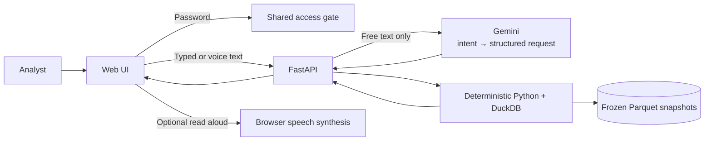

# Airport Investment Intelligence Agent

Built for the Deloitte FDE home assignment: an analyst asks airport-investment screening questions, and the app answers from public aviation data with deterministic calculations, explainable results, follow-ups, and optional voice interaction.

## Demo

**Production:** https://deloitte-airport-analyst.vercel.app  
**Access:** shared password provided separately.

## Assignment coverage

| Question | What the app does | Main data |
|---|---|---|
| Which New England airports are strong terminal-expansion candidates? | Ranks eligible airports with a transparent traffic-pressure score | BTS T-100, FAA |
| How do LAX and SNA compare on congestion? | Compares cancellation, diversion, departure delay, and taxi-out time | BTS On-Time |
| What share of ANC departures are long-haul? | Calculates the share of eligible departures at or above 3,000 miles | BTS T-100 |
| Is there unmet demand at SFO, and why? | Compares passenger growth with seat-supply growth and adds operational delay context | BTS T-100, BTS On-Time, DataSF |

SFO latent demand is **not directly observable** from traffic data. The app says that explicitly instead of inventing a number.

## How it works



**Gemini interprets language; it does not calculate the answer.** All figures, rankings, comparisons, and explanations come from deterministic code over accepted public-data snapshots.

## Key decisions

| Decision | Why |
|---|---|
| Frozen Parquet snapshots + DuckDB | Reproducible results; runtime does not depend on live provider APIs |
| Deterministic calculations | Prevents the model from inventing numbers or SQL |
| One constrained Gemini call | Natural-language flexibility without an agent loop |
| Deterministic overview shortcuts | Obvious “everything / full picture” follow-ups avoid unnecessary model calls |
| No composite LAX/SNA congestion score | Avoids arbitrary weighting and false “winner” claims |
| Signed stateless result context | Follow-ups work on serverless instances without a session database |
| Browser-native voice | Adds the optional voice experience without changing the analytics path |
| Shared password gate | Keeps the recruiter demo private without adding a full user-account system |

## Methodology

| Workflow | Definition |
|---|---|
| New England screen | Mid-rank percentiles for passenger growth (40%), passenger volume (30%), and seat occupancy (30%). It is a screening heuristic, not an ROI model. |
| LAX vs SNA | Four operational indicators shown independently; no composite congestion index. |
| ANC long-haul | Eligible performed passenger-service departures with route distance ≥3,000 miles ÷ all eligible departures. |
| SFO pressure | Passenger-growth % minus seat-growth %, in percentage points. A negative value means seats grew faster than transported passengers. |
| Overall comparison | Compares the key measures valid for both airports; no composite winner is invented. |

Missing airport-years are excluded rather than filled with zero. Different source populations are not combined into unsupported ratios.

## Data

| Source | Use |
|---|---|
| BTS T-100 | passengers, seats, departures, growth, occupancy, long-haul |
| BTS On-Time Performance | cancellations, diversions, delays, taxi-out, delay causes |
| FAA | New England commercial-service cohort and airport coordinates |
| DataSF | SFO enplaned-passenger trend |
| Curated public evidence | terminal-project context, clearly separated from calculated metrics |

Default results compare **CY2024 → CY2025** using the accepted `annual-2025-r1` bundle. Historical 2023 → 2024 data is also supported where the contract allows it.

## Access and voice

- The demo password is checked server-side; the password is never stored in Git or browser storage.
- Authenticated access uses a signed `HttpOnly`, `Secure`, `SameSite=Strict` cookie.
- Speech recognition turns speech into editable text before using the normal chat path. On Send, the composer clears immediately; retryable failures restore the draft for editing.
- “Read aloud” uses browser speech synthesis. Audio is not stored and does not trigger another Gemini call.
- Typing remains the fallback when speech recognition is unavailable.
- The chat starts compact, grows with the conversation, supports manual expand/collapse, and respects reduced-motion preferences.

## Validation

Final RC3 Production release:

- **Backend:** 971 passed, 2 skipped (optional local-data fixtures).
- **Frontend:** 178/178 passed.
- **Model admission:** 108/108, 0 errors, adapter `e58ea32e…`.
- **Conversation reliability:** 40/40 bare two-airport questions; 24/24 overview shortcuts after 2023, with 0 Gemini calls.
- **Production browser QA:** 18/18 desktop, 17/17 phone; 2023 flow 8/8; typed-vs-button 5/5.
- **Assignment checks:** all four brief questions plus follow-ups returned 200; voice passed.
- **Security:** 427 Production log rows scanned with 0 password/API-key hits and 0 provider errors; Preview bypass remains revoked.

See [Validation](docs/VALIDATION.md) for the compact evidence summary.

## Limits

- The app supports screening, not profitability, ROI, capital-cost, or investment-return claims.
- Public traffic data cannot measure passengers who wanted to fly but did not.
- On-Time data covers domestic reporting carriers; T-100 populations differ and are kept separate.
- Results are historical, frozen for reproducibility, and are not forecasts.

## Repository map

```text
README.md
app/
  README.md                 Run, test, configure, deploy
  backend/                  FastAPI, analytics, data, tests
  frontend/                 UI, globe, voice, tests
docs/
  FDE Exam 2.pdf            Original brief
  REQUIREMENTS_TRACEABILITY.md
  ARCHITECTURE.md
  VALIDATION.md
```

Start with [Requirements traceability](docs/REQUIREMENTS_TRACEABILITY.md), then use [Architecture](docs/ARCHITECTURE.md) for the technical design and [app/README.md](app/README.md) to run the project.
