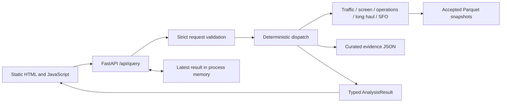

# Local airport analyst: implementation handoff

Status checked against the working tree on 2026-09-27. This describes the implemented local prototype. [ADR 001](adr/001-local-demo.md) records the decision; [API/UI map](../../docs/API_UI_MAP.md) defines the wire contract. Earlier planning text is not evidence that a feature runs.

## Run locally

Run these commands from the repository root with Python **3.11**. The package declares `>=3.11,<3.12`. Use a fresh, unused virtual-environment directory; the example below assumes `.venv` does not already contain an environment you need.

```sh
python3.11 -m venv .venv
source .venv/bin/activate
python -m pip install -r backend/requirements.txt
python -m pip check
```

Runtime dependencies are pinned FastAPI, Pydantic, HTTPX, DuckDB and Uvicorn; pytest is included for checks. The UI needs no bundler or npm installation. Node is needed only for its built-in UI test runner. FAA PDF acquisition additionally requires the external `pdftotext` executable on PATH; Python requirements do not install it.

### Acquire/import accepted data before starting the server

Source commands write under `backend/data/raw/<source>/`; failed acquisition does not replace a previously accepted snapshot. Stop the server before refreshing. Data files are local inputs, not installed by `pip` and not assumed present in a clean checkout.

```sh
PYTHONPATH=backend python -m app.sources.datasf --refresh
PYTHONPATH=backend python -m app.sources.faa --refresh
```

For T-100, obtain the exact qualified official FMG state/year exports first. The importer does **not** contain a download command. Its `EXPECTED_ARCHIVES` tuple in `backend/app/sources/t100.py` defines the 16 filenames, sizes and hashes for AK/CA/CT/MA/ME/NH/RI/VT × 2023/2024, and `FIELDS` defines the full source grain. The official export form is recorded there as `BTS_FORM_URL`. A newly revised export with different bytes is rejected rather than silently accepted; requalification is required. Put the qualified ZIPs in an existing directory, then replace the example path below with that directory:

```sh
PYTHONPATH=backend python -m app.sources.t100 --input-dir /path/to/qualified-t100-zips
```

Acquire and import all twelve CY2024 Reporting Carrier FGJ archives using an operator-chosen archive directory:

```sh
PYTHONPATH=backend python -m app.sources.ontime --input-dir /path/to/ontime-zips --acquire
```

Omit `--acquire` to validate/import archives already present. This command can make substantial downloads. It verifies required archive/schema/population coverage before publishing; it is never invoked by a browser query. No automatic source fallback is provided.

Each source publishes a `current.json` pointer and a snapshot manifest. Analytical readers verify accepted status and Parquet checksums. Snapshot IDs, periods, known source retrieval times and separate import metadata become result provenance. API `retrieved_at` is nullable and means source retrieval time; it is never populated from a local import timestamp. The curated [evidence dataset](../data/evidence.json) is separate from numerical snapshots and is loaded by `backend/app/evidence.py`.

### Launch and use

```sh
python -m uvicorn app.main:app --app-dir backend --host 127.0.0.1 --port 8000
```

Open `http://127.0.0.1:8000/`. `http://127.0.0.1:8000/health` returns `{"status":"ok"}`; it proves backend reachability, not source or model readiness. Use one process/worker, with no hosted deployment implied.

The examples and scope controls submit structured requests. Explain uses the stored result. **Free-text interpretation is disabled:** message requests return `503 ai_unavailable`; setting model configuration alone does not enable a provider. The visible helper states this limitation. A successful conversational/model demonstration remains an unmet assignment requirement.

## Components and request flow



`main.py` owns transport, safe errors and the query deadline; `contracts.py` owns strict request/result schemas; `dispatch.py` owns allowed operations and response projection. `calculations/` contains ordinary Python functions. There is no agent loop, SQL generation, database server, durable queue, or browser access to data providers.

| Route | Behavior |
|---|---|
| `GET /` | Analyst screen |
| `GET /static/app.js` | Static UI behavior; only the static directory is mounted |
| `GET /health` | Liveness response, no provider request |
| `POST /api/query` | Structured analysis, stored explanation, or explicitly unavailable free text |

Success is a bare `AnalysisResult` with `ok` or `partial` status. Failures are non-2xx `ErrorResponse` objects with a safe code/message/request ID. The frontend renders server values, ranks, comparison directions, numerators/denominators, eligible counts, source/evidence details and limitations; it does not recompute percentages. Sources and evidence expand locally without API calls. Errors retain the last displayed result labeled **Previous result**. Duplicate sends are disabled, and input-change generation checks prevent a stale response replacing a newer draft.

### Scope and sessions

- T-100 levels, occupancy and long-haul: supported airports, CY2023 or CY2024. Growth: CY2024 versus CY2023.
- Ranking: the 22-airport New England cohort, by screening score, passenger growth, passengers or occupancy. Display subsets retain the applicable full-cohort ranking/normalization.
- Operations: LAX, SNA and SFO, CY2024 only. SFO trend/pressure bundles: SFO only.
- `explain` requires the displayed `context_result_id`; it reads stored values and leaves the stored result ID/scope unchanged. Fresh independent structured requests omit the reference.

The server issues an opaque `airport_session` cookie (`HttpOnly`, `SameSite=Strict`, path `/`, one-hour maximum age). At most 100 process-local sessions hold one latest successful result each, with a one-hour idle timeout. Restart loses context. Wrong/expired session references return 409; this is a local session boundary, not authenticated multi-user access control. Host/Origin checks restrict requests to the local application; no wildcard CORS is enabled.

One numerical query runs at a time; another receives `409 busy`. The HTTP deadline is 30 seconds. Currently timed-out thread work is allowed to finish while the busy slot remains held; its late result is not saved. This is **not** a claim of immediate database cancellation. No durable jobs, automatic retries or exactly-once replay are provided. `settings.py` validates bounded settings without loading dotenv files; the HTTP deadline is currently a constant in `main.py`, not dynamically wired to every settings override.

## Numerical definitions

| Calculation | Implemented definition and missing-data rule |
|---|---|
| T-100 annual levels | Sum origin passengers, seats and **performed** departures after importer filtering (`CLASS` A/C/E/F, positive seats). Exact duplicate source rows collapse; conflicting measures fail import. An airport-year missing a month is unavailable, not zero. |
| Occupancy | `100 × passengers / seats`; positive seat denominator required. This is aggregate seat occupancy, not a terminal-capacity measure. |
| Passenger growth | `100 × (P2024 − P2023) / P2023`; a zero/missing baseline is unavailable. No small-base floor is applied in this implementation. |
| Screening score | Eligible airports need complete years, valid nonnegative passenger/seat counts, positive 2023 passengers and positive 2024 seats. For each growth, 2024 volume and occupancy component, percentile is `(average ascending rank − 1)/(n − 1)`. Score is `100 × (0.40 growth percentile + 0.30 volume percentile + 0.30 occupancy percentile)`. Fewer than two eligible airports gives insufficient data. Equal values use average rank; final ranks use competition ranking with airport-code display tie-breaks. |
| Long-haul share | `100 × performed departures on rows with distance >= threshold / all performed departures`. Default threshold is 3,000 statute miles; HTTP contract requires `0 < threshold <= 12000`. Missing/invalid distance on a positive-departure row makes the share insufficient; zero total is unavailable. No point estimate is substituted. |
| Cancellation/diversion | `100 × flagged rows / valid scheduled-flight rows`, separately at each origin. Valid rows have binary flags and `flights=1`. Only CY2024 domestic reporting-carrier coverage is represented. |
| Departure delay/taxi out | Independent averages of non-null `DepDelayMinutes` and `TaxiOut` among noncancelled, nondiverted flights. Early departure delay is zero, not signed `DepDelay`. Each field retains its observed denominator and eligible count; zero observed denominator is unavailable. |
| Comparison | Compare raw values; round display only. Higher means greater observed strain for all four operational indicators. Report per-indicator direction and a descriptive summary; split directions give a mixed picture. No overall congestion index or causal claim follows. |
| DataSF SFO trend | Enplaned only; require all 24 months × Domestic/International cells before summing to a combined monthly series. Annual growth uses the same population. Never add Deplaned or Thru/Transit to enplanements. |
| SFO pressure proxy | T-100 passenger-growth percentage minus T-100 seat-growth percentage, in **percentage points**, using matched 2023/24 origin populations and positive baselines. DataSF trends remain separate. The gap is not unmet flights or latent demand. |

The screen's real-data path batches all 22 airports: one snapshot validation and one grouped DuckDB read, then the same exact-count/coverage calculations. Pure supplied-result screening remains available for tests.

## Observed data and evidence limits

The following are local accepted-manifest observations on 2026-09-27, not a fresh upstream acquisition. Clean-environment setup verification is recorded separately below.

| Source | Accepted local scope |
|---|---|
| DataSF | 3,721 raw CY2023/24 SFO rows; calculation selects Enplaned and validates the 48 required month/geography cells. Snapshot ID begins `datasf-28fd4041`. |
| FAA | Accepted CY2024 commercial-service cohort snapshot, ID begins `faa-3aed36dd`. Current adapter parses the official PDF with `pdftotext`; earlier XLSX research is not the adapter. |
| T-100 | CY2023/24, 26 origins: 22 New England airports plus ANC/LAX/SFO/SNA. Snapshot ID begins `t100-09666a46`. PVC lacks December 2024 and is excluded from the complete-year screen; missingness is not imputed. |
| On-time | All twelve CY2024 months for LAX/SFO/SNA, 372,550 rows. Snapshot ID begins `ontime-c224389c`. Carrier lists differ by airport and are disclosed; this is not all-airline/international coverage. |

Full IDs and hashes remain in the local manifests and returned provenance. FAA/BTS historical bulk data are deliberately downloaded inputs; the actual analytical public API is DataSF. Rows from different populations are not joined to manufacture a common denominator.

Evidence is a bounded review of selected candidates, not a current capacity survey of every airport. Historical plans, completed expansions and forecast assumptions do not establish an unresolved terminal bottleneck. Returned evidence states uncertainty and counterevidence, with source/date/locator; no unreviewed airport is labeled unattractive. Neither traffic pressure nor this prototype identifies project capex, attributable investor cash flows, ROI/NPV, or causal unmet demand. Recommendations remain conditional diligence/watchlist statements.

## Verification and remaining proof

Run from the root after setup:

```sh
PYTHONPATH=backend python -m pytest backend/tests -q
node --test backend/tests/ui.test.cjs
node --check backend/app/static/app.js
```

Some source timeout tests bind an ephemeral loopback server; an environment prohibiting sockets cannot pass those tests. Python tests can exercise installed snapshots when present; fixture tests alone do not prove acquisition or end-to-end browser behavior. The Node suite uses a minimal DOM and is explicitly **not** a real-browser accessibility/keyboard/responsive audit.

Optional existing developer tooling, not installed by requirements:

```sh
ruff check backend --ignore EXE002,SIM905 --output-format concise
```

`EXE002` is excluded for the external volume's executable file modes. Preserve source/test findings outside those declared exclusions. Verification against the current local tree: **212 backend tests passed** (one Starlette deprecation warning), `ruff check backend --ignore EXE002,SIM905` passed, `node --test backend/tests/ui.test.cjs` passed **8/8**, `node --check backend/app/static/app.js` passed, and `git diff --check` passed. Clean-environment verification used Python 3.11 at `/private/tmp/deloitte-clean-final-20260927`: pinned `backend/requirements.txt` installed successfully, `pip check` reported no broken requirements, and the full backend suite passed all 212 tests (one Starlette deprecation warning). Accepted source snapshots are local. No model/provider call was made.

Live browser checks against the current local app verified the 2023 passenger-only ranking response and full-cohort ranks, including PVC at 7,535 passengers, rank 19. A PVC-only 2024 passenger-rank request returned safe `422 insufficient_data` and retained the previous result. The separate complete-year screen excludes PVC because December 2024 is missing. Raw-growth results were HYA 48.12% rank 1, HVN 20.15% rank 2, and PVD 14.55% rank 3. Earlier flows also exercised the SFO pressure bundle, operations comparison, ANC long-haul result, safe unavailable-model response with previous-result retention, evidence details, a 390×844 viewport, and visible keyboard focus. These were interactive local checks; no screenshot artifact is retained and they do not constitute a formal accessibility certification or independent review.

The final lead-architect review returned **APPROVED** after disposition of three findings. Native PlanGraph validation and independent review runners remain unverified; this architecture review is not evidence of either.
