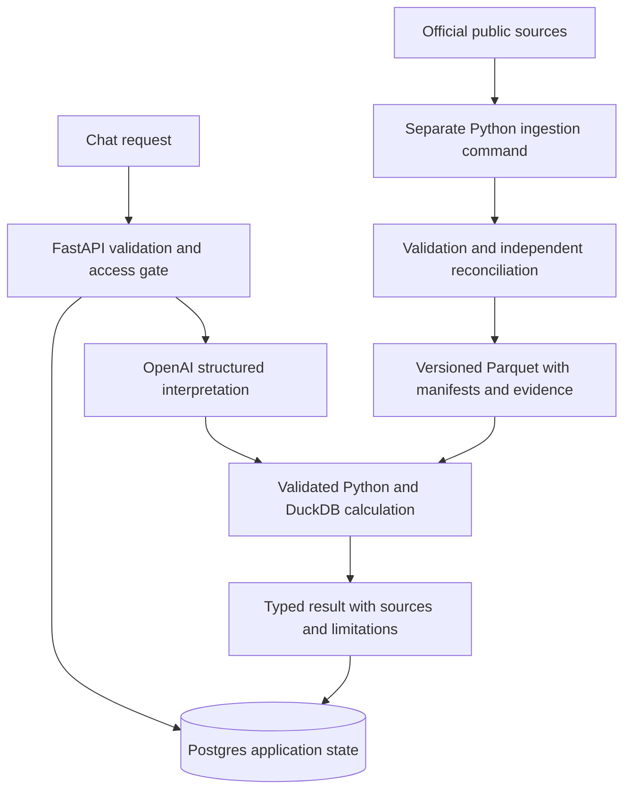

# Backend completion plan — small hosted assignment prototype

> **SUPERSEDED IN PART (2026-09-29).** This is a historical plan. The current design is described in [docs/DESIGN.md](../../../docs/DESIGN.md) and the code. The following parts of this plan are superseded and were **not** built:
>
> - **Postgres application state.** Replaced by a stateless, HMAC-signed `airport_context` cookie. The server recomputes the referenced result and checks its digest.
> - **The $2 spend cap and budget ledger.** The process-local budget was removed, along with the `budget_exhausted` error. Spend is now bounded by per-call caps and by a hard monthly budget on the OpenAI project.
> - **Database-backed throttles.** Replaced by a per-instance limit, `MAX_CONCURRENT_QUERIES`.
> - **The shared access code, login and authorization session.** Removed by owner decision; there is no login.
>
> The source-qualification, bundle and model-admission sections still describe the implemented approach, except where they refer to the items above.

Date: 2026-09-27. Revision: 5. Delivery type for this document: **DESIGN ONLY**.
Review status: determined by the matching document hash in [review receipt](../evidence/backend-completion-plan-review.md); until all three verdicts exist, review is incomplete. Implementation, provider evaluation and deployment are not completed by approving this plan.

## 1. Goal, boundaries and current facts

Deliver the four airport-analysis workflows through the existing FastAPI endpoint, using qualified recent data, reproducible Python calculations, a small hosted OpenAI model for natural-language interpretation, useful follow-ups and explicit business limitations. Complete backend acceptance before frontend integration or deployment acceptance is claimed.

This is the authoritative execution order for the remaining backend work. It supersedes the phase ordering in [recent-data-expansion](2026-09-27-recent-data-expansion.md) and README section 12's undecided storage choice. The source facts and immutable bundle contract in that earlier specification remain normative unless explicitly refined below. Updating this document does not change any running configuration.

- Existing: four historical structured workflows; direct Responses API adapter; offline model evaluation; process-local sessions/budget; staged source qualification and bundle code. The last reported full suite had 338 backend tests; that is historical evidence, not a test of this plan or a completed 2025 backend.
- Known defect: bundle validation permits an AIP reference year inconsistent with its manifest fiscal year. Correct it first.
- Missing: accepted 2025 runtime bundle, all consumers generalized to 2025, freshness producer/consumers, real model admission, hosted shared state and access control.
- Current historical artifact content is 5,252,780 bytes, including 4,838,740 Parquet bytes. This excludes future recent artifacts and runtime dependencies; it is not a Vercel package measurement.
- Preserve dirty/staged work. The parallel session owns frontend implementation, `backend/app/static/` and `docs/frontend/`. Backend interface changes receive a written handoff; no frontend edits in this workstream.
- No local model, LangChain, LangGraph, vector database, queue, agent framework, second cache service or general financial forecasting system. No automatic daily bulk downloads. No cloud provisioning, paid call, push or deployment occurs during this planning task.

## 2. Chosen architecture

Presets bypass OpenAI. Explain reads the saved result. Free text uses at most one provider call, followed by deterministic validation/calculation/summary. Model output cannot supply SQL, URLs, credentials, authoritative numbers, citations or session identity. The model receives only the question, supported scope and bounded validated previous analysis.

### Decision record: storage and runtime

Use one managed Postgres for expiring sessions, latest result/request, usage reservations, rate counters, concurrency leases and source-check receipts. Keep aviation rows in packaged Parquet queried read-only with DuckDB. Local memory stores remain explicit local/test adapters; hosted mode must fail closed without shared state. Local writable SQLite is not the hosted persistence solution. Supabase could supply Postgres, but its additional products are unnecessary; select a minimal managed Postgres connection at provisioning time. No second storage service is required for the initial small package.

Use psycopg with parameterized SQL, TLS verification for managed connections, a small per-instance connection bound and the managed pooled endpoint. Pin a Python-3.12-compatible version during 5.1; no ORM. AIP parsing uses bounded standard-library ZIP/XML processing, so no workbook package is required. Prefer the existing HTTPX OpenAI adapter. Candidate model: `gpt-5.4-mini-2026-03-17`, subject to current availability/prices and frozen evaluation before enablement. No automatic fallback to a different model.

Decider: CEO; implementers: data-engineer (data/state), devsecops-agent (access/budget/API admission); reviewer: lead-architect. Consumers are this plan, README, backend architecture documentation and the backend-to-frontend contract handoff. No global Agent OS files change.

Official references, checked 2026-09-27: [Vercel Python](https://vercel.com/docs/functions/runtimes/python), [runtime filesystem](https://vercel.com/docs/functions/runtimes), [storage choices](https://vercel.com/docs/storage), [cron behavior](https://vercel.com/docs/cron-jobs/manage-cron-jobs), [OpenAI candidate](https://developers.openai.com/api/docs/models/gpt-5.4-mini). Python 3.12+ compatibility must replace the current 3.11-only pin. Measure the actual standard Python package against the documented 500 MB limit, plus cold-start latency and peak memory, before claiming hosting feasibility.

## 3. Contracts that the steps must preserve

### Data, periods and evidence

- Keep `SnapshotRef` and `BundleContext` from the earlier spec. Verify paths/hashes before use. AIP must satisfy both `years == (comparison_year,)` and `fiscal_year == comparison_year`.
- Candidate ingestion never moves legacy `current.json` pointers. Candidate calculator access is internal only. Production resolves an accepted bundle exactly once; all nested calculators/evidence readers receive it. Integrity failure never selects another bundle silently.
- Explicit 2023/2024 without bundle ID selects historical-2024; explicit 2025 selects the accepted recent bundle; omitted year selects the accepted default. Recent bundle baseline 2024 requires its explicit bundle ID. Reject unsupported workflow/year combinations even when a source happens to contain that year. Store the resolved year/bundle in result context.
- Historical screening/growth use 2023→2024; recent screening/growth use 2024→2025. A request to move a regional screen back to 2023 is unsupported because 2022/cohort inputs are unqualified. Explain preserves stored facts even after the default changes.
- Annual comparisons require complete eligible coverage. Distinguish acquisition failure from complete acquisition with no eligible records. Do not impute PVC's missing eligible months as zero. Historical cohort has 22 airports; preliminary recent FAA cohort has 23 including EWB; recent assessable screen has 22 excluding PVC.
- Screening: existing 40/30/30 weights, full eligible reference-cohort percentiles, passenger growth and **seat occupancy**, no inferred profitability. Competition rank is `1 + count(strictly higher unrounded scores)`; tied BGR/PWM scores have rank 2/2, ordered by airport ID. Fewer than two assessable airports gives no comparative score.
- Operations: origin departures, BTS reporting carriers, noncancelled/nondiverted eligible rows for delay/taxi means, per-metric nonnull denominators; `DepDelayMinutes` clamps early departures. Cancellation/diversion denominators use their declared full scoped population.
- ANC uses performed departures. If total departures D>0, known long-haul L and unknown-distance departures U produce bounds L/D to (L+U)/D, multiplied by 100; never silently drop U. D=0 yields null with reason. Preserve the existing threshold bounds/default.
- SFO DataSF enplanements, T-100 passenger/seat growth and FGJ operational populations stay separately labeled. Unsupported quantitative unmet demand, profit and ROI return explicit limitations, not invented values.
- Revalidate terminal evidence against completed/superseding projects. HVN planning deficit is not proof of current operational constraint; BGR/PWM/SFO may remain unassessable. AIP awards are fiscal funding context, not completion, capacity need or ROI. Evidence binds to exact source identities, without circular bundle hashes.

### Refresh and failure behavior

An explicit Python command downloads required source partitions, checks headers, ZIP integrity, counts, raw-key conflicts, periods and coverage, then writes immutable candidates. Metadata preserves exact requests, retrieval UTC, publication status, archive hash and extracted-content hash. Existing qualification files are inputs, never a substitute for application admission. Persist necessary receipts/reference totals under repository evidence paths so `/tmp` loss cannot invalidate reproduction.

Before the demo run a successful official source/revision check. Receipt freshness is at most seven days, bound to exact bundle/source identities. A mere HTTP 200, recent retrieval timestamp or unchanged latest-year label cannot prove no selected-period revision. Where metadata cannot establish revision status, compare selected-period content or return inconclusive. Unchanged extracted CSV with changed ZIP packaging is not a data revision. A newer partial year is disclosed; a newer complete comparable period or selected-period revision blocks current-data admission until refreshed. A failed refresh leaves previous historical presets usable with accurate dates, never relabeled current. No upstream data downloads occur during a user query.

Optional daily release checking is deferred; it is not required for prototype acceptance. Packaged data updates initially require a validated new release and later redeployment. Shared receipts are written atomically only after successful checks. `source_check.py` owns a pure strict payload validator; filesystem input is an offline adapter, while hosted callers load the exact bundle receipt from `state_db.py`. The producer/repository owns writes. Hosted missing/stale/corrupt DB receipts never fall back to a file. No public refresh endpoint.

### Shared state and cost

Use database UTC timestamps, hashed opaque session tokens, one-hour idle expiry and eight-hour absolute expiry. Store only the latest validated request/result, not raw conversation history. Cross-session references and stale result IDs fail. Session/result writes are transactional and conditional on the expected current result/request ownership; errors or late work cannot overwrite a newer success.

Reserve worst-case spend in one transaction before the provider call. Preserve the $0.02/request ceiling and use a **$2 deployment-wide demo cap**, shared by HTTP and live evaluator; restarting a process or redeploying cannot reset it. Record exact model, admitted adapter hash and verified rates. Settling a reservation is idempotent by server-generated attempt ID. A timeout, lost usage or uncertain provider outcome conservatively consumes the reservation. No automatic provider retry. Missing DB/invalid rates means zero paid calls.

One active query per session with a database lease; bound overall concurrent paid calls. Lease expiry recovers crashed instances, but an expired worker may not publish a result or release another worker's lease. Keep short DB transactions outside model waits. The HTTP path must consume the validated query_timeout_seconds setting (maximum30s), measured as one absolute request deadline including validation/DB/provider/calculation; model timeout at most 20 seconds. Hosted free-text requests require a UUID `Idempotency-Key` header. Scope it to the authenticated session plus canonical payload hash (including context_result_id); it never replaces the server request ID. Same key/same payload returns its stored safe response with zero provider calls; same key/different payload or pending work returns 409. Store the terminal error after an uncertain call; that key cannot call the provider again. Replay cannot mutate latest context. New user-initiated attempts use new keys. This guarantees at-most-one application dispatch per admitted key, not exactly-once provider execution. Keep pending/terminal attempt records for24h from creation. Replay additionally requires the original still-authenticated session; expiry/revocation makes retained records inaccessible.

### Final hosted access boundary

Implement after the deterministic backend works: a generated high-entropy shared access code (at least128 random bits), constant-time verifier comparison, expiring opaque authorized session, logout and code-version revocation. Do not accept a short human password under this verifier design. Hosted cookie name is `__Host-airport_session`, with Path=/, no Domain and HttpOnly/Secure/SameSite=Strict; permit only configured exact host/origin combinations. Enforce access before every query/explain/provider action. Proposed endpoints: POST /api/access with bounded JSON `{code}`, POST /api/logout with no sensitive payload; both exact-origin checked. Login succeeds with204 plus cookie; invalid code401, rate limit429, unavailable state503. Logout revokes the current session then clears the cookie with204 (already absent is204). Query unauthenticated401; denied access403 where applicable; all errors keep the established error envelope. Update ErrorCode explicitly before route wiring. Protect query/explain and any source/result endpoint; hosted OpenAPI/docs are disabled, UI shell/static may load but contain no analytical results or secrets; public health exposes no configuration. Return sanitized JSON errors with a server request ID. Secrets are runtime configuration, never browser values or logs. Persist/log only request IDs, safe outcome, model identity, token usage, cost and latency alongside validated result context; never raw user questions, cookies, access codes, DSNs, model keys or raw provider payloads. Public/synthetic frozen evaluation fixtures are the explicit exception for question text. Provider requests retain `store:false`. Tests capture DB/log/error outputs to verify these exclusions. Preserve the explicit loopback-only local mode for local testing.

## 4. Execution convention

Eight milestones below group small actions; groups are not atomic dispatches. Each row is one action owned by the named role, with no more than the listed two files and a 150 changed-code-line ceiling. The check column is the required proof, not permission to mark unimplemented assertions passed. If an action exceeds the bound, split it before editing while retaining its acceptance criterion. Artifact generation is a separate action from importer code. Every code action adds its focused positive/negative regression in its paired test file; new tests may initially fail.

All paths below are relative to `backend/` except explicit `../` paths. `D` = data-engineer; `S` = devsecops-agent; `C` = CEO documentation; `A` = lead-architect read-only review. Code actions default to RECOMMEND; documentation and read-only reviews are DRAFT. Provisioning, sensitive reads and paid execution are separate action-time authorization boundaries; reuse explicit session authorization when applicable. No production migration/deploy is embedded in a code action.

`T(name)` means `PYTHONPATH=backend python -m pytest backend/tests/test_<name>.py -q` from repository root using the pinned environment. Each row's rejection condition is failure of its stated check, including absent prerequisites. A test passing before the required assertion is added does not satisfy a row. Added modules/test paths are proposed deliverables, not claims that they exist now.

At every milestone boundary: run `PYTHONPATH=backend python -m pytest backend/tests -q`, `ruff check backend --ignore EXE002,SIM905 --output-format concise`, relevant JSON validation and `git diff --check`; reconcile relevant real source totals; obtain the relevant specialist review. Record exact revision plus dirty diff/artifact hashes, commands/counts and exclusions. No frontend tests/edits owned here. Only a passed coherent milestone is eligible for a later authorized commit; never stage another session's work. Tests requiring PostgreSQL use a disposable test database, never production. Network/model test doubles remain labeled as such.

### M1 — Repair the immutable source foundation

| ID | Owner | Files | Depends | Single outcome / focused proof |
|---|---|---|---|---|
| 1.1 | D | app/sources/bundle.py; tests/test_bundle.py | none | Reject contradictory AIP years; T(bundle) includes matching/mismatched fiscal cases. |
| 1.2 | C | docs/evidence/recent-source-qualification-20260927.json | 1.1 | Durable acquisition metadata identifies every qualified source partition; JSON parse plus inventory matches source receipts. |
| 1.3 | D | app/sources/t100.py; tests/test_t100.py | 1.1 | Verify CSV content hashes/retrieval/request identity for recent archive specifications; T(t100). |
| 1.4 | D | app/sources/ontime.py; tests/test_ontime.py | 1.1 | Stage all twelve 2025 monthly archives without changing accepted pointers; T(ontime) covers incomplete/duplicate/corrupt inputs. |
| 1.5 | D | app/sources/faa.py; tests/test_faa.py | 1.1 | Parse the preliminary 2025 23-airport cohort with year-correct fields; T(faa) preserves historical cohort. |
| 1.6 | D | app/sources/aip.py; tests/test_aip.py | 1.1 | Parse FY2025 award records using verified grant identity/component sums; T(aip) covers malformed fiscal scope. |
| 1.7 | D | app/sources/aip.py; tests/test_aip.py | 1.6 | Publish an immutable AIP snapshot manifest accepted by BundleContext; T(aip) covers hash corruption. |

Existing DataSF year generalization is reused after focused verification, not rewritten. AIP XLSX parsing bounds ZIP expanded sizes, member paths, XML bytes, required sheet/header identity and record count; reject malformed/duplicate awards.

### M2 — Produce recent candidates

Each generated artifact action writes one data file plus its manifest in a new immutable snapshot directory; never overwrite an existing ID. Raw archives are acquisition inputs outside the serving package. Record paths/hashes in the evidence inventory after generation; source units below are independent after M1.

| ID | Owner | Files | Depends | Single outcome / focused proof |
|---|---|---|---|---|
| 2.1 | D | data/raw/datasf/<new-id>/data.parquet; manifest.json | M1 | Real Python DataSF acquisition produces the qualified 2024/25 snapshot; 4,075 rows, 48 Enplaned cells, hashes verified. |
| 2.2 | D | data/raw/t100/<new-id>/data.parquet; manifest.json | M1 | Real qualified state archives produce the paired T-100 snapshot; no conflicting raw keys, EWB/PVC coverage reconciled. |
| 2.3 | D | data/raw/ontime/<new-id>/data.parquet; manifest.json | M1 | Twelve qualified 2025 archives produce 398,824 scoped flights; source total 7,001,619, no identity conflicts. |
| 2.4 | D | data/raw/faa/<new-id>/source.pdf; manifest.json | M1 | Qualified FAA PDF yields exactly the preliminary 23-airport cohort. |
| 2.5 | D | data/raw/aip/<new-id>/source.xlsx; manifest.json | M1 | Qualified AIP workbook retains all 3,707 grants with New England 66 awards/$259,112,386. |
| 2.6 | C | docs/evidence/recent-candidate-inventory.json | 2.1–2.5 | Every candidate is reproducible from durable official requests/hashes without requiring surviving temporary files. |
| 2.7 | D | data/bundles/annual-2025-r1/manifest.json | 2.6 | Internal candidate context references all five source artifacts for numeric testing; private candidate loader succeeds without accepting the bundle. |

If re-acquisition bytes differ from the qualified content, requalify the change; do not force old counts onto a revised release. Run existing or newly added importer entrypoints recorded in each manifest; CLI interfaces are frozen in the verification appendix below; source actions implement their missing flags before artifact generation.

### M3 — Connect recent calculations

| ID | Owner | Files | Depends | Single outcome / focused proof |
|---|---|---|---|---|
| 3.1 | D | app/calculations/traffic.py; tests/test_traffic.py | M2 | Traffic calculations read supplied bundle periods/paths; T(traffic) proves historical parity. |
| 3.2 | D | app/calculations/long_haul.py; tests/test_long_haul.py | 3.1 | ANC uses bundle-bound performed departures; T(long_haul) proves threshold, missing-distance bounds, zero outcome. |
| 3.3 | D | app/calculations/screen.py; tests/test_screen.py | 3.1 | Screening uses the selected complete reference cohort; T(screen) covers PVC exclusion, EWB, competition ties, fewer than two. |
| 3.4 | D | app/calculations/operations.py; tests/test_operations.py | M2 | Operations use the selected bundle year/population; T(operations) proves independent eligible denominators. |
| 3.5 | D | app/calculations/sfo.py; tests/test_sfo.py | 3.1,3.4 | SFO reads the selected year pair across separate source populations; T(sfo) covers all required monthly cells. |
| 3.6 | D | app/calculations/comparison.py; tests/test_comparison.py | 3.1–3.5 | Comparisons preserve the recent matched-population contract; T(comparison). |
| 3.7 | D | scripts/reconcile_recent.py; tests/test_reconcile_recent.py | M2,3.1–3.6 | Independent expected values detect deliberately changed app arithmetic; test_reconcile_recent passes. |
| 3.8 | C | docs/evidence/recent-arithmetic-reference.json; docs/evidence/recent-reconciliation.md | 3.7 | Preliminary raw-source reconciliation records four-workflow agreement plus historical parity; reference generator must not import app calculators. |

The existing independently calculated temporary reference is an input to 3.7/3.8; correct its BGR/PWM ordinal-rank presentation to competition rank while preserving raw totals. Key controls: ANC 999/36,040 at 3,000 miles; DataSF enplaned 26,054,586→27,250,806; HVN/BGR/PWM score order with BGR/PWM tie. Full numerator/denominator/monthly reference comparisons are required, not only these spot checks.

### M4 — Accept the complete recent API workflow

| ID | Owner | Files | Depends | Single outcome / focused proof |
|---|---|---|---|---|
| 4.1 | D | app/contracts.py; tests/test_contracts.py | M1 | Request schema accepts optional bundle/year with server resolution; T(contracts) rejects invalid combinations. |
| 4.2 | D | app/contracts.py; tests/test_contracts.py | 4.1 | Response schema represents recent bundle scope plus typed ANC uncertainty; T(contracts) validates lower/upper percent bounds, unknown_distance_departures and count consistency. |
| 4.3 | D | app/evidence.py; tests/test_evidence.py | M2 | Evidence schema binds recent cohort notes/AIP context to exact source identities; T(evidence) rejects mismatches. |
| 4.4 | C | data/evidence_2025.json | 4.3,3.8 | Reviewed HVN/BGR/PWM/SFO evidence satisfies the current-constraint contract; validate through evidence loader. |
| 4.5 | D | app/dispatch.py; tests/test_api.py | 4.1–4.4,M3 | Dispatcher serializes one bundle-bound result; T(api) rejects fallback and checks ANC known-only, unknown-distance bounds, zero-D and invalid-count cases. |
| 4.6 | D | app/dispatch.py; tests/test_api.py | 4.5 | All year indexing/default summaries use the resolved pair; T(api) covers historical/recent/baseline/unsupported periods. |
| 4.7 | D | data/bundles/annual-2025-r1/manifest.json | 4.4–4.6 | Final candidate manifest binds the completed evidence hash; full candidate validation succeeds without promotion. |
| 4.8 | D | scripts/check_source_status.py; tests/test_check_source_status.py | 4.7 | Selected-period official checks produce an admitted receipt only on conclusive success; T(check_source_status) rejects superficial latest-year/HTTP-only checks. |
| 4.8a | D | app/sources/source_check.py; tests/test_source_check.py | 4.8 | Strict receipt payload validation accepts either an offline file adapter or an exact DB payload without filesystem assumptions; T(source_check) covers equivalent acceptance/rejection. |
| 4.9 | D | scripts/accept_bundle.py; tests/test_accept_bundle.py | 4.8a,3.7 | Sole promotion coordinator requires four-workflow freshness plus code-bound reconciliation; T(accept_bundle) proves byte-identical registry after every injected failure. |
| 4.10 | D | docs/evidence/recent-source-admission.json; docs/evidence/recent-reconciliation.json | 4.9 | Re-run checks against the frozen final manifest to produce fresh exact-hash receipts; no application calculator is used to generate reference values. |
| 4.11 | D | data/bundles/accepted.json | 4.10 | Coordinator atomically accepts the verified recent bundle; real four-workflow dispatch succeeds with exact lineage. |
| 4.12 | C | docs/evidence/backend-api-handoff.md | 4.11 | Frontend handoff specifies the complete backend delta with real examples. |

Promotion uses the coordinator above, never a hand-edited pointer. The lower-level promotion helper must not be an alternate public CLI path bypassing admission. Reconciliation receipts bind final manifest/source hashes, all calculation/dispatch/contracts/evidence module hashes, independent reference generator hash and reference-data hash. The coordinator recomputes these before atomic promotion; any dirty edit invalidates the receipt. Source facts are not invalidated merely by unrelated frontend edits. Candidate manifest may be finalized while unaccepted; acceptance freezes its bytes under that ID. Evidence lists bundle ID plus source hashes; external admission/reconciliation receipts bind final manifest hash so no evidence-manifest cycle arises. Human-readable immutable bundle IDs avoid evidence-hash cycles. The owned T(api) regression in4.6 saves a historical result, promotes a recent test bundle, then explains the saved result with zero source reload/model calls; verify unchanged metrics/provenance/evidence.

### M5 — Add the one shared application-state store

| ID | Owner | Files | Depends | Single outcome / focused proof |
|---|---|---|---|---|
| 5.1 | D | pyproject.toml; requirements.txt | M4 | Pinned Python3.12 environment installs runtime plus verified Postgres dependency; clean install/full backend suite passes. |
| 5.2 | D | sql/001_app_state.sql; tests/test_state_schema.py | 5.1 | Minimal additive schema satisfies the four-table state contract; disposable Postgres schema test passes. |
| 5.2a | D | scripts/apply_schema.py; tests/test_state_schema.py | 5.2 | Transactional versioned schema application satisfies the exclusive/repeat-safe contract; T(state_schema) checks advisory lock, checksum/version, repeat no-op, rollback on failure and scanned offline preview handling. |
| 5.3 | D | app/state_db.py; tests/test_state_db.py | 5.2a | Parameterized bounded connections fail safely on DB outage; T(state_db). |
| 5.4 | D | app/session.py; tests/test_sessions.py | 5.3 | Shared session adapter preserves expiry/isolation/latest-result contract; T(sessions) with two DB clients. |
| 5.5 | D | app/session.py; tests/test_sessions.py | 5.4 | Lease ownership prevents late or concurrent state overwrite; T(sessions) covers worker death/expiry/old-owner release. |
| 5.6 | S | app/model_budget.py; tests/test_model_budget.py | 5.3 | Two clients cannot overspend the shared cap; T(model_budget) proves atomic reservation. |
| 5.7 | S | app/model_budget.py; tests/test_model_budget.py | 5.6 | Repeated settlement cannot refund twice; T(model_budget) covers unknown usage/crash/restart/cap persistence. |
| 5.7a | S | app/query_attempts.py; tests/test_query_attempts.py | 5.3 | Atomic key acquisition deduplicates requests across clients; T(query_attempts) covers key conflicts and pending attempts. |
| 5.7b | S | app/query_attempts.py; tests/test_query_attempts.py | 5.7a | Terminal attempt replay produces no second charge or context update; T(query_attempts) covers timeout, crashes and ownership. |
| 5.8 | S | app/settings.py; tests/test_settings.py | 5.3 | Typed hosted settings fail closed for missing DSN/code/version/origin; T(settings) checks SecretStr redaction, exact host/origin, configured local mode and startup validation. |
| 5.9 | S | app/main.py; tests/test_api.py | 5.5,5.7,5.7b,5.8 | HTTP requests consume shared session/budget implementations; T(api) proves two-instance behavior. |

The schema applier runs inside one Postgres transaction under an advisory lock, verifies SQL checksum/version in schema history and never runs automatically in request handlers or instance startup. Reapplication of the same version/hash is a no-op; changed hash or unknown schema version fails. Failure rolls back the whole transaction. Successful production migration rollback is by retaining the previous compatible application; no destructive downgrade. Schema creation runs only against a disposable local/test DB at this milestone. Managed DB provisioning is deferred. Use a single versioned SQL migration, a schema-history metadata table and four small application tables: sessions (latest result/request, version, lease), query_attempts (idempotency/reservations/terminal response), control_state (durable demo budget, receipt per accepted bundle), rate_buckets (fixed UTC windows). Bound active sessions100; store at most1000 attempts per24h; refuse safely at capacity. Lease60s, max2 concurrent paid attempts globally, 6queries/min/session and60/min/global, 10login attempts/min/global. Every429 includes Retry-After. Never trust an arbitrary forwarded-IP header as limiter identity. Cleanup expired session/attempt/rate records in bounded batches; never delete/reset the deployment budget or silently evict live attempts. Keep current receipt per accepted bundle; supported bundle inventory is bounded. These are configurable downward; increasing the $2cap requires explicit authorization.

### M6 — Wire source freshness and real model interpretation

| ID | Owner | Files | Depends | Single outcome / focused proof |
|---|---|---|---|---|
| 6.1 | D | app/state_db.py; tests/test_state_db.py | M4,M5 | Receipt repository atomically persists exact-bundle payloads; T(state_db) covers missing/corrupt records with no filesystem fallback. |
| 6.2 | D | scripts/check_source_status.py; tests/test_check_source_status.py | 6.1 | Producer validates successful checks before atomic DB publication; T(check_source_status) proves failed checks cannot advance timestamps. |
| 6.3 | S | app/main.py; tests/test_api.py | 6.2 | Free-text preflight rejects unready supported data before spending/provider work; T(api) asserts zero provider calls on every denial. |
| 6.4 | D | app/model_adapter.py; tests/test_model_adapter.py | M4 | Model input/schema carry supported bundle/period/default semantics; T(model_adapter) includes assignment language and malicious instructions. |
| 6.5 | D | app/intent.py; tests/test_intent.py | 6.4 | Deterministic parsing preserves concrete recent/historical follow-up scope; T(intent) rejects unqualified prior years. |
| 6.6 | C | tests/fixtures/intent_eval_2025.json | 6.4,6.5 | Frozen corpus satisfies the declared evaluation coverage matrix; JSON/schema validation passes. |
| 6.7 | S | scripts/eval_intents.py; tests/test_eval_intents.py | 6.2,6.6,5.7 | Live evaluator enforces the same freshness/shared-budget admission as HTTP; T(eval_intents) asserts zero paid calls when denied. |
| 6.8 | S | app/main.py; tests/test_api.py | 6.3–6.7 | Follow-ups/explain consume session-bound concrete scope with one-call maximum; T(api) covers preserved prior success on failures. |

Pre-model preflight conservatively checks all four enabled default demo workflows because intent is not yet known; post-interpretation validate the actually resolved bundle/workflow too, including historical context. Structured presets require artifact integrity/scope; explicit historical presets remain usable without a current-data freshness claim. Explain requires session ownership but no source refresh or model call.

### M7 — Finish the backend hosted boundary

| ID | Owner | Files | Depends | Single outcome / focused proof |
|---|---|---|---|---|
| 7.1 | S | app/access.py; tests/test_access.py | M5 | Shared access-code verification issues an expiring opaque authorized session; T(access) tests invalid/missing code and code rotation. |
| 7.2 | S | app/access.py; tests/test_access.py | 7.1 | Shared attempt/query throttles deny overflow without spending; T(access) proves concurrent counters. |
| 7.2a | S | app/contracts.py; tests/test_contracts.py | 7.2 | Typed contract declares access/idempotency/rate-limit errors; T(contracts) verifies the common error envelope. |
| 7.3 | S | app/main.py; tests/test_api.py | 7.2a | Hosted access routes support login/logout before protected queries; T(api) proves unauthorized presets/explain/free-text denial. |
| 7.4 | S | app/main.py; tests/test_api.py | 7.3 | Hosted origin policy permits cookie issuance only after successful access verification; T(api) covers validated refresh, zero issuance/refresh on denial, exact-attribute logout/expiry clearing and proxy/foreign/null origins. |
| 7.5 | S | app/main.py; tests/test_api.py | 7.4,M6 | Cancelled/timed-out requests cannot publish a late result; T(api) proves lease/budget cleanup and safe errors. |
| 7.6 | C | docs/evidence/backend-api-handoff.md | 7.5 | Contract delta specifies access endpoints/cookies/statuses with examples for the frontend owner; no frontend implementation implied. |

Access-code secret configuration and cloud deployment remain deferred; backend boundary tests use nonsecret synthetic values. No permanent user accounts/password-reset system. Hosted admission failure must not permit access through local mode or a second unprotected handler.

### M8 — Prove end-to-end behavior, then prepare hosting

| ID | Owner | Files | Depends | Single outcome / focused proof |
|---|---|---|---|---|
| 8.1 | D | tests/conftest.py; tests/test_backend_journey.py | M7 | Real loopback HTTP plus disposable Postgres exercise structured four-workflow numerics across two instances; no mocked calculations. |
| 8.2 | S | tests/conftest.py; tests/test_backend_journey.py | 8.1 | Failure matrix preserves state with zero unauthorized spend; T(backend_journey) covers DB outage, stale data, provider failures, expired context, cap exhaustion and metadata-only logs/DB records. |
| 8.3 | C | docs/evidence/model-live-admission.json | 8.2 | Authorized frozen real-model evaluation meets the stated gates; record exact model/adapter/corpora/bundle/rates/usage/latency without credentials. |
| 8.4 | C | docs/evidence/backend-live-journey.md | 8.3 | Actual HTTP natural-language demo succeeds for all four workflows plus required follow-ups against accepted2025 data. |
| 8.5 | C | docs/evidence/vercel-package-check.md | 8.2 | Local target-runtime build produces the compatibility report; record supported limits. |
| 8.6 | C | ../README.md | 8.4,8.5 | README reflects observed backend readiness with the sourced architecture. |
| 8.7 | C | docs/ARCHITECTURE.md; ../TODO.md | 8.6 | Existing execution/status documents agree with accepted runtime evidence. |
| 8.8 | C | ../docs/API_UI_MAP.md | 7.6,8.4 | Shared API map incorporates reviewed backend deltas in coordination with frontend owner. |
| 8.9 | A | docs/evidence/backend-final-review.json | 8.6–8.8 | Final backend architecture/security/data reviews have no unresolved findings on the tested revision. |

The candidate CLI may evaluate a not-yet-admitted model only through its explicit authorized `--live` path; it shares freshness/cost checks but does not require its own successful admission receipt in advance. Serving free text stays disabled until that receipt passes. No runtime endpoint bypass is added.

Live gate: at least 29/30 historical semantic outcomes plus every declared demo/safety case; all frozen required2025 questions/follow-ups must succeed. Required follow-ups: cancellations only; ANC2500-mile threshold; rank by passenger growth; explain; supported previous-year requests; explicit unsupported previous-year screen; clarified ambiguous question. Require numeric equality to deterministic API results, correct source/bundle IDs and no invented financial quantities. Missing credentials or budget exhaustion leaves live verification OPEN, not approved. Freeze evaluation cases before paid runs; cap all evaluation plus demo work in the same shared $2 allowance. Any model/adapter change invalidates its admission.

Final external hosting actions are a separately authorized release, in this order: provision one managed Postgres; apply reviewed versioned additive schema with `PYTHONPATH=backend python backend/scripts/apply_schema.py --apply`; configure runtime secrets; deploy accepted backend/frontend package; execute HTTPS/cross-instance/access-code smoke tests. Each is a separate action with its own evidence and rollback. The current task plans these boundaries only; successful local packaging cannot claim deployed performance. Frontend end-to-end acceptance belongs to its parallel owner.

## 5. Executable verification contracts

Commands here are part of the planned deliverable. A missing command/flag is a failing prerequisite, never a claimed current capability. Run from repo root with the pinned Python environment. All fixture-only checks must also pass against the exact generated artifacts when the corresponding artifact action runs.

Source actions1.3–1.7 implement `--stage --years/--year --input-dir --qualification --verify-only --snapshot-id` only where relevant, with no current-pointer publication. A separate <=150-line source/test action is required per CLI if the source generalization consumes the original150-line budget. `--verify-only` reads the exact saved manifest/content and asserts the qualified field/count/coverage/hash expectations; it must not fetch, regenerate or merely parse JSON. IDs are server-derived; each command prints its new ID which is recorded in the candidate inventory. `--snapshot-id` values below are replaced by those printed IDs, not invented values.

| Action | Executable command contract / required result |
|---|---|
| 1.2 | `python -m json.tool backend/docs/evidence/recent-source-qualification-20260927.json` plus `PYTHONPATH=backend python -m pytest backend/tests/test_t100.py backend/tests/test_ontime.py backend/tests/test_faa.py backend/tests/test_aip.py -q` with qualification inventory assertions added in their owned source actions. |
| 2.1 | `PYTHONPATH=backend python -m app.sources.datasf --refresh --years 2024 2025` then `PYTHONPATH=backend python -m app.sources.datasf --verify-only --snapshot-id ID --qualification backend/docs/evidence/recent-source-qualification-20260927.json`. |
| 2.2 | `PYTHONPATH=backend python -m app.sources.t100 --stage --years 2024 2025 --input-dir /private/tmp/deloitte-2025-fmg-qualification` then the same module `--verify-only --snapshot-id ID --qualification backend/docs/evidence/recent-source-qualification-20260927.json`. |
| 2.3 | `PYTHONPATH=backend python -m app.sources.ontime --stage --year 2025 --input-dir /private/tmp/deloitte-2025-ontime-qualification` then the same module `--verify-only --snapshot-id ID --qualification backend/docs/evidence/recent-source-qualification-20260927.json`. |
| 2.4 | `PYTHONPATH=backend python -m app.sources.faa --refresh --stage --year 2025` then the same module `--verify-only --snapshot-id ID --qualification backend/docs/evidence/recent-source-qualification-20260927.json`. |
| 2.5 | `PYTHONPATH=backend python -m app.sources.aip --refresh --stage --year 2025` then the same module `--verify-only --snapshot-id ID --qualification backend/docs/evidence/recent-source-qualification-20260927.json`. |
| 2.6–2.7,4.7 | `PYTHONPATH=backend python -m pytest backend/tests/test_bundle.py -q`; add real-candidate manifest/path/hash assertions in1.1's owned pair, then invoke the candidate check with `PYTHONPATH=backend python -m app.sources.bundle --check-candidate annual-2025-r1`. Implement this internal CLI in a separate bundle/test slice underM1. |
| 3.7–3.8 | `PYTHONPATH=backend python backend/scripts/reconcile_recent.py --bundle annual-2025-r1 --output backend/docs/evidence/recent-arithmetic-reference.json`; assert every declared numerator, denominator, month, rank, exclusion and historical control, nonzero exit on any mismatch. Before final evidence this receipt is numeric-only/non-admitted. |
| 4.4 | `PYTHONPATH=backend python -m pytest backend/tests/test_evidence.py -q`;4.3 includes an explicit real-evidence validation case for the supplied candidate source identities. |
| 4.10 | `PYTHONPATH=backend python backend/scripts/check_source_status.py --bundle annual-2025-r1 --output backend/docs/evidence/recent-source-admission.json` then `PYTHONPATH=backend python backend/scripts/reconcile_recent.py --bundle annual-2025-r1 --reference backend/docs/evidence/recent-arithmetic-reference.json --output backend/docs/evidence/recent-reconciliation.json`; both receipts bind the final manifest plus declared code/reference identities. The preliminary reference is never overwritten by this final check. |
| 4.11 | `PYTHONPATH=backend python backend/scripts/accept_bundle.py --bundle annual-2025-r1 --freshness backend/docs/evidence/recent-source-admission.json --reconciliation backend/docs/evidence/recent-reconciliation.json`; follow with `T(api)` four real workflows and byte-preservation negative cases in `T(accept_bundle)`. |
| 6.6 | `PYTHONPATH=backend python backend/scripts/eval_intents.py --corpus backend/tests/fixtures/intent_eval_2025.json --validate-only`;6.7 supplies this option, asserting full coverage plus schema-valid expected outcomes. This action records its final validation at6.7, before paid use. |
| 8.1–8.2 | `PYTHONPATH=backend python -m pytest backend/tests/test_backend_journey.py -q`; no environment skip counts as passing the required real-Postgres/two-HTTP-instance cases. |
| 8.3 | `PYTHONPATH=backend python backend/scripts/eval_intents.py --live --corpus backend/tests/fixtures/intent_eval.json --corpus backend/tests/fixtures/intent_eval_2025.json --report backend/docs/evidence/model-live-admission.json`;6.7 supplies repeated-corpus/report/shared-ledger flags; the single report preserves both corpus outcomes under the same cap. Credential values supplied securely at runtime, never command arguments. |
| 8.4 | `PYTHONPATH=backend python -m pytest backend/tests/test_backend_journey.py -q --live-model`;8.1/8.2 include an explicit opt-in live mode, skipped by default but mandatory here. Record real HTTP captures with source/result/model usage IDs. |
| 8.5 | `python -m pip install -r backend/requirements.txt`; `PYTHONPATH=backend python -m pytest backend/tests/test_backend_journey.py -q --package-check`;8.1 supplies the isolated Python3.12/read-only-package resource measurement mode. Compare measured payload/dependencies and usage against current Vercel limits; local numbers are not hosted latency proof. |
| 8.6–8.8 | `git diff --check`; `rg -n '2025|Postgres|OpenAI|bundle|not_identifiable|Vercel' README.md backend/docs/ARCHITECTURE.md TODO.md docs/API_UI_MAP.md`; reviewers compare statements/examples to8.3–8.5 receipts, since keyword presence is not semantic proof. |
| 8.9 | `python -m json.tool backend/docs/evidence/backend-final-review.json`; final reviewer records three actual zero-finding verdicts bound to the same tested code/artifact identities; JSON parsing alone is insufficient. |

Live journey and package-check options require pytest option registration. Assign `tests/conftest.py` plus `tests/test_backend_journey.py` as the paired ownership for8.1/8.2, splitting resource-check additions into8.2a before editing if the150-line cap is exceeded. No standalone new test framework. Final review evidence path is consistently `docs/evidence/backend-final-review.json`.

Source code and CLI work are named atomic substeps, not implicit extra work:1.3a T-100 CLI,1.4a FGJ CLI,1.5a FAA CLI,1.7a AIP CLI,1.8 DataSF verification CLI,1.9 internal bundle check CLI. Each belongs to D, RECOMMEND, the matching source/test pair,150changed lines, depends on its preceding source action, proves its flags through T(source), and rejects any change to legacy accepted pointers.1.8 reuses existing DataSF acquisition.1.9 depends on1.1. These are complete substeps underM1, not extra milestones.

## 6. What-if controls

### Source acquisition or promotion (M1–M4)
- Failure branch: missing/corrupt/revised source remains a candidate; previous accepted release survives.
- Validation gap: complete download can still have incomplete eligible coverage; test populations/months separately.
- Fallback: keep old immutable bundles; return unavailable when a requested recent analysis lacks prerequisites.
- Scope boundary: no new airports/metrics are inferred merely because an archive contains extra rows.

### Shared database or migration (M5)
- Failure branch: unavailable DB denies mutable-session/paid work; no memory fallback in hosted mode.
- Validation gap: multiple workers, lost connections and expired leases require real two-client transaction tests.
- Fallback: run `PYTHONPATH=backend python backend/scripts/apply_schema.py --check` to produce offline SQL/version preview in memory; pass pre-content-scan/secinj-scan fail-closed before display or persistence. Disclose withheld names/paths and reason classes without secret values; scanner failure stops preview publication. The reviewed preview precedes a separately authorized `--apply`. Verify against a disposable database; previous app/schema stay valid. No destructive downgrade or production cleanup during tests.
- Scope boundary: store minimal application state; aviation data stays in Parquet.

### Model or cost failure (M6/M8)
- Failure branch: timeout/refusal/invalid output produces a sanitized error while preserving the previous result.
- Validation gap: provider output and reported usage are untrusted; bound both independently.
- Fallback: presets remain available when their data/session prerequisites hold; uncertain calls keep their reserved charge.
- Scope boundary: no provider-switch/retry loop, model-written SQL, automatic second narrative call or invented recommendation.

### Access or hosting failure (M7/final release)
- Failure branch: missing access/shared-state/allowed-origin configuration denies hosted requests.
- Validation gap: response errors, logout, proxy headers and alternate routes must obey the same policy.
- Fallback: retain prior deployment and immutable data release; prepared access-code rotation revokes affected sessions. Preview build/SQL/environment-variable names before any cloud action; never persist secret values in previews.
- Scope boundary: backend session gates only; no account product, frontend edits or deployment in the planning task.

## 7. Dependencies, review and completion

M1 → M2 → M3 → M4 → M5 → M6 → M7 → M8. The five M2 source acquisitions can run on distinct artifact paths after M1; calculator work follows their candidate context. Within a milestone, dispatch parallel work only on disjoint files with satisfied dependencies. Shared files (`main.py`, contracts, settings, session, schema, documentation) have one owner at a time. Budget/access work does not precede its shared-state contract. No phase commit precedes the full phase gate.

Plan review roles: data-engineer (source/calculation/reproducibility), devsecops-agent (state/cost/access/failures), lead-architect (assignment fit, sequencing, simplicity, API integration and final verdict). These are separate Codex agents in the same system; no independent-human review is claimed. Use tools/plugins only when their capability answers a concrete gap; no MCP service is required in the shipped application.

Plan completion requires all three reviewers to approve the same final document hash with zero unresolved findings. Record every critique disposition and final verdict in `docs/evidence/backend-completion-plan-review.md`. Re-review changed sections and cross-section dependencies after every fix; final lead-architect reads the complete final revision. This is design approval only. The implementation completion gate remains all M8 evidence, including actual source/model/HTTP behavior; a plan, unit tests or health response cannot substitute.

## 8. Reality Sweep Report

Existing paths verified2026-09-27: `app/{main,contracts,dispatch,session,settings,model_adapter,model_budget,intent,evidence}.py`, five existing calculation modules plus comparison, `sources/{datasf,t100,ontime,faa,bundle,source_check}.py`, `scripts/eval_intents.py`, source/calculation/API tests, `pyproject.toml` and `requirements.txt`. Bundle/source-check files are untracked in the preserved worktree; their presence is not merged/admitted evidence.

Proposed additions: `sources/aip.py`, `state_db.py`, `query_attempts.py`, `access.py`, additive SQL, source-check/reconciliation/acceptance commands, recent artifacts/receipts, journey test options and their named tests. Missing proposed files fail their action until implemented. No provider key was read for planning. No source/model calls or runtime tests were run in this planning round.

| Unknown | Resolution action / command | Closure evidence |
|---|---|---|
| Python3.12/driver compatibility |5.1 clean `python -m pip install -r backend/requirements.txt` under3.12, then full suite|Pinned environment passes, including real Postgres integration.|
| Managed connection behavior |Final provisioning: verify selected provider official pooling/TLS documentation, then `T(state_db)` against the authorized test instance|Verified TLS/connection bound, no secret output.|
| Final package/resources |8.5 `--package-check` plus later deployed smoke|Measured size/memory/latency within then-current limits; local vs hosted explicit.|
| Candidate model availability/quality |8.3 frozen live evaluator|Exact nondeprecated snapshot, verified prices, required outcomes all pass.|
| Current selected-source revision status |4.10 source-status command|Conclusive recent receipt or an honest blocking result.|
| Frontend readiness |Backend handoff4.12/7.6/8.8 to parallel owner|Backend contract accepted; frontend testing remains that session's task.|

Governance applicability: repository enumeration found no `CONSTITUTION.md`. The globally named constitution skill targets MathTeacher Israeli K-12/Hebrew/curriculum content; those nine-section tokens cannot truthfully be manufactured for this airport assignment. Mark that project-specific check **N/A** for this documentation-only BR1 task. Recheck applicable governance before future BR4 auth/shared-state implementation; this plan approves no cloud or paid action. Portable secret protection, explicit authorization, security review, evidence integrity and atomicity still apply. Native Codex goal state tracks this plan loop; the skill's hardcoded MathTeacher shell verifier is inapplicable and is not claimed executed.

[Atomicity self-check: PASS — one owner; <=2 files; <=150 changed lines; one outcome; one tier; dependencies/checks declared.]

One named owner per action; at most two code/test paths;150changed-line ceiling; one stated outcome; one default tier; dependencies and checks declared above. Documentation/read-only actions have blast-radius1, source/calculation/contract code2, shared state/access/budget code4; cloud release actions require separate action-time classification. Every failure of a row's proof is its reject-on-merge condition. No plan-only merge is requested.
