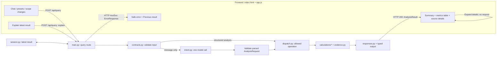

# Backend ↔ frontend connection contract

**Design, not implemented endpoints.** Companion to [README plan revision 4](../README.md). Read this before implementing contracts (1.5), the first API/UI slice (2.4–2.5), or conversational wiring (5.1–5.6). The README owns scope, calculations and limits; this file owns the HTTP field names and their UI consumers. No additional service, client SDK, queue or general-purpose rendering framework is required.

## 1. Source-derived decisions and explicit project choices

Researched `Bar-Bettash/claude-code-config` at `97e5e8e4dc5f2de5a3120b7dfde47b7c52d29458`. The following documents are the basis, not proof that a skill or reviewer executed.

| Config source | Relevant rule | Application here |
|---|---|---|
| [api-protocol-selection](https://github.com/Bar-Bettash/claude-code-config/blob/97e5e8e4dc5f2de5a3120b7dfde47b7c52d29458/knowledge/api-protocol-selection.md) | Explicit HTTP contracts; in-process callees use functions; do not introduce route versions preemptively. | One synchronous, bounded JSON query route. Internal calculations are function calls. Keep `/api/query`, not a new versioned or airport-specific endpoint family. |
| [api-resiliency-canon](https://github.com/Bar-Bettash/claude-code-config/blob/97e5e8e4dc5f2de5a3120b7dfde47b7c52d29458/knowledge/api-resiliency-canon.md) | Validate types/ranges, reject extra fields, project typed output, bound lists, sanitize errors and protect resource references. | Strict request union, typed result/error models, bounded rows, server-checked session/result references. No raw source records on the wire. |
| [error-envelope-logging](https://github.com/Bar-Bettash/claude-code-config/blob/97e5e8e4dc5f2de5a3120b7dfde47b7c52d29458/knowledge/error-envelope-logging.md) | Bare domain success; errors-only envelope; server-generated request ID; no HTTP-200 failures; log a handled error once. | Use the error shape below. **Explicit language adaptation:** the source specifies Hebrew messages; this English-language assignment uses safe English messages. Do not copy Mathly's paths, error-report endpoint or migration aliases. |
| [entity-service-modeling](https://github.com/Bar-Bettash/claude-code-config/blob/97e5e8e4dc5f2de5a3120b7dfde47b7c52d29458/knowledge/entity-service-modeling.md) + [modular-monolith-first](https://github.com/Bar-Bettash/claude-code-config/blob/97e5e8e4dc5f2de5a3120b7dfde47b7c52d29458/knowledge/modular-monolith-first.md) | Boundaries follow business capability; logical entities do not imply separate deployments. | Airport analysis owns request, result and evidence references in the existing local app. No endpoint or service per entity. |
| [capability-without-a-consumer](https://github.com/Bar-Bettash/claude-code-config/blob/97e5e8e4dc5f2de5a3120b7dfde47b7c52d29458/knowledge/capability-without-a-consumer.md) | Name and demonstrate the actual producer/consumer path; code existing is not code being invoked. | Route/UI/file/step crosswalk below, followed by actual API and browser acceptance when implemented. |
| [design-qa-routing](https://github.com/Bar-Bettash/claude-code-config/blob/97e5e8e4dc5f2de5a3120b7dfde47b7c52d29458/knowledge/design-qa-routing.md) | Use accessibility and data-state audits for data-bearing UI; visual audit for a new page. | Review the one results screen and its error states. No canvas/motion tooling for absent features. |

The config's API canon describes `/api/v1/` mechanics, while the protocol-selection owner explicitly decides **when** a version is needed. Its stated non-preemptive default governs this first consumer contract. We are not silently renaming an existing versioned API. Likewise, the protocol owner requires jobs for work that must outlive requests: this prototype instead abandons a query at its deadline. It makes no durable-job promise; bulk acquisition runs separately during setup.

## 2. Endpoint inventory — what the browser actually calls

| Method / path | Frontend caller | Backend owner (planned) | Returned/displayed content | Steps |
|---|---|---|---|---|
| `GET /` | Open the application URL | `backend/app/main.py` serves `backend/app/static/index.html` | The single analyst screen | 1.3–1.4 |
| `GET /static/app.js` | Script tag in `index.html` | `main.py` mounts **only** the static directory | Browser behavior; no provider credentials | 1.4 |
| `GET /health` | One page-load probe from `app.js`; developer smoke check | `main.py` | `{"status":"ok"}` → “Backend reachable”, not “data/model ready” | 1.1, 2.5 |
| `POST /api/query` | Chat submit, preset, metric/year/threshold change, or Explain button in `app.js` | `main.py` → validated internal handlers | A result object or safe error → active/partial/error/previous-result view | 1.5, 2.4–2.5, 5.1–5.6 |

Opening Sources/Methodology or a row's already-returned evidence is **local rendering**, not another API request. Source links open the cited official page; there is no URL-fetch proxy. `GET /health` does not call a model or source provider and is not polled. A failed health probe does not schedule retries.

No browser endpoint for data import/refresh, model configuration, history, credentials, individual airport CRUD or error reporting. A planned setup command, `PYTHONPATH=backend python -m app.sources.datasf --refresh`, produces the accepted snapshot read by the query handler. Stop the local server before refreshing/importing; start it again afterward. The UI never calls DataSF/BTS/FAA or the model provider directly.



The diagram is the **final target**. Step 2.4 initially calls the SFO calculation directly; 5.5 replaces that route body with the shared dispatcher. It does not register a second handler for the same path. Explanation templates arrive at 4.5; the first slice can show metrics with `summary=null`.

## 3. Request contract

`POST /api/query` requires `Content-Type: application/json`. The root contains **exactly one** of `message` or `analysis`, plus optional `context_result_id`. Reject both/neither, null substitutes, unknown keys and invalid nested combinations. Use the README's character, airport, period, cost and deadline limits; also cap the serialized request body at **32 KiB** before processing it. This is an explicit prototype byte limit, so an otherwise valid unusually large escaped request may be rejected rather than silently shortened.

- `message`: nonblank string, at most 4,000 characters. The model proposes an `AnalysisRequest` or a declared safe-outcome code (`clarification_required` or `unsupported_scope`); the backend owns the HTTP status and safe-message mapping. It never supplies session identity, citations or authoritative values.
- `analysis`: typed structured request. `action` is `rank|compare|metric|explain`. `metric` is one allowed metric/bundle. `year` is a supported integer year; growth at 2024 uses the fixed 2023 baseline. Explicit requests supply their year; the interpreter can propose a disclosed 2024 default for free text.
- Airport selection: `metric` requires one airport; `compare` exactly two distinct airports; `rank` requires `region:"new_england"` **or** a nonempty unique subset of its 22 IDs, not both. The result still uses full-cohort score normalization. Reject other regions. No arbitrary identifier, SQL, provider URL or client-selected population.
- `threshold_miles`: accepted only with `long_haul_share`, with the README's bounds and visible default. Do not accept it on another metric and ignore it silently.
- `context_result_id`: UUID of the browser's last displayed successful result, optional for an unrelated new analysis, required for structured `explain`. It must equal that session's latest stored result. A new preset omits it. Free-text follow-ups send it; a resolved independent question does not inherit old scope.
- Structured `explain` omits metric/year/threshold and may select at most two airports from the referenced result. It explains stored values/sources without recalculation, renormalization, source refresh or another model call.

Canonical wire metrics (aliases are interpreted before validation): `passengers`, `seats`, `departures`, `passenger_growth`, `seat_occupancy`, `long_haul_share`, `screen_score`, `congestion`, `cancellation_rate`, `diversion_rate`, `departure_delay_minutes`, `taxi_out_minutes`, `sfo_enplaned_trend`, `sfo_pressure`. They do not widen the README's query matrix: rank supports screen score/passengers/growth/occupancy; operations are LAX/SNA/SFO in 2024; SFO-specific metrics are single-airport only. The `congestion` and `sfo_pressure` names are bundles of the existing indicators, not new formulas.

Free text:

```json
{"message":"Compare LAX and Santa Ana congestion."}
```

The same analysis from a preset, with **zero model calls**:

```json
{"analysis":{"action":"compare","airports":["LAX","SNA"],"metric":"congestion","year":2024}}
```

A follow-up (the ID is illustrative; the server validates the actual reference):

```json
{"message":"Show only cancellations.","context_result_id":"11111111-1111-4111-8111-111111111111"}
```

Explain button:

```json
{"analysis":{"action":"explain"},"context_result_id":"11111111-1111-4111-8111-111111111111"}
```

### Sessions without an authentication product

Use a server-generated opaque `airport_session` cookie (`HttpOnly`, `SameSite=Strict`, `Path=/`, one-hour maximum age) from 5.5 onward. Keep its lookup and the latest successful result in `session.py`; enforce the README's idle timeout/cap there. Browser JavaScript does not read the cookie or send a `session_id` field to the model. `fetch` uses the same origin; do not enable wildcard CORS. Enforce the configured loopback Host and reject a supplied foreign Origin on POST; keep JSON-only requests. This is local-demo protection, **not authenticated multi-user access control**. The cookie is non-Secure only on the declared loopback HTTP demo; a hosted deployment is a separate design task.

A missing cookie on a fresh independent request can create a session. An unknown/expired cookie or mismatched result on a follow-up produces 409 and a “Start a new analysis” action; clear the invalid cookie where applicable. Starting fresh clears the browser's result reference and sends a complete independent request, never automatically resubmitting paid work. Public airport snapshots are not user-owned; session context is isolated by the server-issued opaque token. Never enumerate someone else's result or store raw chat history.

## 4. Results → UI, without frontend arithmetic

Successful requests return the **bare typed `AnalysisResult`**, not `{success:true,data:...}`. Use a declared FastAPI response model; project internal data into it. `GET /health` has its own tiny typed model in `main.py`, introduced at 1.1 without depending on later analysis schemas. No Parquet paths, cookies, provider secrets, raw upstream bodies or exception internals reach JSON.

| Result field | Frontend consumer |
|---|---|
| `result_id`, `request_id` | Store the result reference for follow-ups; show request ID for diagnostics. These are distinct from the opaque session cookie. |
| `status` (`ok` or `partial`) | Active-result heading or **Partial result** label; never encodes a top-level failure. |
| `scope` | Airport(s), year/baseline, selected metric, population description, optional threshold; displayed above the table. |
| `rows` | Airport metrics table, at most 22 rows. Backend supplies scores, ordering and rank; the browser only formats values. |
| `summary` | Deterministic explanation text; can be null during the first SFO slice. |
| `series` | Optional SFO monthly table/plot, at most 24 monthly points per returned series; do not load a charting system just for this. |
| `sources` | Expandable source/coverage details: ID, name, official URL, snapshot ID, observation period and retrieval time. |
| `evidence` | Already-returned reviewed notes with source locators, dates and limitations. No evidence-fetch endpoint. |
| `exclusions`, `limitations` | Unassessable airport reasons and business boundaries. Empty lists are allowed; no numeric zero stands for missing evidence. |

Each row has `airport` and a bounded list of metrics. Each metric has `key`, `value`, `unit`, `status` and `source_ids`; add numerator/denominator for ratios and a reason when unavailable. Output keys are declared by the result schema, not arbitrary model-supplied fields. `source_ids` resolve to returned `sources`. Source populations remain distinct even when shown in one bundle.

Wire units are explicit: `count` is an integer; `percent` is expressed in percentage units (40 means 40%, not 0.40; growth may be negative or exceed 100%); `percentage_points` is a difference of percentages; `minutes` and `score` are not percentages. Unavailable values are JSON null with a reason, never NaN, a stringified number or zero. The backend performs percentage scaling and rounding conventions. The frontend must not recompute any KPI.

A bundle may return HTTP 200 with `status:"partial"` only when there is useful independently valid analysis. Required missing cells are visibly unavailable; they cannot support a score or comparative conclusion. With no usable requested analysis, return the error below. The SFO statement “unmet demand not identifiable” is a documented limitation of a successful pressure analysis, not a fabricated metric or an HTTP failure by itself.

**Synthetic wire-format example only — these are not observed ANC statistics.** Optional lists are empty here for brevity; a real demo must have real snapshot/source metadata.

```json
{
  "result_id":"22222222-2222-4222-8222-222222222222",
  "request_id":"33333333-3333-4333-8333-333333333333",
  "status":"ok",
  "scope":{"airports":["ANC"],"year":2024,"metric":"long_haul_share","threshold_miles":3000,"population":"Synthetic scheduled passenger departures"},
  "rows":[{"airport":"ANC","metrics":[{"key":"long_haul_share","value":40.0,"unit":"percent","status":"ok","numerator":8,"denominator":20,"source_ids":["fixture-t100"]}]}],
  "summary":"In this synthetic fixture, 8 of 20 departures meet the 3,000-mile threshold.",
  "series":[],
  "sources":[{"id":"fixture-t100","name":"Synthetic T-100-shaped fixture, not real airport evidence","url":null,"snapshot_id":"synthetic-only","period":"CY2024","retrieved_at":null}],
  "evidence":[],
  "exclusions":[],
  "limitations":["Illustrative values only; not a real-data acceptance result."]
}
```

## 5. Errors → UI

Use the config's **errors-only** envelope and non-2xx status. A small handler in `main.py` can normalize validation and unexpected errors; do not add a separate logging service. The server generates `request_id`, returns it in `X-Request-ID`, and uses the same ID in the error body and one sanitized log entry. Client-provided IDs do not replace it. The log can record code/exception class/duration; do not log credentials, cookies, full user questions or source dumps.

```json
{"success":false,"error":{"code":"insufficient_data","message":"Not enough distance data for ANC in 2024. Choose another supported analysis.","request_id":"33333333-3333-4333-8333-333333333333"}}
```

| HTTP | Code examples | Frontend action |
|---|---|---|
| 400 / 415 | `invalid_json` / `unsupported_media_type` | Safe request error; do not call the model. |
| 413 | `request_too_large` | Ask for a shorter question. |
| 422 | `invalid_request`, `unsupported_scope`, `clarification_required`, `insufficient_data` | Show the specific safe explanation/allowed choice. A clarification is not a successful analysis and does not replace context. |
| 409 | `busy`, `session_expired`, `result_mismatch` | Wait, or start a new analysis as appropriate. No queue or automatic replay. |
| 503 | `ai_unavailable`, `budget_exhausted`, `data_unavailable` | Presets/other supported analyses remain available where their prerequisites exist. Provider quota is mapped to `ai_unavailable`; no automatic provider switch. |
| 504 | `query_timeout` | Show timeout; preserve the labeled previous result. Backend cancels/interrupts remaining work under the existing busy-slot rule. |
| 500 | `internal_error` | Generic failure plus request ID; never display the exception. |

`app.js` checks the HTTP status, then the corresponding typed body. A network failure or unparseable response has no trustworthy server envelope: render a local connection error without inventing a request ID. Clear loading controls; preserve the last displayed result labeled **Previous result**. Keep a local request-generation counter so a late response cannot replace a newer display. A lost response can leave the server's latest result newer than the browser's: a later mismatch returns 409, not an exactly-once/replay subsystem.

A failed query does not overwrite the server's latest successful analysis. Successful numerical analyses, including useful partial results, can replace it. `explain` reads it without changing its scope, score normalization, snapshots or result ID. Request IDs remain fresh on every HTTP call. No error triggers a retry timer, model call, bulk refresh or result-history fetch.

## 6. Assignment paths — one endpoint, different validated operations

All rows below use **`POST /api/query`** in `main.py`. Paths are planned files, not claims that symbols already exist.

| UI request | Structured operation | Internal calculation path | Visible result |
|---|---|---|---|
| New England expansion | rank / screen_score / new_england / 2024 | `dispatch.py` → `calculations/screen.py` + `evidence.py` → `responses.py` | Ranked metrics, exclusions, conditional terminal notes |
| LAX versus SNA | compare / congestion / LAX,SNA / 2024 | `dispatch.py` → `calculations/operations.py` + `calculations/comparison.py` → `responses.py` | Four indicators, denominators, qualified comparison |
| Anchorage long haul | metric / long_haul_share / ANC / 2024 | `dispatch.py` → `calculations/long_haul.py` | Percentage, counts, threshold and coverage |
| SFO unmet demand | metric / sfo_pressure / SFO / 2024 | `dispatch.py` → `calculations/sfo.py` + evidence → `responses.py` | Trends, pressure proxy, constraints, unidentified-demand limitation |
| First SFO slice | metric / sfo_enplaned_trend / SFO / 2024 | Initially `main.py` → `calculations/sfo.py`; later dispatcher | Real enplaned levels/growth, no claim that the whole SFO bundle already exists |
| BOS/PVD growth | compare / passenger_growth / BOS,PVD / 2024 | `dispatch.py` → `calculations/traffic.py` | Common-baseline comparison |
| Fastest growth | rank / passenger_growth / new_england / 2024 | `dispatch.py` → traffic/ranking logic | Raw-growth ordering, not composite-score ordering |
| Explain / change scope | explain the stored result, or a new validated metric/compare request | `session.py` + dispatcher | Stored explanation, or a recomputed result with disclosed scope |

## 7. Integration checks — TODO when code exists

Use the existing test files and browser acceptance; this contract does not introduce another test framework.

- **1.4 / 2.5:** serve only the static assets; verify `/`, `/static/app.js`, one health call and the first SFO query in the browser's network trace. A green health check is not source readiness.
- **1.5 / 2.4:** contract/API tests cover request XOR, exact field types, valid real calculation output, unknown fields, insufficient data and normalized 422 errors. Assert non-2xx errors and bare 200 success.
- **5.1 / 5.5:** real cookie/result binding, zero provider calls on structured input, at most one on free text, read-only explain, busy/deadline handling, no state overwrite on errors and refusal of foreign/stale references.
- **5.6 / 6.1:** a partial result, an error after success and an unavailable backend display differently. Source expansion makes no request; metric/year changes make exactly one. Verify percentages are not multiplied again and no stale response wins.
- **6.3:** real DataSF snapshot → calculation → same API values/IDs → visible result; then all supported examples and a safe failure. Writing this map or parsing these JSON examples is not that runtime proof.
