# Backend ↔ frontend connection contract

**Implemented structured API with a stateless follow-up context and an admitted natural-language path (Google Gemini, one call per message).** This file records HTTP field names and the UI code that consumes them. The [root README](../README.md) owns scope, calculations and limits. Free text runs only where the exact model and adapter hash are admitted ([admission record](evidence/model-admission-20260930/README.md)); everywhere else it returns `503 ai_unavailable` and presets still work. No additional service, client SDK, queue or general-purpose rendering framework is used.

**Conversation card (browser only).** Follow-ups are asked in a rising chat card. Its transcript is a `role="log"` list held in page memory only: it is never sent to the server, never stored, and a reload clears it. Each request carries one message plus the current `context_result_id`, so the server sees the previous validated request (from the signed cookie), never the transcript. After a "which measure?" clarification the next message also carries that question's two airport codes (`pending_comparison`), so a short reply such as "congestion" keeps them; the pair is sent once, dropped after any answer, a preset, a new analysis or a reload, and kept for Retry after a failed send. One request runs at a time; the input stays editable while it runs. An answer is written from the returned result; a typed "why?" that the server answers with an explanation fills the Explanation section and the reply, and does not replace the result on screen. A clarification or unsupported question is answered in the card and keeps the previous result current. A model, service, timeout or connection failure marks the question "Not sent" with an inline Retry; sending the same text again reuses that turn instead of adding a copy.

## 1. Source-derived decisions and explicit project choices

Researched `Bar-Bettash/claude-code-config` at `97e5e8e4dc5f2de5a3120b7dfde47b7c52d29458`. The following documents are the basis, not proof that a skill or reviewer executed.

| Config source | Relevant rule | Application here |
|---|---|---|
| [api-protocol-selection](https://github.com/Bar-Bettash/claude-code-config/blob/97e5e8e4dc5f2de5a3120b7dfde47b7c52d29458/knowledge/api-protocol-selection.md) | Explicit HTTP contracts; in-process callees use functions; do not introduce route versions preemptively. | One synchronous, bounded JSON query route. Internal calculations are function calls. Keep `/api/query`, not a new versioned or airport-specific endpoint family. |
| [api-resiliency-canon](https://github.com/Bar-Bettash/claude-code-config/blob/97e5e8e4dc5f2de5a3120b7dfde47b7c52d29458/knowledge/api-resiliency-canon.md) | Validate types/ranges, reject extra fields, project typed output, bound lists, sanitize errors and protect resource references. | Strict request union, typed result/error models, bounded rows, server-checked session/result references. No raw source records on the wire. |
| [error-envelope-logging](https://github.com/Bar-Bettash/claude-code-config/blob/97e5e8e4dc5f2de5a3120b7dfde47b7c52d29458/knowledge/error-envelope-logging.md) | Bare domain success; errors-only envelope; server-generated request ID; no HTTP-200 failures; log a handled error once. | Use the error shape below. **Explicit language adaptation:** the source specifies Hebrew messages; this English-language assignment uses safe English messages. Do not copy Mathly's paths, error-report endpoint or migration aliases. |
| [entity-service-modeling](https://github.com/Bar-Bettash/claude-code-config/blob/97e5e8e4dc5f2de5a3120b7dfde47b7c52d29458/knowledge/entity-service-modeling.md) + [modular-monolith-first](https://github.com/Bar-Bettash/claude-code-config/blob/97e5e8e4dc5f2de5a3120b7dfde47b7c52d29458/knowledge/modular-monolith-first.md) | Boundaries follow business capability; logical entities do not imply separate deployments. | Airport analysis owns request, result and evidence references in the existing local app. No endpoint or service per entity. |
| [capability-without-a-consumer](https://github.com/Bar-Bettash/claude-code-config/blob/97e5e8e4dc5f2de5a3120b7dfde47b7c52d29458/knowledge/capability-without-a-consumer.md) | Name and demonstrate the actual producer/consumer path; code existing is not code being invoked. | Route/UI/file/step crosswalk below, followed by actual API and browser acceptance when implemented. |
| [design-qa-routing](https://github.com/Bar-Bettash/claude-code-config/blob/97e5e8e4dc5f2de5a3120b7dfde47b7c52d29458/knowledge/design-qa-routing.md) | Use accessibility and data-state audits for data-bearing UI; visual audit for a new page. | Review the one results screen and its error states. No canvas/motion tooling for absent features. |

The config's API canon describes `/api/v1/` mechanics, but the protocol-selection owner decides explicitly **when** a version is needed. Its non-preemptive default governs this consumer contract, so this is not a silent rename of an existing versioned API. This request-scoped prototype returns a timeout response at its deadline. The shielded worker may continue running: its per-instance slot stays held until the worker finishes, and its late result is discarded. The prototype makes no promise of durable jobs, and bulk acquisition runs separately during setup.

## 2. Endpoint inventory — what the browser actually calls

| Method / path | Frontend caller | Backend owner | Returned/displayed content | Plan step |
|---|---|---|---|---|
| `GET /` | Open the application URL | `app/backend/app/main.py` serves `app/frontend/index.html` | The single analyst screen | 1.3–1.4 |
| `GET /static/app.js` | Script tag in `index.html` | `main.py` mounts **only** the `app/frontend/` directory | Browser behavior; no provider credentials | 1.4 |
| `GET /health` | One page-load probe from `app.js`; developer smoke check | `main.py` | `{"status":"ok"}` → “Backend reachable”, not “data/model ready” | 1.1, 2.5 |
| `POST /api/query` | Chat submit, preset, metric/year/threshold change, or Explain button in `app.js` | `main.py` → validated internal handlers | A result object or safe error → active/partial/error/previous-result view | 1.5, 2.4–2.5, 5.1–5.6 |

Opening Sources/Methodology or a row's already-returned evidence is **local rendering**, not another API request. Source links open the cited official page; there is no URL-fetch proxy. `GET /health` does not call a model or source provider and is not polled. A failed health probe does not schedule retries.

No browser endpoint for data import/refresh, model configuration, history, credentials, individual airport CRUD or error reporting. The setup command `PYTHONPATH=backend python -m app.sources.datasf --refresh` produces the accepted snapshot read by the query handler. Stop the local server before refreshing/importing; start it again afterward. The UI never calls DataSF/BTS/FAA or the model provider directly. With default settings, free-text requests return safe `503 ai_unavailable`; no real provider call or live admission has occurred.

```mermaid
flowchart LR
    subgraph Frontend["Frontend: index.html + app.js"]
        Input["Chat / presets / scope changes"]
        Explain["Explain latest result"]
        View["Summary + metrics table + source details"]
        Error["Safe error + Previous result"]
    end
    Input -->|"POST /api/query"| API["main.py: query route"]
    Explain -->|"POST /api/query: explain"| API
    API --> Contract["contracts.py: validate input"]
    Contract -.->|"default disabled; exact admission required"| Intent["model_adapter.py: one Gemini generateContent call"]
    Intent -.->|"offline implemented"| Contract2["Validate parsed AnalysisRequest"]
    Contract -->|"structured analysis"| Dispatch["dispatch.py: allowed operation"]
    Contract2 -.->|"admitted model outcome"| Dispatch
    Cookie["context_token.py: signed airport_context cookie"] <--> API
    Dispatch --> Calc["calculations/* + evidence.py"]
    Calc --> Response["dispatch.py assembles AnalysisResult using contracts.py"]
    Response -->|"HTTP 200: AnalysisResult"| View
    API -->|"HTTP 4xx/5xx: ErrorResponse"| Error
    View -->|"Expand details: no request"| View
```



The diagram shows the active structured path and the model path, which is implemented but disabled until admitted. Runtime admission requires four things: a Gemini key, `MODEL_RUNTIME_ENABLED=true`, an exact admitted model name, and the SHA-256 of the complete adapter file. Before interpretation, `main.py` verifies the signed `airport_context` cookie and recomputes the referenced result. Only after that does `model_adapter.py` make one direct Gemini `generateContent` call. The app keeps no spend ledger; spend is capped by the Google project's quota or budget. The server validates the model's typed outcome and dispatches calculations itself. All structured operations use the shared dispatcher and its typed `AnalysisResult` assembly, and `/api/query` has one handler. An explanation re-renders the recomputed, digest-checked result and makes no model call.

## 3. Request contract

`POST /api/query` requires `Content-Type: application/json`. The root contains **exactly one** of `message` or `analysis`, plus an optional `context_result_id` and, with `message` only, an optional `pending_comparison`. The server rejects requests with both or neither, null substitutes, unknown keys and invalid nested combinations. The character, airport, period and deadline limits are those in `contracts.py` and `settings.py`. The serialized request body is also capped at **32 KiB** before processing. This is an explicit prototype byte limit, so an otherwise valid but unusually large escaped request may be rejected rather than silently shortened.

- `message`: nonblank string, at most 4,000 characters. The implemented route returns safe `503 ai_unavailable` under default settings; a Gemini key alone does not change that. After exact runtime admission, the model may propose only an `AnalysisRequest` or a declared safe-outcome code; the backend owns status and safe-message mapping and does not accept session identity, citations or authoritative values from a model.
- `analysis`: the typed structured request. `action` is `rank|compare|metric|explain`, and `metric` is one allowed metric or bundle. `year` is 2023, 2024, 2025 or omitted. If `year` is omitted, the server resolves it to the accepted default bundle `annual-2025-r1`, which compares CY2024 with CY2025. An explicit 2023 or 2024 without `bundle_id` uses the historical CY2023 → CY2024 snapshots. Presets omit `year`.
- Airport selection: `metric` requires one airport and `compare` requires exactly two distinct airports. `rank` requires either `region:"new_england"` **or** a non-empty, unique subset of the resolved New England cohort, but not both. The cohort has 22 airports in the historical period and 23 in the 2025 bundle, where EWB is added. The result still normalizes scores over the full cohort. Other regions are rejected, as are arbitrary identifiers, SQL, provider URLs and client-selected populations.
- `threshold_miles`: accepted only with `long_haul_share`. It must be in (0, 12000], and the default of 3,000 is disclosed in the result scope. It is rejected on any other metric rather than silently ignored.
- `context_result_id`: the UUID of the browser's last displayed successful result. It is optional for an unrelated new analysis and required for a structured `explain`. It must equal the result ID inside the signed `airport_context` cookie. A new preset omits it. An admitted free-text follow-up uses the resolved `AnalysisRequest` from the cookie as bounded model context. A resolved independent question does not inherit old scope.
- `pending_comparison`: two different supported airport codes, accepted only with `message`. The browser sends back the pair from the last `clarification_required` response that named one (`error.pending_comparison`). It is added to the model's input, which reads a reply naming only a measure as a comparison of those two airports and ignores the pair for a new question. It grants nothing beyond the codes: the resulting request is validated like any other.
- A structured `explain` omits metric, year and threshold, and may select at most two airports from the referenced result. The server recomputes the referenced result from the signed request, checks its digest, and explains those values and sources. It performs no renormalization, source refresh or model call.

Canonical wire metrics: `passengers`, `seats`, `departures`, `passenger_growth`, `seat_occupancy`, `long_haul_share`, `screen_score`, `congestion`, `cancellation_rate`, `diversion_rate`, `departure_delay_minutes`, `taxi_out_minutes`, `sfo_enplaned_trend`, `sfo_pressure`. They do not widen the query matrix. Rank supports screen score, passengers, growth and occupancy, and `screen_score` with `metric` or `compare` returns 422. Operations cover LAX, SNA and SFO for the comparison year only (2024 historical, 2025 bundle). SFO-specific metrics are single-airport only. The `congestion` and `sfo_pressure` names are bundles of the existing indicators, not new formulas.

Free-text request shape (default settings return `503 ai_unavailable`):

```json
{"message":"Compare LAX and Santa Ana congestion."}
```

The same analysis from a preset, with **zero model calls**:

```json
{"analysis":{"action":"compare","airports":["LAX","SNA"],"metric":"congestion"}}
```

A follow-up (the ID is illustrative; the server validates the actual reference):

```json
{"message":"Show only cancellations.","context_result_id":"11111111-1111-4111-8111-111111111111"}
```

Explain button:

```json
{"analysis":{"action":"explain"},"context_result_id":"11111111-1111-4111-8111-111111111111"}
```

### Follow-up context without a login or server session

After each successful result except an `explain`, the API sets the `airport_context` cookie. The cookie is `HttpOnly`, `SameSite=Strict`, `Path=/`, has a one-hour maximum age, and is `Secure` on Vercel. Its value is an HMAC-SHA256-signed token (`context_token.py`) that holds the result ID, the resolved request, a result digest and an expiry. The server stores nothing. Any instance holding the same `APP_SIGNING_KEY` verifies the token and recomputes the result. Browser JavaScript does not read the cookie or send a session field. `fetch` is same-origin, and wildcard CORS is disabled. The HostGuard allows only loopback hosts, `ALLOWED_HOSTS` and Vercel's own hostnames. In hosted mode it requires an exact same-origin `Origin` on POST. There is **no login**, by the owner's decision: this mechanism provides follow-up integrity, not authenticated access control.

Independent requests ignore and replace any cookie. A follow-up with a missing, forged or expired cookie produces `409 session_expired` and clears the cookie. A follow-up whose ID does not match, or whose recomputed digest differs, produces `409 result_mismatch`. The UI then shows a "Start a new analysis" action. Starting fresh clears the browser's result reference and sends a complete independent request. It never automatically resubmits paid work. Public airport snapshots are not user-owned, and no raw chat history is stored.

## 4. Results → UI, without frontend arithmetic

Successful requests return the **bare typed `AnalysisResult`**, not `{success:true,data:...}`. Use a declared FastAPI response model; project internal data into it. `GET /health` has its own tiny typed model in `main.py`, introduced at 1.1 without depending on later analysis schemas. No Parquet paths, cookies, provider secrets, raw upstream bodies or exception internals reach JSON.

| Result field | Frontend consumer |
|---|---|
| `result_id`, `request_id` | Store the result reference for follow-ups, and show the request ID for diagnostics. These are separate from the signed `airport_context` cookie. |
| `status` (`ok` or `partial`) | Active-result heading or **Partial result** label; never encodes a top-level failure. |
| `scope` | Airport(s), year/baseline, selected metric, population description, optional threshold; displayed above the table. |
| `rows` | The airport metrics table, at most 23 rows. The backend supplies scores, ordering and rank, and the browser only formats values. |
| `summary` | Deterministic explanation text from the dispatcher; null is permitted by the typed contract where no summary is available. |
| `series` | Optional SFO monthly table/plot, at most 24 monthly points per returned series; do not load a charting system just for this. |
| `sources` | Expandable source/coverage details: ID, name, official URL, snapshot ID, observation period and source retrieval time when known. `retrieved_at` is null when unknown; local import time is not substituted. |
| `evidence` | Already-returned reviewed notes with source locators, dates and limitations. No evidence-fetch endpoint. |
| `exclusions`, `limitations` | Unassessable airport reasons and business boundaries. Empty lists are allowed; no numeric zero stands for missing evidence. |

Each row has `airport` and a bounded list of metrics. Each metric has `key`, `value`, `unit`, `status` and `source_ids`; available ratios require numerator/denominator, while unavailable ratios may retain observed components or use a null pair and require a reason. Output keys are declared by the result schema, not arbitrary model-supplied fields. `source_ids` resolve to returned `sources`. Source populations remain distinct even when shown in one bundle.

Wire units are explicit: `count` is an integer; `percent` is expressed in percentage units (40 means 40%, not 0.40; growth may be negative or exceed 100%); `percentage_points` is a difference of percentages; `minutes` and `score` are not percentages. Unavailable values are JSON null with a reason, never NaN, a stringified number or zero. The backend performs percentage scaling and rounding conventions. The frontend must not recompute any KPI.

A bundle may return HTTP 200 with `status:"partial"` only when there is useful independently valid analysis. Required missing cells are visibly unavailable; they cannot support a score or comparative conclusion. With no usable requested analysis, return the error below. The SFO statement “unmet demand not identifiable” is a documented limitation of a successful pressure analysis, not a fabricated metric or an HTTP failure by itself.

**Synthetic wire-format example only — these are not observed ANC statistics.** Optional lists are empty here for brevity; a real demo must have real snapshot/source metadata.

```json
{
  "result_id":"22222222-2222-4222-8222-222222222222",
  "request_id":"33333333-3333-4333-8333-333333333333",
  "status":"ok",
  "scope":{"airports":["ANC"],"year":2024,"metric":"long_haul_share","threshold_miles":3000,"population":"Synthetic scheduled passenger departures"},
  "rows":[{"airport":"ANC","metrics":[{"key":"long_haul_share","value":40.0,"unit":"percent","status":"ok","numerator":8,"denominator":20,"source_ids":["fixture-t100"]}]}],
  "summary":"In this synthetic fixture, 8 of 20 departures meet the 3,000-mile threshold.",
  "series":[],
  "sources":[{"id":"fixture-t100","name":"Synthetic T-100-shaped fixture, not real airport evidence","url":null,"snapshot_id":"synthetic-only","period":"CY2024","retrieved_at":null}],
  "evidence":[],
  "exclusions":[],
  "limitations":["Illustrative values only; not a real-data acceptance result."]
}
```

## 5. Errors → UI

Use the config's **errors-only** envelope and non-2xx status. A small handler in `main.py` can normalize validation and unexpected errors; do not add a separate logging service. The server generates `request_id`, returns it in `X-Request-ID`, and uses the same ID in the error body and one sanitized log entry. Client-provided IDs do not replace it. The log can record code/exception class/duration; do not log credentials, cookies, full user questions or source dumps.

```json
{"success":false,"error":{"code":"insufficient_data","message":"Not enough distance data for ANC in 2024. Choose another supported analysis.","request_id":"33333333-3333-4333-8333-333333333333"}}
```

| HTTP | Code examples | Frontend action |
|---|---|---|
| 400 / 415 | `invalid_json`, `invalid_request` (foreign Host or Origin) / `unsupported_media_type` | Show a safe request error and do not call the model. |
| 413 | `request_too_large` | Ask for a shorter question. |
| 422 | `invalid_request`, `unsupported_scope`, `clarification_required`, `insufficient_data` | Show the specific safe explanation/allowed choice. A clarification is not a successful analysis and does not replace context. A comparison clarification also returns `error.pending_comparison` (two airport codes) for the client to send with the reply. |
| 409 | `busy`, `session_expired`, `result_mismatch` | Wait, or start a new analysis, as appropriate. There is no queue and no automatic replay. |
| 503 | `ai_unavailable`, `data_unavailable`, `internal_error` (hosting misconfigured) | Presets and other supported analyses remain available where their prerequisites exist. Provider errors and quota are mapped to `ai_unavailable`, with no automatic provider switch. (`budget_exhausted` was removed along with the process-local budget ledger.) |
| 504 | `query_timeout` | Show the timeout and keep the labeled previous result. The HTTP handler returns, but the shielded thread work is not forcibly interrupted. Its per-instance slot stays occupied until the work finishes, and its late result is discarded. |
| 500 | `internal_error` | Generic failure plus request ID; never display the exception. |

`app.js` checks the HTTP status, then the corresponding typed body. A network failure or unparseable response has no trustworthy server envelope: render a local connection error without inventing a request ID. Clear loading controls; preserve the last displayed result labeled **Previous result**. Keep a local request-generation counter so a late response cannot replace a newer display. A lost response can leave the server's latest result newer than the browser's: a later mismatch returns 409, not an exactly-once/replay subsystem.

A failed query leaves the browser's last result and its cookie unchanged. Only a successful non-explain analysis replaces the cookie, and a useful partial result counts as successful. `explain` recomputes the referenced result without changing its scope, score normalization, snapshots or result ID. Request IDs are fresh on every HTTP call. No error triggers a retry timer, model call, bulk refresh or result-history fetch.

## 6. Assignment paths — one endpoint, different validated operations

All rows below use the implemented **`POST /api/query`** handler in `main.py`; internal paths name current dispatch/calculation/result assembly code.

| UI request | Structured operation | Internal calculation path | Visible result |
|---|---|---|---|
| New England expansion | rank / screen_score / new_england / default (2025) | `dispatch.py` → `calculations/screen.py` + `evidence.py` → `AnalysisResult` (`contracts.py`) | Ranked metrics with each score's growth/volume/occupancy points, why the leader leads, exclusions, conditional terminal notes |
| LAX versus SNA | compare / congestion / LAX,SNA / default (2025) | `dispatch.py` → `calculations/operations.py` + `calculations/comparison.py` → `AnalysisResult` (`contracts.py`) | Four indicators, denominators, qualified comparison |
| Anchorage long haul | metric / long_haul_share / ANC / default (2025) | `dispatch.py` → `calculations/long_haul.py` | Percentage, counts, threshold and coverage |
| SFO unmet demand | metric / sfo_pressure / SFO / default (2025) | `dispatch.py` → `calculations/sfo.py` + `calculations/operations.py` (delay-cause mix) + evidence → `AnalysisResult` (`contracts.py`) | A direct answer from the passenger-vs-seat growth gap and occupancy, the reported delay-cause mix, trends, and the unidentified-demand limitation |
| SFO enplaned trend | metric / sfo_enplaned_trend / SFO / default (2025) | `dispatch.py` → `calculations/sfo.py` → `AnalysisResult` (`contracts.py`) | One 24-point monthly series of combined Domestic + International Enplaned passenger totals, with levels/growth; all 48 source month/geography cells remain required |
| BOS/PVD growth | compare / passenger_growth / BOS,PVD / default (2025) | `dispatch.py` → `calculations/traffic.py` | Common-baseline comparison |
| Fastest growth | rank / passenger_growth / new_england / default (2025) | `dispatch.py` → traffic/ranking logic | Raw-growth ordering, not composite-score ordering |
| Explain / change scope | explain the referenced result, or a new validated metric or compare request | `context_token.py` + dispatcher | An explanation of the recomputed, digest-checked result, or a new result with its scope disclosed |

## 7. Verification status

Use the existing test files and browser acceptance; this contract does not introduce another test framework. The structured API/UI implementation has passed the recorded suite. Clean-environment setup and test evidence is in [ARCHITECTURE.md](ARCHITECTURE.md); remaining model and deployment steps are in [app/README.md](../app/README.md#whats-left).

- **1.4 / 2.5:** serve only the static assets; verify `/`, `/static/app.js`, one health call and the first SFO query in the browser's network trace. A green health check is not source readiness.
- **1.5 / 2.4:** contract/API tests cover request XOR, exact field types, valid real calculation output, unknown fields, insufficient data, `screen_score` metric/compare rejection, unavailable ratio nulls and normalized 422 errors. Assert non-2xx errors and bare 200 success.
- **5.1 / 5.3–5.5:** signed-cookie result binding, recomputation with a digest check, zero provider calls on structured input, read-only explain, busy/deadline handling, no state overwrite on errors and refusal of foreign/stale references are implemented and covered by the backend suite. The single-call Gemini adapter, the exact model and adapter admission gate, and the candidate CLI's `--live` mode have offline coverage, and the admitted adapter passed its live evaluation sets (corpus, holdout, assignment wording, chat regression and follow-ups; see the [admission record](evidence/model-admission-20260930/README.md)). The process-local budget ledger was removed, and spend is capped by the Google project's quota.
- **5.6 / 6.1:** a partial result, an error after success and an unavailable backend display differently. Source expansion makes no request; metric/year changes make exactly one. Verify percentages are not multiplied again and no stale response wins.
- **6.3:** structured DataSF snapshot → calculation → API values/IDs → visible result and supported structured examples were exercised; clean-environment verification is recorded in ARCHITECTURE.md. Live model runs are recorded in the admission record; writing this map or parsing these JSON examples is not that proof.
