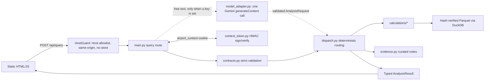

# Backend architecture and implementation notes

This file describes the code in this repository. Module paths below are relative to `app/backend/`; the UI lives in `app/frontend/`. The [root README](../README.md) is the short assignment deliverable, covering methodology, tradeoffs and AI use. [API/UI map](API_UI_MAP.md) is the wire contract. [ADR 001](adr/001-local-demo.md) records the original local-only decision. That ADR's in-memory session and loopback-only parts have since been replaced by the signed context cookie and the hosted mode described below.

## Run locally

Use Python 3.11 or 3.12. `pyproject.toml` allows `>=3.11,<3.13`, and `app/.python-version` pins 3.12, which is the Vercel target. Run these commands from the repository root:

```sh
python3 -m venv .venv && source .venv/bin/activate
python -m pip install -r app/backend/requirements-dev.txt
python -m uvicorn app.main:app --app-dir app/backend --host 127.0.0.1 --port 8000
```

- `app/backend/requirements.txt` holds the runtime pins only: duckdb, fastapi, httpx, pydantic and uvicorn.
- `requirements-dev.txt` adds pytest.
- The UI has no build step. Node is needed only for `app/frontend/tests/*.cjs`.
- A loopback run needs no environment variables. See [app/backend/.env.example](../app/backend/.env.example) for the variables that exist.

## Components and request flow



### Module responsibilities

| Module | Responsibility |
|---|---|
| `main.py` | Transport, the HostGuard, safe errors, the 30 s query deadline, per-instance concurrency slots, the context cookie and the model switch |
| `contracts.py` | The strict request, result and error models, including the closed list of airports, metrics and years |
| `dispatch.py` | Resolves the bundle and year, routes each request to one calculation, and projects typed results |
| `calculations/` | Plain functions |
| `context_token.py` | The stateless follow-up context |
| `settings.py` | Validates the model and hosting settings. It never reads dotenv files. |
| `query_slots.py` | Per-process admission control |
| `intent.py` | A small deterministic parser used only as the evaluation baseline. The runtime never calls it. |

The design has no agent loop, no SQL generation, no database server, no queue and no browser access to data providers.

### Routes

| Route | Behavior |
|---|---|
| `GET /` and `/static/*` | The analyst screen and its assets, served from `app/frontend/`. Both sit behind the HostGuard. |
| `GET /health` and `HEAD /health` | Liveness only. Always open, with no data or model check. |
| `POST /api/query` | Exactly one of `message` (free text) or `analysis` (structured), plus an optional `context_result_id` |

- There are no OpenAPI or docs routes.
- A success is a bare `AnalysisResult` whose status is `ok` or `partial`.
- A failure is a non-2xx `ErrorResponse` carrying a code, a message and a `request_id`. The `request_id` is also sent in the `X-Request-ID` header.

### Follow-up context (stateless)

After every successful result except an "explain", the server sets the **`airport_context`** cookie. The cookie is:

- `HttpOnly`
- `SameSite=Strict`
- `Path=/`
- valid for 1 hour
- `Secure` on Vercel

The cookie value is `v1.<payload>.<HMAC-SHA256>`. The payload holds four things:

- the result ID
- the resolved `AnalysisRequest`, with its year and bundle pinned
- a SHA-256 digest of the result
- an expiry time

The MAC is checked in constant time before the payload is decoded. Every failure looks the same to the client: a missing, forged, malformed or expired cookie all give `409 session_expired`, and the cookie is cleared.

The cookie is read only when a request carries `context_result_id`. What happens next:

1. If the ID in the cookie does not match that ID, the server returns `409 result_mismatch`.
2. Otherwise the server **recomputes** the referenced result from the signed request.
3. It then checks the result digest. A mismatch means the data changed, and also gives `409 result_mismatch`.

The recomputed result has two uses. `explain` renders it without changing it. A free-text follow-up receives only the previous validated request as model context.

Any instance with the same `APP_SIGNING_KEY` can verify the cookie, so no server state is needed. Replaying a cookie within its hour grants nothing beyond recomputing a public-data result the holder already received. Rotating the key invalidates every cookie.

### Hosting mode, host and Origin guard

`settings.load_hosting()` decides the mode, and `HostGuard` in `main.py` enforces it.

**When hosted mode applies.**

- Hosted mode is on when `VERCEL` is set or when `ALLOWED_HOSTS` is non-empty.
- Hosted mode requires `APP_SIGNING_KEY`, 32 to 512 bytes long. If the hosting configuration is missing or malformed, every route except `/health` returns `503 internal_error`.

**Allowed hosts.**

- Loopback names are always allowed.
- `ALLOWED_HOSTS` adds entries as comma-separated hostnames.
- On Vercel, the hostnames in `VERCEL_URL`, `VERCEL_BRANCH_URL` and `VERCEL_PROJECT_PRODUCTION_URL` are added automatically.

**Request checks.**

- A Host header that is not allowed gets `400 invalid_request`.
- Requests with unsafe methods need an `Origin` whose scheme and `host:port` exactly match the request, and the scheme must be HTTPS on Vercel.
- A missing Origin is tolerated only outside hosted mode.
- Hosted responses carry `Cache-Control: no-store`, and there is no CORS.

**Local runs.** A loopback run without a key uses a random per-process key, so follow-up context ends when the process restarts.

**Concurrency.**

- `MAX_CONCURRENT_QUERIES` is per instance. The default is 4 when hosted and 1 locally, and the maximum is 16.
- Any extra request gets `409 busy`.
- A timed-out or cancelled analysis keeps its slot until its worker thread finishes, and its late result is discarded.

There is **no login** and no in-app spending ledger. Model cost is bounded by caps on each call and by the Google project's quota or budget (see the next section).

### Model switch

A `message` request reaches the model only when `GEMINI_API_KEY` is set (`settings.model_access_available`). Otherwise it gets `503 ai_unavailable`, and structured requests are unaffected. A local run also reads `backend/.env` through `settings.load_local_env`; shell variables win, and the file is ignored on Vercel and in tests.

The adapter makes one streamed POST to `https://generativelanguage.googleapis.com/v1beta/models/<GEMINI_MODEL>:generateContent`, with the key in the `x-goog-api-key` header. The call has these properties:

- `responseMimeType: application/json` with a `responseSchema` (Gemini's OpenAPI subset), temperature 0.
- It uses the settings caps: 512 output tokens, 8,000 prompt bytes, a 20 s timeout and a 64 KiB response limit.
- `thinkingConfig.thinkingBudget` is 0 by default so thinking tokens do not eat the output cap; `GEMINI_THINKING_BUDGET=default` omits it.
- A blocked prompt or a safety stop becomes `model_refusal`; `MAX_TOKENS` becomes `model_incomplete`; thought parts are ignored.
- It logs only metadata, never question text. A provider HTTP error is logged as, for example, `ai_unavailable:http_404`, and never returned to the client.

Every provider failure is mapped to a sanitized code. **No live Gemini call has been made yet.**

## Scope and data bundles

| Period | How it is selected | Data |
|---|---|---|
| **CY2024 → CY2025** (default) | Year omitted, or year 2025 | Accepted bundle `annual-2025-r1`, listed in `data/bundles/accepted.json` with its manifest SHA-256. Covers DataSF 2024–25, T-100 2024–25, on-time 2025, the FAA 2025 cohort (23 airports including EWB), and FY2025 AIP awards as context only |
| **CY2023 → CY2024** (historical) | Year 2023 or 2024 with no `bundle_id` | The per-source `current.json` snapshots: DataSF, FAA, T-100 (26 origins) and on-time 2024 |

**Rules for each workflow.**

- Growth, screen score, operations and the SFO workflows use the comparison year only.
- Levels, occupancy and long-haul share also accept the baseline year.
- Ranking uses the New England cohort. A display subset keeps the ranks and normalization of the full cohort.
- The operations workflow supports LAX, SNA and SFO. The SFO workflows support SFO only.
- Explicit 2024 together with `bundle_id` is accepted only for the baseline-capable metrics.

**Integrity checks.** Every read re-checks the manifest and data SHA-256 against the bundle or pointer, and fails closed with `503 data_unavailable`.

## Numerical definitions

| Calculation | Definition and missing-data rule |
|---|---|
| T-100 annual levels | Sum of origin passengers, seats and **performed** departures. The importer keeps rows with service class A, C, E or F and positive seats. An airport-year missing any month is unavailable, not zero. |
| Occupancy | `100 × passengers / seats`. Seats must be positive. |
| Passenger growth | `100 × (P_cmp − P_base) / P_base`. A zero or missing baseline makes the value unavailable. |
| Screen score | See `calculations/screen.py`. An airport is eligible when both years are complete, counts are valid, baseline passengers are positive and comparison-year seats are positive. Each input gets a mid-rank percentile `(2·lower + tied − 1)/(2(n − 1))`. Score = `100 × (0.40 growth + 0.30 volume + 0.30 occupancy)`. Fewer than two eligible airports gives `insufficient_data`. Ranks use competition ranking; ties are displayed in airport-code order. |
| Long-haul share | Performed departures with `distance ≥ threshold` ÷ all performed departures. The default threshold is 3,000 miles, and a request may use any value in (0, 12000]. Rows with a null distance count as unknown, and the result gives lower and upper bounds. A single value is given only when the unknown count is 0. An invalid distance, or an incomplete year, gives `insufficient_data`. Zero total departures makes the share unavailable. |
| Cancellation and diversion | `100 × flagged / valid scheduled flights` at each origin. Valid rows have binary flags and `flights = 1`. |
| Departure delay and taxi-out | Separate means of non-null `DepDelayMinutes` (early departures count as 0) and `TaxiOut`, over flights that were neither cancelled nor diverted. Each mean keeps its own denominator. |
| Comparison | Raw values are compared, and only the display is rounded. Each indicator gets a direction: higher, lower, tied or unavailable. The summary counts these directions, and says "mixed picture" when they are split. There is no composite index and no causal claim. |
| SFO enplaned trend | Enplaned passengers only. All 24 months × Domestic/International cells must be present; they are combined into one monthly series. |
| SFO pressure | T-100 passenger growth % minus seat growth %, in percentage points, over the matched SFO origin population. It is shown alongside the trend and the on-time indicators. Profitability and quantitative unmet demand are `not_identifiable`. |

## Data refresh (offline operator steps)

The source commands under `app/sources/` (`datasf`, `faa`, `aip`, `t100`, `ontime`) acquire or import official files. They write immutable snapshots with manifests, and they never run on a user request.

- T-100 has no downloader. You must supply the exact qualified FMG exports with `--input-dir`.
- A recent bundle is staged and verified in this order:
  1. `scripts/check_source_status.py` checks live freshness and writes a receipt.
  2. `scripts/reconcile_recent.py` reconciles the sources.
  3. `scripts/accept_bundle.py` registers the bundle.

  `python -m app.sources.bundle --check-candidate <id>` re-verifies a bundle offline.
- The acceptance step requires a freshness receipt that is at most 7 days old and bound to the bundle's `manifest_sha256` (`app/sources/source_check.py`). The current receipt for `annual-2025-r1` stops being valid for re-promoting that same bundle after **2026-10-04T17:17Z**. Serving the already-accepted bundle does not depend on it, and it is not a rebuild deadline: a rebuilt bundle has a new manifest and needs its own fresh receipt whenever it is promoted.

## Evidence limits

- Terminal evidence is a bounded, curated review, and every claim begins "Status unknown".
- Traffic pressure is a screening heuristic. It is not a measure of capacity, ROI or unmet demand.
- On-time data covers domestic reporting carriers only.
- Populations from different sources are never joined into a single denominator.
- Figures and hashes are recorded in [integrated-acceptance-20260929.md](evidence/integrated-acceptance-20260929.md) and [recent-data-activation-review.md](evidence/recent-data-activation-review.md).

## Verification

Run from the repository root:

```sh
PYTHONPATH=app/backend python -m pytest app/backend/tests -q
node --test app/frontend/tests/*.cjs
ruff check app/backend --ignore EXE002,SIM905
```

**Results.**

- **Integrated acceptance at `104acfc`:** 583 passed, 2 skipped; 88/88 Node tests; 41 real-HTTP calls with 0 figure discrepancies.
- **Rerun at `fbd2342` during the docs update:** 679 passed, 2 skipped; 96/96 Node tests.
- **Offline Vercel package check:** 86.4 MB uncompressed, and the four workflows ran on a read-only filesystem ([vercel-package-check.md](evidence/vercel-package-check.md)).

**Not yet done.**

- A live Gemini run with a real key.
- A deployed smoke test.
- A live freshness recheck after 2026-09-27.

The Node suite uses a minimal DOM. It is not a real-browser accessibility audit.
