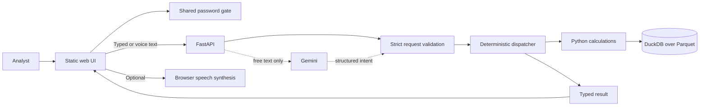
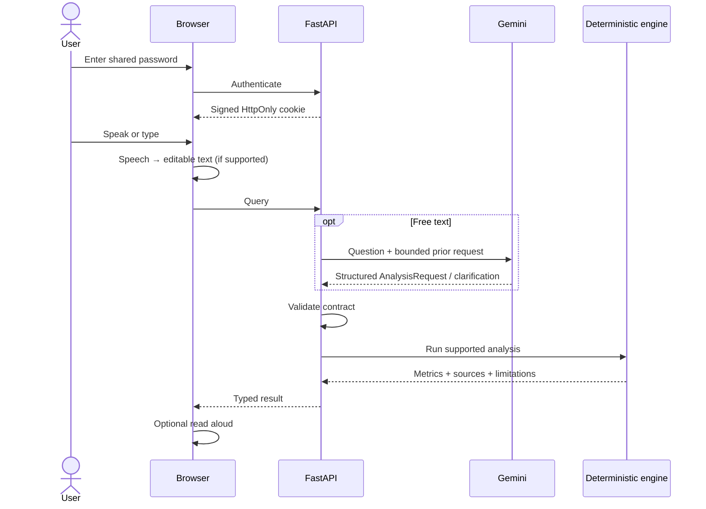
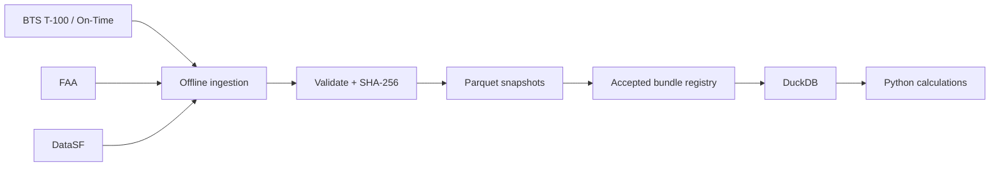

# Architecture

The system keeps language interpretation separate from numerical analysis: Gemini resolves supported intent, while deterministic Python/DuckDB code owns every figure shown to the analyst.

## System

Runtime has no agent loop, generated SQL, vector store, database server, or queue.

## Request flow

Presets skip Gemini completely. **Explain this result** recomputes and explains the referenced deterministic result without another model call.

## Data pipeline

Provider APIs/files are used during offline preparation, not while answering a user. The accepted bundle is frozen and hash-checked so a result can be reproduced later.

Default runtime data is `annual-2025-r1`, comparing CY2024 with CY2025. Historical 2023 → 2024 data remains available where the request contract allows it.

## AI boundary

| Gemini does | Gemini does not |
|---|---|
| Interpret a free-text question | Calculate metrics |
| Resolve supported follow-ups | Generate SQL |
| Return a structured request or safe clarification | Create citations |
| Select from allowed airports/metrics/years | Write authoritative numerical answers |

The adapter uses one Gemini `generateContent` call with structured JSON output. Backend validation remains authoritative.

Free text is admitted only when the configured model name and the SHA-256 of `model_adapter.py` match the reviewed values. Any adapter change disables free text until re-admitted.

## Deterministic analytics

| Workflow | Definition |
|---|---|
| New England screen | Mid-rank percentile score: 40% passenger growth + 30% passenger volume + 30% seat occupancy |
| Congestion | Cancellation %, diversion %, average departure delay, average taxi-out; no composite score |
| ANC long-haul | Eligible performed departures with distance ≥ threshold ÷ all eligible performed departures |
| SFO pressure | Passenger-growth % − seat-growth %, plus occupancy, trend, and delay-cause context |

Important rules:

- Missing airport-years are unavailable, never zero-filled.
- New England scoring is a **traffic-pressure shortlist**, not terminal-capacity or profitability proof.
- ANC excludes cargo-only and charter operations from the scheduled passenger-service measure.
- SFO traffic data cannot identify latent demand that never materialized as a flight/passenger.
- Populations from BTS T-100, BTS On-Time, FAA, and DataSF stay explicit rather than being silently mixed.

## State and security

| Concern | Design |
|---|---|
| Demo access | Server-side shared password; no user database |
| Auth session | Signed `HttpOnly`, `Secure`, `SameSite=Strict` cookie |
| Follow-up context | Separate signed `airport_context` cookie with resolved request, result digest, ID, and expiry |
| Server state | No session database |
| Cross-site requests | Same-origin/Host checks; no wildcard CORS |
| Framing/content | `X-Frame-Options: DENY`, `frame-ancestors 'none'`, `nosniff` |
| Dynamic caching | `Cache-Control: no-store` |

A referenced result is recomputed and digest-checked before it can be explained or used as follow-up context.

## Voice

Voice is a browser-layer feature:

- Speech recognition produces normal editable text.
- Sending that text uses the same API and Gemini intent path as typing.
- Read-aloud uses browser `speechSynthesis`.
- Audio is not stored by the application.
- Voice adds no second model call and no alternate analytics path.
- Unsupported browsers keep the typed-chat experience.

## Deployment

The repository deploys to Vercel with Root Directory `app` and Python 3.12. One FastAPI function serves the UI and API. Preview deployments stay protected during QA; the Production alias is the recruiter-facing demo.

## Key tradeoffs

| Choice | Benefit | Tradeoff |
|---|---|---|
| Frozen snapshots | Reproducible, provider-independent runtime | Refresh requires ingestion + redeploy |
| Deterministic engine | Auditable numbers | Supported analyses are intentionally bounded |
| One constrained LLM call | Flexible language with small AI surface | Unsupported questions are refused/clarified |
| Signed stateless context | Serverless-friendly follow-ups | Context expires and key rotation invalidates it |
| Shared password | Simple private demo | Not a full identity/role system |

## Limits

- No profitability, ROI, capital-cost, or forecast claims.
- Terminal evidence is curated context, not proof of current project status.
- Historical traffic measures observed activity; they do not reveal all latent demand.
- Results depend on the documented source populations and accepted snapshot period.
