# Airport Investment Intelligence Agent: design note

This note is the design and architecture deliverable for the assignment brief (`FDE Exam 2.pdf`). It describes the code at the commit that contains this file. Every figure below comes from a committed evidence file, which is named next to it.

**Status labels used in this note**

| Claim | Status |
|---|---|
| Four workflows, follow-ups and error paths | **Locally tested.** They were run over real HTTP against uvicorn ([integrated-acceptance-20260929.md](../backend/docs/evidence/integrated-acceptance-20260929.md)). |
| Official sources match the packaged data | **Live source verified**, last on 2026-09-27 ([recent-data-activation-review.md](../backend/docs/evidence/recent-data-activation-review.md)). This has not been re-run since because outbound access was blocked. |
| Free-text interpretation by the model | **Not yet live-verified.** The code is implemented and tested offline. Without admission, free text returns `503 ai_unavailable`. |
| Deployed | **Not yet.** The Vercel package was checked offline only ([vercel-package-check.md](../backend/docs/evidence/vercel-package-check.md)). |

## 1. Overview and scope

The app is an analyst chat screen backed by a deterministic calculation engine:

- Presets and the "Adjust scope" controls send a structured request, and no AI is involved.
- Free text is turned into the same structured request by one model call.
- Numbers always come from Python over packaged public data.

The default period is the accepted bundle **`annual-2025-r1`**, which compares **CY2024 → CY2025**. A user can also ask for the historical **CY2023 → CY2024** path by naming 2024.

| Brief question | Answered as (KPI) | Source | Result in evidence (CY2025 default) |
|---|---|---|---|
| New England airports that are strong terminal-expansion candidates | Rank by a traffic-pressure **screen score**, plus reviewed terminal-project notes | BTS T-100 segment data; FAA commercial-service cohort | Status `partial`, 22 airports ranked. HVN is first (74.76), BGR and PWM tie for 2nd, and BOS is 4th. PVC is excluded. |
| Compare LA and Santa Ana congestion | Compare LAX with SNA on 4 operational-strain indicators, with no composite score | BTS Reporting Carrier On-Time (FGJ) | Cancellation rate is 0.690 % at LAX and 1.047 % at SNA. Taxi-out is 17.73 min at LAX and 16.05 min at SNA. The comparison is a mixed picture. |
| Share of long-haul flights out of Anchorage | Performed departures on segments ≥ 3,000 statute miles ÷ all performed departures | T-100 | 999 / 36,040 = **2.77 %**. For CY2024 it is 950 / 40,017. |
| Unmet flight demand at SFO, and why | The **pressure proxy** is passenger growth minus seat growth, shown alongside the enplanement trend and operational indicators | DataSF (live API at ingest), T-100, FGJ | −1.2247 pp. Unmet demand and profitability are reported as **not identifiable**. |

Figures are from [integrated-acceptance-20260929.md](../backend/docs/evidence/integrated-acceptance-20260929.md) and [recent-api-verification.json](../backend/docs/evidence/recent-api-verification.json).

The scope is deliberately closed. The supported airports are the New England cohort plus ANC, LAX, SNA and SFO. The supported years are 2023, 2024 and 2025. Anything else is rejected with `422` before any calculation runs.

## 2. Scoring methodology

All calculations are ordinary Python over DuckDB reads of hash-verified Parquet. Missing data is never imputed: an airport-year with fewer than 12 months is unavailable, not zero.

### New England screen

The code is in `backend/app/calculations/screen.py`.

**Cohort.** The cohort is the FAA New England commercial-service list:

- 22 airports for 2023 → 2024.
- 23 airports for the 2025 bundle. The extra airport is **EWB**, which is included and ranks 17th.

**Eligibility.** An airport is scored only if it meets all of these conditions:

- Both years have complete 12-month coverage.
- Passenger and seat counts are valid non-negative integers.
- Baseline passengers are positive.
- Comparison-year seats are positive.

PVC is excluded in 2025 because its 2024 data is missing December. If fewer than two airports are eligible, the result is `insufficient_data`.

**Inputs.** Each eligible airport contributes three values:

- Growth = `100 × (P_cmp − P_base) / P_base`.
- Volume = `P_cmp`.
- Occupancy = `100 × P_cmp / S_cmp`.

Here `P` is passengers, `S` is seats, `base` is the baseline year and `cmp` is the comparison year.

**Percentile.** Each input is converted to a mid-rank percentile within the eligible cohort only:

`(2·#lower + #tied − 1) / (2·(n − 1))`

This is the average ascending rank minus 1, divided by `n − 1`, so it runs from 0 to 1.

**Score.** `100 × (0.40·growth_pct + 0.30·volume_pct + 0.30·occupancy_pct)`. The weights are exact fractions.

**Ranking and ties.**

- Airports use competition ranking: rank = 1 + the number of airports with a strictly higher score. This is why BGR and PWM share rank 2.
- When scores tie, display order falls back to the airport code.

**Evidence and interpretation.**

- Curated terminal-project notes are attached for the top three airports, and each one begins with "Status unknown".
- The score measures relative traffic pressure. It is **not** a measure of terminal capacity, return on investment (ROI) or investment success.

### LAX vs SNA congestion

The code is in `calculations/operations.py` and `calculations/comparison.py`.

**Data.** The on-time data covers origin departures by domestic reporting carriers only. It is not all airlines and excludes international flights.

**Indicators.** There are four:

- **Cancellation rate** and **diversion rate**: `100 × flagged / valid scheduled flights`.
- **Mean departure delay**: uses BTS `DepDelayMinutes`, so early departures count as 0.
- **Mean taxi-out time.**

Both means are taken over completed flights, meaning flights that were not cancelled and not diverted.

**Comparison.**

- Each indicator gets a raw `higher / lower / tied / unavailable` direction.
- A summary counts how many indicators each airport is higher on, and flags a "mixed picture" when the directions disagree.
- There is deliberately **no composite congestion index** and no significance test.

### ANC long-haul share

The code is in `calculations/long_haul.py`.

**Formula.** Share = performed departures on T-100 segments with `distance ≥ threshold` ÷ all performed departures from ANC in that year. The default threshold is 3,000 miles. A request may set any threshold in the range (0, 12000].

**Rules for missing or bad data.**

- **Missing distance:** departures on rows with no distance are counted as unknown. The result then reports **lower and upper bounds**, and a single point value is given only when the unknown count is 0. In both 2024 and 2025 the unknown count is 0.
- **Invalid distance:** an invalid distance on a row with positive departures gives `insufficient_data`.
- **Incomplete year:** a year with incomplete coverage also gives `insufficient_data`.

### SFO "unmet demand"

The code is in `calculations/sfo.py`.

**Pressure proxy.** Passenger growth % minus seat growth %, in **percentage points**. It uses SFO's matched T-100 origin population for both years.

- A positive gap means passengers grew faster than seats.
- The 2025 value is −1.2247 pp, so seats grew slightly faster than passengers.

**Context shown with the proxy.**

- The DataSF enplaned trend: 24 monthly points, which requires all 48 month × Domestic/International cells.
- T-100 levels and occupancy.
- The four on-time indicators.
- Evidence notes on terminal projects.

**Limit.** Transported-passenger and seat data cannot reveal demand that was never served, and there is no fare or cost data. Every result therefore states: *"Profitability and quantitative unmet demand are not_identifiable."*

## 3. Data and architecture

```mermaid
flowchart LR
    Src[Public sources: DataSF API, BTS T-100 and On-Time, FAA cohort and AIP] -->|offline ingest, qualify, hash| Snap[Parquet snapshots + manifests + accepted bundle registry]
    UI[Static chat UI] -->|POST /api/query| API[FastAPI: host/Origin guard, strict contracts]
    API -.->|free text only, when admitted| LLM[One OpenAI Responses call -> AnalysisRequest]
    LLM -.-> API
    API --> Eng[Deterministic dispatch + calculations over DuckDB]
    Snap --> Eng
    Eng --> Res[Typed AnalysisResult with sources, exclusions, limitations]
    Res --> UI
    API <-->|signed airport_context cookie| UI
```



**Ingestion.** Source commands in `backend/app/sources/` run offline, never on a user request.

- They qualify the official files and write immutable Parquet snapshots with manifests.
- The runtime loads only a bundle listed in `backend/data/bundles/accepted.json`. It re-checks every manifest and data SHA-256 on each use and fails closed on any mismatch.
- The AIP grant workbook travels in the bundle as hash-verified context. It is not used in any formula.

**Serving.**

- One FastAPI app serves both the static UI and `POST /api/query`.
- Success returns a bare `AnalysisResult`. Errors return a safe code, message and request ID.

**Follow-ups without server state.**

- After each successful non-explain result, the server sets an HMAC-SHA256-signed cookie, `airport_context`. It is `HttpOnly`, `SameSite=Strict`, lasts 1 hour, and is `Secure` on Vercel.
- The cookie holds the resolved request, the result ID and a digest of the result.
- An "explain" or free-text follow-up **recomputes** the prior result from that request. It then checks the digest, and returns `409 result_mismatch` if the values differ.

**Hosting.** Vercel is the target but it is not yet deployed. The Root Directory is `backend`.

- `index.py` is the single function, with `maxDuration` 60 s.
- Hosted mode is on when the app runs on Vercel or when `ALLOWED_HOSTS` is set. In hosted mode it requires `APP_SIGNING_KEY`, a Host allowlist and exact same-origin POSTs.
- Concurrency is bounded per instance by `MAX_CONCURRENT_QUERIES`.

## 4. Where and how AI is used

AI is used in exactly one place: `backend/app/model_adapter.py`, for free-text messages only.

**What the call does.**

- It is one OpenAI **Responses API** call with a strict JSON schema, `store: false`, at most 512 output tokens and a 20-second timeout.
- The model maps the question and any previous resolved request to one of three things: an `AnalysisRequest`, `clarification_required` or `unsupported_scope`.
- The server validates the output again with the same strict Pydantic contract used for presets.

**What the model never produces.** It never produces numbers, SQL, file paths, citations or user-visible wording. The deterministic engine computes everything the user sees.

**Safe failure.** Every provider problem becomes a sanitized `ai_unavailable`, `query_timeout` or `invalid_request` error, with no provider text shown. Such problems include timeouts, refusals, malformed or oversized output and usage outside its bounds. Presets keep working.

**Admission gate, fail-closed.** Free text runs only when all of the following hold:

- `MODEL_RUNTIME_ENABLED=true`.
- A key and a model are configured.
- `MODEL_ADMITTED_NAME` equals `OPENAI_MODEL`.
- `MODEL_ADMITTED_ADAPTER_SHA256` equals the SHA-256 of the running adapter file.

Admission follows a live pass of the 30-case intent corpus (`backend/scripts/eval_intents.py --mode candidate --live --acceptance`). **This live admission has not happened yet.** So far there have been 0 model calls ([integrated-acceptance-20260929.md](../backend/docs/evidence/integrated-acceptance-20260929.md)).

## 5. Key tradeoffs

| Choice | Instead of | Why |
|---|---|---|
| Packaged, hash-verified Parquet read by in-process DuckDB | A database service or live API calls per question | The data is annual, small (about 12 MB of `data/`) and read-only. Results are reproducible and the app has no infrastructure to run. The cost is that a refresh requires a re-ingest and a redeploy. |
| Stateless signed cookie; the result is recomputed and digest-checked | A server session store or KV | It works on any serverless instance and there is nothing to provision. The cost is that rotating the key drops all follow-up context, and context lasts at most 1 hour. |
| One constrained model call | An agent framework, tool loop or LLM-written SQL | The model cannot fabricate numbers, so outputs can be audited and tested offline. The cost is that questions outside the closed metric menu are refused rather than attempted. |
| Public data only | Paid or proprietary data | Every figure is traceable to an official source. The cost is that capacity, fares, costs and latent demand are not observable, so profitability and unmet demand remain explicit "not identifiable" limits. |
| No login, as the owner decided | A shared access code or user accounts | The demo is simpler to open. Cost exposure is bounded instead by per-call caps (4,000-character input, 512 output tokens, 20 s model timeout, 30 s query deadline, per-instance concurrency) and by a **hard monthly budget on the OpenAI project**. There is no in-app spending ledger. |

## 6. Assumptions, uncertainty and limits

**Screen score.**

- The screen score measures **relative traffic pressure**.
- The 40/30/30 weights are an explicit judgment and have not been calibrated.
- Percentiles depend on the cohort, so adding or removing an airport shifts other airports' scores.

**Data coverage.**

- T-100 counts origin-direction scheduled passenger service with positive seats, for service classes A, C, E and F.
- The on-time data covers domestic reporting carriers only.
- DataSF covers SFO only.
- The populations differ and are never joined into a single denominator.

**Missing periods.**

- Missing months make a result unavailable rather than zero, as with PVC in 2024.
- Partial 2026 data exists upstream but is excluded ([recent-data-activation-review.md](../backend/docs/evidence/recent-data-activation-review.md)).

**Terminal evidence.**

- The terminal-project evidence is a bounded, curated review.
- Every claim is labelled "Status unknown", and forecasts are not treated as proof of completion.

**Freshness.**

- The official sources were last live-checked on 2026-09-27.
- The admission receipt allows re-promotion of the bundle until **2026-10-04T17:17Z**; after that, a new live check is required. Serving the data does not depend on this receipt.

**Out of scope.** Profitability, ROI/NPV, capex, quantitative unmet demand and causal claims are all out of scope. Voice input is not implemented.

## 7. How to run and verify

The full commands are in the [README](../README.md). In short:

```sh
python3 -m venv .venv && source .venv/bin/activate         # Python 3.11 or 3.12
pip install -r backend/requirements-dev.txt
python -m uvicorn app.main:app --app-dir backend --host 127.0.0.1 --port 8000   # open http://127.0.0.1:8000/
PYTHONPATH=backend python -m pytest backend/tests -q
node --test backend/tests/*.cjs
```

**Recorded results.**

- The integrated acceptance record at `104acfc` shows 583 passed and 2 skipped, 88/88 Node tests, and 41 real-HTTP calls with 0 figure discrepancies.
- At this commit's parent `fbd2342`, the local suite reported **679 passed, 2 skipped** and **96/96** Node tests during this documentation pass.

**Further reading.**

- Component detail: [backend/docs/ARCHITECTURE.md](../backend/docs/ARCHITECTURE.md).
- Wire contract: [API_UI_MAP.md](API_UI_MAP.md).
